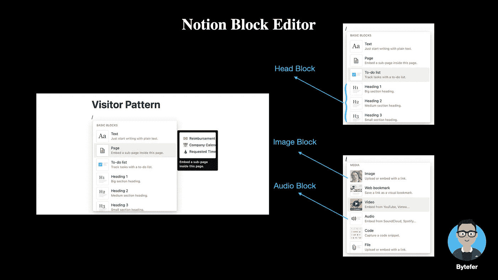
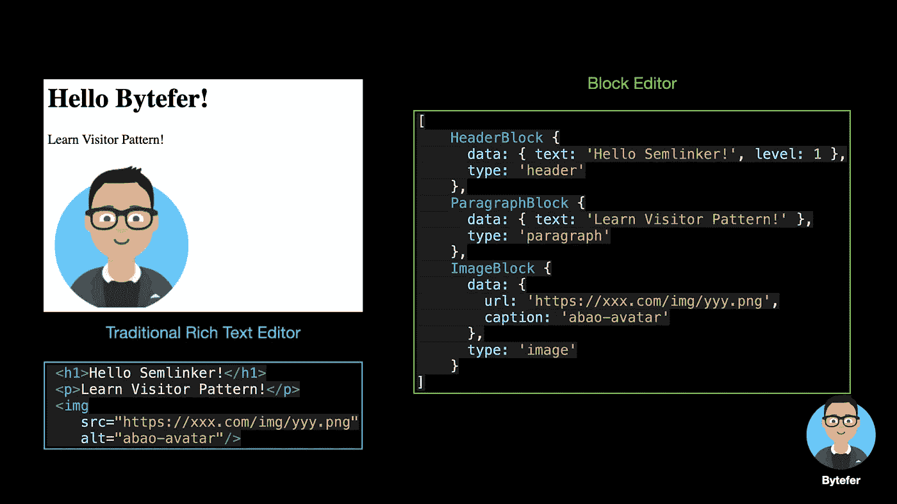
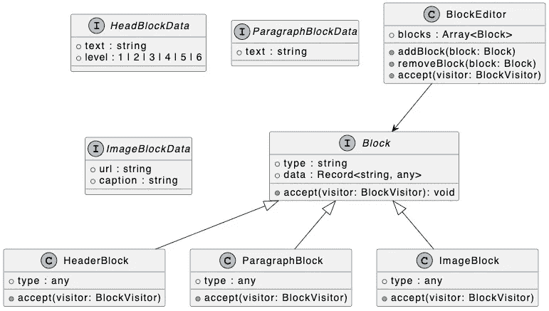
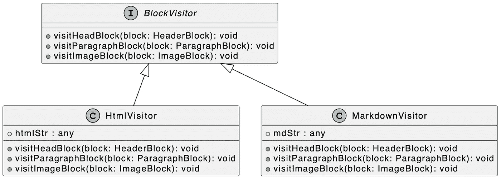
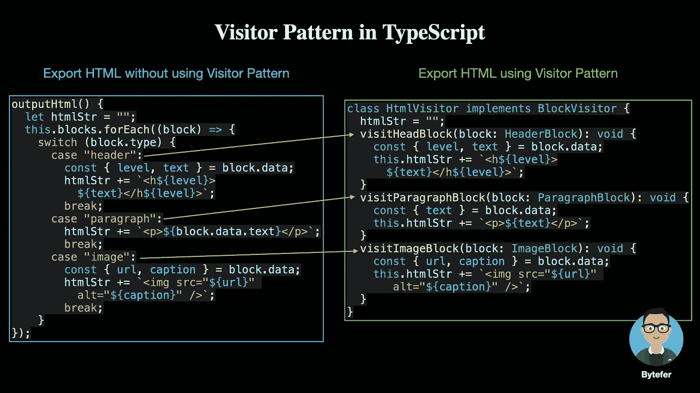
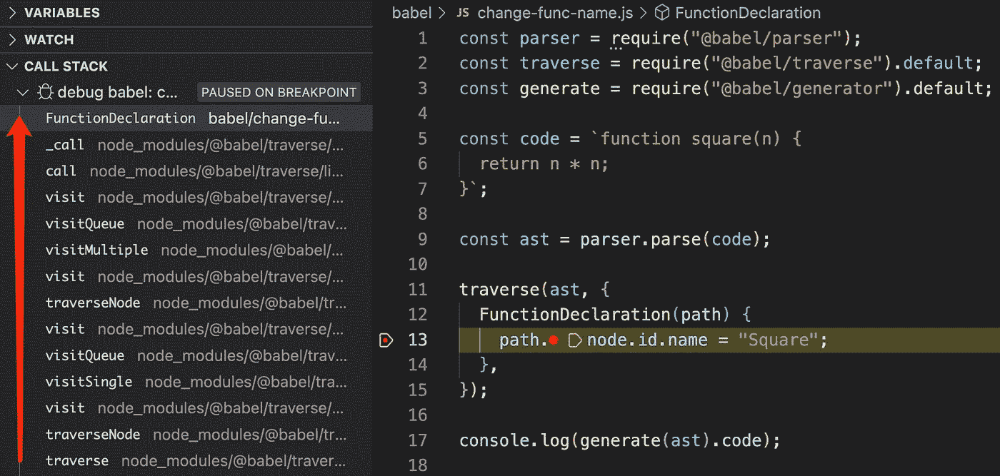
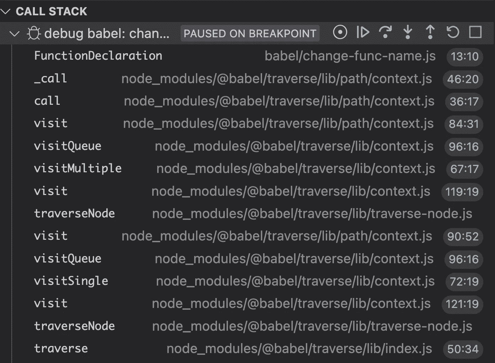
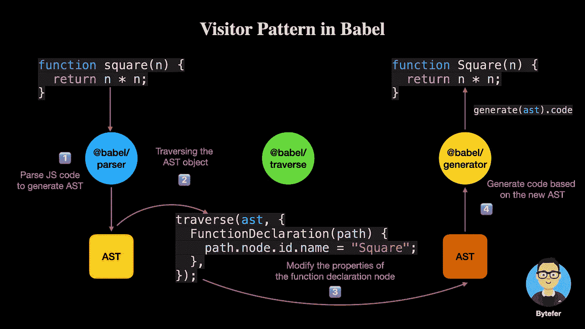

# 设计模式:TypeScript 中的访问者模式

> 原文：<https://levelup.gitconnected.com/design-patterns-visitor-pattern-in-typescript-b80bd7cba155>

## 定义新的操作，而不事先改变数据结构


照片由[梅芝郎](https://unsplash.com/@meizhilang?utm_source=medium&utm_medium=referral)在 [Unsplash](https://unsplash.com?utm_source=medium&utm_medium=referral) 上拍摄

欢迎来到 TypeScript 系列的**设计模式，该系列介绍了一些使用 TypeScript 进行 web 开发时有用的设计模式。**

[](https://medium.com/frontend-canteen/9-design-patterns-every-engineer-should-know-f2423d36d468) [## 每个工程师都应该知道的 9 种设计模式

### 掌握这 9 种设计模式，写出更好的代码

medium.com](https://medium.com/frontend-canteen/9-design-patterns-every-engineer-should-know-f2423d36d468) 

设计模式对于 web 开发人员来说非常重要，通过掌握它们我们可以写出更好的代码。在本文中，我将使用**类型脚本**来介绍**访问者模式。**

你可能不熟悉访问者模式。但如果你学过[巴别塔](https://babeljs.io/)，你应该用过**@巴别塔/遍历**。该库在内部使用访问者模式，允许您快速遍历由 **@babel/parser** 生成的 AST(抽象语法树)中的各个节点。访问者模式也是一种**行为模式**，我将在本文中介绍。

在文本编辑场景中，与传统的富文本编辑器相比，块编辑器已经成为主流的文本编辑器。例如，您可能也使用过的 concept 是块编辑器的经典应用。**使用块编辑器创建的内容由不同类型的块**组成，如标题块、段落块、图像块、视频块、音频块和文件块。



那么传统的富文本编辑器和块编辑器有什么区别呢？让我们看看它们是如何表示相同的页面内容的:



> 注意:当然，大多数块编辑器也支持导出 HTML 或 Markdown 文本格式。

接下来，我们使用 TypeScript 实现一个支持标题块、段落块和图像块的块编辑器。不同的块有不同的类型和数据，所以我们首先使用`interface`关键字定义一个`Block`接口:

```
interface Block {
  type: string;
  data: Record<string, any>;
}
```

然后我们继续定义了 3 个接口`HeadBlockData`、`ParagraphBlockData`、`ImageBlockData`，用来表示不同块对应的数据结构。

```
interface HeadBlockData {
  text: string;
  level: 1 | 2 | 3 | 4 | 5 | 6;
}

interface ParagraphBlockData {
  text: string;
}

interface ImageBlockData {
  url: string;
  caption: string;
}
```

定义`Block`相关接口后，我们可以创建不同类型的块:

*   `HeadBlock`:对应 HTML **h1~h6** 元素；
*   `ParagraphBlock`:对应 HTML **p** 元素；
*   `ImageBlock`:对应 HTML **img** 元素。

```
class HeaderBlock implements Block {
  type = "header";
  constructor(public data: HeadBlockData) {}
}

class ParagraphBlock implements Block {
  type = "paragraph";
  constructor(public data: ParagraphBlockData) {}
}

class ImageBlock implements Block {
  type = "image";
  constructor(public data: ImageBlockData) {}
}
```

虽然上面只定义了 3 种不同类型的块，但是实际上可以根据实际需要定义其他类型的块。有了不同的块之后，让我们定义一个`BlockEditor`类:

```
class BlockEditor {
  blocks: Array<Block> = [];

  addBlock(block: Block) {
    this.blocks.push(block);
  }

  removeBlock(block: Block) {
    const index = this.blocks.indexOf(block);
    index !== -1 && this.blocks.splice(index, 1);
  }
}
```

在`BlockEditor`类中，我们定义了`addBlock`和`removeBlock`方法，用于添加和移除指定的块对象。现在让我们使用`addBlock`方法添加 3 种不同类型的`Block`:

```
const blockEditor = new BlockEditor();

blockEditor.addBlock(
  new HeaderBlock({
    text: "Hello Bytefer!",
    level: 1,
  })
);

blockEditor.addBlock(
  new ParagraphBlock({
    text: "Learn Visitor Pattern!",
  })
);

blockEditor.addBlock(
  new ImageBlock({
    url: "https://miro.medium.com/fit/c/176/176/1*krjVh9VFhDEcMUif4Ewt-A.png",
    caption: "bytefer-avatar",
  })
);
```

成功添加以上块后，我们再给`BlockEditor`类添加一个`outputHTML`方法，用于将块编辑器保存的块导出为 **HTML** 文本。

```
class BlockEditor {
  // Omit some code
  outputHtml() {
    let htmlStr = "";
    this.blocks.forEach((block) => {
      switch (block.type) {
        case "header":
          const { level, text } = block.data;
          htmlStr += `<h${level}>${text}</h${level}>`;
          break;
        case "paragraph":
          htmlStr += `<p>${block.data.text}</p>`;
          break;
        case "image":
          const { url, caption } = block.data;
          htmlStr += ``;
          break;
      }
    });
    return htmlStr;
  }
}
```

`outputHtml`方法的实现非常简单，就是遍历 blocks 数组，然后根据数组中每个`block`对象的类型拼接不同的字符串。现在的问题是，如果我们想要支持导出 **Markdown** 格式，我们应该怎么做？最简单的方法是在`BlockEditor`类中添加一个`outputMd`方法。但是如果你还想继续支持 **PDF** 格式，就需要继续修改`BlockEditor`类，给它添加一个`outputPDF`方法。

这个时候，相信你也意识到了问题。每次我们向`BlockEditor`类添加不同的导出格式，我们都需要不断地修改`BlockEditor`类。那么如何解决上述问题呢？解决方案之一是使用访问者模式。访问者模式主要由以下 5 个角色组成:

*   **访问者**:抽象访问者，定义对元素的访问行为。
*   **具体访问者**:具体的访问者，定义了具体的访问行为。
*   **元素**:包含`accept`方法的抽象元素类，表示每个元素都可以被访问者访问。
*   **ConcreteElement** :一个具体的元素类，定义了`accept`方法的具体实现。
*   ObjectStructure :内部包含一个元素集合，可以迭代这些元素以提供访问者访问。

对于块编辑器场景，`ObjectStructure`角色对应于`BlockEditor`类，`Element`角色对应于`Block`接口。当然，`ConcreteElement`角色对应的是具体的`Block`类。所以块编辑器的访问者，最终访问的数据是`BlockEditor`对象中的`blocks`数据。

为了更好地理解下面的代码，我们先来看看相应的 UML 图:



我们先来定义一下`BlockVisitor`接口:

```
interface BlockVisitor {
  visitHeadBlock(block: HeaderBlock): void;
  visitParagraphBlock(block: ParagraphBlock): void;
  visitImageBlock(block: ImageBlock): void;
}
```

在上面的接口中，我们定义了 3 种不同的方法，用于访问不同类型的块对象。现在我们有了`BlockVisitor`接口，让我们更新之前定义的`Block`接口:

```
class HeaderBlock implements Block { 
  type = "header";
  constructor(public data: HeadBlockData) {}

  accept(visitor: BlockVisitor) {
    visitor.visitHeadBlock(this);
  }
}

class ParagraphBlock implements Block { 
  type = "paragraph";
  constructor(public data: ParagraphBlockData) {}

  accept(visitor: BlockVisitor) {
    visitor.visitParagraphBlock(this);
  }
}

class ImageBlock implements Block { 
  type = "image";
  constructor(public data: ImageBlockData) {}

  accept(visitor: BlockVisitor) {
    visitor.visitImageBlock(this);
  }
}
```

在上面的代码中，不同`Block`类的`accept`方法实现也很简单，即调用`visitor`对象的`visitXXX`方法来访问当前块对象。比如`ImageBlock`类中的`accept`方法就是调用`visitor.visitImageBlock`方法来访问当前的`ImageBlock`对象。

更新了具体的块类后，就需要实现块编辑器导出 HTML 文本的功能。我们可以基于`BlockVisitor`接口实现一个 HTML 访问者— **HtmlVisitor** :

```
class HtmlVisitor implements BlockVisitor {
  htmlStr = "";
  visitHeadBlock(block: HeaderBlock): void {
    const { level, text } = block.data;
    this.htmlStr += `<h${level}>${text}</h${level}>`;
  }
  visitParagraphBlock(block: ParagraphBlock): void {
    const { text } = block.data;
    this.htmlStr += `<p>${text}</p>`;
  }
  visitImageBlock(block: ImageBlock): void {
    const { url, caption } = block.data;
    this.htmlStr += ``;
  }
}
```

在`HtmlVisitor`类中，我们将之前 **switch…case** 分支中的不同处理逻辑封装成不同的方法。对于前面提到的支持 **Markdown** 格式文本导出的功能，我们只需要实现一个 **Markdown visitor** — `MarkdownVisitor`:

```
class MarkdownVisitor implements BlockVisitor {
  mdStr = "";
  visitHeadBlock(block: HeaderBlock): void {
    const { level, text } = block.data;
    this.mdStr += `${"#".repeat(level)} ${text}\r\n`;
  }
  visitParagraphBlock(block: ParagraphBlock): void {
    const { text } = block.data;
    this.mdStr += `${text}\r\n`;
  }
  visitImageBlock(block: ImageBlock): void {
    const { url, caption } = block.data;
    this.mdStr += ``;
  }
}
```

现在我们有了`HtmlVisitor`和`MarkdownVisitor`类，块编辑器还需要最后一步来支持以 HTML 和 Markdown 格式导出文本。也就是说，我们还需要向`BlockEditor`类添加一个`accept`方法，用于迭代内部块数组并提供访问者访问。

```
class BlockEditor {
  blocks: Array<Block> = [];
  // Omit some code

  accept(visitor: BlockVisitor) {
    this.blocks.forEach((block) => {
      block.accept(visitor);
    });
  }
}
```

接下来，让我们验证一下`BlockEditor`导出 HTML 和 Markdown 格式文本的能力:

```
const htmlVisitor = new HtmlVisitor();
blockEditor.accept(htmlVisitor);
console.log(htmlVisitor.htmlStr);

const mdVisitor = new MarkdownVisitor();
blockEditor.accept(mdVisitor);
console.log(mdVisitor.mdStr);
```

成功运行上述代码后，相应的输出如下:

```
<h1>Hello Bytefer!</h1><p>Learn Visitor Pattern!</p>
# Hello Bytefer!
Learn Visitor Pattern!

```

之后如果添加其他导出方法，只需要创建一个实现`BlockVisitor`接口的 visitor 类，然后通过`BlockEditor`对象的`accept`方法接收新添加的 visitor 对象。

接下来，我们来比较一下不使用 visitor 模式导出 HTML 的功能和使用 visitor 模式的区别:



大多数 web 开发人员应该熟悉 Babel，它是一个 JavaScript 编译器。Babel 项目为不同的功能提供了多个核心库:

*   **@ Babel/parser:**Babel parser，用于解析 JavaScript 代码；
*   **@ babel/traverse:**Traverser，用于遍历解析器生成的 AST 对象；
*   **@babel/generator:** 基于 AST 对象生成相应代码的代码生成器。

先来看看 **@babel/parser、@babel/traverse 和@babel/generator** 的简单用法:

```
const parser = require("@babel/parser");
const traverse = require("@babel/traverse").default;
const generate = require("@babel/generator").default;

const code = `function square(n) {
  return n * n;
}`;

const ast = parser.parse(code);

traverse(ast, {
  FunctionDeclaration(path) {
    path.node.id.name = "Square";
  },
});

console.log(generate(ast).code);
```

成功运行上述代码后，相应的输出如下:

```
function Square(n) {
  return n * n;
}
```

在上面的代码中，利用 Babel 提供的函数，我们可以很容易地将`square`函数的名称改为`Square`。其中，`traverse`方法用于遍历 AST 对象上的各个节点。

```
- FunctionDeclaration:
  - id:
    - Identifier:
      - name: square
  - params [1]
    - Identifier
      - name: n
  - body:
    - BlockStatement
      - body [1]
        - ReturnStatement
          - argument
            - BinaryExpression
              - operator: *
              - left
                - Identifier
                  - name: n
              - right
                - Identifier
                  - name: n
```

提示:你可以使用[astexplorer.net](https://astexplorer.net/)在线工具来可视化 AST 对象。

如果想了解 Babel 支持的所有 AST 节点类型，可以看一下这个 [AST 规范](https://github.com/babel/babel/blob/master/packages/babel-parser/ast/spec.md)。此外，我们使用 **VSCode** 提供的断点调试功能来查看在前面的示例中执行`FunctionDeclaration`方法时的调用堆栈:



观察上面的调用栈，就能理解一般的执行流程。如果你对具体的执行过程感兴趣，可以看一下 [**@babel/traverse**](https://github.com/babel/babel/tree/main/packages/babel-traverse) 包的源代码。我用一张图来概括一下上面的过程:



访问者设计模式可以将数据操作与数据结构分离开来。例如，在块编辑器中，`BlockEditor`类只负责管理不同的块，将导出 HTML 和 Markdown 格式文档的逻辑分离给独立访问者。

这样做的好处是，以后要添加新的函数，只需要添加一个新的访问者，而不需要修改`BlockEditor`类。对于处理树结构(比如 AST 和组织树)的场景，您也可以考虑使用访问者设计模式。

好了，访客模式到此结束。我建议你基于我的代码实现不同的访问者或者扩展不同的块。如果您有任何问题，请随时给我留言。稍后我会继续介绍其他模式，如果你有兴趣，可以在 [Medium](https://medium.com/@bytefer) 或者 [Twitter](https://twitter.com/Tbytefer) 上关注我。

想学习打字稿，千万不要错过**掌握打字稿**系列。

[](https://medium.com/frontend-canteen/with-these-articles-you-will-not-be-confused-when-learning-typescript-d96a5c99e229) [## 有了 40+篇文章，学习 TypeScript 就不会迷茫了

### 通过生动的动画，让你轻松了解 TypeScript 的难点和核心知识！不断地…

medium.com](https://medium.com/frontend-canteen/with-these-articles-you-will-not-be-confused-when-learning-typescript-d96a5c99e229)