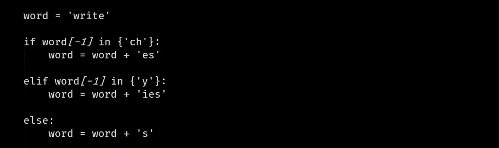
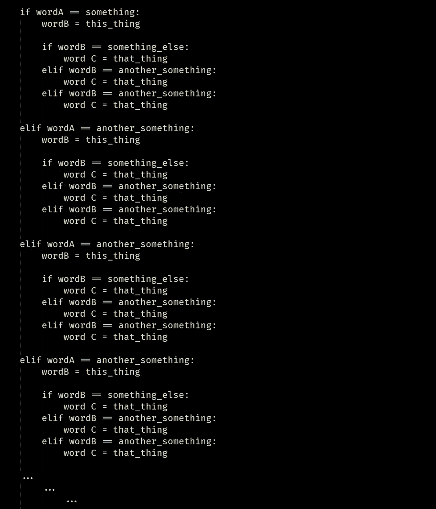

# 使用数学和编程设计最简单、复杂和精确的语言

> 原文：<https://levelup.gitconnected.com/design-the-most-simpliest-complex-and-presise-language-using-mathematics-and-programming-3d9ada37a6a7>

布雷特·乔丹在 [Unsplash](https://unsplash.com?utm_source=medium&utm_medium=referral) 上的照片

自然语言深受人类历史的影响。然而，历史年龄并不意味着他们是正确的。它们不容易学，非常复杂，但一点也不精确。

例如英语。英语在很大程度上是一种垃圾，不能简单地用使用英语的人数来证明其合理性。你怎么能把水算作一个，而把眼镜和裤子算作两个呢？科学家们对此很感兴趣。

水是由 H2O 分子组成的，当且仅当在电子显微镜下有一个 H2O 分子时，总是有水，而不是水。

我知道有很多自然语言使用上下文动词或名词之类的东西，根据上下文或性别使用同一个单词的变体。英语里‘他玩’；“他们玩”显然是这种东西，使这种语言变得不必要的复杂。

在这里我想我可以为引用和引用“最简单复杂和精确的语言”提出一个方案，由我可怜的数学和编程头脑。当然，如果你擅长量子信息和张量代数，任何人都可以做得更好。

# 每个单词都是一个对象。

请注意，我是故意在副标题中写“一个物体”而不是“一个物体”。这当然使语言更精确，更简单。

你需要记住的第一件事是，一个句子或一个短语是由几个对象放在一起组成的，它们中的每一个都是独立的元素。就像我们的世界是由原子的基本构件组成的，但现在我们知道它是夸克，然后是亚夸克…然后可能它实际上是弦…不管“最小的”有多小，但你总是可以找到更小的组件，直到它停止。对于任何语言，它可能是一个字符。

所以语言的基本构件是字符。也许重新定义语言中的字符是一个好主意，例如[u，v]，[h，n]在手写中具有相似的外观和非常低的错误容限。有时课本上做的那些微小的计算没有可读性。名为“h”和“n”的常量无法区分。只有当高度超过 0.5 毫米时，h 和 n 才是可写的。可区分性是一个基本层面的问题。

# 句子中没有隐含意义。

我不希望在判决中有任何暗示。例如，仅仅因为“a”后面有一个“o”,“a object”就一定是“a object”。这实际上是和量子介入相同的现象，量子介入给语言带来了大量不必要的复杂性。换句话说，改变一个无功能的字符无助于理解整个句子。这种不必要的语法规则对学习者来说是一种障碍。

同样的，语言中动词或名词的上下文变化，也不是我想要的。

在英语中，s 加在名词或动词后。但这并不一致。例如，如果动词以“ch”结尾，那么它后面要加上“es”。如果是，那么就是。如果这是一个程序，它会是这样的:

我只是忘记了那些繁琐的规则。这就是为什么这个列表比语法课本上说的要短。当语言使用超过 26 个字符时，编写这些字符交换规则将是一个超长的程序。每次你想说一个词的时候，你的大脑都需要执行这个动作。你确定你不想走捷径吗？

但对于名词来说，同样的‘s’毕竟只是一种描述或传达‘许多事物’的观念的方式，这不需要复杂的条件变分名词来获得同样的功能。谁在乎单数和复数？因为所有单词都是一个宾语，所以复数只是形容词。一个“多”字就足够了。“多”太多了。只用一个“多”来表达“多事”的全部情况。这使得复杂度降为零。这就是中文写作最终的工作方式。

这有数学推理。

假设有三个词。[wordA，wordB，wordC]，它们组成一个句子。

侧词的状态取决于前一个词。就像' s '，' es '，' ies '的用法一样，有些字符会根据上下文而变化。这是一个迭代函数，你无法预测接下来会发生什么，这会导致混乱。

你仍然可以为此写一个条件 if-then 程序。

这可能会永远持续下去。

先不说纠结。只谈方差。如果每个动词有 3 个方差，那么实际上是字典中所有动词的 3 倍。在自然语言中，有时单词遵循规则，但有时不遵循。这种例外的情况使得规则不适用于所有地方，这就是复杂性的来源。你不能简单地压缩这些信息。但最终，这些差异只是代表了同样的东西，所以不值得花力气去制定规则和记住这些差异。

如果纠缠在一个句子中不存在，那么这些繁琐的东西首先都可以省略。任何句子都不应该有纠缠。所有对象都必须保持其独立性和稳定性。

# 做张量词汇。

据我所知，张量代数是一种将几个独立的物体粘在一起的数学技巧。但是这和语言有什么关系呢？

嗯，复合词基本上是由积木组成的。只是，不要每次都发明一个全新的独立单词。英语中没有张量代数的概念。但是在德国和中国，这是基本规则。

比如，“科学家”的字面意思是“做科学的人”，“消防员”的中文意思是“灭火的人”，等等。而不是用决策树来决定你应该用“ist”还是“man”还是“ian”。不是每次发明一个全新的词只是为了表达一个现成的想法。当且仅当新词不能用现成词的组合来表达时，才引入新词。

因为张量代数，这将极大地降低语言的复杂性。你看到的任何新东西，只要说每个人都懂的话。

另一个例子，“跑”和“冲刺”，从根本上说，他们只是在速度上有所不同。在中文里，感谢上帝，它们是“跑”和“快跑”。你知道“跑”，也知道“快”，那么你一定知道“快跑”。

在日语中，传统服装“和服”并不是一个真正独立的物体名称。“ki”是穿的意思，“mono”是东西的意思。事实上，它是“可以穿的东西”。日本的食物实际上是“吃的东西”。但是现代日本人似乎没有意识到他们自己的语言，并失去了进行适当翻译的能力。

由于张量代数，假设你有 500 个基本单词，如果一个单词的上限是一卷 4 个单词，那么它将有 500*500*500*500 = 500⁴词汇，即字典中总共有 620 亿个词汇。奇妙的是，在你学会了 500 个基本单词之后，你就知道了 620 亿词汇中任何一个单词的每一个意思。

张量的真正力量在于它使得语言可以无限扩展。这和“数字”的工作原理是一样的。假设你用一个数字从 0 数到 9，如果你得到的都是一个数字，你只能数到 9。如果是两位数，则可以数到 99，如果是三位数，则可以数到 999，依此类推。当你发现当前系统不足以满足功能需求时，你不必引入一个全新的计数系统。比如 10，11，12，那么什么是 13，14？？？

有些语言没有过去式和将来时。那些需要重新设计整个事情只是为了增加一个新的功能，即增加描述过去发生的事情的能力。当你使用张量时，你只需要在句子中附上表示“过去”的关键词。你可以用同样的方式做任何事情。

所以孩子们，做数学，而不是文学。从我来说，以前是学文学的。

# word 中的纠结。

这是更浓的纠结。虽然我不希望在句子中有任何纠缠，但我希望在文字中。

对任何一个单词来说，它们的发音、书写和意义都应该是纠缠在一起的，在任何情况下都不允许出现脱连贯。中文有点纠结于意义和书写，然而发音却不是。这就产生了口音和方言。但是这是可以原谅的，因为声音信息不是稳态信息。声音是时间序列信息，不容易处理。就像波函数一样，它不会一直保持相同的形状。所以基线必须是写作和意义的纠缠。

对于那些完全不知道这是什么意思的人来说，任何与鱼有关的单词在中文里都写成“fish-xxxxx”。比如子前缀或前缀系统。所以你一定知道那东西和鱼有关。而对于金属，中文是‘metal-xxxxx’。同样的事情也发生在气态物质、硅质物质等上。

# 科学

没错。水是一个水分子，两个水是水或‘多水’。这个不用说两遍了。科学帮助设计一种精确的语言。