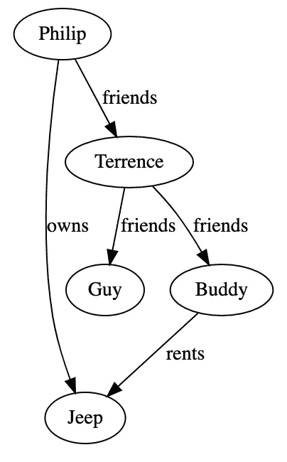
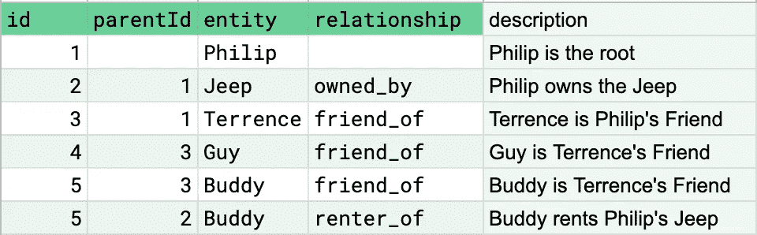
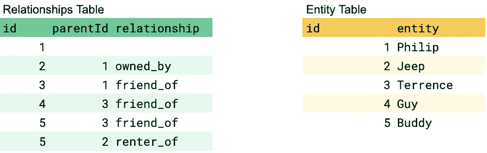
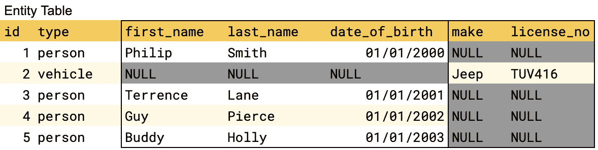
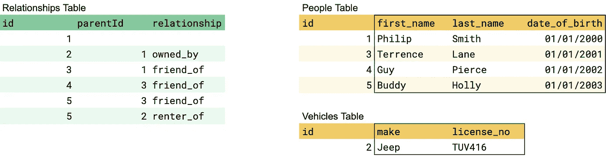
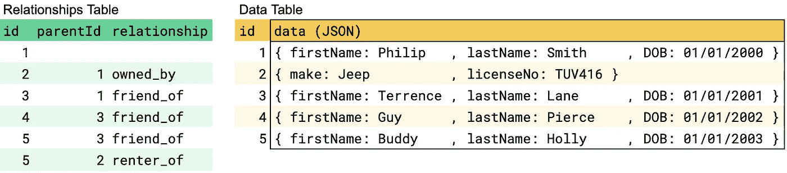

# 在关系数据库中设计图形数据结构

> 原文：<https://levelup.gitconnected.com/designing-a-graph-data-structure-in-a-relational-database-e13ffb857ce2>

奥布里·达尔克在 [Unsplash](https://unsplash.com/s/photos/vine?utm_source=unsplash&utm_medium=referral&utm_content=creditCopyText) 上拍摄的照片

如果你曾经想问我为什么要在关系数据库(如 MySQL 或 Postgres)中设计图形数据结构，而不使用图形数据库或 NoSQL，这可能是出于几个特定的原因:

1.  SQL 作为一种查询语言被广泛使用，大多数开发人员对它都很了解。
2.  RDSs 扩展，有很多大公司已经扩展了关系数据库。(诚然，没有 NoSQL 多，但见第 3 点)
3.  rds 提供了许多有用的一致性保证，以及围绕特定数据访问和数据迁移的灵活性。

# 问题是

图是具有节点和边的数据结构。边连接节点，大多数时候，表达两个节点之间的关系。节点是数据库中的“实体”，是那些关系的主体。

举个例子，

*   菲利普拥有一辆吉普车
*   泰伦斯是菲利普的朋友
*   特伦斯还有另外两个朋友——盖伊和巴迪
*   巴迪目前出租菲利普的吉普车

如果你试着想象这些关系，你可能会得到这样的结果:

与 http://www.webgraphviz.com[一起创作](http://www.webgraphviz.com/)

在表格中呈现这种结构有多种方式。一种方法是让表中的每一行都有一个到图中相邻行的“链接”。换句话说，每一行都有足够的信息来推断相邻关系。我们称之为邻接表。

图一

正如你所看到的，这个表格传达了和我们的视觉图一样多的信息。出于可读性的目的，我保留了表中的*实体*字段，但是当构建该表的最规范形式时，我们可以将其丢弃，因为它是可以使用 *id* 字段从另一个表中解密的信息。

由于我们使用的是关系数据存储，因此规范化这些信息会使我们有两个表。对这些表执行连接将得到表的先前版本(图 1)。

图 2

# 稀疏表格

实体表保存 id 和实体之间的映射。但事实是，实体可以是任何东西，不可避免地，我们将不得不存储某些特定实体特有的信息。

例如，Jeep 属于车辆类型，必须有牌照。菲利普、泰伦斯、盖伊、巴迪都是人，都有姓氏和出生日期。如果你不介意迁就我一下，我们可以把所有这些列放在一个表格里，就像这样:

图 3

我们需要我们的关系表来保存另一个表中的关系。

正如您可能怀疑的那样，某些列不适用于某些实体类型。对于这些列，它们用空值表示。实体越多，每行的空列就越多。我从现在开始把这个叫做稀疏表。因为随着实体数量的增加，包含空值的单元格数量也会增加。

## 赞成:稀疏表实现起来很简单

它是一张单人桌子。通过一个简单的 SELECT 语句，您可以访问您想要的所有信息。但不幸的是，这可能是这种设计唯一的好处。

## 缺点:很难保证数据的一致性

数据没有标准化，每个实体都可以访问其他实体的列。没有什么可以阻止 Terrence 在数据库设计中拥有一个 license_no 属性。

## 缺点:它不能随着实体数量的增加而很好地扩展

关系数据存储能够很好地处理大表。但是一旦表中的列数开始增加，这种可伸缩性就会下降。你可以争辩说，如果这是真的，你必须有大量的列。但是，如果您支持的实体数量或每个实体支持的列数增加，这种情况很快就会发生。根据 RDS 分区的内部情况，您迟早会遇到这个问题。

## 反对意见:迁移可能会很痛苦

因为所有数据都集中在一个表中，所以添加、删除或更改列的数据类型可能需要一些停机时间。这是因为 rds 是为强一致性而设计的，当数据库模式在后台很难改变时，它可以实现一定的一致性保证。

## 缺点:单个表成为您的瓶颈

如果您有一个繁重的写入工作负载，那么您的所有应用程序节点都将开始向该表写入数据。如果您对一些数据库操作使用事务，您可能会发现一些操作被死锁或等待锁，这取决于您的[隔离级别](https://en.wikipedia.org/wiki/Isolation_(database_systems))。

# 卫星表

另一个解决问题的方法是使用我称之为“卫星桌”的设计。您可以在一个表(id，parentId，type)中拥有节点的关系，并拥有 *n* 个其他附属表，其中 *n* 是您的“实体类型”的数量。

本质上，它是稀疏表设计的标准化版本。

图 4

因为所有的实体都有自己的表，所以避免了稀疏性。然而，现在当您想要读取所有数据时，您将有 n 个连接要执行。要获得数据集的完整视图，您必须将关系表的 id 与人员表和车辆表的每个 id 连接起来。

如果您创建这个视图，那么它包含一个数据集，非常像我们前面看到的稀疏表。但是，由于数据存在于几个表中，而不是一个表中，所以它没有同样的缺点。

## 赞成:数据集是正常的。

这里不需要太多解释——一切都在[第三范式](https://en.wikipedia.org/wiki/Third_normal_form)中。

## 赞成:数据访问是分布式的

由于数据访问分布在多个表中，并且每种类型的实体都有自己的表，所以您的读写不会像稀疏表设计那样出现瓶颈。

## 教授:迁移更容易

您的迁移现在影响更多的表，但是影响是分散的。如果您正在进行大型迁移，(比如完全删除一个实体类型或者添加一个新的实体类型)，可以分阶段进行，避免停机时间。例如，要更改大型实体表的模式，可以先用新模式创建一个新的实体表，将数据增量迁移到新表中，然后废弃旧表。这在稀疏表设计中是不太可能的。

## 缺点:连接随着实体类型的增加而增加

就像稀疏表设计中的列随着实体类型的增加而增加一样，连接也随着实体类型的增加而增加。并且连接会稍微降低查询性能。

## 缺点:数据访问逻辑很复杂

对于稀疏表设计的所有缺点，数据访问要简单得多。您可以在一个表上做一个简单的选择、更新、删除，然后就完成了。在卫星表设计中，你必须包含连接。如果您想要删除一个实体，这将导致在两个表中最少两次删除操作

# JSON 列

当我们试图在关系数据存储中设计图形数据结构时，看起来我们试图解决两个问题。

1.  设计一个邻接表，把代表一个图的行彼此连接起来。
2.  设计可以在关系数据存储中表示 n 个模式的数据存储。

如您所见，1 可以很容易地用引用`id`列的`parent_id`列来解决(用外键来确保一致性)。

№2 是我们正在努力解决的问题。当您可以事先对表模式进行推理时，传统的关系数据存储规范化技术是有用的，但是当您使用不断变化和不断增长的模式列表时，它们就不够用了。

这是 NoSQL 试图用“无模式”设计来解决的一个问题。但是正如一些大型的 T2 实现可能显示的那样，SQL 可能是比 NoSQL 更好的 NoSQL。

以这种方式设计表看起来很像稀疏表设计，但是您的数据在 JSON 列中。

## 教授:鱼与熊掌不可兼得。

您可以享受 RDS 世界的精华，享受它所提供的保证，以及一种让您将无模式数据视为无模式数据的查询语言。数据库中可以正常化的数据被正常化。

## 利:减轻对可伸缩性的大部分担忧。

在上面的两种方法中，我们遇到了列和连接数量的可伸缩性问题。使用这种方法，随着表中行数的增加，您会遇到可伸缩性问题。谢天谢地，这个问题有很多解决方案。

## 利:迁移可以利用 JSON 函数

如果需要对 JSON 列进行迁移，可以使用引擎的查询功能来进行更新，而不需要借助应用程序代码。换句话说，您将在数据库级别处理数据库迁移。

## 缺点:你必须在应用程序代码中实施 JSON 模式

关系数据库不能保证 JSON 列中使用的模式。这将是您必须在应用程序代码中强制执行的内容。除非您求助于在 JSON 列上进行数据库迁移，否则您将不可避免地实施[模式读取](https://luminousmen.com/post/schema-on-read-vs-schema-on-write)方法，就像您如何处理 NoSQL 用例一样。

# 关于 NoSQL 解的一个注记

现在，您可能会问，我们处理 NoSQL 数据库不是更好吗？毕竟，这是一个键值存储。嗯，你可能会。但是，不要把关系数据存储带来的好处一笔勾销。

您将获得更多的一致性保证、 [ACID 事务](https://en.wikipedia.org/wiki/ACID)，以及批量更新 JSON 数据的能力，其中 [MySQL](https://dev.mysql.com/doc/refman/8.0/en/json-functions.html) 和 [Postgres](https://www.postgresql.org/docs/9.5/functions-json.html) 都实现了 JSON 查询，并将语法更新为 SQL 的超集。

由于 NoSQL 数据库的设计，它们往往比关系数据库更具可伸缩性，但这种优势仅在大型数据集上体现，为了获得这种优势，您必须做出许多正确的决策，包括预先选择正确的分区键。通常，当迭代一个项目时，由于不断变化的需求，很难确定正确的分区键。

当您认为自己犯了一个错误时，NoSQL 数据库中的数据库迁移也不是一件小事。DynamoDB [对批量更新吞吐量](https://docs.aws.amazon.com/amazondynamodb/latest/APIReference/API_BatchWriteItem.html)有上限，MongoDB 有[的数据库内 map-reduce](https://docs.mongodb.com/manual/core/map-reduce/) 功能，管理起来有点麻烦。

而在 RDS 中，您可以将 JSON 数据作为数据迁移的一部分或作为读取模式机制进行迁移。换句话说，对于绝大多数用例(当然，这取决于数据集的大小)，为此目的使用 rds 有很大的好处，但坏处很少。