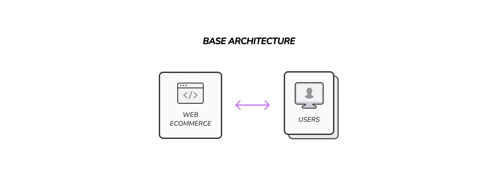
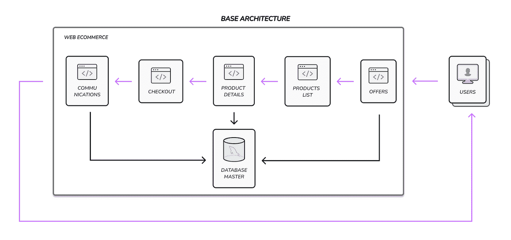
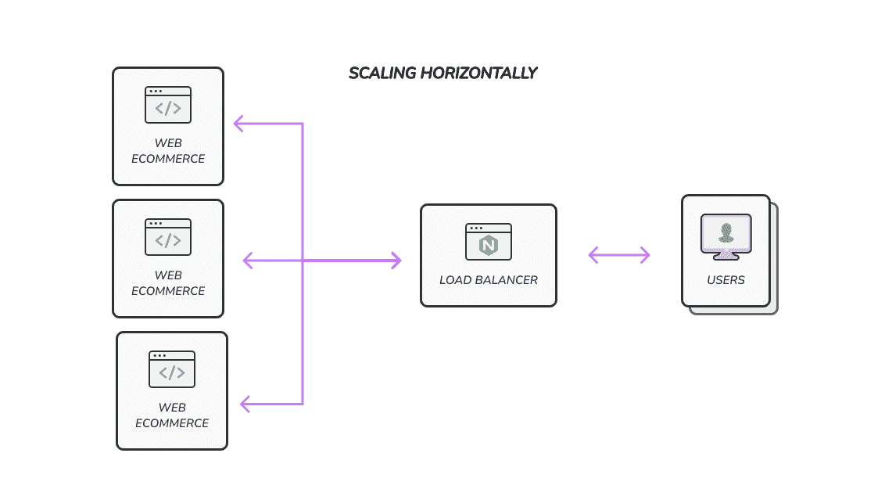
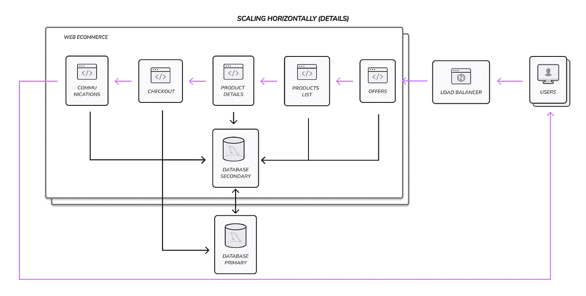
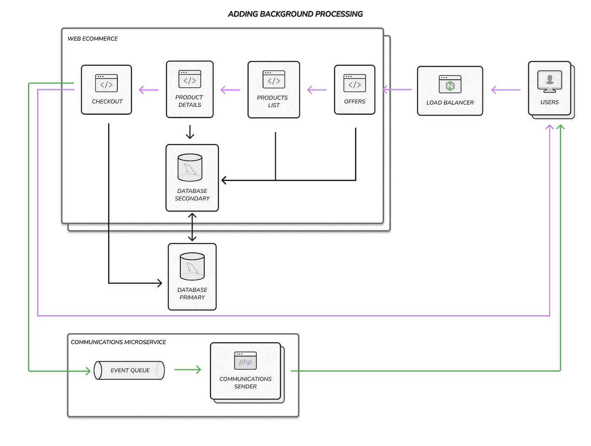
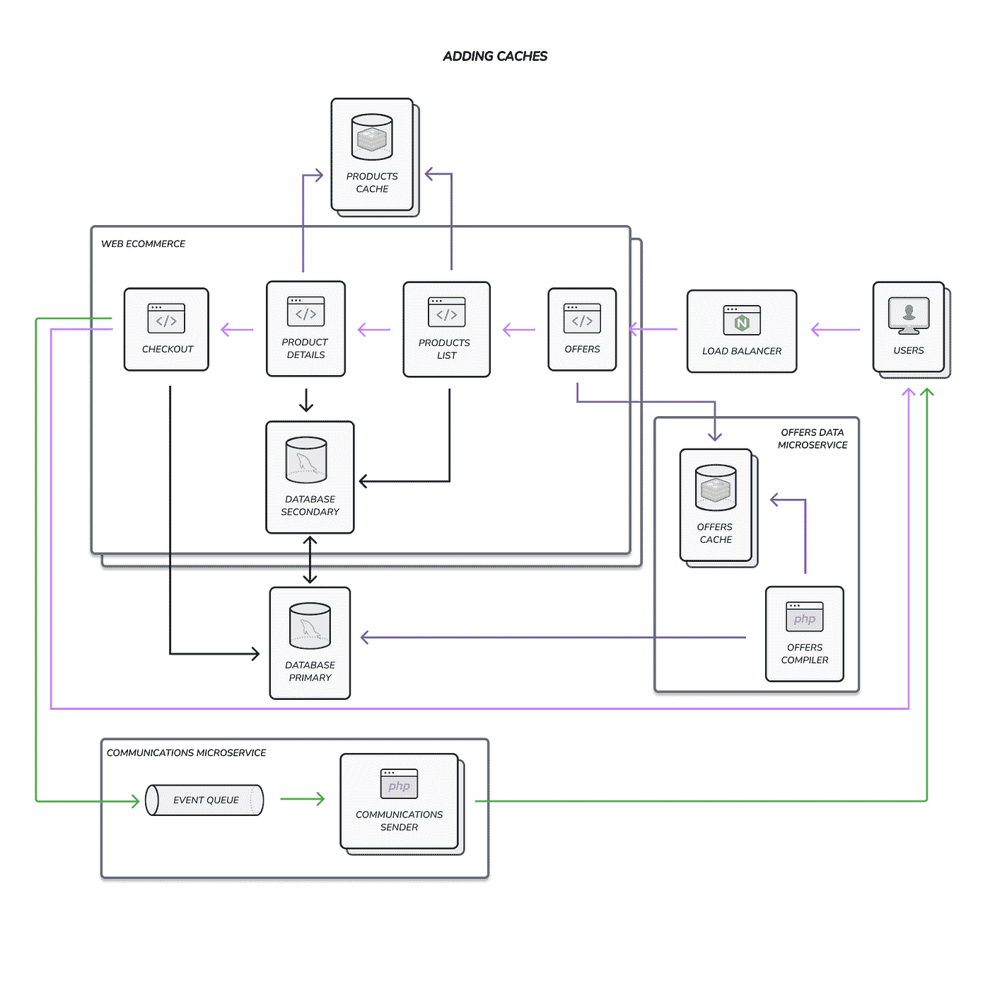
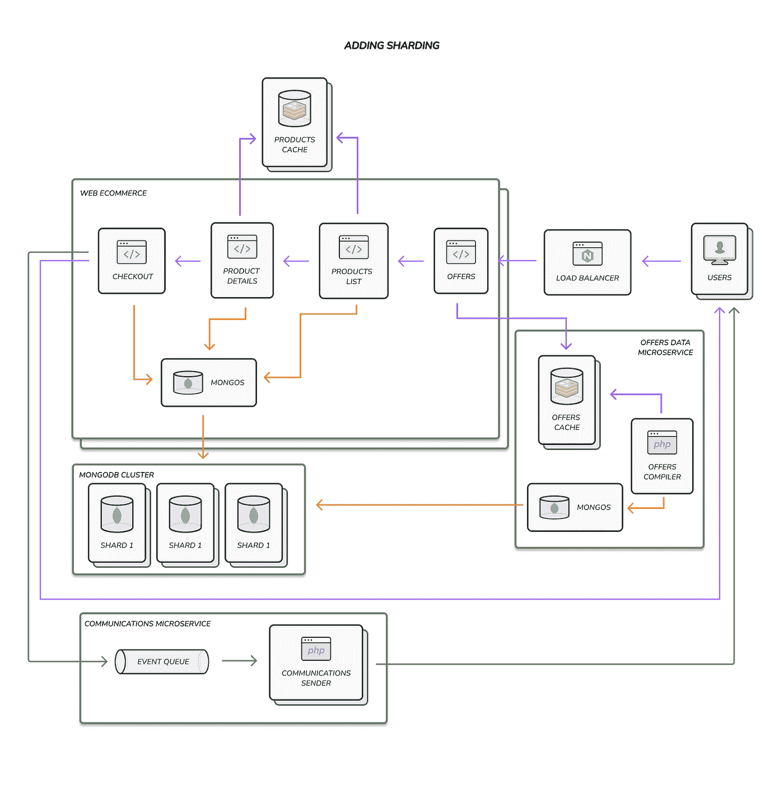

# 为傻瓜设计一个高度可扩展的电子商务网站。

> 原文：<https://levelup.gitconnected.com/designing-a-highly-scalable-e-commerce-site-for-dummies-947e0f6665fe>

照片由[陈茂三潭✪](https://unsplash.com/@tranmautritam?utm_source=unsplash&utm_medium=referral&utm_content=creditCopyText) 拍摄于 [Unsplash](https://unsplash.com/es?utm_source=unsplash&utm_medium=referral&utm_content=creditCopyText)

这是关于如何创建和开发高可伸缩性后端应用程序系列的第三篇文章。您可以查看关于一些基本概念的[第一篇文章](/scaling-backend-applications-for-dummies-31c713ec04a4)，以及关于如何在您的应用程序中应用高可伸缩性模式的[第二篇文章](/high-scalability-patterns-for-dummies-da1f7d2a7873)。

在本文中，我们将集中讨论如何使用我们从以前的文章中获得的所有知识来扩展真实世界的后端应用程序。

我们将特别关注体系结构的变化，以在应用程序中实现我们想要的高可伸缩性。

免责声明:本文旨在介绍这一主题，因此我将跳过许多内容，如配置文件、部署环境配置等。出于同样的原因，一些架构变化不会像广泛使用微服务的重大重构那样被提出或解释。我想让没有经验的开发人员容易理解这个解释。

让我们继续前进，获取一些关于我们项目的信息！

# 项目定义和初始系统架构

首先，我们需要定义我们正在处理的项目和一些初始架构。

我们要合作的网站是正规的电商网站，有点像亚马逊，零售网站，Shopify 等。因此，基本上可以想象任何一个常规的电子商务网站，当用户购物时，它会发送电子邮件与用户进行双向交流。

用户的主要使用情形如下:

*   查看优惠
*   列出产品
*   查看产品详情
*   检验
*   发送电子邮件确认购买

我们的项目是一个整体，封装了所有功能，但使用相同的代码库开发。因此，在不同的应用程序中分离每个特性是很容易的，但是现在，这不是一个技术要求，因为技术债务不是很高。

同样，每个特性都使用一个常见的典型 MySQL 数据库来存储关于产品、订单、折扣、活动等的所有信息。

简而言之，我们面前的是一个成功的 MVP 应用程序，它将随着时间的推移变得越来越大。它正在工作，但它接近达到技术债务开始成为开发新功能和维护现有功能的问题的程度。

所以……突然有一天，我们的产品经理告诉我们，因为公司在成长，销售情况也很好，营销团队正在准备一场大型活动，以增加黑色星期五的销售额。

技术团队因为这个好消息而非常高兴，但是很快他们都开始意识到应用程序没有为此做好准备。为了获得良好的响应时间和处理预期的巨大流量，必须做大量的工作。

听起来耳熟吗？你遇到过类似的情况吗？

# 分析和改进

在产品路线图发生变化后，技术团队的所有人都开始思考如何改进应用程序，以应对巨大的黑色星期五活动。

首先，他们需要发现当前的性能问题，以及当请求数量开始增加时可能出现的新问题。为此，他们用 Kibana 和 Elasticsearch 建立了一个可观察性仪表板，以获得一些关于性能和 APM 信息的详细指标。

之后，他们开始测量当前客户请求、页面负载、数据库缓慢查询等的性能。有了这些信息，他们可以发现一些可能严重影响黑色星期五活动的问题。

发现的主要问题是:

*   有时发送购买确认电子邮件会花费太多时间
*   在高峰时段提供页面性能下降
*   产品列表和产品详细信息页面的性能在高峰期间会下降，并且发现了许多与这些功能相关的缓慢查询
*   写签出信息的时间度量在最忙的时候达到峰值

如您所见，他们可以确定在启动新活动之前应该解决的四个不同问题。

每个问题都可以使用不同的高可伸缩性模式来解决，因此在接下来的部分中，我们将对电子商务网站的初始架构进行更改，以改进它。

# 水平缩放

技术团队做的第一件事是添加更多的服务器来提高代码执行速度。是的，他们应用水平扩展来提高性能。

系统中的变化是最小的。所有服务器将执行相同的代码，并使用 CI/CD 工具进行相应的更新。一个负载平衡器被放置在适当的位置，将请求分发到将执行代码的服务器池中。

其中一个重要的变化是修改数据库架构以创建一个主从架构。主服务器将对池中的所有服务器保持公用，并且池中的每台服务器都有一个用于只读目的的数据库辅助副本。需要对代码进行一些更改，以使存储库在需要时使用主服务器或辅助服务器，但这些更改是最小的，因为它们没有更改数据库引擎。

这些变化提高了高峰时段的性能，但没有解决所有问题，因此团队一直在改进系统。

# 使用后台处理

该团队解决的第二个问题是发送购买电子邮件有时非常慢。这个问题发生在系统的特定部分，并影响它的特定功能，因此他们探索了另一种解决方案。

有时“发送电子邮件”功能真的很慢，因为连接到外部电子邮件服务器的问题。因为这不是一个关键特性，这段代码的执行可以推迟到稍后发送电子邮件，所以团队通过应用后台进程模式解决了这个问题。

该团队创建了一个微服务来重构这个功能，以运行所有这些业务逻辑。微服务和 monolith 将使用事件总线进行通信。这样，主代码将执行购买过程，并将向总线发送一个事件，以便稍后发送电子邮件。

事件总线是一种在微服务或系统的不同部分之间发送消息的方法，因此将更多的操作推迟到系统的其他部分是一个很好的改进。

现在应用程序准备得更充分了，但是为了让应用程序准备好处理黑色星期五活动的所有请求，还可以做一些其他的事情。

缓存数据

下一个改进集中在报价、产品列表和产品详情页面的性能上。以前，该团队通过启用水平扩展来提高整个系统的性能，但这些页面需要一些特定的改进。

为了改进这些页面，该团队选择使用缓存来降低响应时间，并允许这些页面处理更多的查询。

该团队选择使用两个具有不同逻辑的缓存实例来存储和填充数据。

第一个将存储产品信息，并将使用一种懒惰的方法来填充数据。这意味着当业务逻辑从主数据库获得查询结果时，数据将存储在缓存中。这种方法有一些缺点，那就是当数据不在缓存中时，性能不是很好。但另一方面，这种缓存的维护成本较低，因为它是自己填充的。

第二个缓存将存储报价信息，并使用一种急切的方法来填充数据。在这种情况下，该团队创建了一个过程，通过从主数据库中的信息进行编译来存储报价数据。这种方法非常好，因为它将提供最佳性能，因为系统将总是从缓存中检索信息。但是它有一些问题，系统将只能使用存储在高速缓存中的数据，因此如果一些数据存在于主数据库中而不在高速缓存中就无法检索。

分片主数据库

为了获得一个健壮的系统，团队应该解决的最后一个问题是与高峰时间写入主数据库的性能有关的问题。

为了提高写性能，最好的解决方案之一是在数据库层使用分片。它需要大量的更改，因为通常涉及到更改数据库引擎，这意味着在代码中进行大量的更改和重构。

在这种情况下，团队选择将使用 MySQL 的主数据库更改为基于 MongoDB 的 NoSQL 数据库。如前所述，这种变化需要对代码进行大量修改，以使数据存储库类适应这种新的数据库引擎。

这确实很有挑战性，需要付出很多努力，但它允许系统处理成千上万的写请求，并使系统更加健壮。

# 结论

当您要提高应用程序性能时，您的第一步应该是深入分析，了解系统不同部分的性能指标。

下一步是创建一个策略来解决在初始分析中发现的所有问题。解决性能问题最常见的方法是水平扩展、实现缓存和后台处理。

为了提高整个系统的性能，您应该混合和匹配所有的可伸缩性模式，以提高性能和处理的请求数量。在本例中，您可以看到扩展和应用是一个迭代和增量过程。

我的建议是，伸缩和性能问题应该像任何其他 bug 一样得到解决。所以你不需要一次性地进行大规模的重构，而是在维护系统的过程中定期进行小的改进。