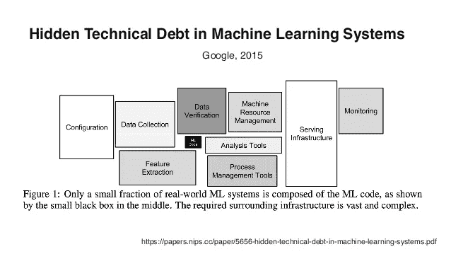
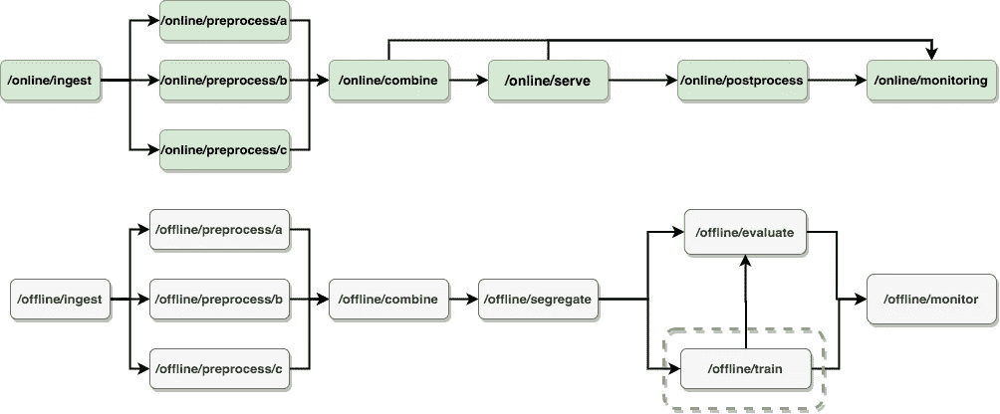
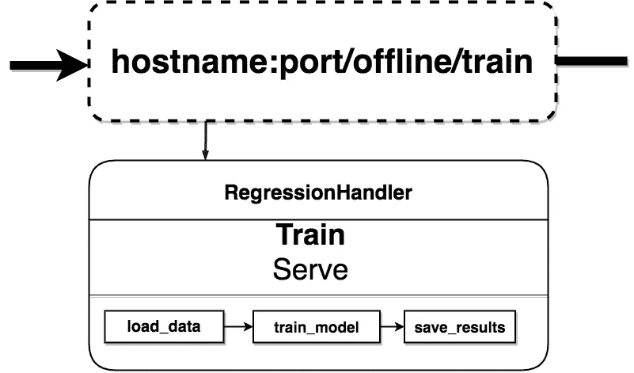
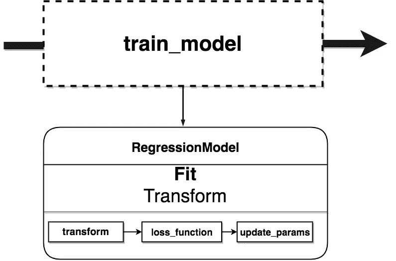

# 设计机器学习微服务

> 原文：<https://levelup.gitconnected.com/designing-a-machine-learning-micro-service-dbac65c3b9fe>


# **简介**

在机器学习研究中，非常强调模型开发。人们对新颖架构的关注如此之多，以至于数据几乎成了一种事后的想法——这是有可能的。当使用为机器学习模型的基准测试精心准备的标准化数据集时，我们不需要谈论管理我们的模型和数据之间的交互。

在现实世界中，情况要复杂一些。焦点转移到处理数据上，因为在商业环境中，数据是易变的、混乱的和分散的。因此，我们将讨论如何弥合世界级模型与如何构建一个将该模型应用于业务工作流程的系统之间的差距。要明确的是，我们不会谈论机器学习模型本身或模型设计，因为有很多“如何从头构建神经网络”的文章。为了限制本文的范围，我们也不会过多地讨论数据管理和存储(留到后续文章中讨论吧！).

相反，我们将从快速描述机器学习系统的每个部分开始。在此基础上，我们将讨论如何组织所有这些部分，以便作为微服务进行部署。最后，我们将描述如何为所有这些组件定义接口，以及如何构建允许这些组件相互交互的管道。

# **机器学习系统设计**

我们可以把模型想象成某种黑匣子，它做两件事，数据训练和预测。在其核心，这就是它所做的，在我们的应用程序的核心，我们将有。我们称之为`fit`和`transform`。但是有很多其他的部分也应该被认可。



上面的小黑方块是 ML 代码。我们不会涵盖上图中的每一个方框，但是让我们来谈谈与我们的模型直接相关的一些事情。

## **线上 vs 线下**

在线和离线本质上是指如何处理数据。从这两个类别，我们可以对我们机器学习系统的所有其他部分有不同的策略，所以这可以被认为是系统的最高划分。

在“离线”设置中，源数据来自历史信息(日志、数据库)。大多数情况下，训练模型是“离线”进行的，因为数据来自存储。当用户点击你网站上的东西时，这个活动就会被存储在日志中。既然有了所有的数据，就可以批量处理了。

在“在线”设置中，数据是“实时”的，因此是动态生成的。这意味着数据来自生成数据的源。这方面的一个例子是实时(“在线”)发生的点击。您手头没有数据，并且可能无法在训练新模型之前等待数据收集到存储器中，因此需要将其作为流进行处理。

## **子组件**

在线和离线模式之间有一些共同的组成部分。我们将把这些组件组织成服务，所以我们将从列出它们是什么开始。

**摄取**

摄取是机器学习系统的第一部分。它从外部数据源获取数据。这是系统的边界。我们希望指定用于训练的数据将来自哪里，以及用于服务的数据将来自哪里。摄取应该将外部数据的副本作为“原始”数据转储，这样您就拥有了用于构建模型的数据的不可变的历史时间戳。这比将模型的数据管理耦合到外部数据源更好。

**准备**

预处理是大部分工作发生的地方。通常被称为“特征工程”或“数据挖掘”，这是我们从源获取原始数据并将其转换为模型就绪格式的地方。这意味着清理、格式化、输入和丰富数据。每个唯一的数据源都有自己的数据准备管道。

**组合**

这种组合包括将所有独立的准备管道中需要的东西连接起来。如果准备管线并行运行，您仍需要将它们合并到一个单一的要素和标注数据集中。在服务期间，我们将只有特征而没有标签，因为标签将由我们训练有素的模型创建。

**分离**

我们需要将数据集分成不同的群组。通常，我们保留一大部分可用的标记数据集用于训练，然后一些用于测试。在模型开发过程中，我们可以将测试数据进一步分割成“开发”或“验证”数据集，这样我们就可以针对看不见的数据改进我们的模型，但仍然可以在真正从未见过的数据上测试它。

在服务期间，我们可能只分离和保留未标记的数据，或者我们可能有一个不同的在线学习和服务的分割。

**培训**

对于训练，我们获取用于训练的数据集(包括特征和标签)和未训练的系数数据，然后更新这些系数，直到我们的模型可以仅使用系数和特征来创建与实际标签匹配的标签。最后，我们只剩下一个经过训练的模型，训练数据已经达到了目的。

**评估**

我们需要一种方法来衡量我们训练好的模型的性能。当然，它很好地符合它已经看到的数据，但是它如何处理它还没有看到的数据呢？这一步获取测试数据和经过训练的模型，并评估模型的表现。如果经过训练的模型通过评估，那么它就成为服务预测的可用候选。

**上菜**

服务将选择一个候选模型，并使用它来创建对未标记数据的预测。这是机器学习的核心价值——在事情变得已知之前的某个时候估计它将会是什么。与需要输入和输出来生成训练系数的训练不同，我们现在将使用输入和系数来进行我们业务所需的预测。

**后处理**

当我们处理数据和机器学习模型时，我们非常接近金属。机器学习模型涉及浮点数向量的矩阵乘法、微积分和线性代数，它们返回概率或实值。在后期处理过程中，我们将重新格式化和丰富模型输出，使其成为更易于使用的格式。

**监控**

我们可能希望报告进入系统的数据的特征、模型的性能、预测值和历史真实值。为了预测房价，我们可以把预测房价的分布想象成类似于可用数据的房价分布。如果差别很大，那么这个模型可能已经严重降级，或者可能有一个 bug。我们可以包含独立于上述其他组件的监控服务。

# **创建微服务**

我们现在需要做的是将这些组件定义为服务。微服务设计的一个原则是提供粗糙的外部接口。我们将通过用 RESTful APIs 包装这些组件来实现这一点。这种模式提供了“端点”,看起来很像客户端调用来执行任何组件的 web 地址。

**定义终点**

假设我们正在建立一个模型来预测一种新药临床试验的成功概率。过去临床试验的历史和结果可以在一个名为“现在健康数据”的共享存储库中获得。

`[http://hostname:port/offline/preprocess](http://hostname:port/offline/preprocess)`将对来自当前健康数据和许多来源的摄取数据进行预处理，以生成模型就绪数据集。在提供预测时，我们依赖位于“私有健康云”上的内部临床试验数据。当内部启动新的试验时，我们将调用`[http://hostname:port/online/preproc](http://hostname:port/offline/preprocess)ess`从“私有健康云”准备原始的未标记数据。然后我们将调用`[http://hostname:port/online/s](http://hostname:port/offline/preprocess)erve`来获取最新部署的模型以生成预测。

**定义服务边界**

由您决定哪些组件属于哪个服务端点。它可以是细粒度的，因为每个组件都被视为具有自己的 API 端点的独立服务，或者许多组件都位于一个服务之下。服务越分散，应用程序就越模块化。但是，网络成本更高，需要维护额外的基础设施。每个服务负责它自己的数据，所以当数据在内存中，并且可以简单地传递给管道中的下一步时，不太希望分解服务。

**集装箱化**

面向微服务架构的另一个好处是，服务不需要全部放在一起。由于它们通过 API 相互交互，每个服务都可以被认为是自己的应用程序，有自己的应用程序需求。如果机器学习系统的不同部分有不同的计算需求，那么我们可以为它们定义单独的容器。在最简单的情况下，我们为所有服务定义一个容器，因此部署将包含运行所有服务所需的所有需求。在另一个极端，每个端点都有一个容器，其中每个端点都是作为独立应用程序部署的自己的服务。

为您的服务定义多个容器的一个好处是，每个服务只有运行所需的需求。这对于依赖性隔离来说非常好。让我们看一个例子，不同的服务是用不同的编码语言开发的。模型训练是用 Scala 设计的，需要 GPU 资源。这些容器每晚旋转运行训练，模型参数被转储到云上的 YAML 文件中。虽然我们需要数据并行性来训练我们的模型，但与预测速度相比，实时数据的速度不需要 GPU 来服务预测。服务模型是用 C++编写的，其中模型用包含最新参数的 YAML 文件刷新。此外，用于数据准备和培训的许多工具在服务过程中根本不需要，因此我们将与服务预测相关的服务仅与进行预测所需的软件封装在一起。

**版本控制**

机器学习系统通常受到“CACE”范式的困扰— ***改变任何事情都会改变一切*** 。考虑到这一点，我们可以说“模型”包含了我们上面描述的所有东西。对任何服务的更改，尽管是独立模块化的，但都被认为是新的模型版本。

# **深入挖掘:实现服务**

我们知道我们的机器学习系统需要什么组件，我们知道我们将使用 RESTful API 端点来与它们交互。我们如何设计这些端点背后的系统？

我们将讨论两个框架，我们将使用它们来编排我们的机器学习模型，这两个框架将渗透到我们系统的大部分。第一个是模板化接口，第二个是数据流编程。

# **模板化接口**

我们将设计两个包来创建我们的机器学习系统、处理程序和模型的组件。当客户端调用一个服务端点时，应用程序将使用处理程序和模型执行所需的功能。

Handlers 将提供两个接口`train`和`serve`，models 将提供`fit`和`transform`。这些是我们的应用程序将使用的内部 API，而应用程序向客户端公开 RESTful APIs(以 URI 的形式)。

# 经理人

处理程序处理数据。可以把它们想象成定义数据管道的类。他们主要负责数据管理。它们处理标准的提取、转换、加载(ETL)逻辑，从源提取数据，通过模型传递数据，然后存储到目的地。

## **列车**

在**训练**的情况下，这些训练者充当模型的训练者。他们收集训练数据和训练参数，将它们提供给模型，并存储结果。我们定义了如何在 Handlers train 函数中训练模型，使用模型的`fit`接口使模型调整系数。

## **发球**

在**服务于**的情况下，处理程序负责收集未标记的数据和一个具有训练系数的模型。处理程序使用 models `transform` API 将这些未标记数据的特性转化为预测标签。

```
class RegressorHandler(BaseHandler): @classmethod
    def train(cls, model, epochs):
        ... @classmethod 
    def serve(cls, model):
        ... @staticmethod
    def load_data():
        ... @staticmethod
    def load_params():
        ... @staticmethod
    def store_output():
        ...
```

当处理非 ML 模型时，没有`train`功能。相反，Serve 将使用 models `transform` API 来转换数据，可能不需要任何参数。这方面的一个例子是[group by-apply-combine](https://pandas.pydata.org/pandas-docs/stable/user_guide/groupby.html)方法。这样做不需要参数，但是我们仍然使用一个**模型**类来实现逻辑，处理程序将使用`serve`以这种方式转换源数据。

# **车型**

模型包含应用程序的核心逻辑。它们接受数据并执行某种转换。我们可以用一个抽象基类来模板化它们，以要求两个接口:`fit`和`transform`。

## **配合**

Fit 是为需要使用输入数据来调整某些参数的模型保留的(这个词我一直和“系数”互换使用)。它是机器学习的“学习”部分。本质上，它将通过将输入与系数相乘并相加，将输入转换为预测的标签，测量预测与提供的实际标签之间的误差，然后以方向正确的方式更新这些系数。

## **变换**

对于机器学习，变换构成了拟合函数的第一部分——将输入转换为预测的标签。当我们进行预测时，我们不再需要更新系数，所以处理程序使用`transform` API。对于非机器学习模型，transform 将通过其他无状态函数传递数据，以获得所需的输出。

```
# models/regression.pyfrom templates import BaseModel
import numpy as np**class** **Regressor**(BaseModel):

    @classmethod
    def fit(cls, parameters, x, y):
        y_h = cls.transform(x, parameters)
        err = cls.loss_func(y_h, y)

        return cls.update(parameters, x, y_h, y) @classmethod
    def transform(cls, x, parameters):
        x = x.dot(parameters.theta)
        x = x.add(parameters.bias) return x @classmethod
    def loss_func(y_h, y):
        ... @classmethod
    def update():
       ...
```

## **数据流构造**

[数据流编程](https://en.wikipedia.org/wiki/Dataflow_programming)采用了一种更加功能化的软件设计方法，也就是说，数据流经无状态程序，这些程序对通过它们的内容进行转换。将这些程序视为节点，根据数据流向以流程图的方式连接起来。这被称为有向无环图，简称 DAG。

## **编排服务**

当我们编排服务的执行时，我们可以将每个服务看作一个无状态的节点，有数据流入和流出。在很多情况下，诸如 Airflow 或 Luigi 之类的调度和编排系统将这些服务的执行定义为 DAG。在这种情况下，编排(和调度)位于系统之外，所以我们不需要担心这是如何发生的。



一个示例机器学习系统的服务图。为了简化图表，我没有包括数据存储系统之间的交互。

## **编排处理程序**

上图中的每个服务都调用处理程序 API 来运行数据管道。处理程序是描述任何给定数据管道的类。`train`或`serve`API 以同样的方式执行一系列的子程序。



放大到其中一个应用服务，/offline/train 利用处理程序的“Train”API 通过一系列 ETL 函数传递数据。

## **编排模型**

像处理程序一样，模型也是数据管道。它们公开的 API`fit`和`transform`执行一系列子程序，这些子程序像一条 DAG 一样串在一起。



## **最终想法**

组成模型和处理程序 API 的子程序是原子函数。在上面的图中，我展示了一个 DAG 的*load _ data→train _ model→store results*和*transform→loss _ function→update _ params。这些函数是模型和处理程序的基础。*

在一个完美的函数式编程世界中，我们将数据从一个匿名、无状态的函数转移到下一个函数。如果你想知道一个函数做什么，看看数学。由于是匿名的，所以没有明确的名称。

相反，我们采用这些小的匿名函数，比如`lambda x: sum(x) / count(x)`(我们可以称之为“平均值”)并将它们堆叠成一个完成一项任务的命名函数。我们可以测试这些命名的函数，以确保它们按照预期转换数据，然后将它们串到一个由我们的模型或处理程序 API 调用的管道中。然后，我们可以测试这些 API，以确保它们也以正确的方式转换数据。

# **结论**

这就完成了这篇关于机器学习系统的文章，从高到低。从整体上描述机器学习开始，我们将其分解为组件，然后描述我们如何将它们组织在一起作为微服务。然后，我们讨论了使用模板方法和数据流范例来组合构建数据管道所需的类。

最后，我们描述了我们需要的两个类，处理程序和模型。从处理程序开始，我们讨论了它们如何用于 ETL 数据管道、培训和服务模型。然后，我们完成了最低层，模型类，它描述了我们的应用程序的核心逻辑，机器学习方法，以及组成它们的原子函数。