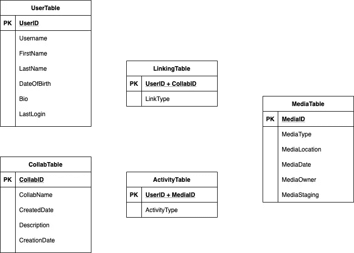
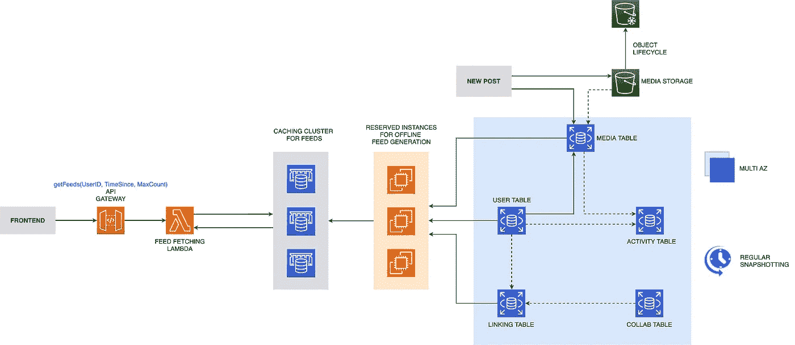

# 在 AWS 上设计社交媒体新闻源

> 原文：<https://levelup.gitconnected.com/designing-a-social-media-newsfeed-on-aws-c5e17c5b5fa2>

让我们从理解我们试图设计的东西开始:新闻提要是一个不断更新的事件列表，包括照片、视频、链接、文本、应用程序活动，如来自用户网络中的人和页面的评论、分享和喜欢。

所以总的来说，我们可以说我们有以下要求:

1.  提要应该支持不同类型的数据，如图像、视频和文本
2.  饲料将显示为用户的网络，因此应该有用户之间的链接
3.  提要可以包含按用户、按页面和作为组的一部分的帖子。
4.  使用模式可能因用户而异。

# API 设计

我想说，系统设计的道路更多的是个人选择，有些从数据库开始，我从 API 开始。

这里我们只看一个组件，所以我们将把重点放在论点上。请注意，我们正在查看一个基于时间的组件，因此在决定参数时，我们的主要关注点也是“时间”。
1。**用户名/用户标识**——非常明显的一个，将用于定义社交媒体网络中的根节点
2。**times since**——如果你经常查看你的 Instagram 订阅，你会注意到在向下滚动所有最近的帖子后，你会看到“你都赶上了”的消息。这个论点可以帮助我们实现那个
3。 **MaxCount** —很长时间后您可能会登录到平台上，因此只需设置 TimeSince 参数就会生成一个巨大的响应列表。为了避免这种情况，让我们添加这个阈值。

我想我们都准备好进入下一步了。

# 数据库设计

可以有很多方式来看待这一节。您可能会创建一个用户表、一个包含许多用户的组表、一个包含多个关注者的页面表，但是请听我说…

为了保持列的有限性和设计的可伸缩性，我认为这种设计是合适的。

**用户表**包含特定于用户的详细信息以及一个用户标识(可以与用户名相同，也可以是系统生成的)。这里需要注意的一个重要条目是 LastLogin。这将用于填充我们的 API 的 TimeSince 参数。

**可折叠表**用于页面、群组和任何可以发表文章但不是用户的实体。

用户和协作将在**链接表**中链接。主键将是一个 UserID 和一个 CollabID 或两个 UserID 的组合。这样，我们可以将用户之间的关系设置为朋友，将用户和组之间的关系设置为成员，将用户和页面之间的关系设置为关注者。朋友、成员和关注者的这种关系构成了表中的 LinkType 字段。

**中介**保存帖子的记录。请注意，该表不会保存完整的媒体，它只是引用它，而实际的媒体存储在存储位置。该位置的路径将构成 MediaLocation 字段。MediaType 将保存像“图像”、“视频”和“文本”这样的条目，MediaOwner 将是发布它的用户或页面，MediaStaging 将决定它是发布在用户的 feed、页面 feed 上，还是发布在组中。

最后一个是**活动表**。这个用来存储评论、喜欢和类似信息的记录。

# 提要生成的工作流

现在我们有了自己的表，我们可以决定数据和流程将如何流动

1.  使用 API 请求中的 UserID 来查询 LinkingTable 和 finding 以查找用户的网络
2.  通过将 MediaOwner 设置为他们的 UserIDs 来查询中介，从用户的网络中检索最新的帖子。此外，使用 API 调用的 TimeSince 参数来确保检索到的媒体是最新的。
3.  根据与用户的相关性对这些帖子进行排名。决定的方法可以根据业务分析师的报告而变化。
4.  将这些帖子存储在缓存中并返回排名靠前的帖子，这由 API 调用的 MaxCount 参数决定。
5.  当用户到达这个提要的末尾时，从缓存中发送下一组帖子，并重复这个步骤。

# 你看到打嗝了吗？

我看到了几个，让我们一个一个来。

## 社交蝴蝶的巨大计算量

我们正在执行计算，如查询，排序，排名等。并且这将随着用户网络的增加而增加。因此，当用户加载页面时，我们无法生成时间轴，我们需要将这些数据保存在备用状态。

一种可能的解决方案是定期生成提要并存储它们。在每个周期之后，将检查最后一个周期的时间戳，并且数据将从该时间开始更新。这些数据不必是完整的记录，而只是该记录的引用 ID。

## 是否应该对所有用户一视同仁？

并非所有用户都频繁登录，也并非所有用户都平等地保持在线。他们中的一些人可能会在几个月后登录并看到一些帖子，而其他人可能会每天查看并滚动多个页面。

这些使用趋势可能对我们有用。那些很少登录的用户可能是每第 4-5 个提要生成周期的一部分，而那些不花太多时间的用户可能检索的数据较少。这将帮助我们优化储物空间。

## 替代方法？

你们中的一些人可能还会想，既然现在我们正在生成备用提要——提取记录是正确的方法还是我们应该推送。我这里所说的“推送”是指当用户发布一个新帖子时，我们可以将其推送至他们网络的订阅源。

这种方法在开始时可能真的很有帮助，但是随着网络的增长，feed 也将成为一项大工程。

也许在这里正确的做法是找到一个中间立场。将用户分为普通用户和名人用户，对普通用户使用推送，对名人用户使用推送。同样，这种方法更有可能随着趋势而改变，因此使用数据是关键！

# 将这些知识转化为 AWS

从 feed 抓取 API 和后端开始，我推荐 API Gateway 和 Lambda。由于我们在缓存端管理提要数据之间的链接，我们可以在计算端独立执行，因此 Lambda 是一个不错的选择。只要确保根据用户群调整 Lambda 并发执行的软限制。

如果无服务器不是你要走的路，建立一个 spot 舰队而不是 Lambda，并用 ELB 曝光它。

现在看看存储方面，对于每个媒体帖子，可以生成 S3 的签名 URL，并且可以使用它上传媒体。该媒体的一个条目进入中介。伴随它的是前面讨论过的其他表格。对于灾难恢复，考虑在多个 az 中设置数据库，并启用定期快照。

为了生成提要，可以使用一组保留的实例。这是一个持续运行的过程，您可以使用保留实例来节省此类过程的成本。然后实例可以将此转发给 ElastiCache 集群。

有多种方法可以设计最简单的系统，广泛的 AWS 服务甚至增加了可能性。这只是其中之一。