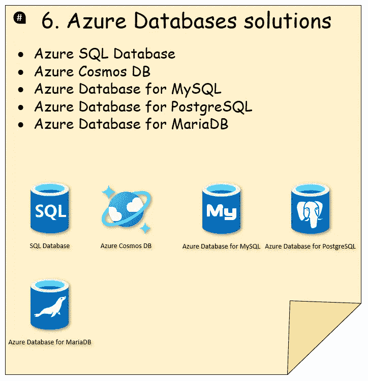

# 使用 Azure 云服务设计系统——如何为您的系统选择合适的 Azure 云服务的指南

> 原文：<https://levelup.gitconnected.com/designing-a-system-with-azure-cloud-services-a-guide-on-how-to-choose-the-right-azure-cloud-4c399b0f0639>

设计一个系统并不容易，经常涉及不同的技术。同时，Azure cloud 为不同的服务提供了很多选择，所以你可能会经常面临如何为你的系统选择合适的服务的问题。

因此，我已经分解了一个常见的系统设计，并创建了这个图表，它将带您了解一些技术，并指导您如何为您的系统选择正确的 Azure 服务。

让我们继续前进！⬇️⬇️⬇️

# 👉 #𝟭. 𝗔𝘇𝘂𝗿𝗲 𝗖𝗗𝗡 𝗽𝗿𝗼𝗱𝘂𝗰𝘁𝘀

内容交付网络(CDN)是用于交付静态内容的地理上分散的服务器的网络。

Azure 内容交付网络(CDN)包括四个产品:
-微软的✅ Azure CDN 标准
-akamai 的✅ Azure CDN 标准
-Verizon 的✅ Azure CDN 标准
-Verizon 的✅ Azure CDN Premium

𝑯𝒐𝒘 𝒕𝒐 𝒄𝒉𝒐𝒐𝒔𝒆 𝒂 𝒄𝒂𝒏𝒅𝒊𝒅𝒂𝒕𝒆 𝒔𝒆𝒓𝒗𝒊𝒄𝒆:

 [## 比较 Azure 内容交付网络(CDN)产品功能

### 了解每个 Azure 内容交付网络(CDN)产品支持的功能。

docs.microsoft.com](https://docs.microsoft.com/en-us/azure/cdn/cdn-features?WT.mc_id=DT-MVP-5001664) 

# 👉 #𝟮. 𝗟𝗼𝗮𝗱-𝗯𝗮𝗹𝗮𝗻𝗰𝗶𝗻𝗴 𝗼𝗽𝘁𝗶𝗼𝗻𝘀

负载平衡旨在优化资源使用，最大化吞吐量，最小化响应时间，并避免任何单个资源过载。
- ✅ Azure 前门
- ✅流量经理
- ✅应用网关
- ✅ Azure 负载均衡器

𝑯𝒐𝒘 𝒕𝒐 𝒄𝒉𝒐𝒐𝒔𝒆 𝒂 𝒄𝒂𝒏𝒅𝒊𝒅𝒂𝒕𝒆 𝒔𝒆𝒓𝒗𝒊𝒄𝒆:

 [## 负载平衡选项- Azure 架构中心

### 术语负载平衡指的是在多个计算资源之间分配工作负载。负载平衡…

docs.microsoft.com](https://docs.microsoft.com/en-us/azure/architecture/guide/technology-choices/load-balancing-overview?WT.mc_id=DT-MVP-5001664) 

# 👉 #𝟯. 𝗔𝘇𝘂𝗿𝗲 𝗰𝗼𝗺𝗽𝘂𝘁𝗲 𝘀𝗲𝗿𝘃𝗶𝗰𝗲𝘀

Azure 提供了多种托管应用程序代码的方式。术语“计算”指的是运行应用程序的计算资源的托管模型。

- ✅应用服务

——✅蔚蓝色的春云

- ✅蔚蓝海岸服务公司(AKS)

- ✅批次

- ✅集装箱实例

- ✅函数

- ✅服务面料

- ✅虚拟机

𝑯𝒐𝒘 𝒕𝒐 𝒄𝒉𝒐𝒐𝒔𝒆 𝒂 𝒄𝒂𝒏𝒅𝒊𝒅𝒂𝒕𝒆 𝒔𝒆𝒓𝒗𝒊𝒄𝒆:

 [## 选择 Azure 计算服务- Azure 架构中心

### Azure 提供了多种托管应用程序代码的方式。术语“计算”指的是…

docs.microsoft.com](https://docs.microsoft.com/azure/architecture/guide/technology-choices/compute-decision-tree?WT.mc_id=DT-MVP-5001664) 

# 👉 #𝟰. 𝗔𝘇𝘂𝗿𝗲 𝗺𝗲𝘀𝘀𝗮𝗴𝗶𝗻𝗴 𝘀𝗲𝗿𝘃𝗶𝗰𝗲𝘀 𝗮𝗻𝗱 𝗾𝘂𝗲𝘂𝗲𝘀

使用消息队列，生产者可以在消费者无法处理消息时将消息发送到队列。消费者可以稍后从队列中读取消息。Azure 提供了三种服务来帮助在整个解决方案中传递事件或消息，并支持两种类型的队列机制:

- ✅蔚蓝事件网格

- ✅蔚蓝事件中心

- ✅ Azure 服务巴士(排队)

- ✅ Azure 存储队列

𝑯𝒐𝒘 𝒕𝒐 𝒄𝒉𝒐𝒐𝒔𝒆 𝒂 𝒄𝒂𝒏𝒅𝒊𝒅𝒂𝒕𝒆 𝒔𝒆𝒓𝒗𝒊𝒄𝒆 (𝗺𝗲𝘀𝘀𝗮𝗴𝗶𝗻𝗴 𝘀𝗲𝗿𝘃𝗶𝗰𝗲):

 [## 比较 Azure 消息服务- Azure 事件网格

### Azure 提供了三种服务来帮助在整个解决方案中传递事件或消息。这些服务是…

docs.microsoft.com](https://docs.microsoft.com/en-us/azure/event-grid/compare-messaging-services?WT.mc_id=DT-MVP-5001664) 

𝑯𝒐𝒘 𝒕𝒐 𝒄𝒉𝒐𝒐𝒔𝒆 𝒂 𝒄𝒂𝒏𝒅𝒊𝒅𝒂𝒕𝒆 𝒔𝒆𝒓𝒗𝒊𝒄𝒆 (𝗾𝘂𝗲𝘂𝗲 𝘀𝗲𝗿𝘃𝗶𝗰𝗲):

 [## 比较 Azure 存储队列和服务总线队列- Azure 服务总线

### 本文分析了微软 Azure 提供的两种类型的队列之间的差异和相似之处…

docs.microsoft.com](https://docs.microsoft.com/azure/service-bus-messaging/service-bus-azure-and-service-bus-queues-compared-contrasted?WT.mc_id=DT-MVP-5001664) 

# 👉 #𝟱. 𝗖𝗮𝗰𝗵𝗲𝘀

高速缓存是一个临时存储区域，它将昂贵响应的结果或频繁访问的数据存储在内存中，以便更快地处理后续请求。

redis 的✅ Azure 缓存

Azure Cache for Redis 提供了一个基于 Redis 软件的内存数据存储。

 [## 缓存指南- Azure 架构中心

### 缓存是一种常见的技术，旨在提高系统的性能和可伸缩性。它通过以下方式做到这一点…

docs.microsoft.com](https://docs.microsoft.com/en-us/azure/architecture/best-practices/caching?WT.mc_id=DT-MVP-5001664) 

# 👉 #𝟲. 𝗔𝘇𝘂𝗿𝗲 𝗗𝗮𝘁𝗮𝗯𝗮𝘀𝗲𝘀 𝘀𝗼𝗹𝘂𝘁𝗶𝗼𝗻𝘀

Azure 提供了许多托管数据存储解决方案，每一个都提供了不同的特性和功能。您可以在传统的关系数据库和非关系数据库之间进行选择。

- ✅ Azure **SQL** 数据库

——✅蔚蓝**宇宙 DB**

- ✅ Azure 数据库用于 **MySQL**

- ✅ Azure 数据库用于 **PostgreSQL**

- ✅ Azure 数据库用于 **MariaDB**

𝑯𝒐𝒘 𝒕𝒐 𝒄𝒉𝒐𝒐𝒔𝒆 𝒂 𝒄𝒂𝒏𝒅𝒊𝒅𝒂𝒕𝒆 𝒔𝒆𝒓𝒗𝒊𝒄𝒆:

 [## 数据存储决策树- Azure 应用程序架构指南

### 为您的应用程序选择 Azure 数据存储。查看选择数据存储的图形表示。

docs.microsoft.com](https://docs.microsoft.com/azure/architecture/guide/technology-choices/data-store-decision-tree?WT.mc_id=DT-MVP-5001664) 

# 👉 #𝟳. 𝗔𝘇𝘂𝗿𝗲 𝗠𝗼𝗻𝗶𝘁𝗼𝗿

Azure Monitor 帮助您最大限度地提高应用程序和服务的可用性和性能。它提供了一个全面的解决方案，用于收集、分析和处理来自您的云和内部环境的遥测数据。

- ✅日志分析(**日志**)

- ✅度量浏览器(**度量**)

- ✅应用洞察(**监控**)

𝗥𝗲𝗳:

 [## Azure Monitor 概述- Azure Monitor

### Azure Monitor 帮助您最大限度地提高应用程序和服务的可用性和性能。它提供了一个…

docs.microsoft.com](https://docs.microsoft.com/en-us/azure/azure-monitor/overview?WT.mc_id=DT-MVP-5001664) 

🏆 𝐌𝐢𝐜𝐫𝐨𝐬𝐨𝐟𝐭 𝐂𝐥𝐨𝐮𝐝 𝐒𝐤𝐢𝐥𝐥𝐬 𝐂𝐡𝐚𝐥𝐥𝐞𝐧𝐠𝐞 🚀
—📌[https://lnkd.in/dm5dGgJu](https://lnkd.in/dm5dGgJu)

**🎯关注我:**[陈家东 ](https://www.linkedin.com/in/chenjd/)