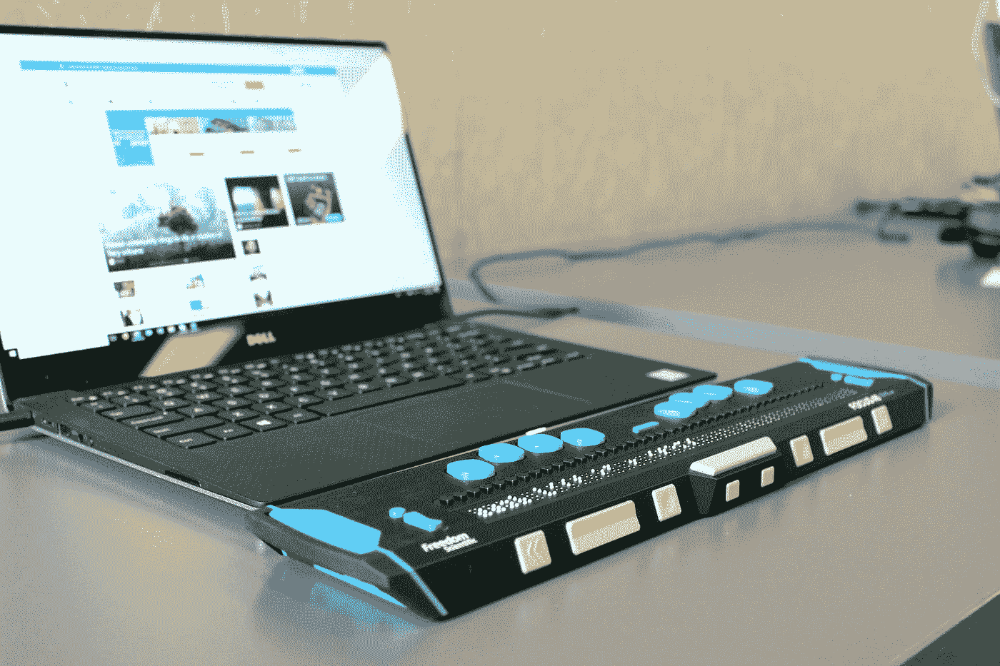
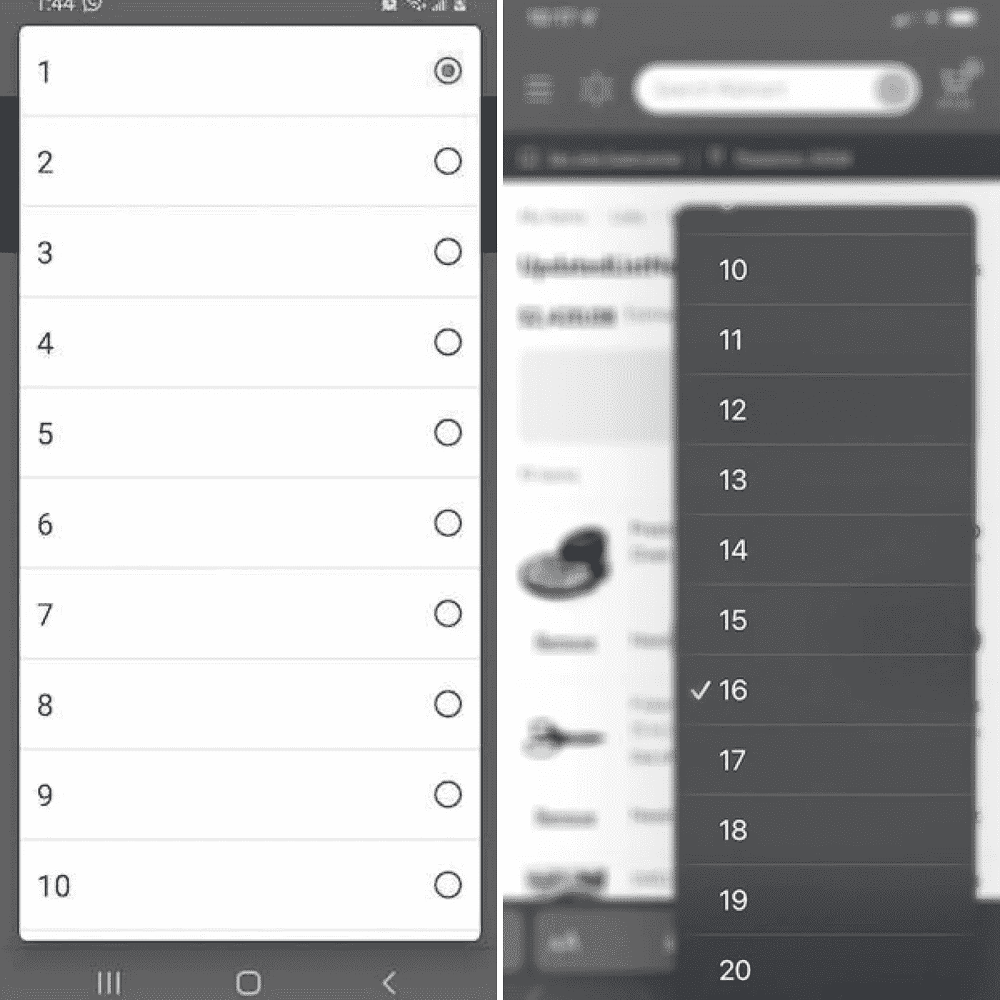
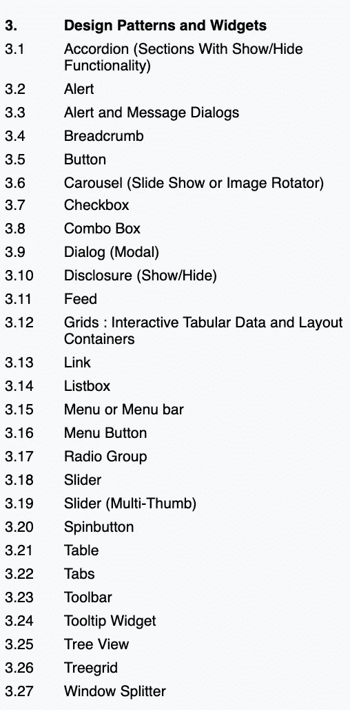
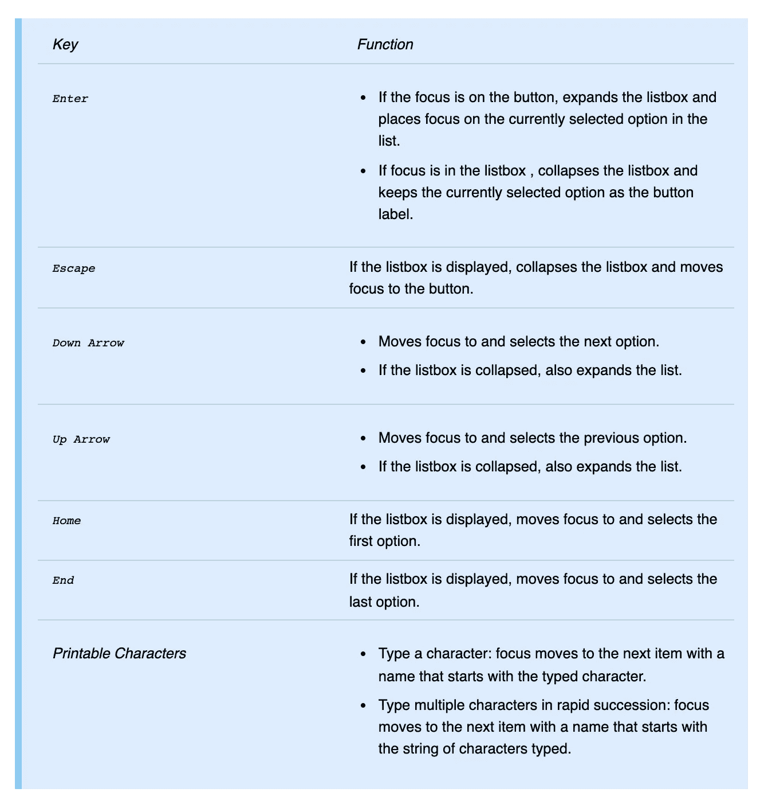
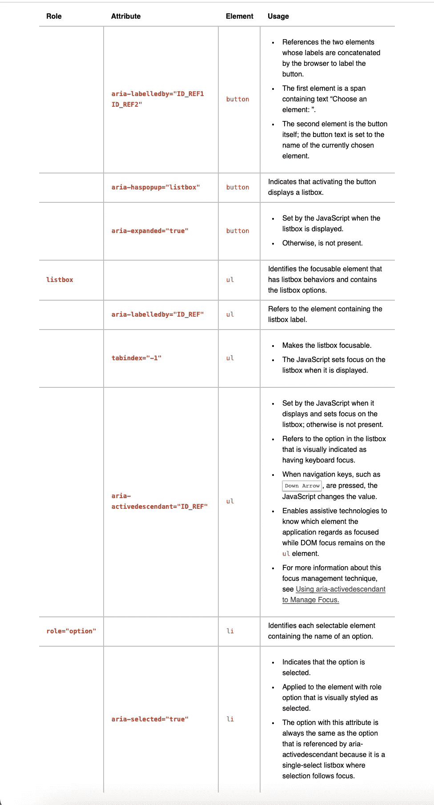
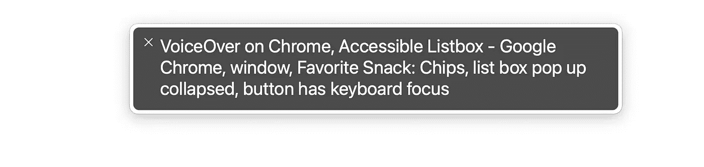
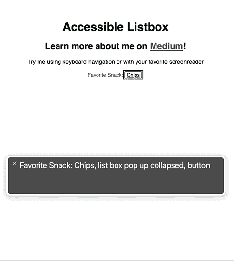

# 为 Web 设计可访问的组件

> 原文：<https://levelup.gitconnected.com/designing-accessible-components-for-web-301691c96465>

## 在 React 中编写一个符合 WCAG 标准的自定义列表框

照片由[伊丽莎白·伍尔纳](https://unsplash.com/@elizabeth_woolner?utm_source=medium&utm_medium=referral)在 [Unsplash](https://unsplash.com?utm_source=medium&utm_medium=referral) 上拍摄

[*我不需要后台，直接带我去代码*](#a2e8)

# ***谁应该读这个？***

出于本文的目的，我们假设如下:

*   您对前端 web 开发有一定的了解，或者对 React 框架有一定的了解
*   不管你目前的知识如何，你都想学习更多关于易访问性编码的知识。也许它对你的工作变得很重要，或者只是你想获得更多专业知识的一个领域。

在本文中，我不会深入探讨可访问性遵从的复杂性；其他人已经就这个话题写了很棒的[篇](https://krisrivenburgh.medium.com/the-ada-checklist-website-compliance-guidelines-for-2019-in-plain-english-123c1d58fad9)。但是，对于那些刚接触软件工程的人来说，如果一个网站可以被残疾人成功地使用，那么它就是可访问的。例如，有视力问题的人可能需要屏幕阅读器将屏幕上的信息传递给他们，或者不能使用鼠标或触控板的人可能需要使用键盘浏览网站。

大多数时候，易访问的编码并不困难。有几条主要规则可以帮你解决大部分问题:

1.  总是使用正确和精确的 HTML5 语义元素。如果你的网站需要一个按钮，使用`<button>`标签。是的，可以将一个`
`标签设计成按钮的样子，并添加一个事件监听器，这样它的行为就完全像一个按钮。一个有视力的用户不会知道区别。然而，你还需要添加 ARIA 标签来告诉屏幕阅读器这应该是一个按钮。您需要添加一个`tabindex`属性，以便让`
`表现得像一个交互元素，如果用户用键盘在页面上移动，它将获得焦点。要使您的自定义元素可访问，您必须付出很大的努力。当您使用精确的语义元素时，您可以免费获得可访问性。
2.  使用您精确的 HTML5 语义元素创建一个逻辑和层次结构的页面。每一页都有一个标签，并确保较小的标题只出现在它的后面。将主要内容包装在一个<主>标签中，并用`<section>`标签填充。`<h1>`标签与`<main>`一起出现。CSS 可以改变网站上几乎所有内容的外观，但是可访问性仅仅依赖于页面的简单结构来解释需要传达给用户的信息类型，并使页面便于残障人士导航。

这两个规则(实际上是一个扩展的规则)可能在编码时考虑了 80%的可访问性问题。

# 构建自定义可访问组件的原因

当你不能轻易地应用上面的简单规则时会发生什么？我的要求是开发一个功能，用户将与下拉互动。一些来自 UX 的模拟包括提出了明确的样式下拉菜单。为了在小屏幕上利用浏览器特有的风格，还要求在移动网络上使用原生的`<select>`标签。只有桌面浏览器会使用被 UX 嘲笑的显式下拉菜单。

这里有几件事需要注意…

1.  我的门票承认，一个原生`<select>`标签将在每个浏览器上有不同的风格，尤其是移动浏览器。开发人员几乎没有直接控制样式的选择。我花了一点时间研究这个问题，没有发现任何新的东西，但我无法找到一种方法来哄一个本地的`<select>`标签来匹配我的 UX 模仿。
2.  不使用原生的`<select>`标签会自动给这个特性的可访问性带来风险，因为我必须打破可访问性编码的第一条规则——使用语义元素。对于这个用例，没有现成的 HTML5 元素。我需要建立我自己的。

Android(左)和 iPhone(右)上相同的原生选择标签

# 可访问的创作指南

## 目标

在构建可访问的 web 应用程序时，有两个主要方面需要关注:

1.  键盘导航——用户能否只用键盘浏览网页？在元素间导航时，焦点意外丢失了吗？键盘导航行为是否遵循预期的模式？
2.  屏幕阅读器声明—辅助技术(AT)的用户是否可以访问同样的可视信息？AT 用户会被告知页面的错误或其他重大变化吗？

万维网联盟(W3C)提供全面的[网络无障碍资源](https://www.w3.org/TR/wai-aria-practices-1.1/)。链接层次结构中包含了[创作指南](https://www.w3.org/TR/wai-aria-practices-1.1/)，它们精确地描述了每个组件的预期行为。(注意:W3C 站点会提到 *widgets* ，而 React 中常用的术语是 *component。*我觉得这些术语可以互换使用。底线是，我们正在建立一个具有特定功能的网页互动部分。)

在浏览了选项之后，没有提到一个`<select>`标签，但是那是因为这个站点没有涵盖本地 HTML 元素的行为。它涵盖了我们在创建自己的可访问元素时需要包含的内容。

来自 [WAI-ARIA 创作实践](https://www.w3.org/TR/wai-aria-practices-1.1/)的设计模式和小部件列表

如果我们进一步探究这些设计模式，我们会发现一个[列表框](https://www.w3.org/TR/wai-aria-practices-1.1/#Listbox)描述了一个本地`<select>`元素的功能，所以这就是我们要编写的代码。实际上，根据组件的编写方式，可以实现不同的功能。例如，我们可能希望用户能够进行多项选择，或者能够在选择中滚动。该网站详细解释了如何通俗易懂地编写这些变化。对于这个例子，我们特别要编写一个[可折叠列表框](https://www.w3.org/TR/wai-aria-practices-1.1/examples/listbox/listbox-collapsible.html)。

该网站为我们提供了两个图表，每个主要关注领域一个，这些图表精确地列出了我们需要编码的内容，以使列表框按照预期的方式工作。

这样，就完成了可访问列表框的所有背景。继续编码！

## 对可访问列表框进行编码

在深入研究之前，总结一下，挑战在于设计和构建一个可访问的组件，其行为将与本机`<select>`标签完全相同。

我们将在 React 中构建可访问的自定义 listbox，但是无论使用什么样的框架或库，我们想要实现的可访问性目标都是一样的。

## 键盘导航

这个图表向我们展示了我们需要支持的键盘交互。让我们开始分解它。通读需求，我们看到我们将有一个按钮，将切换列表框状态之间的折叠和展开。特定的键根据状态具有特定的功能。

来自 [WAI-ARIA 创作实践](https://www.w3.org/TR/wai-aria-practices-1.1/examples/listbox/listbox-collapsible.html)的可访问列表框的键盘支持规则

这就是我们将要建造的:

*   带有按钮的组件，可以在显示和隐藏下拉列表之间切换。
*   下拉菜单将显示作为道具传入的字符串数组中的选项，并包含一个`<ul>`标签，该标签将映射每个选项的列表项。
*   我们需要一些辅助函数和状态来处理切换。

## React 中的聚焦

由于这是一个 React 项目，我们将在主 DOM 元素上设置`Refs`来管理焦点。这被认为是 React 中`Refs`的主要[可接受用法](https://reactjs.org/docs/refs-and-the-dom.html)之一。我们将需要对每个元素的直接 DOM 访问——外部列表框`
`、按钮和列表项元素——以便能够对它们调用`focus`方法。

## 初始代码

下面的代码是 Listbox 组件的起始结构。`Refs`被设置在所有必要的元素上，但是我们只管理在`toggleDropdown`函数中点击按钮时的焦点。事实上，由于我们使用的是原生 HTML `<button>`，浏览器确实为我们处理了这个问题。如果不在第 43 行设置明确的焦点，代码仍然可以工作。然而，其余的元素需要显式地管理焦点，以便表现得像本地的`<select>`。

元素上设置了引用的初始代码

## 管理焦点

Listbox 有一个`onSelected`方法，当用户与按钮交互时，该方法需要一个`MouseEvent`或一个`KeyboardEvent`。无论事件类型如何，都会执行`onChange`和`toggleDropdown`方法。

我们需要一些只响应键盘事件的焦点处理方法。下面的函数将实现 W3C 为[可折叠列表框](https://www.w3.org/TR/wai-aria-practices-1.1/examples/listbox/listbox-collapsible.html)定义的键盘行为，如键盘支持图表中所述。

***重要注意事项***

*   使用`event.preventDefault()`在这里尤其重要，这样就只实现了指定的键盘行为，尽管不是所有的键都需要它。
*   我们还需要考虑列表项是*而不是*本地交互元素，所以它们通常不能接收浏览器焦点。这意味着我们需要控制他们的注意力。当需要焦点时，我们可以通过有条件地将每个列表项的`[tabindex](https://developer.mozilla.org/en-US/docs/Web/HTML/Global_attributes/tabindex)` [属性](https://developer.mozilla.org/en-US/docs/Web/HTML/Global_attributes/tabindex)设置为`-1`来做到这一点。

`handleButtonPress`在按钮上触发，以在单击按钮时切换下拉列表，并将焦点返回到按钮

`handleKeyPress`触发具有特定键的特定行为的单个列表项。

键盘焦点管理功能

列表项中的键盘交互现在可以处理了，但是对于键盘用户来说，仍然没有办法将焦点从按钮转移到列表项上。在检查了需求之后，我们看到，当列表框展开时，我们总是希望聚焦在选中的选项上，所以我们可以在`useEffect`中自动聚焦。

在这个例子中，`focusedValue`将被一个`Ref`跟踪，所以我们可以在渲染之间保持这个值。我们不能在这里使用`state`,否则每当下拉列表被折叠和再次展开时，值将被重置。如果用户多次打开和关闭下拉列表，我们希望列表框中的焦点总是反映选定的选项。如果这是一个应用程序通过这个列表框从后端获取和改变数据，我们可以依靠`state`来完成。

键盘导航现在可以工作了！仅使用键盘，用户可以使用与本机`<select>`标签所期望的相同的键来执行所有以下动作:

*   打开和关闭下拉菜单
*   遍历下拉选项
*   离开列表框

## 管理 ARIA

但是就浏览器而言，这个组件仍然不是一个列表框，因为键盘导航暗示了一个列表框。对于浏览器来说，这仍然只是一个通用元素的集合。ARIA 提供了一种方式让浏览器知道它正在呈现一个列表框。如 [MDN Web 文档](https://developer.mozilla.org/en-US/docs/Web/Accessibility/ARIA)中所定义:

> 可访问的富互联网应用程序 **(ARIA)** 是一组属性，定义了使 web 内容和 web 应用程序(尤其是那些用 JavaScript 开发的)对残障人士更易访问的方法。

回到[可折叠列表框的创作实践](https://www.w3.org/TR/wai-aria-practices-1.1/examples/listbox/listbox-collapsible.html),有另一个图表说明了预期的属性。我们实际上已经讨论了一个属性，键盘导航中焦点所需的`tabindex`。

其余的属性是 ARIA 属性，图表中的**用法**列引用了站点上的 HTML，如果我们检查列表框中的元素，那么在我们自己的列表框中设置这些属性时，提供了一个清晰的示例。

**用法**列也提供了每个属性用途的一些指示。

我们需要在一些元素上设置 id，以便在设置 ARIA 属性值时可以引用它们。我们还需要确保页面上的 id 是唯一的，即使我们呈现了 listbox 的多个实例，所以让我们添加一个属性来确保我们可以传递一个唯一的值。

添加这些 ARIA 属性后，屏幕阅读器将宣布按钮的用途和状态。

向按钮添加 ARIA 属性后的屏幕阅读器公告

让我们继续使用`<ul>`和`<li>`元素。在设置各种 ARIA 属性的同时，我们需要将`listbox`的角色分配给`<ul>`，将`option`的角色分配给每个`<li>`，以向浏览器表明它们作为这个小部件的一部分的用途。

## 活动中的可访问列表框

## 包扎

列表框现在可以访问了！它仍然缺少很多我们可能希望为视力正常的用户提供的功能(也许是为了通过自定义样式的类而提供的道具？)，但它适用于使用屏幕阅读器或键盘导航的人。

以下是所涵盖内容的摘要:

*   尽可能使用语义 HTML5 元素。
*   如果*不可能使用语义元素:*

1.  找到 [WAI-ARIA 创作指南](https://www.w3.org/TR/wai-aria-practices-1.1/)为你想要建立什么。
2.  在 React 中，通过在元素上设置`Refs`来管理焦点。这也可以用普通的 JavaScript 来处理。
3.  将`-1`的`tabindex`属性设置为允许非交互元素以编程方式接收焦点。
4.  为特定按键编写功能代码时，请注意该按键的默认行为，并在适当的时候使用`preventDefault`。
5.  为 ARIA 属性设置引用元素的唯一 id(并确保它们对于网页是唯一的)。
6.  在元素上设置 ARIA 属性和角色。

请访问这个[代码沙箱](https://codesandbox.io/s/accessible-listbox-pxytx?file=/src/components/listbox.tsx)查看完整的项目，感谢您的阅读！