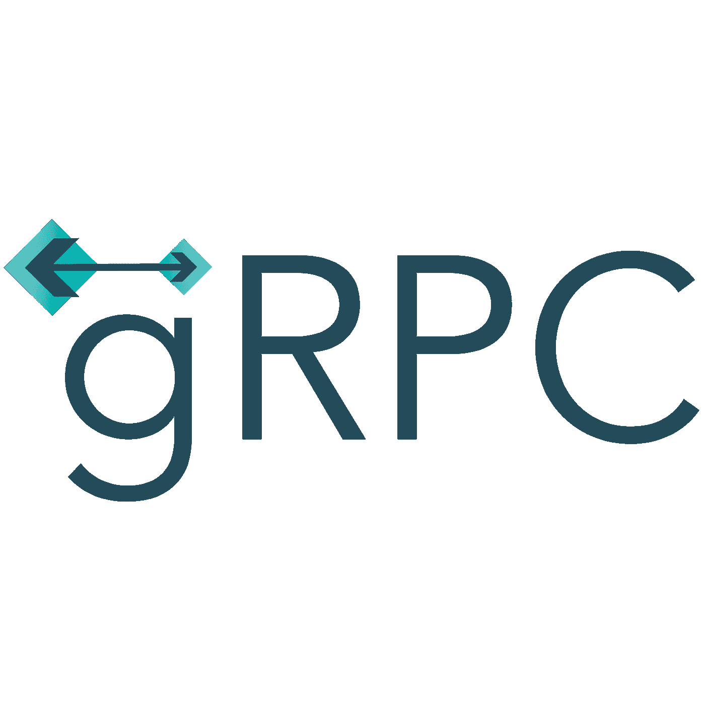

# 用 gRPC 设计 API

> 原文：<https://levelup.gitconnected.com/designing-apis-with-grpc-dd5e39df0333>

gRPC 远程过程调用是一个高性能、开源、功能丰富的 RPC 框架。gRPC 的理想用途是用于微服务中的服务间通信，以及移动应用程序和服务器之间的通信。



## **面向移动应用的 gRPC】**

移动应用程序可以依靠 gRPC 来提高性能，因为它是基于 HTTP/2 构建的，HTTP/2 具有更低的延迟，同时为 CPU 速度较慢的移动设备提供更高的性能。移动客户端可以利用 gRPC 中的流选项来节省带宽并减少与服务器的 TCP 连接数量，从而有助于减少 CPU 的使用并优化移动设备的电池。

## **微服务 gRPC】**

在微服务架构中，服务间的通信应该更快。gRPC 使用的协议缓冲区比 JSON 更小、更快，并且可以有效地连接服务。默认情况下，gRPC 服务器是异步的，这意味着它们不会根据请求阻塞线程，而是可以并行处理多个请求。gRPC 提倡使用 SSL，在 SSL 中，通过网络传输的所有数据都被加密，并且集成了身份验证。

## **使用 Protobuf 的 gRPC APIs】**

● gRPC 使用协议缓冲区，这是一种序列化强类型结构化数据的方法

●解析二进制格式的协议缓冲区比解析文本格式的 JSON 消耗更少的 CPU

●协议缓冲区有助于向后兼容，而不会影响客户端代码

●一个简单的原型文件可以用任何语言生成大量代码

Proto 文件用于定义消息(请求和响应)、服务(RPC 端点)。

下面的原型文件(cart.proto)是一个简单的 cart 操作的服务契约。

```
*// The cart service definition**service CartService {**rpc createCart(CreateCartRequest) returns (CreateCartResponse);**}**// The item message**message Item {**string id = 1;**string name = 2;**}**// The request message containing Items**message CreateCartRequest {**repeated Item item = 1;**}**// The response message containing cart id**message CreateCartResponse {**string cart_id = 1;**}*
```

上面的 cart.proto，它包含需要在客户机和服务器之间共享的服务和消息。API 服务是创建一个购物车。这些消息可以用于服务中定义的相应请求和响应。

## **gRPC 中 API 的类型**

在 gRPC 中，API 不是基于 CRUD(创建/检索/更新/删除)的，每个 API 的设计都没有任何限制。因此 gRPC 不是面向资源的，而是特定于 API 的。我们可以将 gRPC 中的 API 大致分为一元 API 和流式 API

## **一元 API**

一元 RPC 调用是简单的请求-响应模型，其中客户端发送请求消息，服务器用响应消息进行响应。一旦客户端收到响应，呼叫就完成了。大多数 API 使用一元 RPC 模型。


## **流式 API**

由于 g RPC 中 HTTP/2 的底层实现，流 RPC 调用是可用的。

由于 HTTP/2 支持多路复用，客户端和服务器可以通过单一 TCP 连接并行推送消息，这有助于减少数据传输的延迟。

gRPC 中有三种可用的流式 API

●客户端流 API

●服务器流 API

●双向流 API

## **客户端流 API**

在客户端流 RPC 调用中，客户端向服务器发送多条消息，作为回报，服务器向客户端发送单个响应。当客户端需要向服务器发送大量数据而不期望从服务器得到响应时，可以使用客户端流 API。例如，发送数据进行分析。


## **服务器流 API**

在服务器流 RPC 调用中，客户端向服务器发送单个消息，作为回报，服务器向客户端发送多个响应。当服务器需要通过单个请求向客户端发送大量数据时，可以使用服务器流 API。例如，在比赛期间发送实况比分。


## **双向流 API**

在双向流 RPC 调用中，客户端和服务器彼此异步发送消息。当客户端和服务器不等待彼此发送和接收数据时，可以使用双向 API。例如聊天应用。


***作者:Ashwinbalaji Purusothaman
流:Java***