# 在界面生成器中设计自定义 UICollectionViewListCell

> 原文：<https://levelup.gitconnected.com/designing-custom-uicollectionviewlistcell-in-interface-builder-a2f72c2477b3>

## 了解如何设置自定义单元格高度。

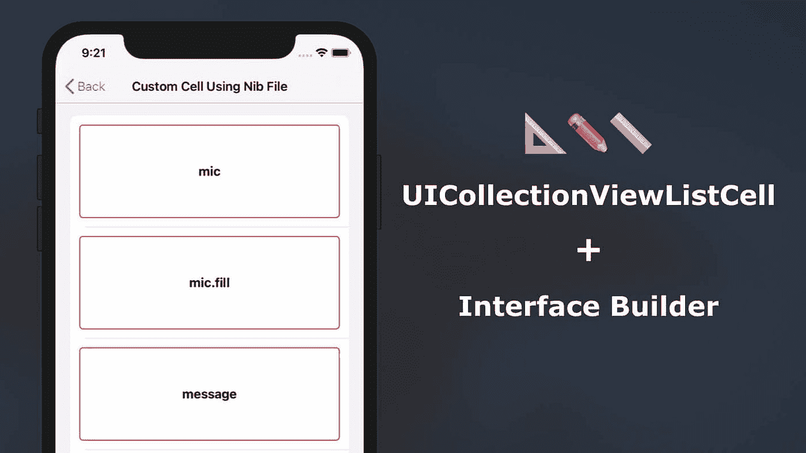

*本文原载于 2020 年 8 月 22 日*https://swiftsenpai.com

*自从我的文章“[UICollectionView List with Custom Cell and Custom Configuration](https://swiftsenpai.com/development/uicollectionview-list-custom-cell/)”发表以来，我的许多读者一直在问我是否可以在界面构建器中设计自定义的`UICollectionViewListCell`。*

*嗯，答案肯定是**是**！*

*由于`UICollectionViewListCell`的内容视图只是一个符合`UIContentView`协议的`UIView`子类，理论上只要我们能够将内容视图与界面构建器链接起来，那么一切都应该相应地工作。*

*在 Xcode 中花了一些时间进行试验后，我已经成功地使用界面构建器创建了一个`UICollectionViewListCell`内容视图。除此之外，我还发现您甚至可以通过在单元格的内容视图中调整自动布局约束来操纵单元格的高度。*

*如何做到这一点？让我们找出答案。*

# *示例应用程序*

*为了简单起见，我们的示例应用程序将显示一个只包含一个标签的简单自定义单元格。下面是示例应用程序的屏幕截图:*

*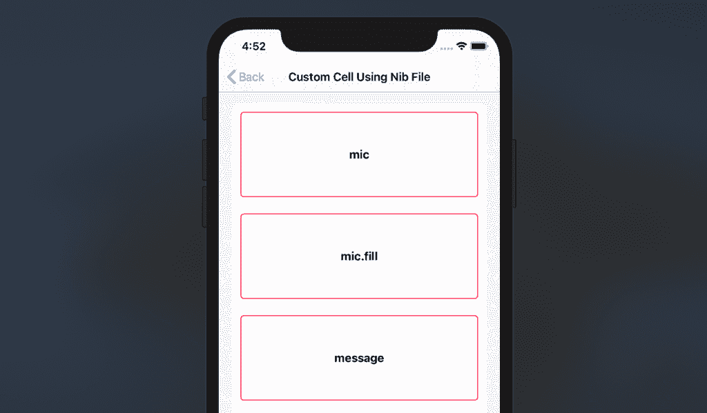*

*我们将要构建的示例应用程序*

*请注意，我还在标签上添加了红色边框，以便我们在本文后面更容易观察它的高度。*

*说了这么多，我们开始吧。*

> ****注:****
> 
> **我不会对内容视图、内容配置和自定义单元格背后的概念进行过多的描述。如果您对此不熟悉，我强烈建议您在继续之前阅读我以前的文章“*[*UICollectionView List with Custom Cell and Custom Configuration*](https://swiftsenpai.com/development/uicollectionview-list-custom-cell/)*”。**

# *实现自定义内容视图和内容配置*

*首先，让我们实现自定义内容视图和内容配置。让我们把它们都命名为`SFSymbolNameContentView`和`SFSymbolNameContentConfiguration`。*

*下面是我们将如何实现`SFSymbolNameContentView`类:*

*从上面的代码中，有几个重要部分我们必须注意:*

1.  *为标签和容器视图定义`IBOutlet`。请注意，容器视图将是我们的界面构建器画布，我们一会儿就要开始工作了。*
2.  *初始化时调用`loadNib()`函数，对`SFSymbolNameContentView`进行相应配置。*
3.  *在`loadNib()`函数中，加载一个名为`SFSymbolNameContentView.xib`的笔尖文件，并使`self`成为笔尖文件的所有者。*
4.  *使用自动布局约束使容器视图占据整个内容视图。*
5.  *给标签添加红色边框和圆角。*

*接下来，我们将致力于实现`SFSymbolNameContentConfiguration`类。实现非常简单，我们只需要确保`makeContentView()`返回的是`SFSymbolNameContentView`的一个实例。*

# *在界面构建器中创建自定义`UIView`*

*有了内容视图和内容配置类之后，让我们将注意力转移到界面构建器上。这是我们要做的:*

1.  *创建新的用户界面视图。*
2.  *设置文件所有者的类。*
3.  *调整自定义视图的大小。*
4.  *添加标签并配置自动布局。*
5.  *连接所有`IBOutlet`。*

## *1.创建新的用户界面视图*

*在 Xcode 中，按下⌘N 键(cmd + N)将新文件添加到项目中。在添加新文件对话框中，选择用户界面部分下的“查看”，点击“下一步”并将 nib 文件命名为`SFSymbolNameContentView`。*

*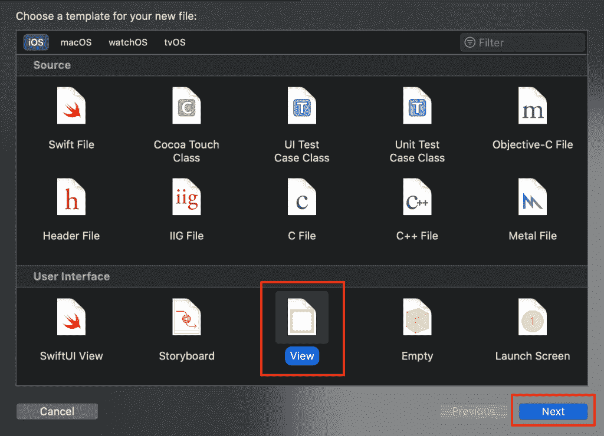*

*在 Xcode 中添加新的 nib 文件*

## *2.设置文件所有者的类*

*接下来，我们必须让接口构建器知道我们刚刚创建的 nib 文件属于`SFSymbolNameContentView`类。*

*在界面构建器的左面板中，点击“文件的所有者”，然后在属性检查器中，将文件所有者的类别设置为`SFSymbolNameContentView`。*

*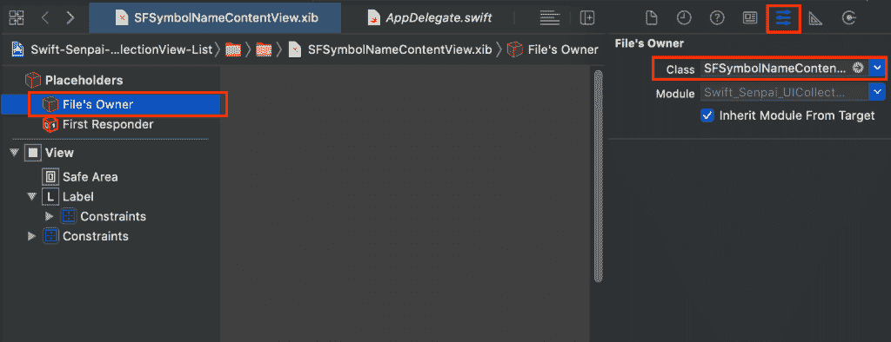*

*设置文件的所有者*

## *3.调整自定义视图的大小*

*默认情况下，界面构建器将创建一个遵循 iPhone 外形的自定义视图。然而，这不是我们想要的，我们需要一个比这小得多的视图。*

*继续操作，打开视图的属性检查器，将尺寸模拟度量改为“**自由形式**”。*

*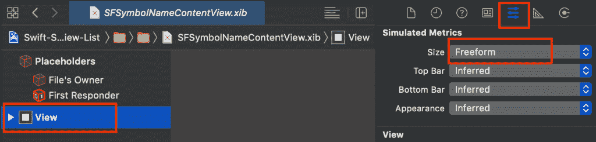*

*将视图的大小模拟度量大小设置为自由格式*

*之后，打开尺寸检查器，设置视图高度为**150 磅**。*

*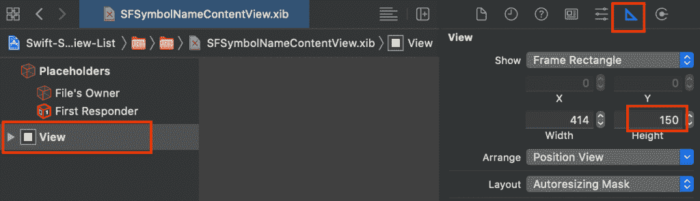*

*将视图高度设置为 150 磅*

## *4.添加标签并配置自动布局*

*现在将一个`UILabel`拖到视图中，并根据下图设置其顶部、底部、前导和尾部自动布局约束。*

*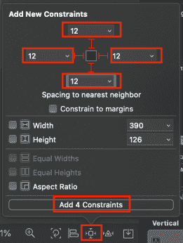*

*设置标签的顶部、底部、前导和尾随约束*

*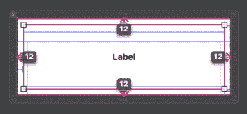*

*标签的自动布局约束*

*这将使`UILabel`占据整个视图。*

## *5.连接所有 IBOutlets*

*最后，将`containerView`和`nameLabel`T3 连接到界面生成器，如下图所示:*

*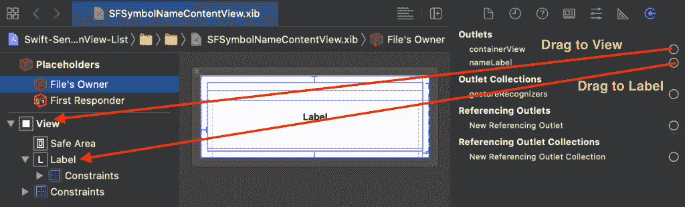*

*连接 IBOutlets*

*至此，我们已经成功地将`SFSymbolNameContentView`类连接到了界面构建器。让我们继续运行您的示例应用程序，看看一切都在运行。*

*但是等等！单元格高度与我们预期的不同！😨*

*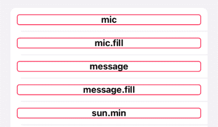*

*意外的单元格高度*

*在下一节中，让我们找出导致这个问题的原因以及如何解决它。*

# *处理单元格高度*

*意外单元格高度背后的原因是因为`UICollectionViewListCell`默认情况下是**自动调整大小**。*

*由于我们没有指定`nameLabel`的高度约束，我们只配置了`nameLabel`来占据整个`containerView`，集合视图将根据`nameLabel`的内容自动调整单元格的大小。*

*解决这个问题的方法非常简单。我们只需要给`nameLabel`添加一个高度约束，这样自动布局引擎在计算单元格的高度时就会考虑到`nameLabel`的高度。*

*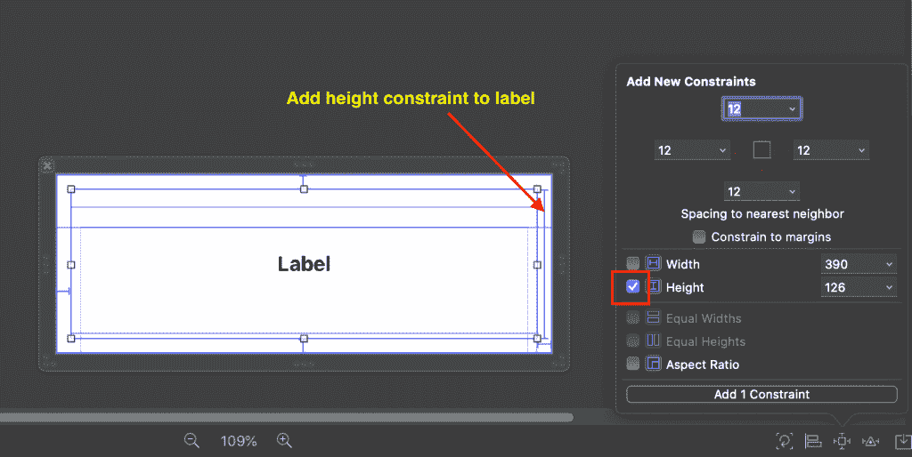*

*向`nameLabel`添加高度约束*

*如果您现在运行示例应用程序，您应该会看到单元格的大小已经正确调整。不幸的是，通过给`nameLabel`添加高度约束导致了[单元格内的](https://developer.apple.com/library/archive/documentation/UserExperience/Conceptual/AutolayoutPG/ConflictingLayouts.html)约束不可满足。*

*根据 Xcode 控制台输出，似乎`nameLabel`的高度约束与内容视图的高度约束相冲突。*

*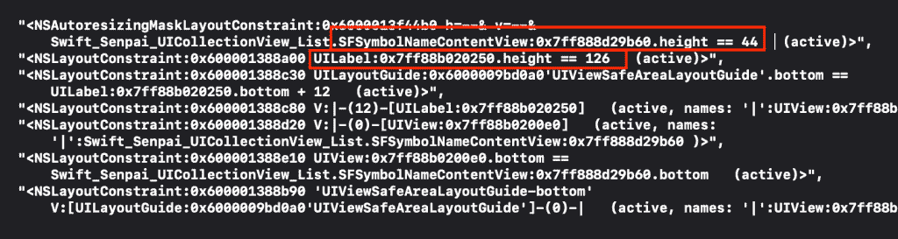*

*Xcode 控制台中的不可满足约束错误日志*

*"但是我们从来没有在内容视图上设置任何高度限制！"你可能会说。*

*我不是 100%确定为什么在内容视图上设置了高度限制，我怀疑`UIKit`在计算其实际高度之前给了内容视图一个默认的 44pt 高度限制。*

*因为我们将`nameLabel`设置为 126 磅高，但是内容视图只能有 44 磅高，所以不可能同时满足这两个约束，从而导致不可满足的约束问题。*

*为了解决这个问题，我们可以将`nameLabel`的高度约束优先级降低到 **999** ，这样自动布局引擎就可以暂时忽略这个约束。*

*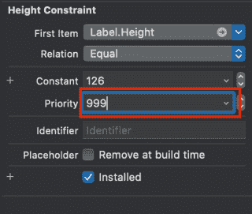*

*将`nameLabel`高度限制优先级设置为 999*

*这篇[文章](http://aplus.rs/2017/one-solution-for-90pct-auto-layout/)详细讨论了我们用来解决不可满足约束问题的解决方案。如果你想了解更多，请随时查看。*

*至此，我们已经使用界面构建器成功设计了一个定制的`UICollectionViewListCell`。🥳*

*你可以在这里获得完整的样本项目[。](https://github.com/LeeKahSeng/SwiftSenpai-UICollectionView-List)*

# *一个常见的例外*

*当您在界面构建器中设计自定义`UICollectionViewListCell`时，您可能会遇到的一个最常见的异常是“**nsinterinalinconsistencyexception**”。*

*Xcode 控制台中的异常信息如下所示:*

```
**** Terminating app due to uncaught exception 'NSInternalInconsistencyException', reason: 'Rounding frame ({{20, -8.9884656743115785e+307}, {374, 1.7976931348623157e+308}}) from preferred layout attributes resulted in a frame with one or more invalid members ({{20, -8.9884656743115785e+307}, {374, inf}}). Layout attributes: <UICollectionViewLayoutAttributes: 0x7fd0d2043130> index path: (<NSIndexPath: 0x947fdb8ab9f8e625> {length = 2, path = 0 - 0}); frame = (20 -8.98847e+307; 374 1.79769e+308); zIndex = 10; View: <Swift_Senpai_UICollectionView_List.SFSymbolNameListCell: 0x7fd0cfc21470; baseClass = UICollectionViewListCell; frame = (20 17.5; 374 44); clipsToBounds = YES; layer = <CALayer: 0x600002768000>>'*
```

*这种异常是由于自动布局引擎没有足够的信息来确定单元格的高度。这通常是由于内容视图中的**缺少垂直间距约束**和**缺少高度约束**造成的。因此，当发生这种情况时，一定要重新检查内容视图内容的自动布局配置。*

# *包扎*

*在“*在界面构建器*中创建定制 UIView”一节中介绍的概念基本上是将一个`UIView`子类连接到界面构建器。因此，这种技术不仅限于创建自定义的`UICollectionViewListCell`。*

*无论何时你想使用界面构建器设计一个定制的`UIView`，你都可以使用相同的技术。如果你像我一样，喜欢使用界面生成器来创建 UI，那么我相信你会发现这种技术非常方便。*

*如果你喜欢这篇文章，请随时关注我的推特。*

*感谢阅读和快乐设计。👨🏻‍💻*

# *进一步阅读*

*   *[使用 Swift 中的 UICollectionView 构建列表](https://swiftsenpai.com/development/uicollectionview-list-basic/)*
*   *[具有自定义单元格和自定义配置的 UICollectionView 列表](https://swiftsenpai.com/development/uicollectionview-list-custom-cell/)*
*   *[使用 UICollectionView 构建可扩展列表:第 1 部分](https://swiftsenpai.com/development/collectionview-expandable-list-part1/)*
*   *[使用 UICollectionView 构建可扩展列表:第 2 部分](https://swiftsenpai.com/development/collectionview-expandable-list-part2/)*
*   *[重新加载表格和集合视图单元格的现代方法](https://swiftsenpai.com/development/modern-ways-reload-cells/)*
*   *[声明式 UICollectionView 列表页眉和页脚](https://swiftsenpai.com/development/declarative-list-header-footer/)*
*   *[带有交互式自定义标题的 UICollectionView 列表](https://swiftsenpai.com/development/list-interactive-custom-header/)*