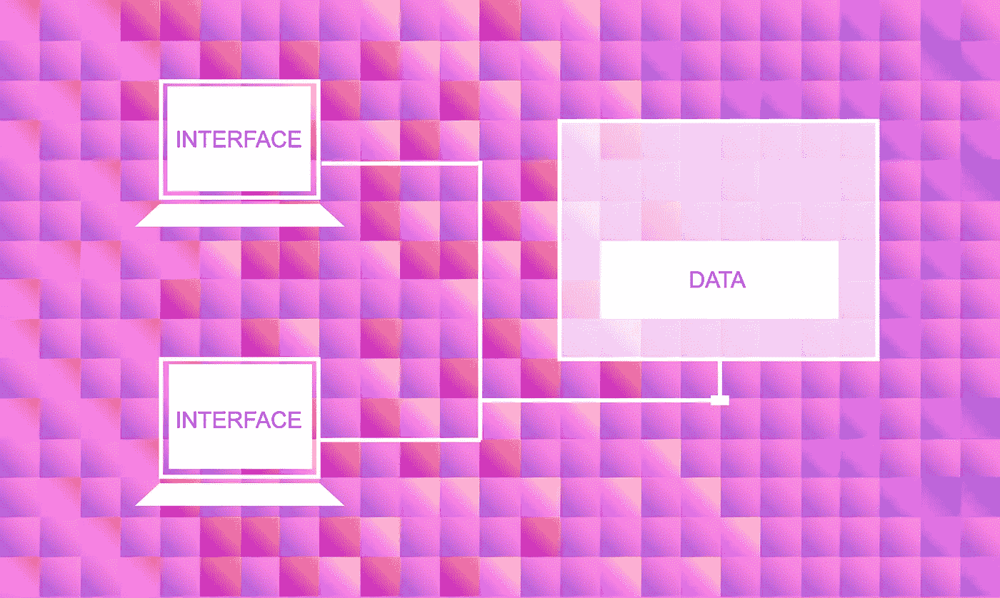
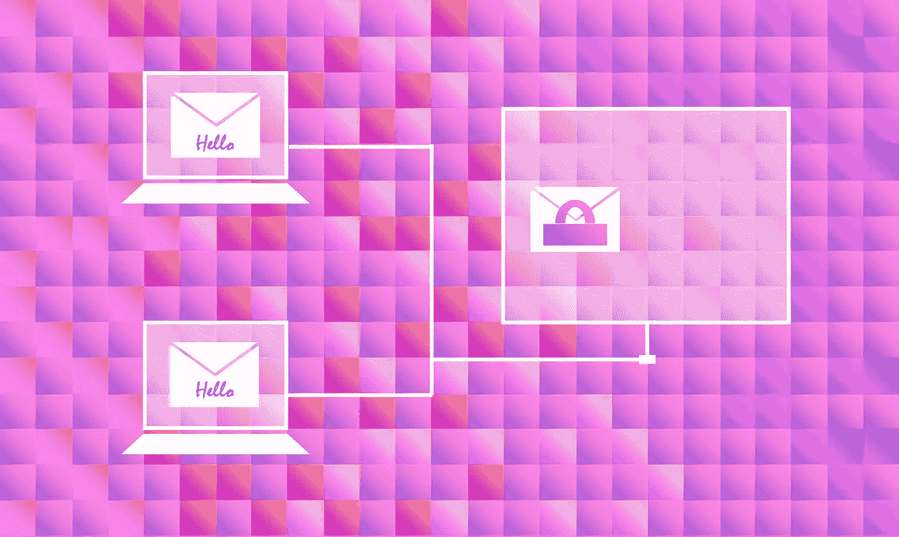

# 为隐私而设计——一种新兴的软件模式

> 原文：<https://levelup.gitconnected.com/designing-for-privacy-an-emerging-software-pattern-7c632cb1de35>

在地毯下拖得太久，处理隐私现在是许多软件架构师和开发人员的待办事项中的一个问题。一种新型的初创公司开始出现，以解决这个问题。我们讨论问题的核心以及解决问题的正确方法。

# 在你的系统设计上有冲突的力量

在软件设计中，我们经常谈论定义设计问题的冲突力量，通过特定的[设计模式](https://en.wikipedia.org/wiki/Design_pattern)来解决。在隐私问题上，到底是什么力量？

一方面:

*   **个人用户数据是功能的金矿**。一个真正有用的最终用户应用程序自然会收集和处理个人用户数据。事实上，内容越多，应用程序对用户越有用。用户和应用程序通过交换用户数据“说话”。无论您正在构建何种最终用户软件，无论是电子商务网站、银行应用程序还是社交网络；你的软件是用来收集和处理用户数据的，通常它的目的甚至是由数据来定义的。此外，
*   **智能依赖于用户数据**。人工智能系统依靠用户数据来学习智能行为，并向用户提供智能、个性化的服务。用户需要智能应用程序。

换句话说，在不收集、存储和处理用户数据的情况下交付用户想要的现代最终用户应用程序是不可想象的。很难想象一个应用程序能最大限度地减少收集和存储的数据量。这是我们对你的软件设计施加压力的第一股“力量”。

另一方面(第二“力”):

*   **在中心位置收集和存储个人数据会使您的系统面临安全和隐私风险**这些风险将由您的系统负责。其他人可能想知道您的系统“知道”用户的什么。即使是最意想不到的软件系统也是攻击和[数据泄露](https://en.wikipedia.org/wiki/List_of_data_breaches)的目标。
*   **建立和维护信任**也更难，即用户有能力相信您或实际运行您系统的企业员工没有读取用户个人数据。大型软件公司(如谷歌[)出台了严肃的内部政策来解决这些问题，然而，随着每一桩新的用户数据相关丑闻的发生，用户实际上信任充分保护他们的政策的能力越来越弱。](https://mashable.com/article/google-reading-your-emails-response/?europe=true)
*   法律要求最大限度地减少收集和存储的数据，并在传输和存放过程中保护这些数据。 [欧洲的 GDPR](https://en.wikipedia.org/wiki/General_Data_Protection_Regulation) 是人们谈论最多的保护在线隐私的法律框架，也是全球开发者头疼的问题(因为它甚至保护欧盟公民免受外国公司妨碍隐私行为的影响)。但是在加州([、CCPA](https://en.wikipedia.org/wiki/California_Consumer_Privacy_Act) )和世界其他地方也有类似的法律保护。

现代的系统-用户关系不仅需要保护用户数据免受非预期外部方的影响，而且在一定程度上还需要保护系统本身的影响。

然而，几十年来，传统的客户机-服务器体系结构一直在向减少客户机责任的方向转变，从而使得最终用户应用程序通常只负责收集用户输入和显示来自中央服务器的响应。

通用客户机-服务器体系结构

虽然这种方法确保了系统组件的某种优雅和有意义的责任分配，但是它也放大了我们在这里描述的冲突。因此，系统架构师不得不在有用的功能和隐私之间做出选择，或者更糟:在代码外部应用策略或安全解决方案方面的补丁，这通常会使可用性变得糟糕。然而，现代用户的期望值越来越高，越来越意识到隐私风险，理所当然地期望高水平的有用功能和隐私，更不用说可用性了。

我们在这里展示了可以解决这种力量冲突的软件架构元素，这些元素是我们从成功克服这种冲突的新兴现代应用程序中衍生出来的。

# 通过设计实现隐私的建筑选择

# 1 分离:已知和未知的用户数据

首先要做的是将系统需要“知道”的用户数据与系统可以收集和处理但实际上无法访问的用户数据分开，并以不同的方式考虑。我们将这两类数据称为:已知的和未知的用户数据。

这种分离没有神奇的方法，因为它取决于您系统的功能。在有些系统中，所有的用户数据都被认为是未知的——在这些系统中，系统不知道向哪个用户提供其功能(Tor 等匿名服务就是很好的例子)。

然而，大多数系统需要识别用户的身份，以便让他为他们提供的服务付费。拼车平台可能会认为乘客和司机的身份“已知”，但目的地以及司机和乘客之间交换的任何消息“未知”。酒店预订平台可能会以这样的方式执行拆分，将用户与酒店联系起来，从酒店收取费用，但忽略暴露用户行踪的预订日期。

一旦您将哪些用户数据视为“已知”，哪些视为“未知”，您就可以采用一种新的客户机-服务器体系结构——当您像平常一样对待“已知”数据时，但是“未知”用户数据保存在用户的端点；通过您的系统在用户之间交换时进行端到端加密，并在备份时加密。

基于隐私设计的客户端-服务器架构

# 2 次端到端加密传输

每当您的系统需要将未知用户数据从一个用户移动到另一个用户时，您可以使用端到端加密来确保这些传输(和相关功能)不会发生，而您的系统无法读取正在交换的实际用户数据。

端到端加密用户交互

对于这一点，你可以从成熟的信号协议中得到启发。在 blindnet，我们致力于为您提供易于集成的组件，使您的软件为端到端加密做好准备。

随着确保信任的必要性的增长，端到端加密在最终用户应用中变得越来越不可行。关注一下 [blindnet.io](http://blindnet.io) 正在做些什么，让它的实现对每个应用程序中的每个开发人员来说都很容易。

# 3 加密存储

“未知”用户数据的风险在于，您为“已知”用户数据准备的任何中央数据库备份都是不够的。在一个可能的场景中，您的系统暴露于一个“未知”数据集，您将需要设置一个加密，以便只有用户在其端点上可以解密备份。

您可以使用以下现有的优雅解决方案之一来实现这一点，例如[油轮。](https://tanker.io/)

这里需要考虑的一个重要问题是，如果加密密钥因用户终端丢失而丢失，备份会发生什么情况。系统“未知”的数据将永远丢失。这真的取决于你如何最好地处理这个问题。[端到端加密聊天应用](https://signal.org/en/)在用户端点相互认证的工程方法方面处于领先地位，因此一个用户可以有多种方法访问她的数据。

# 4 个零知识证明

在处理某些应该保持“未知”的用户信息时，[零知识证明](https://en.wikipedia.org/wiki/Zero-knowledge_proof)可用于实现高度的功能性，同时允许大量用户数据对您的系统保持“未知”。通常，法定年龄验证可以通过这种方式优雅地实现。

你可以在这里了解零知识证明和开源工具[。](https://github.com/matter-labs/awesome-zero-knowledge-proofs)

# 5 加密或在边缘处理数据

设计软件时，最大的挑战是智能/个性化功能。传统上，这些特征是通过维护机器学习算法可以操作的集中式数据存储来开发的。为了满足现代用户的期望，一种趋势正在出现，即将某些计算从中央服务器转移到更靠近用户端点的地方(因此称为“边缘计算”)。

“边缘计算”背后的想法是以类似于我们将数据分为“已知”和“未知”的方式来分割计算，并使计算点更接近用户，代表云执行任务和提供服务。的确，机器学习算法仍然可以集中运行，并通过使用匿名化的用户数据来学习参数关联。[设备上的机器智能](https://ai.googleblog.com/2017/02/on-device-machine-intelligence.html)是一种在改善隐私和延迟方面都取得进展的方法。看看 [MobileNet](https://github.com/tensorflow/models/blob/master/research/slim/nets/mobilenet_v1.md) 和 [Learn2Compress](https://ai.googleblog.com/2018/05/custom-on-device-ml-models.html) 等开源项目。

然后，可以在用户终端上基于“未知”数据执行个性化计算，从而为用户提供智能行为和智能功能。

以保护隐私的方式处理用户数据也是一个充满活力的挑战，这让位于许多新奇的想法和方法:密切关注 Evervault 正在构建什么。

# 全新的看待一天的方式

将“已知”和“未知”用户数据的分离、端到端加密传输、加密存储、零知识证明和边缘计算结合起来，可以产生一种全新的方式来构建健壮、功能强大但又是按设计定制的软件系统。

这种设计对软件架构师来说并不陌生，他们一直故意忽视这一点。事实上，对软件系统隐私的期望是对软件系统(尤其是商业软件)最基本和最自然的期望之一。

虽然许多人会试图出售隐私作为对恐惧的回应——害怕被过度控制的政府监视，害怕被视为广告目标，害怕被暴露在数据泄露和其他恐惧中；我认为这种观点是危险的，它对软件设计有害无益。我相信恐惧是非理性的，虽然人们确实出于恐惧而购买东西，但恐惧不是软件系统设计决策的可行主题。

另一方面，我所看到的，是在用户和软件系统之间设计一个平衡关系的基本需要。我相信用户和软件系统不是一体的。在考虑第三方入侵和滥用之前，软件架构师必须考虑到，当用户和系统不是一个实体，而是两个实体时，向软件系统完全公开用户的数据不能被认为是一种合理的默认运行方式。而且，正如每一种关系一样，用户-系统关系只有在平衡的情况下才能存在。

构建软件时要考虑隐私，这意味着首先要设计这种平衡的关系，在不损害系统功能的情况下，限制系统暴露给用户的数据。只有在您将系统设计为保护用户免受系统本身的攻击之后，您才能有效地保护用户免受外部威胁。