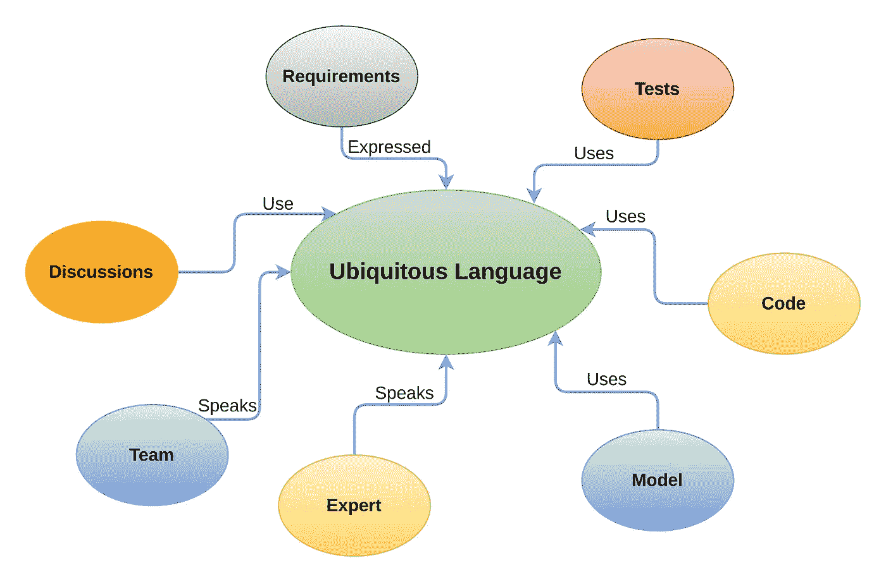
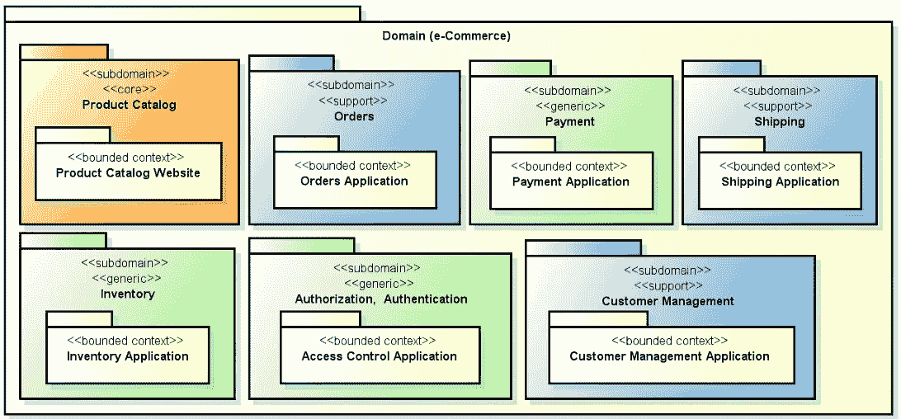
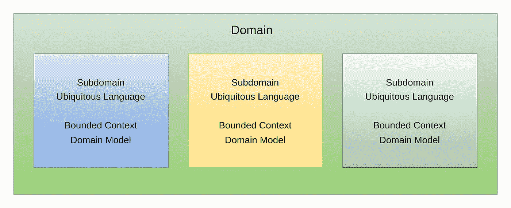
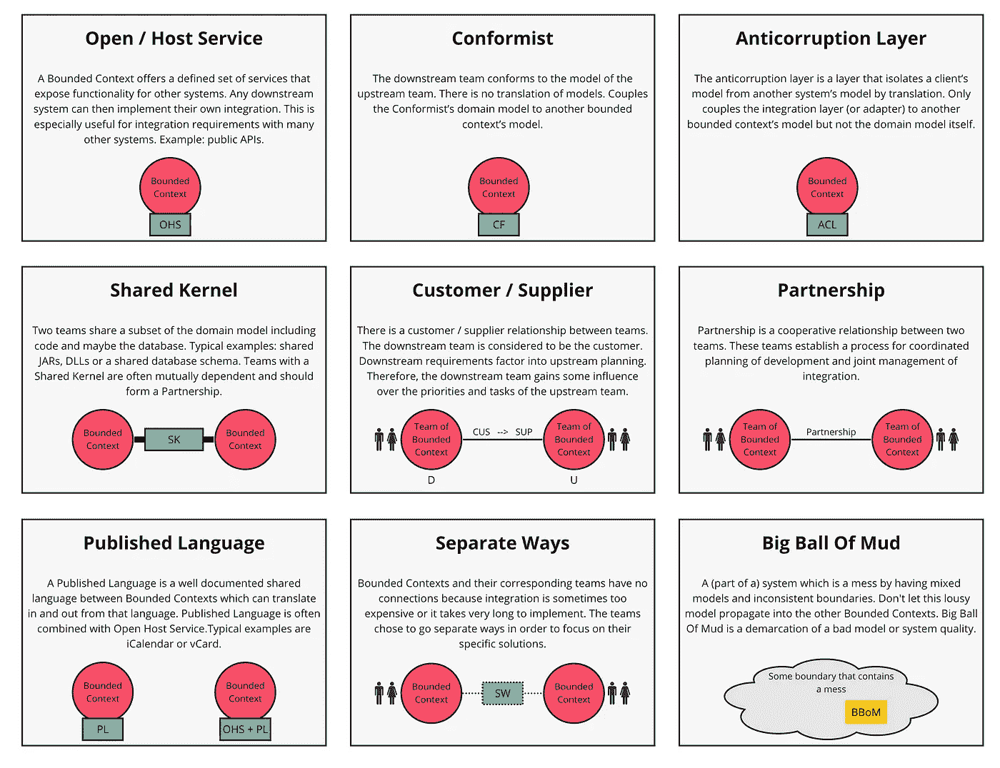
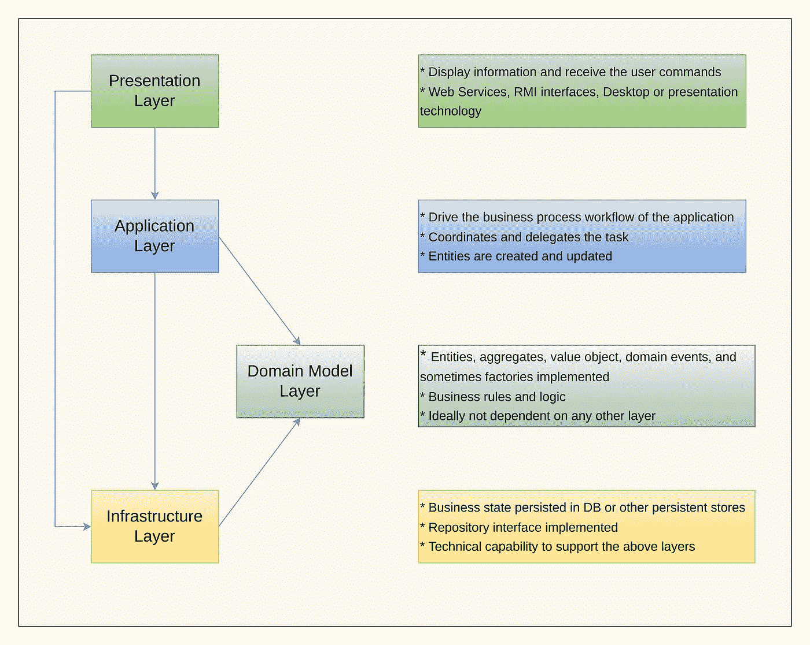

# 在复杂领域中设计软件:领域驱动设计

> 原文：<https://levelup.gitconnected.com/designing-software-in-a-complex-domain-domain-driven-design-10604ad08d12>

## 建模软件以符合商业现实

图片来源:【pexels.com 

软件的核心是处理和解决可用的业务环境和问题。今天的企业业务领域通常很大，而且复杂，并且在不断发展/变化——以及接受这种增强的软件。领域驱动设计(DDD)是一种软件开发方法，其中软件工件与核心业务概念和目标完全一致。

领域驱动设计是由[**Eric Evans**](https://www.amazon.com/Eric-Evans/e/B001KDCO2I/ref=dp_byline_cont_book_1)**在其著作 [*领域驱动设计:解决软件核心的复杂性*](https://www.amazon.com/Domain-Driven-Design-Tackling-Complexity-Software/dp/0321125215/ref=pd_sbs_14_t_0/137-5419951-0842927?_encoding=UTF8&pd_rd_i=0321125215&pd_rd_r=e2ec0e29-603b-4c31-a76e-b4419a8fe1f9&pd_rd_w=vMMsg&pd_rd_wg=zdDXi&pf_rd_p=5cfcfe89-300f-47d2-b1ad-a4e27203a02a&pf_rd_r=A4XCP34BVJBZC8GPVX5W&psc=1&refRID=A4XCP34BVJBZC8GPVX5W) *中提出的。它由模式、原则和集合组成，使团队能够专注于业务成功的核心。***

> **“领域驱动设计(DDD)是一种为复杂需求开发软件的方法，通过将实现与核心业务概念的演进模型紧密联系起来。”——dddcommunity.org**

# **问题域建模——战略 DDD**

**战略 DDD 关注高层次的架构设计决策。它包括业务流程建模、域到子域的分解以及它们之间的集成模式。无处不在的语言、有界的上下文和上下文图是领域战略图景的关键组成部分。**

## **无处不在的语言——提炼领域知识**

**与领域专家的持续协作是理解和交流领域见解的战略设计的核心。领域概念需要在涉众(领域专家、开发人员、产品经理、设计人员)之间以相同的术语、含义和上下文进行交流，不能有歧义。**

**最终目标是在对话中创建术语/语言的一致性，以创建反映沟通语言的模型/代码。例如，如果您需要在订阅期间定义一个方法来创建用户，请使用方法名称`signupForSubscription`而不是`create`方法。**

**有效的领域建模者是优秀的知识消化者。参考[此处](https://thedomaindrivendesign.io/developing-the-ubiquitous-language/)关于无处不在的语言的发展和挑战。**

****

**无处不在的语言**

## **有界上下文——大而复杂的领域？分裂以征服**

> **“哪里有问题，哪里就有太大的问题”——利奥波德·科尔**

**一个复杂的领域模型可以被分割成更集中的区域来管理复杂性，并在设计和执行中带来灵活性。为了**划分**(并征服)复杂域，我们需要创建一个逻辑**边界**来分解成**子域**。子域是问题空间的一部分，反映了组织的业务流程。**

**在这篇博文中，我们将考虑一个典型的电子商务应用程序的例子**

****

**图 2 典型电子商务应用程序中的子域**

**有多个子域(核心、支持或通用)。为了解决这个问题，我们引入了一个**有界上下文**，它是子域**适用性**的一个有形边界，在这里一个特定的**域模型**一致地适用。**

****

**问题空间和有界环境**

**让我们考虑两个有界的上下文——支付和运输。在支付上下文中，客户表示诸如信用卡信息、税率、业务号码和帐单地址等属性。在运输方面，客户数据可以是交货地址、交货时间偏好。这两种上下文的术语(语言)和领域专家可以是不同的。**

****

**图 1 .相同的对象承载不同的上下文**

## **识别您的领域中的有界上下文**

**领域知识的深度洞察力对于识别有界环境是必不可少的。业务相关性、自主性、语言边界、数据流以及与其他上下文的关系是识别有界上下文的线索。 [**事件风暴**](https://www.eventstorming.com/)**(workshop approach for a high-level overview)**&[**有界语境画布**](https://github.com/ddd-crew/bounded-context-canvas) (设计&文档的工具)有助于有界语境的探索。******

## ****上下文映射****

****就实现业务目标而言，有界上下文不是独立的。它们之间的集成是必需的。上下文映射是对系统的不同有界上下文之间的关系进行识别、分类和可视化描述的过程。有[种不同的上下文映射模式](https://github.com/ddd-crew/context-mapping)，如下图所示。****

********

****图:上下文映射模式(图片来源:[https://github.com/ddd-crew](https://github.com/ddd-crew)****

# ****战术设计模式——在有限的上下文中塑造代码****

****战术设计模式是在代码级别上实现有界上下文的指南。一个**域模型**需要精确地定义，并在一个有界的上下文中应用。****

*   ******实体:**实体是具有唯一标识(数据库中的主键或系统生成的 ID)的对象，该标识会随着时间的推移而保持不变。客户可以是电子商务应用程序中具有名称、电子邮件和地址属性的实体。****
*   ******值对象:**没有完全由其属性定义的标识的对象。让我们考虑一个货币价值对象- `100 AUD`。这个值对象是可比较的(可以和`90 USD`比较)、不可变的(创建一个新的而不是替换它)、自我验证器(不能有一个货币无效的值对象`25 ABC`)。****
*   ******聚合:**聚合是定义事务一致性边界的实体和值对象的封装。假设你有一个带有`OrderInfo`和`OrderItems`的`**Order**`。`OrderInfo`的变化可能会改变订单的状态。类似地，订单总量会随着`OrderItems`的变化而变化，所有这些都有一个严格的交易边界，需要始终保持一致。`Order`、`OrderInfo`和`OrderItems`一起构成一个 ***集合体*** 。聚合中只有一个实体是根，其标识符用于查找。根实体的子实体通过跟随来自根的指针来引用。****
*   ******储存库和工厂:**工厂用于通过提供实体和值对象来创建新的集合。存储库提供了访问持久存储的逻辑封装。****

# ****分层架构****

****每个有界的上下文被划分成以下内聚的水平层。****

## ****用户界面****

****这一层向用户提供接口。这一层负责显示数据和捕获用户命令。****

## ****应用层****

****业务流程流在这一层处理。域实体在这里被创建和更新。****

## ****领域模型层****

****领域的数据和行为在概念上在领域模型中建模。这里定义了**实体、值对象、集合、工厂和接口**来表达领域规则和逻辑。领域模型的设计通常不依赖于其他层、第三方或持久层。然后，应用层协调这些决策。领域模型层和应用层分离的细节参见[这里的](https://enterprisecraftsmanship.com/posts/domain-vs-application-services/)。****

## ****基础设施层****

****最初保存在域实体中的数据被持久保存在数据库或另一个持久存储中。****

********

****图 3 DDD 的不同层次****

## ****代码实现****

*   ****[贫血域模型 vs DDD](https://github.com/mahad96/adm-vs-ddd/tree/master/src)****
*   ****ASP。NET [ABP 框架](https://github.com/abpframework/abp/)****
*   ****[弹簧框架](https://www.baeldung.com/hexagonal-architecture-ddd-spring)****
*   ****[Node.js 样板文件](https://github.com/joshuaalpuerto/node-ddd-boilerplate)****

# ******DDD 什么时候适用？******

****DDD 不仅仅是一个编码食谱。它是关于对需要理解业务语义(概念和行为)的系统有帮助的战略思维。然而，这不是一个全有或全无的交易。我们可以根据您的项目实施这些想法(战略或战术方法)。DDD 方法可能不太适合以 CRUD 为中心的系统。****

****沃恩·弗农唤起他的 [DDD 记分卡](http://www.informit.com/articles/article.aspx?p=1944876&seqNum=2)来决定是否值得应用 DDD。[该回购](https://github.com/ddd-crew/ddd-starter-modelling-process)为 DDD 的启动提供了极好的洞察力。****

# ****DDD 和微服务****

****[微服务](https://martinfowler.com/articles/microservices.html)是一种架构模式，通过松散耦合、可独立部署、小型且可重用的服务(微单元)来设计应用程序。DDD 有助于通过“有限的上下文”保持较小的服务范围单个有界上下文通常映射到一个微服务，但它可以有一对多的关系。DDD 帮助识别子域和上下文映射，这有助于微服务之间的通信。****

****优步实施了基于 DDD 的[面向领域的微服务架构(DOMA)](https://eng.uber.com/microservice-architecture/) 。你可以在这里找到指导方针[来设计面向 DDD 的微服务。](https://docs.microsoft.com/en-us/dotnet/architecture/microservices/microservice-ddd-cqrs-patterns/ddd-oriented-microservice)****

# ****处理独石****

****单片应用程序是很好的开始。当产品发展时，它将变得难以管理，我们需要转移到 [SOA](https://en.wikipedia.org/wiki/Service-oriented_architecture) 。这种过渡可以通过基于 DDD 的中间模块方法[来实现](https://github.com/kgrzybek/modular-monolith-with-ddd)。****

# ****应用 DDD 的挑战****

****应用 DDD 时的一些常见挑战包括创建无处不在的语言所花费的时间、一开始对领域专家的要求、抽象开销、事务管理、领域建模的合理性。****

## ****参考****

*   ****[领域驱动设计的模式、原则和实践——Scott Millett 和 Nick Tune](https://www.amazon.com/Patterns-Principles-Practices-Domain-Driven-Design/dp/1118714709)****
*   ****[实现领域驱动设计——沃恩·弗农](https://www.amazon.com/Implementing-Domain-Driven-Design-Vaughn-Vernon/dp/0321834577)****
*   ****[https://docs . Microsoft . com/en-us/dot net/architecture/microservice/microservice-DDD-cqrs-patterns/DDD-oriented-microservice](https://docs.microsoft.com/en-us/dotnet/architecture/microservices/microservice-ddd-cqrs-patterns/ddd-oriented-microservice)****
*   ****[https://github.com/ddd-crew/ddd-starter-modelling-process](https://github.com/ddd-crew/ddd-starter-modelling-process)****
*   ****[https://eng.uber.com/microservice-architecture/](https://eng.uber.com/microservice-architecture/)****
*   ****[https://netflixtechblog . com/ready-for-changes with-hexagonal-architecture-b 315 EC 967749](https://netflixtechblog.com/ready-for-changes-with-hexagonal-architecture-b315ec967749)****