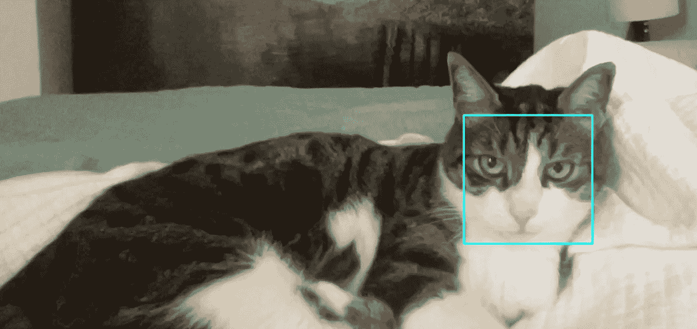

# 用 OpenCV 检测你的猫的脸

> 原文：<https://levelup.gitconnected.com/detect-your-cats-face-with-opencv-21893210737e>

## Python 中的 OpenCV 猫脸检测代码


我的猫蒂姆，开放的关系，可爱的猫。

使用 OpenCV 的预训练级联分类器，可以轻松检测照片或视频中的猫脸。完成所有工作的小代码:

让我们一行一行地检查它:

*   cv2 库是*导入的*。

如果你还没装；

```
#install cv2
pip install opencv-python **#1**
import cv2
```

*   *加载*级联分类器 XML 文件。

OpenCV 目录中有很多预先训练好的级联。还有一个(实际上是两个)是给猫的。你可以从[这个地址下载文件。](https://github.com/opencv/opencv/tree/4.x/data/haarcascades)

```
**#3**
cascade = cv2.CascadeClassifier('haarcascade_frontalcatface.xml')
```

## 级联分类器

级联是一种集成学习方法，它是一种使用多个分类器来提高准确性的方法。第一个级联分类器是 Viola 和 Jones (2001) 的面部检测器。对这种分类器的要求是快速的，以便在低功率 CPU 上实现，例如照相机和电话。

级联是一种训练分类器的方法(分类器是一种机器学习算法，可以用来标记事物)，以便它们在一个链中一起工作。链中的第一个分类器是在数百张你试图检测的事物的“正面”图像和一堆不包含该事物的“负面”图像上训练的。然后，这个分类器可以应用于图像的一个区域，它会尝试检测这个东西。如果没有找到，它将移动到下一个区域，以此类推，直到它找到这个东西或者已经搜索了整个图像。这个过程最常用于面部检测和识别。

该算法通过扫描图像并寻找与训练数据中匹配的 Haar 特征来工作。如果找到匹配，它会将该区域标记为人脸。如果没有找到匹配，它会将该区域标记为非人脸。


哈尔特色。来源: [opencv](https://docs.opencv.org/3.4/db/d28/tutorial_cascade_classifier.html)

在整个图像中进行这种搜索是一项极其昂贵的工作。想想看，即使是 24x24 的图像也有 160000 个特征。因此，它使用积分图像，这是一种有效的方法来克服这一点。

积分图像允许快速计算给定矩形下的像素总和，用于计算各种特征。这种方法比传统方法快得多，这使得它非常适合用于大型图像。


长方形。

1 的值是 A 中像素的和.位置 2 的值是 A 和 B 的和.位置 3: A+C .位置 4 A+B+C+D . D 的值是(4+1) — (2+3)。

在我们得到这些特征(会有很多)后，我们需要对它们进行过滤，我们需要找出能告诉我们一些东西的特征。Adaboost 是一种机器学习算法，有助于从大量特征中选择最佳特征。它通过关注与手头任务最相关的特性来做到这一点。

我们将每个特征应用于训练图像，并获得正例和负例中提供的最佳阈值。选择在两个方向上误差率最低的特征。Adaboost 的基本分类器很弱。但是当他们走到一起，他们就达到了一个强大的水平。通过将特征从 160000 个减少到 6000 个，实现了超级增益，但是还有更多。

通常，与整个图像区域相比，包含人脸的区域非常小。所以，到处找还是效率不高。相反，在你的脸更可能出现在照片中的区域。

分类器级联是为了更有效地将所有特征应用于一个窗口而引入的概念。这些特征被分组到不同阶段的分类器中，并被逐一应用。如果窗口在第一阶段失败，则不考虑剩余的特征。如果通过，则应用特征的第二阶段，并继续该过程。通过所有阶段的窗口是面部区域。

*   为了访问和读取从网络摄像头接收的数据，我们创建了一个视频捕获对象并传递了我们的设备号。VideoCapture 类用于捕获视频。您可以传递视频文件的路径。

```
**#5**
cap = cv2.VideoCapture(0)
```

*   开始一个循环以确保连续的视频数据流。

```
**#7**
while True:
```

*   VideoCapture 对象(cap)读取、解码并返回下一帧视频。

```
**#8**
ret, img = cap.read()#ret is True if there is a video data
#img is the image
```

*   我们将接收到的图像转换为灰度，以最小化计算成本。

```
**#9**
img_gray = cv2.cvtColor(img, cv2.COLOR_BGR2GRAY)
```

*   现在，是时候在提供的图像帧中检测人脸了。我们将使用我们的级联。

*detectMultiScale* 方法检测给定图像中各种尺寸的物体。它接受灰度图像、比例因子、minNeighbors、minSize、maxSize。

*比例因子*用于创建比例金字塔，这是一系列不同尺寸的图像，用于检测图像中不同尺寸的人脸。较小的比例因子会导致更彻底的人脸搜索，但速度较慢，而较大的比例因子会导致更快的搜索，但可能会错过一些人脸。

*邻居*参数指定每个候选矩形应该保留多少邻居。该参数将影响检测到的人脸的质量。值越高，检测次数越少，但质量越高。3~6 是一个很好的值。

*最小尺寸*确定被检测物体的阈值尺寸。而对于 *maxSize* ，则反之。

```
**#10**
faces = cascade.detectMultiScale(img_gray, 1.5, 5)
```

*   在图像中的人脸周围绘制矩形。

```
**#12-13-14-15**
for (x,y,w,h) in faces: 
        cv2.rectangle(img,(x,y),(x+w,y+h),(255,255,0),2) 
        roi_gray = img_gray[y:y+h, x:x+w] 
        roi_color = img[y:y+h, x:x+w]
```

*   监听事件以结束程序。(在我们的例子中按下退出键)。

```
**#19-20-21**
k = cv2.waitKey(30) & 0xff
if k == 27: 
   break
```

结果是:



## 阅读更多内容…

[](https://towardsdev.com/warping-an-objects-perspective-with-opencv-in-c-cbe971698ac5) [## 用 C++中的 OpenCV 扭曲对象的透视图

### 用 C++中的 OpenCV 实现图像中物体的扭曲透视

towardsdev.com](https://towardsdev.com/warping-an-objects-perspective-with-opencv-in-c-cbe971698ac5) [](https://medium.com/mlearning-ai/adaboost-from-scratch-f8979d961948) [## 从头开始

### AdaBoost 算法的解释和实现

medium.com](https://medium.com/mlearning-ai/adaboost-from-scratch-f8979d961948) [](https://medium.com/@okanyenigun/what-is-a-voxel-and-how-to-display-them-5bc3a76521e5) [## 什么是体素，如何显示它们？

### oxels 简介

medium.com](https://medium.com/@okanyenigun/what-is-a-voxel-and-how-to-display-them-5bc3a76521e5) 

## 参考

[https://docs . opencv . org/3.4/db/d28/tutorial _ cascade _ classifier . html](https://docs.opencv.org/3.4/db/d28/tutorial_cascade_classifier.html)

[https://www . geeks forgeeks . org/detect-cat-faces-in-real-time-using-python-opencv/](https://www.geeksforgeeks.org/detect-cat-faces-in-real-time-using-python-opencv/)

[https://www . cs . CMU . edu/~ efros/courses/lbmv 07/Papers/viola-cvpr-01 . pdf](https://www.cs.cmu.edu/~efros/courses/LBMV07/Papers/viola-cvpr-01.pdf)

# 分级编码

感谢您成为我们社区的一员！在你离开之前:

*   👏为故事鼓掌，跟着作者走👉
*   📰查看[升级编码出版物](https://levelup.gitconnected.com/?utm_source=pub&utm_medium=post)中的更多内容
*   🔔关注我们:[Twitter](https://twitter.com/gitconnected)|[LinkedIn](https://www.linkedin.com/company/gitconnected)|[时事通讯](https://newsletter.levelup.dev)

🚀👉 [**加入升级人才集体，找到一份神奇的工作**](https://jobs.levelup.dev/talent/welcome?referral=true)