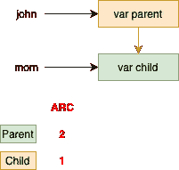
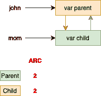
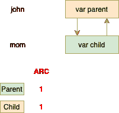
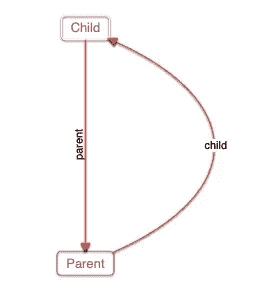
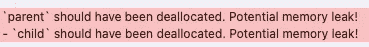
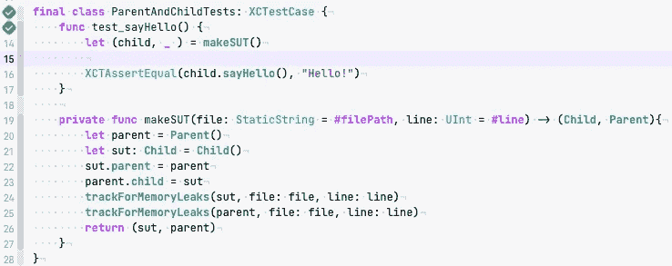
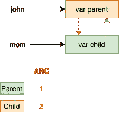

# 在 Swift 中使用单元测试检测内存泄漏

> 原文：<https://levelup.gitconnected.com/detecting-memory-leaks-using-unit-tests-in-swift-c37533e8ee4a>

内存管理是我们每次写代码都需要处理的话题。幸运的是，Swift 帮助我们完成了*自动引用计数* (ARC)。但是人为错误仍然存在，正如我们在[最后一个条目](https://alfredohdz.medium.com/proxy-design-pattern-f040a6561bfb)中看到的，我们犯的一个常见错误是*保留周期。*

当一个**对象 A** 保留另一个**对象 B** 并且**对象 B** 保留**对象 A**时，产生一个保留周期。让我们看一个例子:

假设我们有两个对象`Parent`和`Child` *、*，并创建了对它的两个引用。

这里我们有两个对两个对象的不同引用

注意，这两个变量都是可选的，然后我们将它们的属性赋给另一个对象(A 赋给 B and B，A 赋给 A)。分配`john.parent`和`mom.child`后，弧看起来是这样的:

电弧从 A 作用到 B

从 B 到 A 作用的弧

但是如果我们失去了来自`mom`和`john`变量的引用会怎么样呢？答案是我们**生成一个保留周期**。通过将两个变量都设为`nil`，我们失去了引用，但它们仍然相互保留。

共同保持循环的方法

## 检测内存泄漏的古老方法:

如果我们有内存泄漏，一个简单的“检测”方法是在反初始化器中添加一个简单的`print`消息来验证`deinit`从未被调用。

将打印消息添加到定义块中

运行你的代码，你会发现`deinit`永远不会被调用。

这就是 Instruments tool 显示内存泄漏的方式

## 用单元测试检测内存泄漏:

为了检测内存泄漏，我们可以在每个测试中添加一个断言，在测试结束后验证我们的对象是否不同于`nil`。但是 [XCTest 框架](https://developer.apple.com/documentation/xctest)为我们提供了一个`tearDown`模块来在每次测试结束后添加行为。所以让我们利用这个特性。

让我们给`**child**`添加一个名为 *sayHello()* 的函数，它只返回一个“Hello！”字符串，并编写如下测试:

父母和孩子的测试用例

如你所见，我们在测试的末尾添加了一个`**tearDown**`块，在这里我们断言`**parent**`和`**child**`是否为零。

> 注意，我们需要在"***【weakify】***`**parent**`和`**child**` *里面拆掉块*

通过运行该测试，我们将看到以下断言错误:

断言失败表明内存泄漏

就是这样，我们已经从单元测试中很容易地发现了内存泄漏！

## 改进内存泄漏跟踪:

当然，为了跟踪内存泄漏，我们需要在每个测试中添加断言，但这可能会更好。您可以创建一个 XCTestCase 助手。

然后在我们的测试类中，我们可以创建一个`makeSUT`助手来创建我们的 [*被测系统*](https://en.wikipedia.org/wiki/System_under_test) 并添加内存泄漏跟踪。

通过使用这个`makeSUT`工厂助手，您可以跟踪每个测试的内存泄漏，并避免重复代码，代码也更干净。

您可以在我的 github 资源库中看到更多如何使用该助手的示例:

 [## AlfredoHernandez/HackrNews

### Y Combinator 的黑客新闻的一款 iOS 阅读应用。-阿尔弗雷多·埃尔南德斯/哈克新闻

github.com](https://github.com/AlfredoHernandez/HackrNews/tree/develop/HackrNewsTests) 

## 内存泄露怎么解决？

默认情况下，Swift 中对类的引用是强类型(强引用)，因此只要父类还活着，每个子类都将保持“活着”。如果父类死亡，那么子类也会死亡。

回想一下，当它们“死亡”时，父类和子类的引用计数器都减 1。

打破保持循环很简单，只需创建弱 eather `child.parent`或`parent.child`变量。这取决于我们的用例。在这种情况下，我们让`weak`成为孩子的父母。

`weak var parent: Parent?`

并再次运行测试，测试将通过。

通过测试

那么 ARC 现在怎么样了？

打破保留周期

记住:`weak`和`unowned`变量不会增加圆弧。

有关 ARC 如何处理弱引用和无主引用的更多信息，请访问 swift 官方文档:

 [## 自动引用计数-Swift 编程语言(Swift 5.4)

### Swift 使用自动引用计数(ARC)来跟踪和管理您的应用程序的内存使用情况。在大多数情况下，这意味着…

docs.swift.org](https://docs.swift.org/swift-book/LanguageGuide/AutomaticReferenceCounting.html) 

**还有一件事** :
这项技术因为[essentialdeveloper.com](https://www.essentialdeveloper.com/articles/the-minimum-you-should-do-to-prevent-memory-leaks-in-swift?rq=memory%20leaks)的伟大工作而被应用和学习。让我们来看看他们伟大而有价值的内容。
[https://www.essentialdeveloper.com](https://www.essentialdeveloper.com)