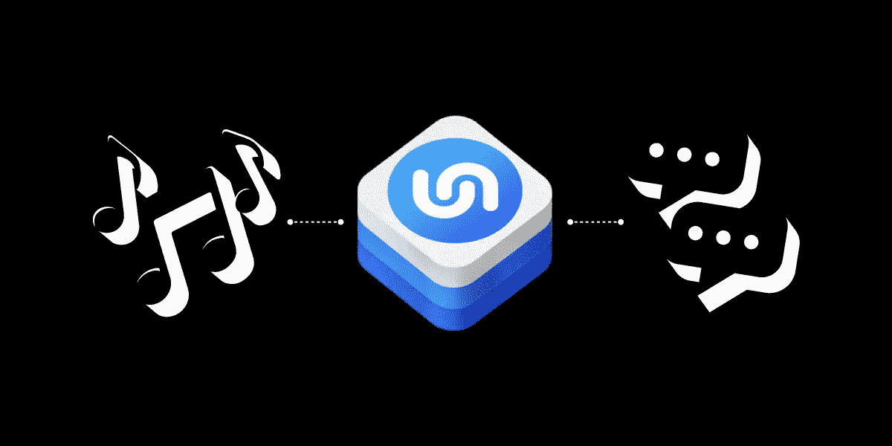
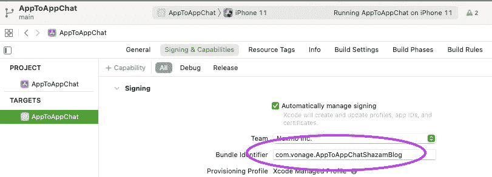
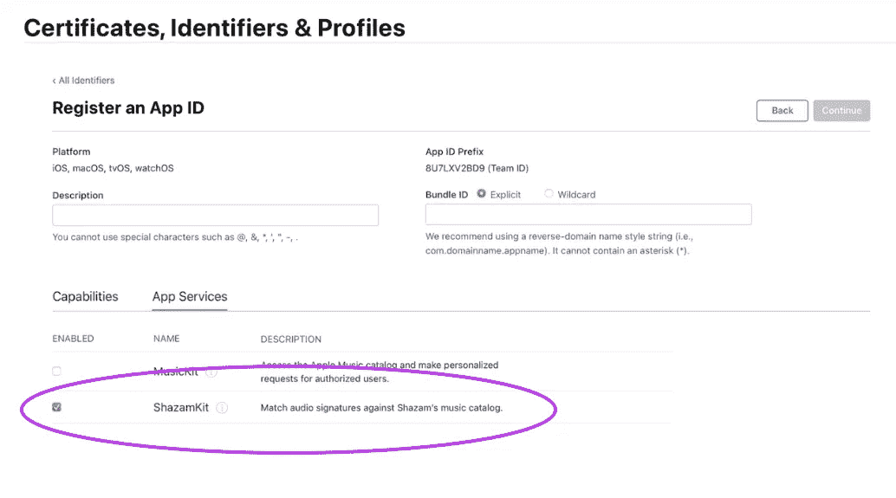
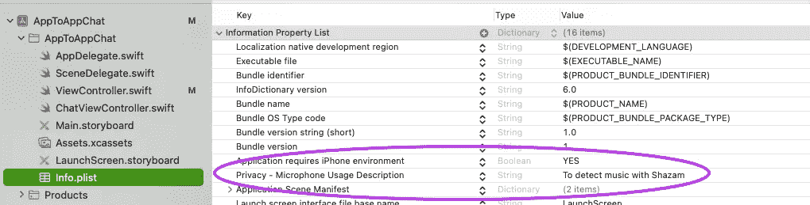
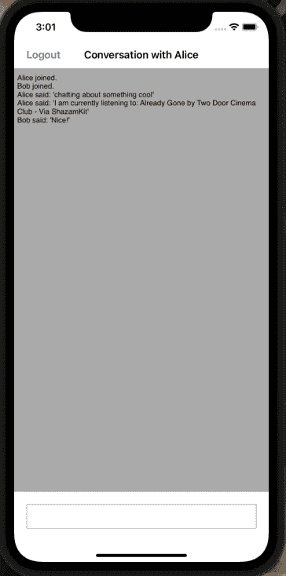

# 使用 ShazamKit 检测音乐

> 原文：<https://levelup.gitconnected.com/detecting-music-with-shazamkit-c36168cfba5e>

在本教程中，您将使用 [ShazamKit](https://developer.apple.com/documentation/shazamkit) 来检测音乐播放，并将其作为消息发送到与 iOS 的 [Vonage 客户端 SDK 的聊天中。ShazamKit 在 iOS 15 及更高版本中可用，在撰写本文时还处于测试阶段。](https://developer.nexmo.com/client-sdk/overview)

# 先决条件

*   一个苹果开发者账号和一个运行 iOS 15 的测试设备。
*   Xcode 13。
*   Cocoapods 为 iOS 安装 Vonage 客户端 SDK。
*   我们的命令行界面。可以用 npm install nexmo-cli@beta -g 安装。

# Vonage API 帐户

要完成本教程，您将需要一个 [Vonage API 帐户](http://developer.nexmo.com/ed?c=blog_text&ct=2021-07-08-detecting-music-with-shazamkit)。如果你还没有，你可以今天就[注册](http://developer.nexmo.com/ed?c=blog_text&ct=2021-07-08-detecting-music-with-shazamkit)开始用免费的信用点数建造。一旦你有了一个帐户，你可以在 [Vonage API 仪表板](http://developer.nexmo.com/ed?c=blog_text&ct=2021-07-08-detecting-music-with-shazamkit)的顶部找到你的 API 密匙和 API 秘密。

# 启动项目

本教程将建立在 Vonage 开发者门户的[“创建聊天应用”](https://developer.nexmo.com/client-sdk/tutorials/in-app-messaging/introduction/swift)项目之上。本教程将从从 GitHub 克隆完成的项目开始，但如果你不熟悉使用 Vonage Client SDK for iOS 构建聊天 app，可以从教程开始。如果您遵循本教程，可以直接跳到启用 ShazamKit 部分。

## 设置 Vonage 应用程序

您现在需要创建一个 Vonage 应用程序。应用程序包含连接到 Vonage 所需的安全和配置信息。在您的终端中使用 mkdir `vonage-tutorial`为您的项目创建一个目录，然后使用 cd `vonage-tutorial`切换到新目录。使用以下命令创建一个 Vonage 应用程序:

一个名为`.nexmo-app`的文件被创建在您的项目目录中，它包含新创建的 Vonage 应用程序 ID 和私钥。还创建了名为 private.key 的私钥文件。

接下来，为您的应用程序创建用户。您可以通过运行以下命令来实现:

创建对话:

将您的用户添加到对话中，用您之前的对话 ID 替换`CONV_ID`:

客户端 SDK 使用 JWTs 进行身份验证。JWT 标识用户名、关联的应用程序 ID 和授予用户的权限。它是使用您的私钥签名的，以证明它是有效的令牌。您可以通过运行以下命令为您的用户创建一个 JWT，用您之前的应用程序 ID 替换`APP_ID`:

# 克隆 iOS 项目

要获得 iOS 项目的本地副本，请打开您的终端并输入`git clone git@github.com:nexmo-community/clientsdk-app-to-app-chat-swift.git`。使用`cd clientsdk-app-to-app-chat-swift`将目录切换到`clientsdk-app-to-app-chat-swift`文件夹。然后通过运行`pod install`安装项目的依赖项。完成后，您可以通过运行 open AppToAppChat.xcworkspace 来打开 Xcode 项目。

# 验证客户端 SDK

在`ViewController.swift`文件的底部，有一个为我们的用户 Alice 和 Bob 提供静态属性的`User`结构。用您之前在终端中生成的值替换`CONVERSATION_ID`、`ALICE_JWT`和`BOB_JWT`。

# 启用 Shazam

项目打开后，确保您有一个惟一的包标识符，并启用自动签名。

接下来，访问苹果开发者门户网站上你的账户的[标识符部分](http://developer.apple.com/account/resources/identifiers/list)。找到您的捆绑包标识符，并在*应用服务*下启用 ShazamKit。

# 检测音乐

## 麦克风权限

麦克风权限

要检测正在播放的音乐，您需要访问设备的麦克风，这需要您的许可。您的项目包含一个包含应用程序元数据的`Info.plist`文件——您可以在 AppToAppChat 组中找到该文件。

需要在`Info.plist`文件中添加一个新条目:

1.  将鼠标悬停在列表中的最后一个条目上，然后单击出现的小+按钮。
2.  从下拉列表中，选择`Privacy - Microphone Usage Description`并添加`To detect music with Shazam`作为其值。

你的`Info.plist`应该是这样的:

接下来，打开您的`AppDelegate.swift`文件并导入`AVFoundation`:

然后，调用`application:didFinishLaunchingWithOptions:`内的`requestRecordPermission:`:

## 创建音频缓冲区

该应用程序将使用麦克风连续检测背景中的音乐，因此您需要从麦克风创建一个音频缓冲区，以传递给 ShazamKit。打开`ChatViewController.swift`文件，导入`AVFoundation`、`ShazamKit`并将这些属性添加到类中:

接下来向名为`startAnalysingAudio`的类添加一个新函数:

该功能使用`[AVAudioEngine](https://developer.apple.com/documentation/avfaudio/avaudioengine)`来访问麦克风的输入。`AVAudioEngine`是一个健壮的框架，允许你通过插入/链接节点对象来操作音频。您只对这个应用程序的`inputNode`的输出`bus 0`感兴趣。`installTap`函数允许您观察输出，并允许您访问`AVAudioNodeTapBlock`，它是一个`AVAudioPCMBuffer`和`AVAudioTime`元组的 typealias。然后，缓冲区和时间都会传递给`SHSession`上的`matchStreamingBuffer`功能，该功能会尝试将播放的任何音乐与 Shazam 目录进行匹配。

要结束这个过程，您需要添加一个名为`stopAnalysingAudio`的函数，它将安全地停止观察输入:

将会话的委托设置为此类，调用`viewDidLoad`函数底部的`startAnalysingAudio`和`logout`函数中的`stopAnalysingAudio`:

# `SHSessionDelegate`

现在应用程序正在向 ShazamKit 传递一个缓冲区，您需要实现`SHSessionDelegate`来接收更新。在文件底部创建扩展名:

当 ShazamKit 没有发现匹配或错误时，调用`didNotFindMatchFor`函数。否则，当找到匹配时，将调用`didFind`函数。

匹配结果以不同置信度的数组形式返回，但您将获得第一个结果。此外，该函数将匹配 ID 与上一次匹配进行比较，以确保当您向聊天发送消息时，每次匹配只发生一次。

# 尝试一下

在您的 iOS 设备和模拟器上构建并运行(CMD + R)项目。在每台设备上以不同的用户身份登录。如果你在后台播放一些音乐，物理 iOS 设备会将音频缓冲区传递给 ShazamKit。如果歌曲与 Shazam 目录匹配，将会向聊天室发送一条消息。

# 接下来呢？

你可以在 [GitHub](https://github.com/nexmo-community/swift-app-to-app-shazamkit) 上找到已经完成的项目。使用客户端 SDK，您可以做更多的事情。了解有关 developer.nexmo.com[的客户端 SDK 和 developer.apple.com](https://developer.nexmo.com/client-sdk/overview)[的 ShazamKit 的更多信息](https://developer.apple.com/documentation/shazamkit)

*最初发布于*[*https://learn . vonage . com/blog/2021/07/08/detecting-music-with-shazamkit/*](https://learn.vonage.com/blog/2021/07/08/detecting-music-with-shazamkit/)