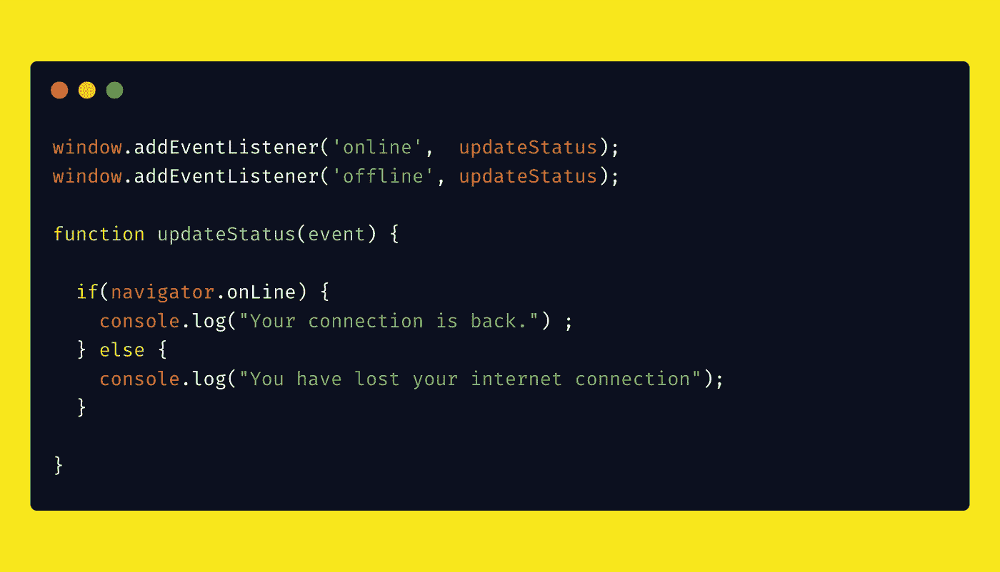

# 在 Javascript 中检测在线/离线状态

> 原文：<https://levelup.gitconnected.com/detecting-online-offline-in-javascript-1963c4fb81e1>

## 了解如何检测用户是在线还是离线，以及如何在在线/离线状态发生变化时处理事件。

我们可以通过使用`navigator`对象上的`online`属性来检测用户是在线还是离线，如果用户连接到互联网，该属性将返回`true`，否则返回`false`。

此外，如果用户的互联网连接状态发生变化，将触发`online`和`offline`事件。因此，我们可以向`window`添加一个`online`和`offline`事件监听器，并基于`online`和`offline`状态执行各自的操作。

Javascript 中的在线离线状态处理程序

由 [Pulkit Aggarwal](https://codepen.io/pulkitsvm) 执笔

上面的 codepen 最初是由 [Pulkit Aggarwal](https://codepen.io/pulkitsvm) 创建的。谢谢🙏 😊至 [Pulkit Aggarwal](https://codepen.io/pulkitsvm) 。

感谢阅读📖。我希望你喜欢这个迷你课程。如果你发现任何错别字或错误，给我发一封私信📝谢谢🙏 😊。

关注我 [JavaScript Jeep🚙💨](https://medium.com/u/f9ffc26e7e69?source=post_page-----98efbae5e8aa----------------------)。

**请捐款** [**这里**](https://www.paypal.com/paypalme2/jagathishSaravanan) **。你捐款的 80%捐给了需要食物的人🥘。提前感谢。**