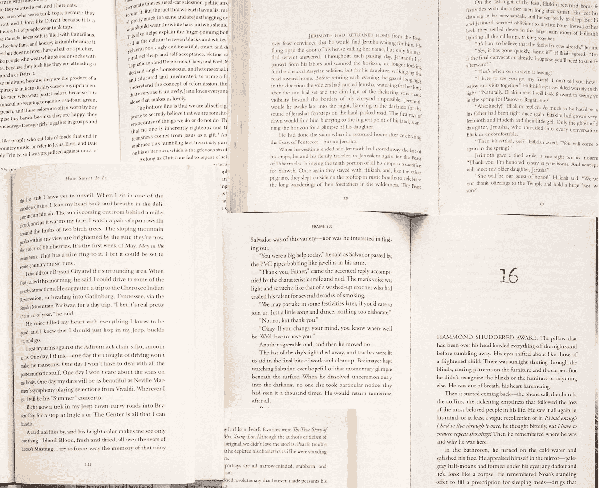

# 在 JavaScript 中检测浏览器标签的焦点

> 原文：<https://levelup.gitconnected.com/detecting-the-focus-of-browser-tab-in-javascript-d4460bc579ac>

## 确定选项卡是否已从用户处获得焦点，以及焦点改变时如何处理事件



图片由[真心媒体](https://unsplash.com/@sincerelymedia?utm_source=unsplash&utm_medium=referral&utm_content=creditCopyText)

`Page Visibility API`给了我们决定页面何时有焦点的能力。当页面的焦点改变时，API 也会触发`visibilitychange`事件。

当我们需要在以下情况下节省资源时，页面可见性 API 非常有用:

*   当用户不使用该页面时，不发送任何网络请求。
*   不在没有焦点的页面上执行动画。
*   不更新非焦点页面上的任何用户界面。
*   如果用户不在页面上，则阻止媒体播放。

我觉得 Medium 也是用这个 API 来决定一个故事的阅读时间。

页面可见性 API 在文档对象下公开了**两个属性:**

```
document.hidden
```

返回一个布尔值，表示文档是否隐藏。

```
document.visibilityState
```

可见性状态的字符串表示:

*   `visible` →标签有焦点。
*   `hidden` **→** 选项卡隐藏。
*   `prerender` **→** 页面在后台加载，用户不访问。
*   `unloaded` **→** 页面正在从内存中卸载。

并非所有浏览器都支持`prerender`和`unloaded`状态。

除了上述属性，我们还有一个事件`visibilitychange`。当浏览器选项卡获得或失去焦点时，将触发此事件。

# 例子

```
document.addEventListener('visibilitychange', function(ev) {
  console.log(`Tab state : ${document.visibilityState}`);});
```

在上面的例子中，我们简单地记录了状态。但是，当选项卡的可见性改变时，我们可以使用该事件来节省资源或执行任何所需的代码。

```
document.addEventListener('visibilitychange', function(ev) {

 **// Stop animation 
   // Stop unwanted request
   // Stop unwanted UI update**});
```

使用页面可见性 API， [**马特-韦斯特**](https://codepen.io/matt-west) 创建了一个视频播放器，当页面失去焦点时暂停视频，当页面获得焦点时自动再次播放。

感谢阅读📖。我希望你喜欢这个。如果你发现任何错别字或错误，给我发一封私信📝谢谢🙏 😊。

关注我 [JavaScript Jeep🚙💨](https://medium.com/u/f9ffc26e7e69?source=post_page-----98efbae5e8aa----------------------)。

**请捐款** [**这里**](https://www.paypal.com/paypalme2/jagathishSaravanan) **。你捐款的 98%都捐给了需要食物的人🥘。提前感谢。**