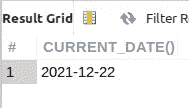
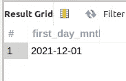
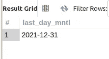

# 使用 MySQL 确定每月的第一天和最后一天

> 原文：<https://levelup.gitconnected.com/determine-the-first-and-last-day-of-a-month-with-mysql-c7a2235aa2ab>

处理日期值是每个开发人员工作的一部分。似乎我们总是在按日期或日期范围寻找或过滤一些数据。

MySQL——像其他 SQL 实现一样——有许多日期函数可用于日期数据处理。

如果您需要知道任何月份的第一天和最后一天，您可以使用特定的 MySQL 日期函数并确定每个函数的值。

***OpenLampTech*** 是面向 PHP/MySQL 开发者的简讯。[免费注册](http://openlamptech.substack.com)加入社区。学习和成长…

来自 [Pixabay](https://pixabay.com/?utm_source=link-attribution&utm_medium=referral&utm_campaign=image&utm_content=23684) 的[Clker-Free-Vector-Images](https://pixabay.com/users/clker-free-vector-images-3736/?utm_source=link-attribution&utm_medium=referral&utm_campaign=image&utm_content=23684)的图像

## 当前日期

在撰写本文时，MySQL 的`CURRENT_DATE()`函数在我的 8.0.27 版本的本地学习/开发安装中返回了这个日期:

我在这篇文章的例子中使用了当前的日期值。对于您的特定用例，请使用您正在处理的任何日期值。只需用你的约会对象替换`CURRENT_DATE()`函数调用，你就可以开始了。

## MySQL 中没有 FIRST_DAY()函数

当前版本的 MySQL 没有内置的原生 FIRST_DAY()日期函数。

但是，没关系。没什么大不了的。

我们可以使用选择现有日期函数的组合来计算一个月的第一天。

具体来说，我们可以使用:

*   `DATE_ADD()` —将日期/时间`INTERVAL`值加到日期上，并返回计算出的日期。更多信息参见 [DATE_ADD()官方文档](https://dev.mysql.com/doc/refman/8.0/en/date-and-time-functions.html#function_date-add)。(非现场链接)
*   `DAY()` —对于给定的日期值，以 1 到 31 之间的数字形式返回一个月中的某一天。更多信息见[日()官方文件](https://dev.mysql.com/doc/refman/8.0/en/date-and-time-functions.html#function_day)。(非现场链接)

我将使用的表达式显示在以下查询中:

使用特定的日期函数来确定一个月的第一天。

它是如何工作的？

相信我。这可能看起来很复杂，但绝不是。

以下是概要…

`DAY()`函数返回所提供的日期参数的数字日期值。根据我们在这些示例中使用的日期值，“2021-12-22”，该数字日值为 22。

22 加 1 等于 23(告诉过你这不是火箭科学)。

接下来，我们使用`DATE_ADD()`函数。第一个参数是`CURRENT_DATE()`返回值(这里使用您的日期值)。那么，我们使用的`INTERVAL`值和`INTERVAL`类型就是`DAY`时态类型的 23。

实际上，从`CURRENT_DATE()`值中减去 23(天)，返回该月的第一天:“2021-12-01”。

我可以整天喝咖啡。如果你愿意，你甚至可以帮我做这件事！！！

## LAST_DAY()日期函数

幸运的是，MySQL 确实有一个`LAST_DAY()`日期函数，这使得查找给定月份的最后一天变得非常容易。

只需提供一个有效的日期值作为`LAST_DAY()`的参数即可。

使用`LAST_DAY()`函数很简单，不需要太多思考(我最喜欢的那种)。

你在这里。您现在知道如何使用 MySQL 找到任意给定月份的第一天和最后一天。

一如既往，如果你有任何问题或看到代码中的任何错误，请通过评论让我知道。建设性的意见有助于我提供准确的博客帖子，我非常感激。感谢您的阅读。

 [## OpenLamp.tech 问题#7 —带有 CodeIgniter 4 的 MySQL 元数据

### OpenLamp.tech，PHP /MySQL 开发人员的时事通讯，正在轰轰烈烈地结束这个月和这个年。之后…

parabollus.medium.com](https://parabollus.medium.com/openlamp-tech-issue-7-mysql-metadata-with-codeigniter-4-850155ba571)  [## 用 MySQL 中的 SUBSTRING()实现递归 CTE

### 虽然这些天我主要在后端 web 开发项目中使用 MySQL/MariaDB，但我正在学习 Oracle SQL…

levelup.gitconnected.com](/recursive-cte-fun-with-substring-in-mysql-3a06fab881cd) 

请在我的博客 [Digital Owl 的散文](http://joshuaotwell.com)上关注我，在那里我定期撰写关于 SQL、PHP 和 CodeIgniter 的文章。请务必[注册***OpenLampTech***](http://openlamptech.substack.com)，这是一份面向 PHP/MySQL 开发人员的时事通讯，您可以收到直接发送到您收件箱的每周精选内容和每月深度精选文章。🙏