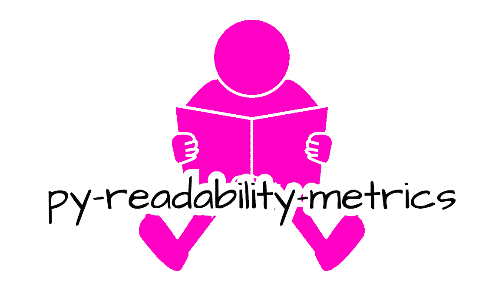
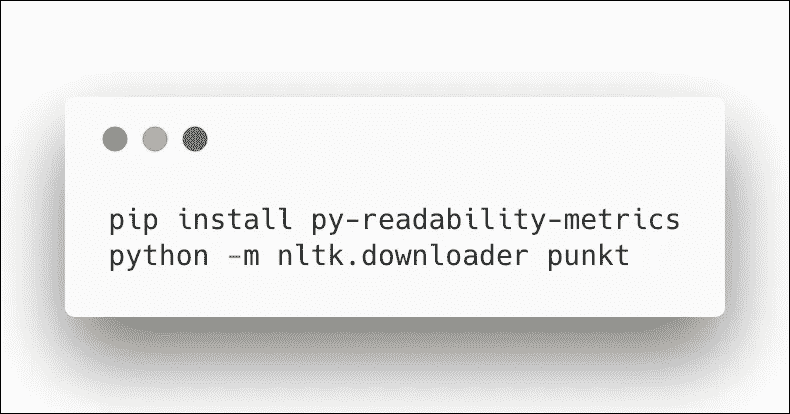
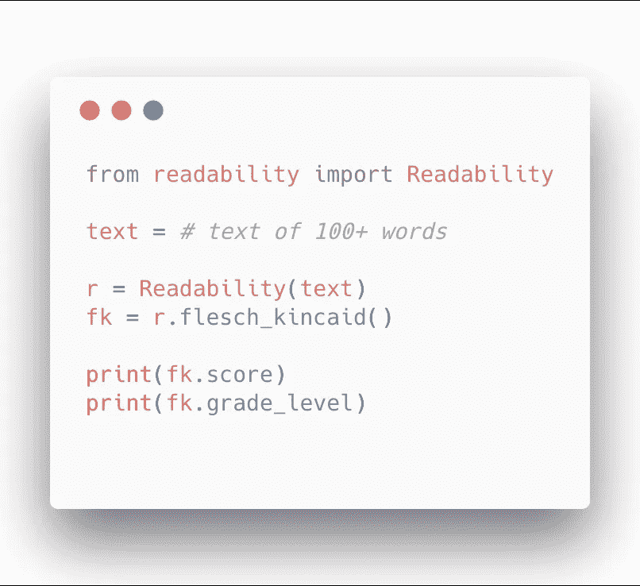
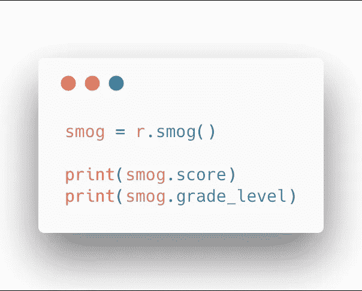

# 用 Python 确定文本的“可读性”

> 原文：<https://levelup.gitconnected.com/determine-the-reading-level-of-a-text-with-python-d2f9dccee6bf>

> 乔治·克拉尔(1963)将可读性定义为“因写作风格而易于理解或领会。”

可读性，虽然有点主观，但从 20 世纪 20 年代开始就已经是一个很好的研究课题了。从那时起，研究人员已经精心制作了许多可读性公式，试图准确地识别文本的可读性。

可读性指标有许多用途。一个作家可能会使用这些指标来客观地评估他作品的复杂性，以确定他的作品是否适合他的目标读者。教育软件公司可能会使用可读性指标来为学生推荐适合他们水平的内容。

目前，我致力于后者。因此，我编写了一个 Python 包， [py-readability-metrics](https://github.com/cdimascio/py-readability-metrics) ，它使用各种当今最流行的可读性指标来评估给定文本的可读性。其中包括:

*   弗莱施·金凯等级水平
*   轻松阅读
*   戴尔·查尔可读性
*   自动化可读性索引
*   科尔曼利奥指数
*   喷射雾
*   烟雾
*   线性写入

给定一篇课文，上述每一个指标都计算出一个表示课文难度的分数。通常，分数被映射到一个等级级别，例如..幼儿园，一年级，…，直到大学毕业。

[py-readability-metrics](https://github.com/cdimascio/py-readability-metrics) 实现上述公式并计算它们的分数。此外，它使人们能够通过报告其等级映射轻松解释每个分数。例如,“Flesch Reading Ease”得分为 80 表示该文本是以 6 年级阅读水平编写的。6.4 的“弗莱施-金凯等级水平”分数也表明 6 年级的阅读水平。

# **让我们看几个例子**

要安装软件包，请使用 *pip* :

*   *pip 安装 py-可读性-度量*安装模块
*   *python-m nltk . downloader*安装标点模块

现在我们已经安装了模块，让我们看看如何使用 ***弗莱什金凯等级级别*** 度量来评估文本

而现在，用同样的文字评估，用的是 ***雾霾指数***

py-readability-metrics 提供了一个简单的 api，使开发者能够使用各种流行的度量标准轻松评估给定文本的可读性。

如果你喜欢这个项目，就在 GitHub 上开始吧！

 [## 学习 Python -最佳 Python 教程(2019) | gitconnected

### 77 大 Python 教程。课程由开发者提交并投票，让你找到最好的 Python…

gitconnected.com](https://gitconnected.com/learn/python)