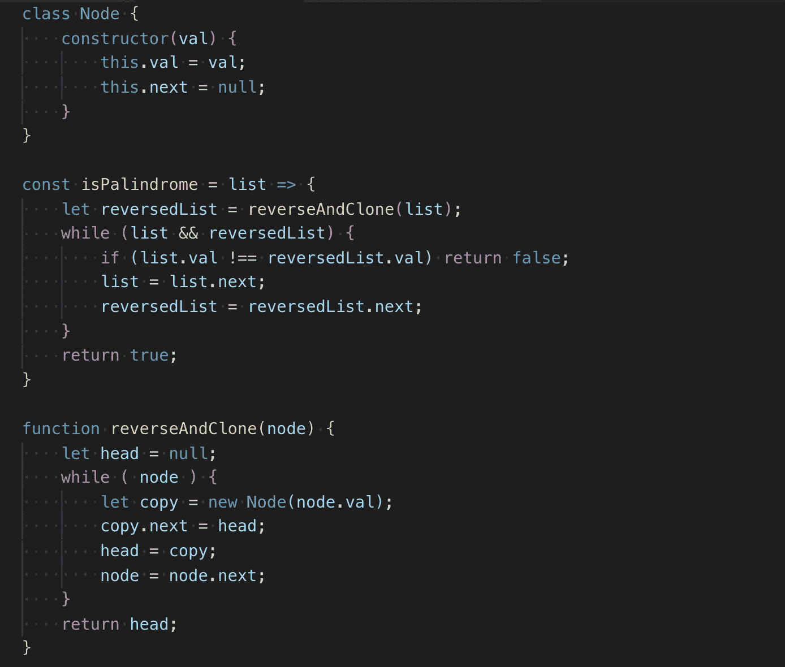
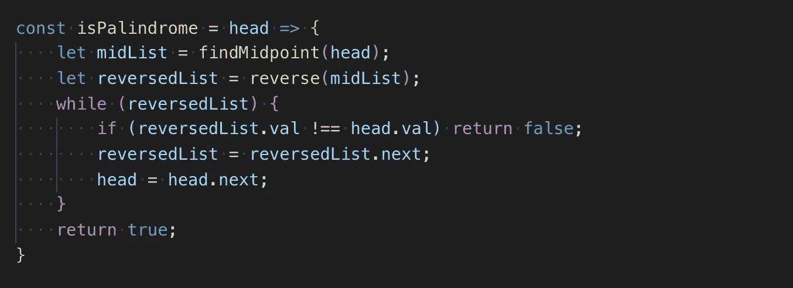
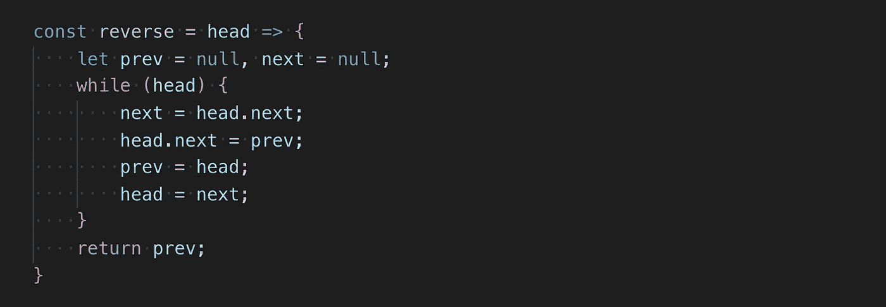
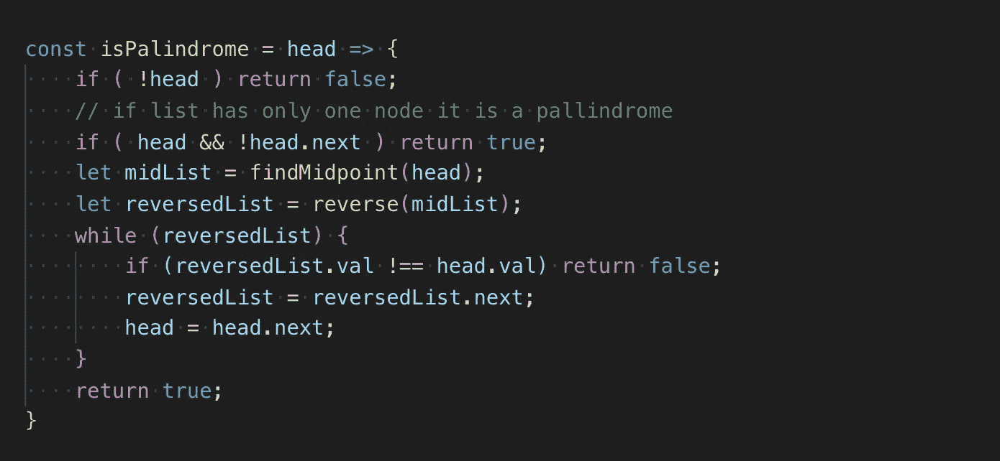

# 判断一个链表是否是回文

> 原文：<https://levelup.gitconnected.com/determining-if-a-linked-list-is-a-palindrome-899616714f5e>

被劫持

 [## 回文链表- LeetCode

### 提高你的编码技能，迅速找到工作。这是扩展你的知识和做好准备的最好地方…

leetcode.com](https://leetcode.com/problems/palindrome-linked-list/) 

Leetcode 的回文链表问题(#234)是一个很大的问题，因为达成一个解决方案综合了链表算法中几种常用的模式。在这个问题中，我们要确定一个单链表是否是一个回文。类似于字符串，回文链表中的节点值等于它的逆序节点值。然而与字符串不同的是，我们不能仅仅创建一个反向版本并与原始输入进行比较，因为链表不像字符串那样是原始数据类型。对于链表，我们必须通过遍历链表并比较每次迭代的值来比较反向链表和原始链表。如果它们中的任何一个值在迭代中不相等，那么链表就不是回文。

这里有一个解决方案。

在上面的解决方案中，我们首先在 reverseAndClone 中创建一个链表的反向副本，使用 Node 类构造函数在原始列表的每次迭代中创建节点实例，并执行一个看起来有点复杂的反向操作，我将在下面详细介绍。假设我们有一个这样的链表。

在第一次迭代中，我们用 list1 的第一个节点的值 1 创建一个新节点。我们的节点目前看起来是这样的: **copy = { val: 1，next: null }** 。现在，我们将副本的指针设置为 head，它当前为空。然后，我们设置头部等于我们的副本。现在，head 等于 **{ val: 1，next: null }** 。然后我们将节点设置为最后的下一个节点。在第二次迭代中，我们将 copy 设置为保存 list1 的第二个节点值 2 的节点。然后，我们将副本的指针设置为 head，它当前等于 **{ val: 1，next: null }** ，随后将 head 设置为副本。现在，head 等于 **{ val: 2，next: val: 1，next: null }** 。然后，将 node 设置为列表中的下一个节点。我希望你能明白接下来会发生什么。:)迭代运行后，我们返回 head 变量，它现在保存了原始链表的反向副本。

在 isPalindrome 中，运行 reverseAndClone 函数后，我们希望在 while 循环中遍历原始列表和反转列表。只要原始列表的当前节点的值等于反向列表节点的值，我们就迭代，直到我们的一个链表是 falsy。如果其中一个列表的节点值不等于另一个列表的节点值，我们将通过返回 false 来中断循环。如果一切顺利，我们将从循环的另一端出来，返回 true。我们的 list1 示例将产生 true 这是一个回文！

上面是一个很好的解决方案，时间复杂度和空间复杂度都是 O(N)。然而，我知道我们可以做得更好。假设我们取回文字符串，" racecar "。如果我们从开始到(包括)其中点(“race”)切割字符串，然后从其中点到结束(“ecar”)切割字符串，然后反转(“race”)，我们会注意到两者是相同的。将一个回文在其中点拆分，比较原来的前半部分和反转后的后半部分，应该是镜像吧！我们可以对链表使用相同的逻辑，并将空间复杂度降低一半！

如果我们将这个新想法伪代码化，它看起来会像这样:

1.)找到链表的中点。

2.)在链表的中点反转链表

3.)通过查看每个值来比较从其头部开始的原始列表和从中点开始的反转列表，以查看它们是否相等

我觉得把步骤分成不同的功能看起来最好。

我们在函数中做的第一件事是找到链表的中点。在链表问题中普遍需要找到链表的中点，所以理解它是一个很大的功能。

在 findMidpoint 中，我们定义了两个名为 fast 和 slow 的变量，并将它们设置为 head。然后我们迭代，只要 fast 是真的，fast 的指针是真的。我们恰当命名的 fast 变量在每次迭代中被设置为下一个节点的下一个节点，而 slow 被设置为该节点的下一个值。绕了一圈后，我们慢慢返回。这一开始可能会有点混乱，所以让我们试着用旧的 list1 调用 findMidpoint 一步一步地完成它。

我们首先将 fast 和 slow 设置为 list1。然后我们进入 while 循环。第一次迭代时，fast 设置为 fast.next.next，所以 fast 的头节点值为 3。而 slow 就变成了 slow .接下来，so slow 的头值是 2。在第二次迭代中，fast 的头部值变为 1，slow 的头部值为 3。因为没有 fast .接下来我们跳出循环返回 slow，slow 在链表的中点:slow 是 **{ val: 3，next: { val: 2，next: { val 1，next:null } }**。

现在我们的列表从中点开始，我们想要反转它。反转链表是链表问题中另一种常用的方法，所以理解其中的逻辑真的很有帮助。

反过来，我们做的第一件事就是把 prep 和 next 赋值给 null。然后我们遍历我们的大脑。在迭代的第一行，我们的下一个变量被设置为 head 中的下一个节点。我们这样做是因为在下一步中，我们要将 head 指向 prev，它目前为空，我们不想丢失原始列表的节点。否则我们没有什么可迭代的。然后我们将 prep 设置为 head，然后将 head 设置为 next，它保存 head 的下一个节点的原始版本。最后，我们返回 prev，它保存传入列表的反向版本。

在下一步中，我们想在从中间开始的反向链表长度上迭代原始列表，并比较每次迭代的值。如果它们在每次迭代中相等，就证明了链表是一个回文。让我们在 isPalindrome 函数中添加几个条件，进一步优化它。

在第一个 if 语句中，我们基本上是在检查我们是否收到了良好的输入。如果传入 isPalindrome 的值是假的(可能是一个空的链表)，只需返回 false。在第二个 if 语句中，我们检查链表是否只由一个节点组成。如果是，那么我们知道它的值颠倒了将是相同的，所以只是返回真，而不是执行下面的 isPalindrome 的复杂逻辑。:)

 [## 编码面试问题|熟练。开发

### 一个完整的平台，在那里我教你所有你需要的东西来找到你的下一份工作和技巧…

熟练的. dev](https://skilled.dev)