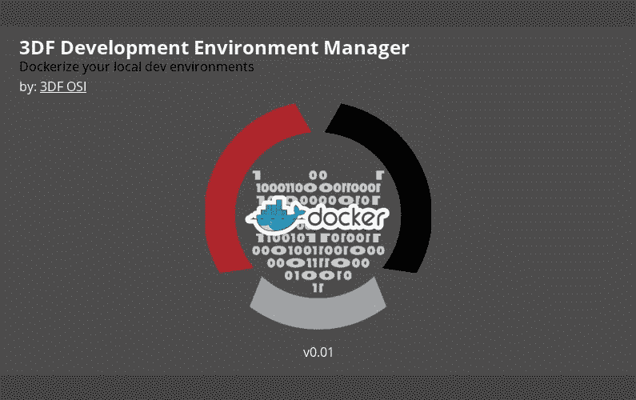
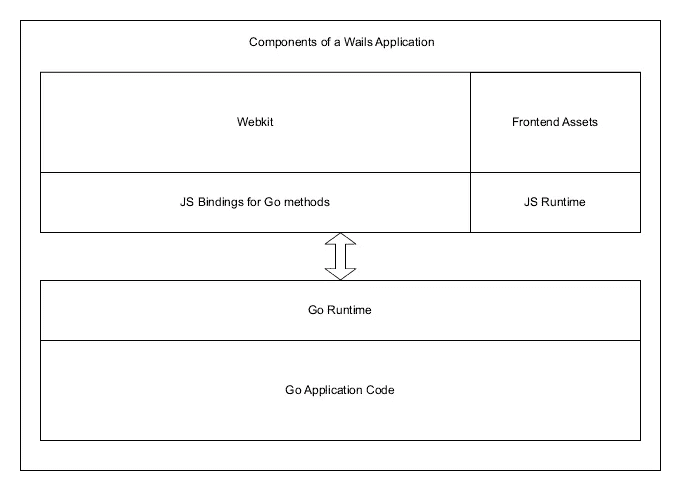
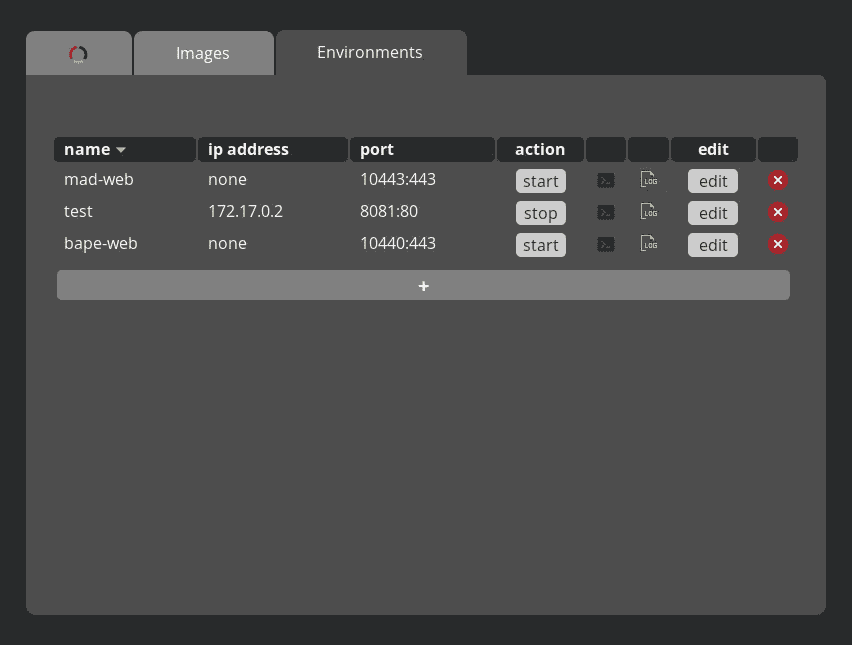

# 开发环境管理 GUI

> 原文：<https://levelup.gitconnected.com/dev-environment-management-gui-a2a0753bef19>

## 图形化管理归档的本地开发环境

3DF 开发环境管理器(DEM)是一个开源的轻量级桌面应用程序，它通过图形用户界面(GUI)接受简单的用户输入，以自动管理 docker 容器作为本地软件开发环境。这是一个实验项目，旨在测试使用[walls](https://wails.io)作为开发跨平台桌面应用程序的快捷方式。

如果你只是想了解更多关于这个应用的信息，请随意跳过这篇文章的**背景**部分。

## 背景:

我经常被客户要求做一些小的桌面图形工具，以避免让终端用户或不太懂技术的员工使用终端。这些年来，这非常痛苦，尤其是当我需要在 Windows、Mac 和 Linux 上进行跨平台开发的时候。直到我发现了[go-as electron](https://github.com/asticode/go-astilectron)，我用它做了 [InstaCrypt](https://instacrypt.io) 的桌面应用。它允许我做 HTML/CSS/JS 的前端和后端。然而，框架本身并不完美，但主要是因为我并不是最喜欢 [electron](https://electronjs.org) 及其工作方式，而不是 [asticode](https://github.com/asticode) 的工作。事实上，我是 asticode 的粉丝，go-as electron 确实让我从过去的痛苦中解脱出来，但是我跑题了。

大约两周前，我不知道为什么我没有更早发现这个，我发现了[哀号](https://wails.io)。这就是 go-as electron 的一切，但更轻便，更快，在我看来，更好。也许最值得注意的细节之一是前端和后端之间的交互要简单得多。

城墙建筑—[https://e6e38fbd.wails-website.pages.dev/docs/howdoesitwork](https://e6e38fbd.wails-website.pages.dev/docs/howdoesitwork)

另一方面，作为我最近几年工作的一部分，我还必须自己建立简单的网站或快速修复更复杂的 web 应用程序，这需要我有许多不同的本地开发环境。所以 Docker 自然是我的首选解决方案。然而，尽管如此，如果在 repo 中已经有 docker-compose 文件是一回事，但是当您得到一个没有预先定义的本地 dev env 的 repo 时就是另一回事了。因此，我最终建立了自己的图像，然后在终端中启动它们。然后，我编写一些脚本或 docker-compose 文件，以便我的队友可以更容易地构建他们自己的环境。这对我来说很有用，因为我实际上生活在终端中，但是正如大多数人所知道的，即使是一些最好的开发人员也讨厌通过 CLI 处理设置，而只想继续进行实际的工作。此外，即使是像我这样生活在终端中的人，也经常会因为一个错误输入的标志而弄乱 docker 命令，或者在需要的设置就绪之前多次重复 docker-compose 文件。然而，大多数基于 web 的 GUI 管理应用对于本地开发环境用例来说太重或太复杂，并且面向服务器而不是本地开发工作站。因此，我认为制作一个简单而轻量级的实用程序将是一个伟大的项目，让 Wails 物有所值。因此，3DF 开发环境管理器(DEM)应运而生。

## 应用:

正如开头提到的，DEM 是一个开源的轻量级桌面应用程序，它通过 GUI 接受简单的用户输入，以自动管理 docker 容器作为本地软件开发环境。

功能包括:

*   在 DB (JSON 平面文件)中添加/编辑/删除图像，用于命令构建
*   添加/编辑/删除容器(环境)
*   启动/停止现有容器(环境)
*   一键访问容器 CLI
*   一键访问跟踪记录日志

您可以在下面看到该应用程序如何工作的演示:

虽然这个工具可以让新用户更容易地管理/使用 docker，但它目前的状态只适合已经非常了解 docker 的用户。在它被认为是一个适合新用户的生产就绪工具之前，还需要做一些输入验证和错误处理的工作。

除了用户输入验证和错误处理，如果有足够的时间，我还想在未来实现一个额外的选项卡来处理 docker 网络。

最后，我不是一个 UI/图形的家伙，所以 UI 只是放在一起实用。我确信它可以做得更“漂亮”。因此，我愿意接受公关要求，这将使事情更加视觉愉悦。；)

## 要了解更多信息，请查看 Github 上的回购:

 [## GitHub - 3dfosi/dem:一个跨平台的 GUI 工具，用于管理本地的 dockerized 开发…

### 一个跨平台的 GUI 实用程序，它管理用…

github.com](https://github.com/3dfosi/dem)