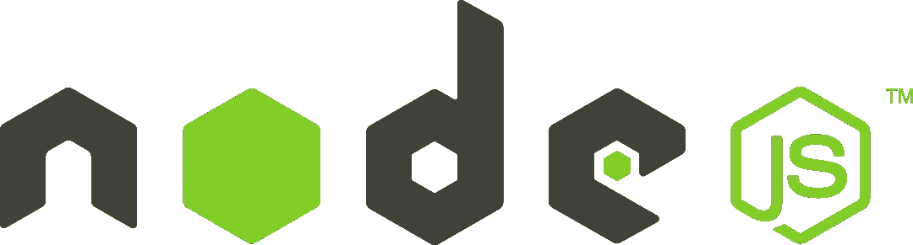

# 关于 JavaScript 运行时应该知道的一切

> 原文：<https://levelup.gitconnected.com/dev-explainer-javascript-runtimes-8e4d1e3af405>

作者图片

JavaScript 可能是有史以来最有影响力的编程语言之一(不管是好是坏)——它可以在几乎所有现代网络浏览器中运行，不管是什么操作系统。无论你是在 MacOS、Windows 还是 Linux 上使用 Safari、Chrome 还是 Firefox，JavaScript 都会在后台运行(除非你禁用它)。

然而，JavaScript(参见 [ECMAScript](https://www.ecma-international.org/publications-and-standards/standards/ecma-262/) )只是一种编程语言:一种计算机应该如何解释 ASCII 字符序列的抽象规范。为了实际执行 JavaScript 代码，你需要一个名为*运行时*(又名*引擎*)的程序。每个现代的网络浏览器都捆绑了一个 JavaScript 运行时。Chrome 用的是 V8 引擎，Firefox 用的是 SpiderMonkey，Safari 用的是 WebKit/JavaScriptCore。

最近，出现了在 web 浏览器之外执行 Javascript 代码的趋势。现在有多个 JavaScript 运行时被设计为在“服务器端”执行 JavaScript(也称为独立程序，类似于 Python 或 Java 等其他编程语言)。在本文中，我将简要介绍 JavaScript 运行时的当前状态及其各种优缺点。

# 浏览器运行时(V8、SpiderMonkey、Webkit 等)

我将所有这些都打包到本节中，因为它们并不是本文的重点。虽然这些引擎*可以独立使用*，但它们的主要目的是嵌入到另一个应用程序中。它们支持您最喜欢的 web 浏览器，以及我将在下面讨论的其他运行时。但是，您通常不会使用它们，比如说，通过命令行在本地运行 web 服务器。

# NodeJS

2015 年 NodeJS 标志，取自维基共享

目前最流行的服务器端 JS 运行时是 [NodeJS](https://nodejs.org/) ，基于 V8。NodeJS 广泛用于开发 web 服务器、web apps、API 等。NodeJS 使用 [npm](https://www.npmjs.com/) 包管理器，它拥有数百万个现成的库，几乎可以满足你所能想象到的所有用例。

NodeJS 本身有很多特性——它的事件循环支持异步编程；它是跨平台的；其标准库支持网络请求、与操作系统/文件系统接口、使用 REPL/TTY 等。

然而，你通常会看到 NodeJS 与非常流行的库一起使用，例如 [React](https://reactjs.org/) 、 [Express](https://expressjs.com/) 、 [Lodash](https://lodash.com/) 、 [Axios](https://github.com/axios/axios) 等。这些库为互联网提供了很大一部分动力，你会发现一个接一个的教程解释如何使用它们。

然而，NodeJS 也不是没有问题。如此庞大的生态系统，碎片化和安全问题肯定会出现。

为了使用基于 NodeJS 的框架部署网站或应用程序，您需要使用*捆绑器*将所有代码打包在一起。你必须在[汇总](https://rollupjs.org/guide/en/)、[包裹](https://parceljs.org/)、[网络包](https://webpack.js.org/)、 [esbuild](https://esbuild.github.io/) 、 [vite](https://vitejs.dev/) 、 [snowpack](https://www.snowpack.dev/) 等之间做出选择。如果你陷入配置地狱，太糟糕了！您应该使用`npx xxx-create-app`来为您生成所有的配置文件。对于一个新的开发人员来说，弄清楚所有这些工具之间的区别并选择正确的选项是非常令人困惑的。

对于 NodeJS 来说，处理依赖关系也是一件痛苦的事情。众所周知，运行一个`npm install`会带来数百个包，社区中一个常见的抱怨是`node_modules`文件夹太大，它存储了一个项目所有下载的依赖项。

此外，还有一些潜在的安全问题，您必须妥善处理。恶意行为者可以将一个恶意软件设计为 npm 包，然后将其偷偷放入某个包的依赖列表中，该包依赖于某个包，而该包又依赖于某个包，该包又依赖于 React 等流行库。如果一个包被移除，如此深的依赖链也会导致问题——还记得移除[左填充](https://qz.com/646467/how-one-programmer-broke-the-internet-by-deleting-a-tiny-piece-of-code/)导致互联网暂时中断吗？

这些问题中的一些可以通过诸如[纱线](https://yarnpkg.com/)、[精梳机](https://bower.io/)或 [pnpm](https://pnpm.io/) 的替代品来缓解。但是，npm 仍然是标准，现在每个 JS 库都有 5 个不同的安装命令(当然我是夸大了，但是看这个[例子](https://github.com/axios/axios#installing)和这个[相关的 XKCD](https://xkcd.com/927/) )。

但同样，NodeJS 的受欢迎程度是不可低估的。它最好的资产是它庞大的生态系统，你会发现 NodeJS 提供了你创建下一个伟大的 web 应用所需的一切。

# 德诺

Deno 标志，取自维基共享资源

NodeJS 是多年来的标准，但是现在， [Deno](https://deno.land/) 是这个街区的新成员。Deno 于 2018 年发布，是 NodeJS 的更现代版本。事实上，Deno 和 NodeJS 拥有同一个创造者:瑞安·达尔(Ryan Dahl)。另外，两个运行时都是基于 V8 引擎的(虽然 Deno 是用 [Rust](https://www.rust-lang.org/) 写的，而 NodeJS 用的是 C++)。

Deno 的编写是为了解决 NodeJS 的各种缺点，从安全性到可用性。Deno 是“默认安全的”——如果 Deno 代码需要访问文件系统或发出网络请求，您需要显式地提供许可。此外，Deno 是作为一个一体化的可执行文件发布的，它提供了一流的类型脚本支持，用`deno {lint,fmt}`进行林挺/格式化，用`deno bundle`进行捆绑，用`deno test`进行测试运行，等等。

Deno 处理依赖关系的方式也与 NodeJS 完全不同。远程依赖项直接从 URL 导入。比如可以用`import * as oak from "https://deno.land/x/oak@v10.6.0/mod.ts";`导入 [oak](https://deno.land/x/oak@v10.6.0/mod.ts) ，一个 HTTP 框架。Deno 然后将处理依赖关系管理——它将下载包并在本地缓存它们。一种常见的模式是使用单个`deps.ts`文件来导入远程库，并在本地重新导出它们以供其他 JavaScript 或 TypeScript 文件使用。

总的来说，Deno 生态系统要比 NodeJS 小很多。Node 有一个实验性的兼容模式(见这里的)，但是它并不是 100%的时候都能工作。另一方面，Deno 有自己的一系列新的有趣的 web 库，如 [fresh](https://fresh.deno.dev/) (一个全栈 web 框架) [oak](https://deno.land/x/oak@v10.6.0/mod.ts) (一个 HTTP 路由器)，以及 [ultra](https://github.com/exhibitionist-digital/ultra) (一个流 SSR 框架)。此外，像 [Lodash](https://deno.land/x/lodash@4.17.19) 、 [day.js](https://deno.land/x/dayjs@v1.11.5) 和 [xstate](https://deno.land/x/xstate@xstate%404.33.1) 这样的流行节点库都是由 Deno 支持的，托管在`deno.land/x`上。更不用说，Deno 有一套经过审核的标准模块，涵盖了许多使用案例，包括操作系统/文件系统交互、I/O、网络请求、加密等。

关于生态系统的话题，Deno 官方提供的一个不可忽视的独特 web 服务是 [Deno Deploy](https://deno.com/deploy) 。Deno Deploy 允许您在全球范围内部署 Deno 代码——考虑通用的无服务器功能(例如 AWS Lambda 或 Google Cloud 功能)。Deno Deploy 可以用来托管网站、代理 API 服务、处理表单/POST 请求等等。目前，Deno Deploy 有一个免费的产品，支持每天 100，000 个请求和每月 100 GiB 的数据传输(本文没有赞助，我只是觉得这真的很酷)。

虽然 Deno 还没有杀死 NodeJS(可能永远也不会)，但它是一个很好的替代品，已经被 Slack、Netlify 和 Github 等公司使用。如果你没有义务使用 NodeJS，我肯定会在你的下一个项目中尝试 Deno。

# 小圆面包

Bun 标志，取自 Bun 的 Github 项目页面

如果 Deno 是这个街区的新成员，Bun 就是这个街区更新的成员。它由贾里德·萨姆纳(Jarred Sumner)于 2021 年底发布，并立即在网上掀起波澜。Bun 的主要产品是它的速度——它声称启动速度比 NodeJS 快 4 倍，在各种情况下运行 JavaScript 比 NodeJS/Deno 快 2 到 3 倍。

这怎么可能呢？嗯，Bun 是用 [Zig](https://ziglang.org/) 编写的，这是一种低级的 C 语言替代，它从一开始就针对速度进行了优化——它的大部分代码都是从头开始编写的。它使用 JavaScriptCore 作为后端 JS 引擎。

除了性能，Bun 标榜的是很棒的可用性，就像 Deno 一样。Bun 由一个可执行文件组成，它包括一个 TypeScript transpiler、内置 bundler、task runner 和 package manager，所有这些都比它们的 NodeJS 等价物更快。

Bun 使用与 NodeJS 相同的模块解析算法，这使得它与 npm 兼容。它还实现了 Node 的大部分 API，这允许它与本机节点模块一起工作。总的来说，Bun 的目标是用一个快速、易用的包来代替与 NodeJS 相关的打包程序、传输程序和包管理程序。

Bun 出现的时间不长，我们只能等着看它是否会在现代 JS 生态系统中站稳脚跟。不过，基于它的速度和 NodeJS 兼容性，似乎 Bun 会有一个光明的未来。

# 各种嵌入式 JS 运行时

令人惊讶的是，JS 也被用在微控制器等嵌入式设备上。出现了一些可嵌入的运行时，它们都在极端的 CPU 和内存使用要求下执行 JavaScript 代码。

*   [Duk tape](https://github.com/svaarala/duktape)——专注于可移植性和紧凑尺寸的嵌入式 Javascript 引擎
*   [Elk](https://github.com/cesanta/elk)——一个用于嵌入式系统的低占用空间的 JavaScript 引擎
*   Espruino —一个用于微控制器的 JavaScript 解释器，只有 128kB 闪存和 8kB RAM。

# 接下来呢？

JavaScript/TypeScript 运行时生态系统似乎仍在发展。成千上万的工时被用来提高 JavaScript 的速度，然而 Bun 表明仍有很大的改进潜力。同时，Deno 正在展示可用性和简单性在现代开发工具中的重要性。我期待看到 JavaScript 的前景在未来会如何继续变化。

Edit (8/15/22): Deno just [宣布](https://deno.com/blog/changes)他们正在努力提高 npm 兼容性，他们的目标是“让 Deno 成为最快的 JavaScript 运行时”。这可能是他们对 Bun 的反应吗？我很期待看到事情的发展。

# 分级编码

感谢您成为我们社区的一员！在你离开之前:

*   👏为故事鼓掌，跟着作者走👉
*   📰查看[级编码出版物](https://levelup.gitconnected.com/?utm_source=pub&utm_medium=post)中的更多内容
*   🔔关注我们:[推特](https://twitter.com/gitconnected) | [LinkedIn](https://www.linkedin.com/company/gitconnected) | [时事通讯](https://newsletter.levelup.dev)

🚀👉 [**加入升级人才集体，找到一份惊艳的工作**](https://jobs.levelup.dev/talent/welcome?referral=true)