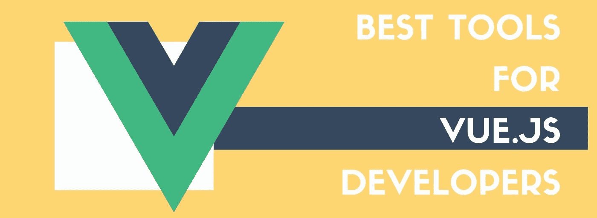

# Vue.js 开发的顶级工具

> 原文：<https://levelup.gitconnected.com/dev-tips-top-tools-for-vue-js-development-7cf2f71137fe>

Vue.js 是一个渐进式的 JavaScript 框架，使 web 开发人员能够以优雅高效的方式创建 ui。最近，它开始吸引越来越多的 web 开发社区的关注。

这并不是没有原因的——Vue 最突出的[特性之一是*平滑的学习曲线*、*简洁的编程风格、*和*高性能*，这是由于在渲染期间自动跟踪组件的依赖关系。此外，它的核心概念是有据可查的。](https://www.webdatarocks.com/blog/what-vue-is-all-about/)

随着 Vue.js 社区规模的增长，它的开发工具生态系统也在增长。让我们更详细地探索它的最佳代表。

# Vue CLI

[Vue CLI](https://cli.vuejs.org/) 是快速 Vue.js 开发的标准实用程序。它为您的 Vue 应用程序提供对构建工具的访问，并确保它们能够顺畅地协同工作，让您能够完全专注于将您的想法融入代码，而不是配置应用程序。

Vue CLI 灵活的插件系统支持 Babel、TypeScript、ESLint、PostCSS、PWA、Jest、Mocha、Cypress 和 Nightwatch。另外，由于这个系统，开发者可以与社区共享他们的插件。

对我来说，最重要的是你可以利用各种配置和定制选项来满足你的项目的特定需求。

另一个你会喜欢的东西是 Vue CLI 强大的 GUI，它使得创建、配置和管理项目变得更加容易。此外，Vue CLI 对**单元**和**端到端测试**有现成的支持。

# 故事书

[Storybook](https://storybook.js.org/) 是一个用于开发、管理和测试 UI 组件的开源环境。通过灵活的 API 无缝配置组件使其成为高效构建 ui 的必备工具。

使用 Storybook，您可以创建令人惊叹的组件，并在隔离的环境中演示它们。由于它运行在你的应用程序之外，你不需要担心你的应用程序的依赖和具体要求。

如果你想为故事书实现额外的功能，你可以试试[插件](https://storybook.js.org/docs/addons/introduction/)功能。

# 使虚弱

Vuetify 是一个组件框架，提供了广泛的令人惊叹的 UI 组件。所有组件都遵循材料设计原则。您可以使用这个框架来构建移动的、服务器端呈现的、单页的和渐进式的 web 应用程序，以及常规的 HTML 页面。

为了熟悉 Vuetify 提供的一切，[浏览](https://vuetifyjs.com/en/components/api-explorer)组件，挑选你最喜欢的，并在你的应用程序中亲自体验它们。尝试一个[预制的布局](https://vuetifyjs.com/en/getting-started/pre-made-layouts)，设计你自己的主题或者用[颜色](https://vuetifyjs.com/en/styles/colors)、[间距](https://vuetifyjs.com/en/styles/spacing)、[排版](https://vuetifyjs.com/en/styles/typography)等等来设计你的组件。

我想强调的另一个方面是它丰富的生态系统，包括一个[主题生成器](https://theme-generator.vuetifyjs.com/)、 [vuetify-loader](https://github.com/vuetifyjs/vuetify-loader) 、[认知模块](https://cognito.vuetifyjs.com)和其他工具。此外，这些组件都有很好的文档记录，并附有很好的示例。

在我看来，这个框架可以满足任何项目的需求。此外，您可以仅选择特定组件在您的应用中使用。这种方法通过使应用程序更加轻量级，允许您控制应用程序的大小。

# VuePress

[VuePress](https://vuepress.vuejs.org/) 是一个静态站点生成器工具。它提供博客功能和一个插件系统。您可以构建自定义主题并使用现成的社区主题。

让我来分解一下它的工作本质。使用 Markdown 语法编写完网站内容后，VuePress 会将其转换为静态 HTML 文件。一旦加载了这些文件，您的网站就会作为一个由 Vue、Vue 路由器和 Webpack 支持的单页应用程序(SPA)运行。

这种方法的主要优点是您可以在 Markdown 文件中包含 Vue 代码或组件。这就是为什么开发出来是灵活的，你可以创建一个像普通 Vue 应用程序一样的网站。

# VueX

VueX 是一个针对 Vue 应用的状态管理系统。您可以将它用作应用程序组件的集中存储，并定义规则来确保状态仅以可预测的方式发生变化。

让我们仔细看看 VueX 的**结构部件**:

*   **状态** —包含应用程序状态的对象
*   **getters** —提供用于访问状态的方法的对象。它们就像商店的计算属性。
*   **突变** —提供影响状态的方法的对象。突变可能会提醒您事件，因为一个突变有一个字符串**类型**和一个**处理程序**——一个我们修改实际状态的函数。
*   **动作** —提供触发**突变**和运行异步操作的方法的对象。

此外，值得一提的是**模块**是 VueX 不可或缺的一部分。当你的应用程序*开始扩展*时，模块可能会派上用场。将你的代码组织成模块是一个很好的实践，将**商店**分成单独的部分，从而简化它的维护。每个模块都有自己的状态、突变、动作和 getters。

其他你可能喜欢的很酷的内置特性有**热重装突变**、**模块**、**动作**和**开发期间的 getters** 。

在我看来，VueX 完美地处理了共享状态管理。但是如果您的应用程序像单页应用程序一样简单，那么您很可能不需要 Vuex。如果您正在构建一个**中型或大型**单页面应用程序，并且面临处理 Vue 组件之外的状态的问题，那么您应该使用它。

# Nuxt

Nuxt 是另一个基于 Vue 的渐进式框架，用于构建现代 web 应用程序。在 Nuxt 的引擎盖下，有 vue 官方库(Vue、vue-router 和 vuex)和 web 开发工具(如 webpack、PostCSS 和 Babel)正在使用。

使用 Nuxt，您可以构建各种类型的 Vue 应用程序——从静态登录页面到复杂的企业级应用程序。它有一个模块化的生态系统，使您能够轻松地连接 REST 和 GraphQL 端点。

其他内置功能包括**服务器端渲染**，**自动代码分割**， **ES2015+ transpilation** ，**具有异步数据的强大路由系统**等等。

在我看来，Nuxt 最好的一点是，它通过提供使应用结构化和优化的功能，让你增强开发体验。

为了更好地了解如何使用 Nuxt.js，请深入研究[示例](https://nuxtjs.org/examples)并探索其 [API](https://nuxtjs.org/api) 。

如果你想为它的发展做出贡献，欢迎你在它的 [GitHub](https://github.com/nuxt/nuxt.js) 上发表。

# 网格体

[Gridsome](https://gridsome.org) 是一个现代框架，用于构建**快速**和**安全的网站**，可以部署到任何静态 web 主机或 CDN (Netflify、亚马逊 S3 等)。虽然它相对较新(2018 年发布)，但 Vue 开发者中已经有很多采用者和追随者。它的创建者受到 Gatsby . js(React 的一个站点生成器)的启发。这个灵感导致了为 Vue.js 构建一个类似的框架。

让我解释一下它是如何工作的。Gridsome 根据您在应用程序中提供的数据源生成 SEO 友好的 HTML 文件。数据源可以是任何——Markdown、CSV、Yaml、JSON、WordPress、Drupal(任何其他 CMS)、MongoDB、Airtable 等。在加载内容之后，它变成了一个单一的 **GraphQL 数据层**，用于集中式数据管理。现在您可以使用 extract 这个数据，并使用它来构建和部署您的 Vue 应用程序。

连接到应用程序的所有数据源使用通用的 GraphQL 层是 Gridsome 如此独特的原因。由于这个原因，数据管理被大大简化了，因为 GraphQL 层充当了集中存储，可以被任何页面或组件使用。

我想提到的另一个方面是 Gridsome 的插件生态系统。您可以利用开发人员社区开发的各种插件，甚至可以创建自己的插件。

其他开箱即用的特性有**自动代码分解**、**静态文件生成**、**动态**和**基于文件的路由**、**热重装**等。我建议花时间探索框架的所有其他[特性。](https://gridsome.org/docs/)

此外，它不仅是免费的，而且是开源的。任何对项目的贡献都是非常受欢迎的，因为这是一个由两位 Vue 爱好者创建和维护的年轻项目。

# 💡了解更多信息

如果你正在寻找方法来提高你的 VueJS 编码技能并加深其特定概念的知识，我们建议你探索[git connected](https://gitconnected.com/learn/vue-js)——在那里你可以找到大量关于如何用 VueJS 构建应用的教程。

【https://www.webdatarocks.com】最初发表于**。**