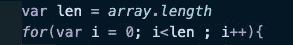

# JavaScript 中无方向虚拟对象的毁灭性动态编程

> 原文：<https://levelup.gitconnected.com/devastatingly-dynamic-programming-for-directionless-dummies-in-javascript-1f1bd128b081>

我也是伦敦政坛的发电机

在疫情大灾难期间，我试图变得更聪明，但我发现了许多令人分心的事情。我已经开始和朋友们一起参加 Zoom 会议和 Google Hangouts。我对乔布斯做过一些电话采访和视频采访。我在布鲁克林区绕着我的滑板车走了很长一段路。我甚至开始学习[角形](https://angular.io/)和[烧瓶](https://medium.com/p/aa0f7b76f235/)。

但是，在这个病毒横行的环境中，除了不要让医院挤满病人和彻底洗手之外，唯一重要的事情是什么呢？找工作。

也就是说理解编程和面试问题。例如，您是否知道在 JS“for”循环中，您可以通过在循环前的变量中定义其长度来增强其性能？这是因为”。长度”实际上是一个在每次迭代中都会被调用的函数！

优化了！

但是也有一些方法可以让昂贵的功能变得更快！我说的是**记忆**和**制表**。如果你有“重叠的子问题和一个最优的子结构”,这些都是可能发生的效果，但是这真的令人困惑！

这里有另一种说法:**如果你正在做一个包括许多较小的相同计算的和或积的计算，你可以存储小计算的结果，这样你就不必一直做它们。**

这里有一些斐波纳契数列[的代码，摘自柯尔特·斯蒂尔在 Udemy](https://www.udemy.com/course/js-algorithms-and-data-structures-masterclass/) 上的算法课程，这就是我如何学习大部分算法的。

我不能撒一个谎…哦，不，不，不。

[斐波那契数列](https://en.wikipedia.org/wiki/Fibonacci_number)非常有趣，在设计和自然中也被用作[“黄金比例”](https://en.wikipedia.org/wiki/Golden_ratio)，但我们在这里不讨论这个！

基本上，**斐波纳契数列中的每个数字都是数列中后面两个数字的和，第一个和第二个数字都是 1** 。

这就是你所需要知道的，希望这在上面的代码中是显而易见的，除了它使用了**，这是你应该检查的，因为它在面试问题中也非常常见**

**那么问题出在哪里？我们谈完了，对吗？**

**哦，错了。**

****

**归威利所有。**

**如果我们用甚至像“100”这样的正常值来调用上面的函数，会发生什么？根据您的系统或可用内存，它可能会工作，但您也可能会得到一个[“堆栈溢出”](https://en.wikipedia.org/wiki/Stack_overflow)或甚至崩溃您的浏览器！这是因为**递归**导致太多的计算同时发生。**

**其实这个解的[大 o(或者说时间复杂度)](https://medium.com/javascript-in-plain-english/an-intro-to-big-o-in-javascript-a-k-a-dont-mess-up-ur-interview-u-silly-nub-8082005e47c2)就是 O(2^n)，除了不好你不用知道。事实上，它是一个算法或函数在 O(n！)或 n 阶乘。**

**那么我们如何更好地？这个怎么样？**

****

**我们要走了！**

**这是**记忆化**，这很复杂，但基本上意味着**每次我们计算一个新值，我们可能能够用它来计算另一个值，我们保存它并把它传递回我们的函数**。**

**这里我们使用一个数组，但是你也可以使用一个 javascript 对象，顺便说一下，对于另一个 JS 面试问题，几乎所有东西都是 JS 中的一个对象！**

**因此，就像我们已经知道 fib(1)和 fib(2)是-1 一样，我们从每次迭代**中知道先前的值是什么，因为我们已经计算了它们！****

**还有**制表！****

****

**我想已经没有汽水了。**

****制表**存储斐波纳契数列的最后值，**从 0、1 和 2 开始，**在**数组**和**中迭代**继续**改变数组中的值**以跟踪需要累加哪些值来找到数列的下一个数字。**

**这两种解决方案都有很大的时间复杂度，这意味着它们**不会变得** **更加难以计算**，因为需要通过它们计算大量的数据。**

****

**我也是**

**记忆、制表和动态规划是很难的话题。有些我几乎听不懂！但它们也是谷歌等公司为其搜索和地图开发复杂算法的基础，这使他们成为市场领导者。**

**随着所有编程新手继续我们的旅程，我们将继续面临类似这样的难题。我发现的诀窍是休息一下，吃一些不可能的巨无霸，看看可爱狗狗的照片。**

****

**比如拍林戈。**

**这是澳洲牧羊犬林戈/许多其他可爱的狗杂种狗。他喜欢拥抱和抚摸，喜欢在沙发上做你的朋友。他不在乎下雨或炎热。**

**他是你在阿尔戈斯海上的绿洲。**

**白现在来说，**

**网卡**