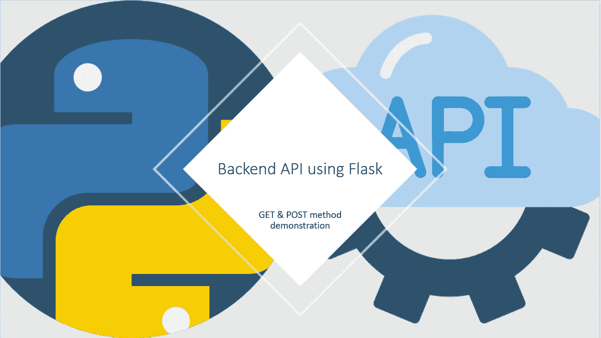

# 后端 API 和 Flask 概述

> 原文：<https://levelup.gitconnected.com/develop-a-backend-api-using-flask-27aade77993f>



lask 是一个轻量级框架，可以用来实现 web 应用程序和后端 API 应用程序。这篇文章之后，我的目标是演示使用 Sqlite 这样的数据库开发后端 API 的简单步骤。

在这里，我们将实现一个完整的后端 API 应用程序，并通过任何 API 工具(如 postman)测试 JSON 请求和响应。

首先，我想告诉所有的读者和程序员，我希望至少对 python 编程语言有一点好的理解，对数据库和 SQL 查询有一点了解。

我想提一下我使用过的必要工具。确保您已经安装了 python/anaconda 并且已经执行了 python 脚本。

1.  任何 IDE，比如 Pycharm，或者如果对编码很熟悉，那么 notepad++也可以。
2.  邮差工具。

现在我们已经准备好开始实施了！但是在开始之前，我想先说明一下这次学习的结果。

我们将创建后端 API，使用 API 将学生详细信息存储到数据库中，GET 和 POST 两种方法都将实现，我们将使用 Postman 工具手动测试我们的 API。

我们正在使用 Flask 框架，所以我们需要用 anaconda 或 PIP 安装它。

>>康达安装-c 蟒蛇烧瓶

> > pip 安装烧瓶

用户可以使用上面的任何命令来安装 python 的 Flask 框架。

现在我们可以开始实现一个后端 API，将简单的学生信息存储到数据库中。

## 第一步:

创建一个项目文件夹，如果使用任何 IDE，然后在那里创建一个项目。

## 第二步:

创建两个 python 文件，分别命名为 ***server_config.py*** 和 ***route_config.py***

> ***注意:*** *我没有遵循任何指南来创建项目文件结构，因此可能会以不同的方式做同样的工作。所有的 python 文件都是为了更好的理解和代码的可重用性而创建的。*


这就是项目结构的样子。

## 第三步:

用 flask python 脚本设置***server _ config . py***和***route _ config . py***。

在***server _ config . py***中设置主机和端口

```
import os
from route_config import *app.debug = True
host = os.environ.get(**'IP'**, **'0.0.0.0'**)
port = int(os.environ.get(**'PORT'**, 8080))
app.run(host=host, port=port)
```

在 route_config.py 中创建应用程序引用

```
from flask import Flask# app reference
app = Flask(__name__)
```

现在您可以运行***server _ config . py***，预期的输出将是。


这表明服务器已经启动并在本地主机上运行

> **注意:**如果未明确定义主机和端口，则默认主机将是 127.0.0.1，端口将是 5000。

## 第四步:

现在我们准备将 GET 和 POST 方法以及一些额外的辅助方法从 flask 添加到***route _ config . py***中。

将以下代码添加到 ***route_config.py***

```
from flask import Flask# app reference
app = Flask(__name__)# This method executes before any API request
@app.before_request
def before_request():
    print(**'before API request'**)# This method returns students 
# list and by default method will be GET
@app.route(**'/api/students'**)
def get_students_list():
    return "Student list[GET]"# This is POST method which stores students details.
@app.route(**'/api/storestudents'**, methods=[**'POST'**])
def store_student_data():
    return "Student list[POST]"# This method executes after every API request.
@app.after_request
def after_request(response):
    return response
```

现在 GET 和 POST API URL 已经准备好用 postman 工具测试 API 请求-响应(postman 工具可以作为 chrome 浏览器的扩展)

> 请阅读帖子了解 postman 工具和 API 测试 [*点击这里*](https://medium.com/aubergine-solutions/api-testing-using-postman-323670c89f6d) *。*我们需要在 postman 工具上设置几个参数来测试 API，详细信息请见我们的中型社区帖子，我发现这对使用 postman 学习 API 测试非常有用。

>>方法> [http://Host:P](http://localhost:8080/api/storestudents) ort/ **方法路由路径。>** 正文:？

> > GET >[http://localhost:8080/**API/students**](http://localhost:8080/api/students)**>**Body:无

>>回应:学生名单[获取]

> > POST >[http://localhost:8080/**API/store students**](http://localhost:8080/api/storestudents)**:**Body:{ }

>>回应:学生名单[帖子]

>>内容类型:应用程序/JSON


这是邮递员工具

到目前为止，我们已经用一个 POST 和一个 GET 方法配置了服务器，现在我们必须配置数据库并创建一个表来执行进一步的任务。

我已经为学生详细解释了数据库和表的创建，请查看([单击此处)](https://medium.com/@narendra147h/sqlite-database-crud-operations-using-python-3774929eb799)为了更加清晰，正如我之前提到的，我们需要对数据库和 SQL 有一点了解。因此，为了从这里进一步理解，我希望您已经理解了数据库术语，并具有使用 python 的 SQL 的基本知识。

## 第五步:

我正在创建一个名为 **StudentDB** 的 Sqlite 数据库，表名为 **StudentTable** 。

数据库模式将如下所示。


现在，在项目根文件夹中创建一个名为“db”的包，并创建两个用于数据库支持的 python 文件，如 ***db_config.py*** 、***db _ creation . py***

***db_config.py*** 用于 API 实现，***db _ creation . py***，是创建数据库表的 python 脚本。

将代码添加到 *db_config.py* 中

```
import sqlite3 as sq
from flask import gDATABASE_DIR = **"C:**\\**SqliteDB**\\**StudentDB"** DB_NAME = **'StudentDB.db'** TABLE_NAME = **'StudentTable'** DATABASE_PATH = DATABASE_DIR + **'**\\**'** + DB_NAME
print(DATABASE_PATH)# The method returns the database instance 
def get_db():
    if **'db'** not in g:
        g.db = sq.connect(DATABASE_PATH, detect_types=sq.PARSE_DECLTYPES)
        g.db.row_factory = sq.Rowreturn g.db
```

在这个文件中，数据库的配置和 DB 实例创建代码是在 route_config()中调用 get_db()方法来实例化数据库的地方编写的。

> **注意:**必须先创建 DATABSE _ DIR，它可以是系统的任何路径。由于我们不部署此代码，所以我们的数据库将存储在系统硬盘驱动器中，对于不同的操作系统它可能会有所不同，也请根据您的操作系统采取相应的行动，如果是 Linux 或 Mac for windows 用户，最好将相同的文件夹结构创建到“C”驱动器中。
> 
> DATABASE _ DIR =**" C:**\ \**SqliteDB**\ \**StudentDB "
> 此路径适用于 windows 用户，Linux 和 Mac 用户请根据您的操作系统将路径替换为有效位置。**


现在的项目结构会是这样的。

## 第六步:

将代码添加到***db _ creation . py***中并运行它。如果没有任何错误，那么数据库文件将在此位置创建到“C”驱动器**C:**\ \**SqliteDB**\ \**StudentDB**中，并位于为 Linux 和 MAC 用户配置的位置。

这完全取决于“数据库路径”，它在 ***db_config.py*** 中被定义为一个变量，所以这个脚本使用相同的路径来创建数据库。

```
import sqlite3 as sq
from db.db_config import *conn = sq.connect(DATABASE_PATH)
cur = conn.cursor()conn.execute(**'CREATE TABLE if not exists '** + TABLE_NAME + **' ('** +
             **'ID TEXT PRIMARY KEY NOT NULL, '
             'NAME TEXT NOT NULL, '
             'RollNo TEXT NOT NULL, ' 
             'Address TEXT NOT NULL, '
             'CLASS TEXT NOT NULL,'
             'DOB TEXT NOT NULL,'
             'gender TEXT NOT NULL'** + **' );'**)conn.commit()
conn.close()
```

> **注意:**我预计人们可能会在创建 python 文件和在硬盘上创建文件夹位置时出错，为了避免这种情况，请创建与我上面提到的相同的文件夹结构，并根据您的操作系统使用数据库文件位置的有效路径。

现在，我们必须返回到***route _ config . py***，然后进一步编辑代码，以扩展 GET 和 POST 方法，通过后端 API 获取和存储学生的详细信息。

## 第七步:

对于 batter 项目代码结构，您必须创建一个名为“api”的包，并在名为***api _ student . py***的“API”包中创建一个 python 文件

这个文件将包含数据库查询的业务逻辑。我已经创建了一个实用程序文件，其中包含可重用的方法，如生成 Json 响应等，因此您需要再创建一个名为 utils 的 python 包，并在其中创建一个 utils python 文件。


这是包含所有 python 源文件的最终项目结构。

> **注意:根据项目结构，项目的最终源代码如下，所以现在一个接一个地将最终代码添加到您的项目文件中。**

**server _ config . py**

```
import os
from route_config import *app.debug = True
host = os.environ.get(**'IP'**, **'0.0.0.0'**)
port = int(os.environ.get(**'PORT'**, 8080))
app.run(host=host, port=port)
```

***route _ config . py***

```
from flask import Flask
from api.api_student import *
from db.db_config import *
# app reference
app = Flask(__name__)# This method executes before any API request
@app.before_request
def before_request():
    g.db = get_db()# This method returns students list
# and by default method will be GET
@app.route(**'/api/students'**)
def get_students_list():
    return get_student()# This is POST method which stores students details.
@app.route(**'/api/storestudents'**, methods=[**'POST'**])
def store_student_data():
    return store_student()# This method executes after every API request.
@app.after_request
def after_request(response):
    return response
```

我在 before request 方法中添加了 **"g.db = get_db()"** 用于在任何 API 请求之前创建 db 实例，

**get_students_list()** 方法是返回学生列表

**store_student_data()** 方法现在将学生的详细信息存储到数据库中，并在响应中返回同一个学生的详细信息。

拥有这个文件的主要动机只是编写路由方法，所以当我们添加任何新的 API 时，我们应该只添加一个新的方法，并且我们应该将业务逻辑存储在不同的文件中。这就是为什么这可以被认为是一个项目的配置文件。

**db/db _ config . py**

```
import sqlite3 as sq
from flask import g
# For windows user Linux and Mac Os required chnage here
DATABASE_DIR = **"C:**\\**SqliteDB**\\**StudentDB"** DB_NAME = **'StudentDB.db'** TABLE_NAME = **'StudentTable'** DATABASE_PATH = DATABASE_DIR + **'**\\**'** + DB_NAME# The method returns the database instance
def get_db():
    if **'db'** not in g:
        g.db = sq.connect(DATABASE_PATH, 
                          detect_types=sq.PARSE_DECLTYPES)
        g.db.row_factory = sq.Rowreturn g.db
```

**db/db _ creation . py**

```
import sqlite3 as sq
from db.db_config import *conn = sq.connect(DATABASE_PATH)
cur = conn.cursor()conn.execute(**'CREATE TABLE if not exists '** + TABLE_NAME + **' ('** +
             **'ID TEXT PRIMARY KEY NOT NULL, '
             'NAME TEXT NOT NULL, '
             'RollNo TEXT NOT NULL, ' 
             'Address TEXT NOT NULL, '
             'CLASS TEXT NOT NULL,'
             'DOB TEXT NOT NULL,'
             'gender TEXT NOT NULL'** + **' );'**)conn.commit()
conn.close()
```

***API/API _ student . py***

```
from flask import request, g
import uuid
from utils.uitils import *# This method is to fetch the students details
def get_student():
    if request.method == **'GET'**:
        data_cursor = g.db.execute(**"SELECT * "
                                   "FROM StudentTable"**)
        data = data_cursor.fetchall()
        user_data = [{**'ID'**: row[0], **'NAME'**: row[1],
                      **'RollNo'**: row[2], **'Address'**: row[3],
                      **'CLASS'**: row[4], **'DOB'**: row[5],
                      **'Gender'**: row[6]} for row in data]
        return success_response(user_data,
                                **"These are the students "
                                "stored into records"**)# This method is to store the students details
def store_student():
    if request.method == **'POST'**:
        data = request.json
        user_cursor = g.db.execute(**"SELECT * FROM "
                                   "StudentTable WHERE "
                                   "NAME=? OR RollNo=? "**,
                                   (data[**"name"**],
                                    data[**"RollNo"**]))
        if len(user_cursor.fetchall()) >= 1:
            return success_message(**"Student details is "
                                   "already Stored !!"**)
        else:
            query = (**'INSERT INTO StudentTable (ID, NAME, RollNo, '
                     'Address, CLASS, DOB, gender) '
                     ' VALUES (:ID, :NAME, :RollNo, '
                     ':Address, :CLASS, :DOB, :GENDER);'**)
            param = {
                **'ID'**: str(uuid.uuid4()),
                **'NAME'**: data[**"name"**],
                **'RollNo'**: data[**"RollNo"**],
                **'Address'**: data[**"address"**],
                **'CLASS'**: data[**"class"**],
                **'DOB'**: data[**"dob"**],
                **'GENDER'**: data[**"gender"**]
            }
            g.db.execute(query, param)
            g.db.commit()
            data_cursor = g.db.execute(**"SELECT * FROM "
                                       "StudentTable WHERE NAME=? OR "
                                       "RollNo=? "**,
                                       (data[**"name"**],
                                        data[**"RollNo"**]))
            data = data_cursor.fetchall()
            user_data = [{**'ID'**: row[0], **'NAME'**: row[1],
                          **'RollNo'**: row[2], **'Address'**: row[3],
                          **'CLASS'**: row[4], **'DOB'**: row[5],
                          **'Gender'**: row[6]} for row in data]
            return success_response(user_data,
                                    **"These are the students "
                                    "stored into records"**)
    else:
        return error_response(**"Invalid method[GET/POST]"**)
```

该文件包含所有业务逻辑 API 请求的 GET 和 POST 方法，

**get_student()** 是用来获取学生的详细信息和

**store_student()** 方法通过 POST 请求存储学生。

这两种方法都被调用到 route_config.py 中

**utils/utils . py**

```
import json
from flask import make_responseJSON_MIME_TYPE = **'application/json; charset=utf-8'** STATUS = **'success'**def json_response(data=**''**, status=200, headers=None):
    headers = headers or {}
    if **'Content-Type'** not in headers:
        headers[**'Content-Type'**] = JSON_MIME_TYPEreturn make_response(data, status, headers)def error_response(error):
    error = json.dumps({**'status'**: **'failed'**,
                        **'error'**: error})
    return json_response(error)def success_response(result, message=**''**):
    format = {**'status'**: **'success'**,
                  **'message'**: message,
                  **'result'**: result}
    return json_response(json.dumps(format))def success_message(message):
    format = {**'status'**: **'success'**,
              **'result'**: message}return json_response(json.dumps(format))
```

这是一个 Utils 文件，对于成功和失败的响应几乎没有可重用的方法，因为 API 应该总是返回一个响应，不管它是成功还是失败，它不应该以错误结束。

将所有文件集成到项目中后，运行***server _ config . py***，如果服务器运行成功，它将显示与最初显示的相同的输出。

现在我们可以测试 GET 和 POST 方法。现在再次启动 postman 工具，使用 URL 并相应地更改参数。

> > >[http://localhost:8080/**API/students**](http://localhost:8080/api/students)**>**

>>正文:无

>>回应:


响应将所有学生的 Json 存储到数据库中

> **注意:**首先使用 Post 方法测试，这样至少有一些数据可以进入数据库。

> > POST >[http://localhost:8080/**API/store students**](http://localhost:8080/api/storestudents)

>>正文:{
"姓名":" Raj13 "，
"罗尔诺":" 005 "，
"地址":"班加罗尔"，
"阶级":" 12 日"，
"多布":" 01/01/2001 "，
"性别":" M"
}

>>回应:


响应将是 post 请求中发送的同一学生的记录。

>>内容类型:应用程序/JSON

如果一切都运行良好，那么工作就完成了，你可以在 GitHub repo 中找到完整的源代码，但我的建议是，请一步一步地尝试，并理解实现。

这是一个使用 Python 和 Flask 的 SQLite 数据库 API 的完整实现。

GitHub:[https://gitlab.com/NarendraH/narendrablogssource](https://gitlab.com/NarendraH/narendrablogssource)

REST/Backend API 开发需要大量的经验和时间来成为这方面的专家，Flask 和 Django 这样的框架使 python 变得更容易。此外，我们应该学习如何上传文件和从服务器下载文件。

*感谢，*[*Khushboo kote cha*](https://medium.com/u/74bddc99f2b2?source=post_page-----27aade77993f--------------------------------)*为邮差撰写 API 测试博客。*

谢谢大家！！！快乐编码。