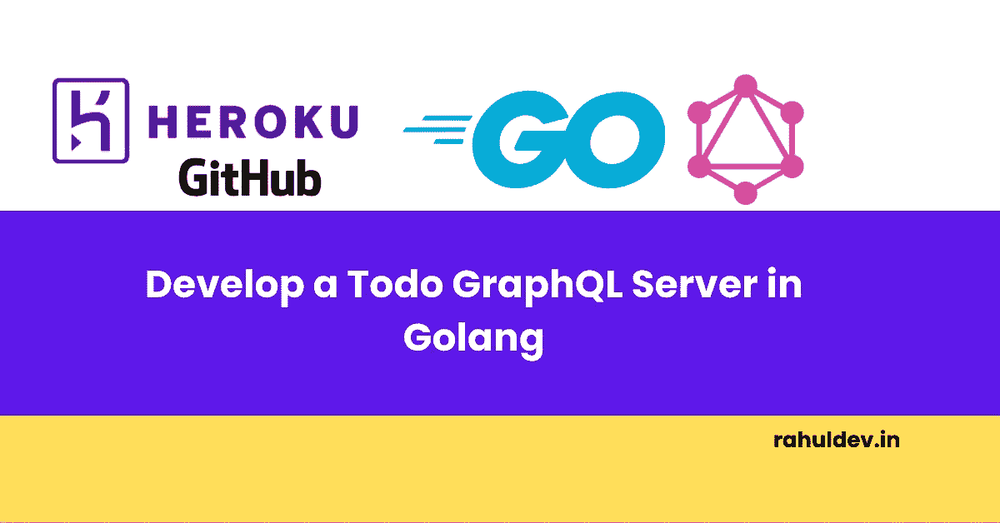
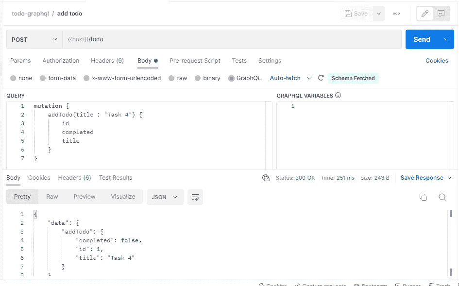
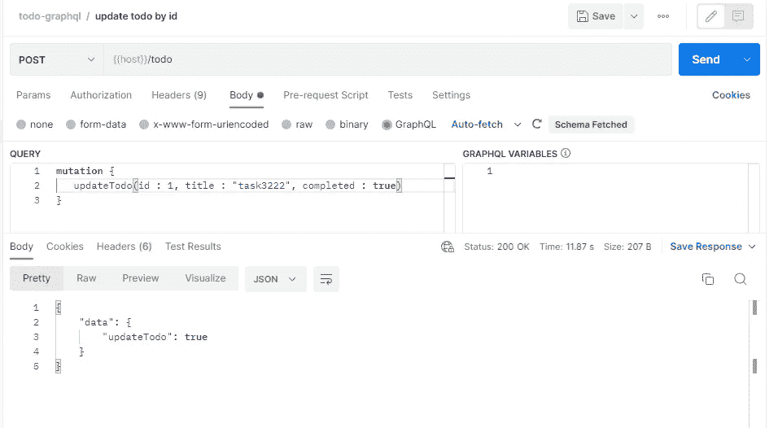
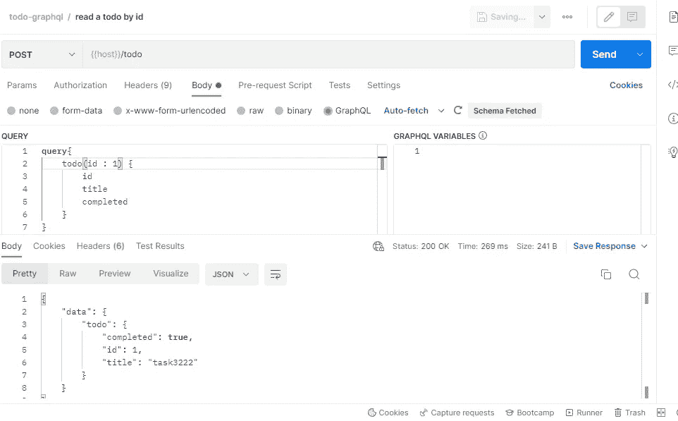
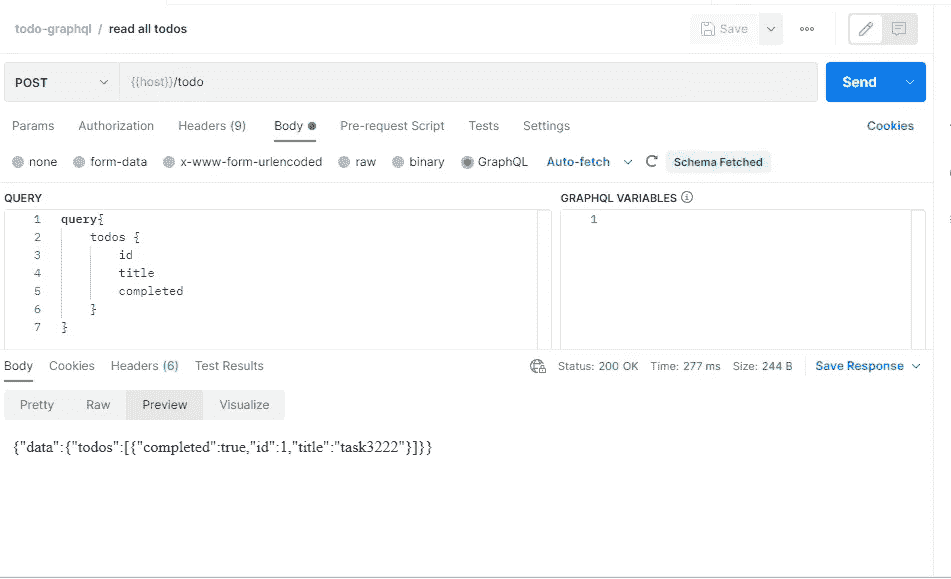
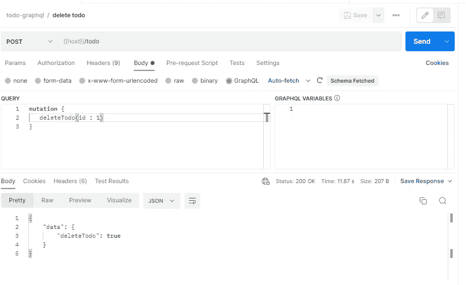

# 用 Golang 开发一个 Todo GraphQL 服务器🔥

> 原文：<https://levelup.gitconnected.com/develop-a-todo-graphql-server-in-golang-2bc6ecae1463>



graph QL-服务器

# 介绍

这是一个使用 GraphQL 在 Golang 中开发的简单的 Todo 应用程序。本教程帮助您找到在 Go 中构建自己的 GraphQL 服务器实现的正确方法。

[点击此处](https://github.com/rahul-yr/learn-go-graphql)获取完整源代码

[点击此处](https://www.postman.com/rahul-public/workspace/learn-go-graphql-todo-app)进入邮差合集。

在本教程中，我们将主要关注 3 件事

*   它是初学者友好的。
*   专注于行业最佳实践。
*   部署到云。

本教程的范围主要集中在构建 graphQL 服务器，而不是 Go 基础。如果你对 Golang 完全陌生，我强烈建议你在阅读本文之前对 Go 基础知识有一个很好的了解。

# GraphQL 是什么？

GraphQL 由脸书创建，于 2012 年在他们的移动应用中实现，并于 2015 年开源。

GraphQL 是一种用于 API 的查询语言和服务器端运行时。GraphQL 提供了一种灵活而直观的语法，使客户能够准确地要求他们所需要的，而不是更多，从而更容易随着时间的推移发展 API。

作为 REST 的替代方案，GraphQL 允许开发人员在一个 API 调用中构造从多个数据源提取数据的请求。因此，减少网络呼叫和带宽可以节省电池寿命和后端应用消耗的 CPU 周期([官方来源](https://graphql.org/))。

此外，GraphQL 为 API 维护人员提供了在不影响现有查询的情况下添加或删除字段的灵活性。

GraphQL 正迅速成为基于 API 的数据访问的标准。

# 什么是模式？

API 开发人员创建的 GraphQL 模式描述了客户端可以通过该服务查询的所有可能的数据。GraphQL 模式是由对象类型组成的，它定义了您可以请求的对象类型以及它所拥有的字段。

任何 GraphQL APIs 上最常见的操作是`Queries`和`Mutations`。`Queries`用于从 API 中读取数据。`Mutations`用于创建、更新和删除操作。

GraphQL 模式中的每个操作都被附加到一个名为`resolvers`的函数上。A `resolver`用于执行`Query`或`Mutation`的实际执行。

# 现场演示

[使用此端点执行现场测试](https://learn-go-graphql.herokuapp.com/todo)

# 在 Go 中开发一个 GraphQL 服务器

*   打开您最喜欢的代码编辑器，使用这个`go mod init github.com/rahul-yr/learn-go-graphql`命令创建一个 go 模块。
*   安装以下模块。

*   在根目录下创建一个名为`todo`的文件夹和三个名为`todo/models.go`、`todo/schema.go`和`todo/udf.go`的文件
*   在`todo/models.go`文件中创建一个 Todo 模型。此模型表示待办事项。

## 实现 CRUD 操作。

*   让我们为 TODO 模型创建 CRUD 操作(`todo/udf.go`)。

*   上面的代码片段有 5 个函数，其中 2 个为`Queries`定义，3 个为`Mutations`定义。以及一个存储所有 todo 项的变量(您可以在这里使用一个数据库实例)。
*   `GetTodos()`方法用于获取所有待办事项。
*   `GetTodo(id int)`方法用于根据项目 id 提取 todo 项目。
*   `AddTodo(title string)`方法用于创建新的待办事项。
*   `UpdateTodo(id int, title string, completed bool)`方法用于根据项目 id 更新现有的待办事项。
*   `DeleteTodo(id int)`方法用于根据项目 id 删除待办事项。

## 实现 GraphQL 模式

*   现在终于到了创建 GraphQL 模式的时候了(`todo/schema.go`)。

*   GraphQL 模式使用这个`graphql.NewSchema(graphql.SchemaConfig{...})`方法实现。这个方法实际上解析了 GraphQL 请求。
*   你可以用这个`graphql.NewObject(graphql.Objectconfig{...})`方法定义`Queries`、`Mutations`和其他`object types`。
*   这个`graphql.Fields{...}`方法对于定义字段很有用。
*   下面的方法用于声明输入参数。

```
graphql.FieldConfigArgument{
                    "some_id": &graphql.ArgumentConfig{
                        Type: graphql.SomeDataType,
                    },
                }
```

*   `Resolve`块是实际执行的地方。

## 为 GraphQL 实现一个端点

*   创建一个路线处理程序(`graph/router.go`)文件。
*   这里我用了`gin`包。您可以使用自己选择的任何 http 包来创建端点。
*   这里最重要的部分是添加这个`graphql.Do(...)`方法。这实际上解决了 graphql 请求。

# 运行服务器

*   为运行 graphql 服务器创建一个`main.go`文件。

*   使用`go run .`命令运行服务器
*   你可以在这里找到直播的 [postman API 合集](https://www.postman.com/rahul-public/workspace/learn-go-graphql-todo-app)。有关 API 规范，请参考此处。
*   下面是使用 Postman 的 API 请求和响应的一些快照。

## 创建待办事项



## 更新待办事项



## 根据项目 id 读取待办事项



## 阅读所有待办事项



## 删除待办事项



# 部署到云

知道如何将这个回购部署到 Heroku 吗？[点击这里找到正确的方法](https://blog.rahuldev.in/how-to-deploy-any-backend-to-heroku-easily)

# 摘要

可怕的🔥，您已经成功完成了本教程。我会💝听听你的反馈和意见，看看你能用它做些什么。如果你被困在某个地方，请随意评论。我随时都有空。请在 [github](https://github.com/rahul-yr/learn-go-graphql) 找到完整的代码

# 分级编码

感谢您成为我们社区的一员！更多内容请参见[升级编码出版物](https://levelup.gitconnected.com/)。
跟随:[推特](https://twitter.com/gitconnected)，[领英](https://www.linkedin.com/company/gitconnected)，[通迅](https://newsletter.levelup.dev/)
**升一级正在改造理工大招聘➡️** [**加入我们的人才集体**](https://jobs.levelup.dev/talent/welcome?referral=true)