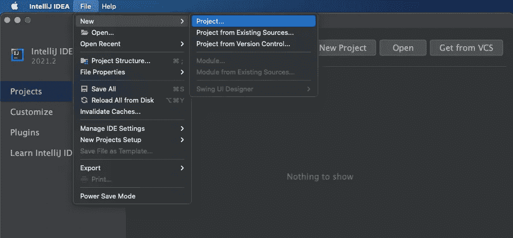
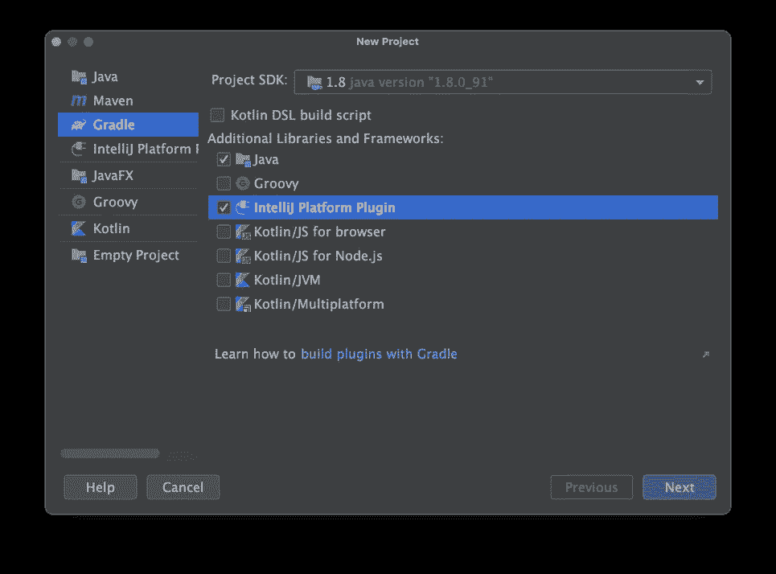
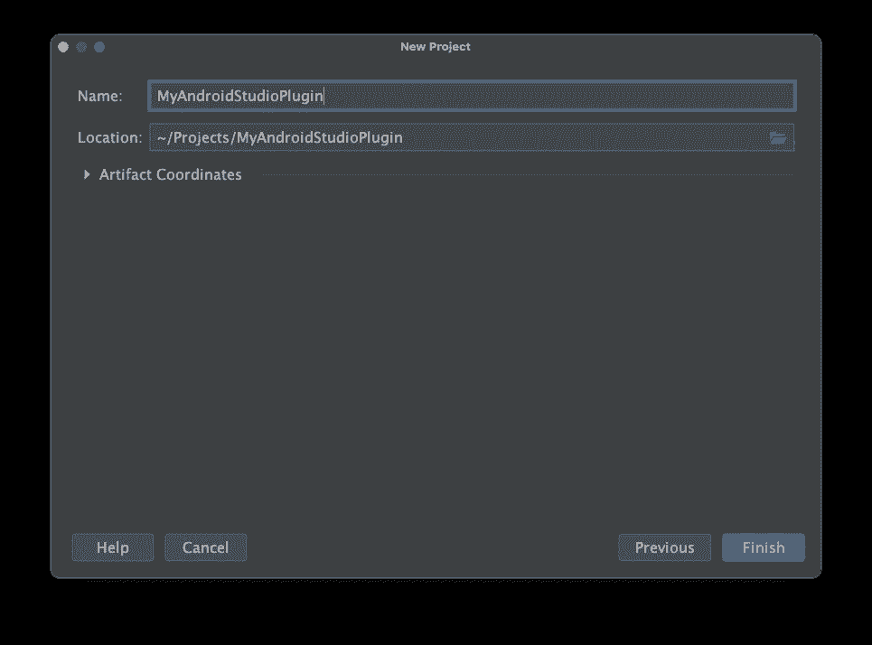
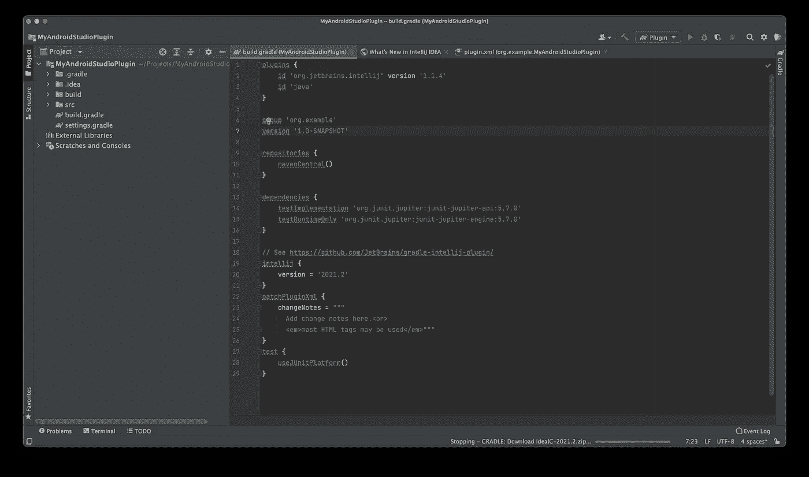
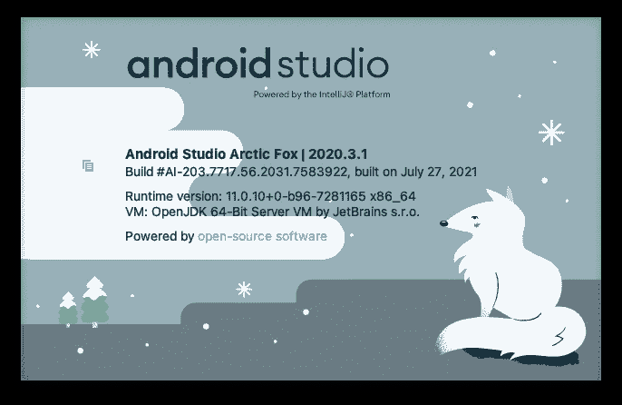
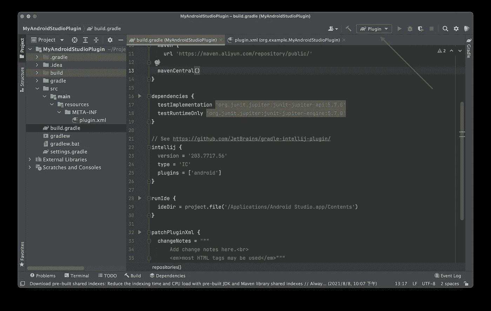
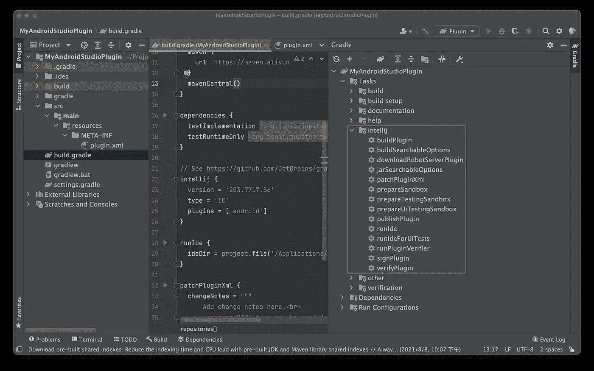

# 使用 Gradle 开发 Android Studio 的插件

> 原文：<https://levelup.gitconnected.com/develop-android-studios-plugin-using-gradle-152fad14f11>

作为一名 Android 开发者，我每天都在使用 Android Studio。在编码的时候，我经常想:我们有没有可能让 Android Studio 变得更强大？例如，我们是否可以一键提取库模块的源代码，并将其导入到构建中？能否支持基于 AI 的更智能的代码完成？我们能支持定制的特定领域语言吗？事实上，Android Studio 插件可以将上述所有想法变为现实。本文将详细介绍如何使用 Gradle 开发 Android Studio 插件。如果你也是想提高生产力的 Android 开发者，那就继续读下去吧！

# 准备

开发 Android Studio 插件唯一需要准备的工具是 Intellij IDEA(旗舰版和社区版都可以)。你可以从 Jetbrains 的官方网站[下载 Intellij IDEA 的最新版本。本文将使用 Intellij IDEA 社区版 2021.2 作为演示。](https://www.jetbrains.com/idea/download/)

# 创建项目

打开 Intellij IDEA，按照以下步骤操作:

1.  选择文件-新建-项目...



2.在“新建项目”页面上，选择 Gradle 选项卡，并确保选择了 Java 和 Intellij 平台插件。单击下一步。



3.输入项目的名称。单击完成。



# 配置项目

然后 Intellij IDEA 会创建一个 Intellij 插件项目，使用 Gradle 来构建。大多数配置位于根目录下的 build.gradle 文件中。



如你所见，这里有一个 Gradle 插件，名为 org.jetbrains.intellij。它为开发者提供了许多配置来定制他们的插件。你可以在这里看到所有的配置。

## intellij

**Intellij 的版本**

在 Intellij IDEA 生成的 build.gradle 中，Intellij 的版本与创建这个项目的 Intellij IDEA 相同。但是 Android Studio 的 Intellij 版本总是不一样。我们可以通过 Android Studio 看到 Intellij 版本——关于 Android Studio:



上面显示的 Android Studio 的 Intellij 信息是

```
*Build #AI-203.7717.56.2031.7583922, built on July 27, 2021*
```

所以对应的 Intellij 版本是 203.7717.56。我们都知道 Android Studio 是基于 Intellij IDEA 的社区版，所以我们需要将 type 字段设置为 IC:

```
… 
intellij { 
    version = ‘203.7717.56’ 
    type = ‘IC’ 
} 
…
```

**添加安卓依赖**

实际上，Android Studio 通过 android Intellij 插件添加了 Android 特定的功能。如果我们的插件想要使用 Android Studio 提供的 API，我们需要让我们的插件依赖于 Android 插件:

```
… intellij {    version = ‘203.7717.56’     type = ‘IC’     plugins = [‘android’] } …
```

## 鲁尼德

Intellij Gradle 插件提供了一个名为 runIde 的任务，帮助开发人员在 Ide 中调试他们的插件。Android 开发者可以将 ideDir 设置为本地安装的 Android Studio 的路径:

```
… runIde { ideDir = project.file(‘/Applications/Android Studio.app/Contents’) } …
```

注意:ideDir 的值需要是 Jetbrains 在他们的文档中没有提到的文件类型。

## plugin.xml

默认情况下，不同的插件有不同的类加载器。所以插件可以使用同一个库的不同版本，互不影响。但是当我们想要使用 android 插件提供的 API 来获得一些 Android 特定的信息(比如 android gradle 插件的版本)时，我们会因为这个类加载器机制而失败。开发人员可以使用 plugin.xml 提供的依赖 API 来使他们的插件使用与 android 插件相同的类加载器。

```
<idea-plugin> … <depends>org.jetbrains.android</depends> … </idea-plugin>
```

这样，我们可以在运行时获得正确的数据。

# 构建并运行

## 使用图形用户界面

Intellij IDEA 将自动创建名为插件的运行配置:



只需点击运行和调试按钮，您就可以运行和调试您的插件完美。

点击按钮后，将会打开一个安装了插件的 Intellij IDEA 客户端。如果你像上面提到的那样配置了 runIde 任务，你本地安装的 Android Studio 将会打开。

## 使用 Cmd

打开右侧的 Gradle 面板，您会看到 intellij 组中的几个任务。



我们可以通过

```
./gradlew buildPlugin
```

我们可以在目录/build/distributions 下找到工件。

我们可以完成这个项目

```
./gradlew runPlugin
```

# 更大的

现在，我们可以使用 Gradle 来配置、构建和运行 Android Studio 插件。关于如何使用 Intellij 平台 SDK 开发插件，可以阅读 Jetbrains 的文档: [Intellij 平台 SDK](https://plugins.jetbrains.com/docs/intellij/welcome.html) 。我会写一些关于 IDE 和 SDK 的有趣部分。

关注我以获取更新！