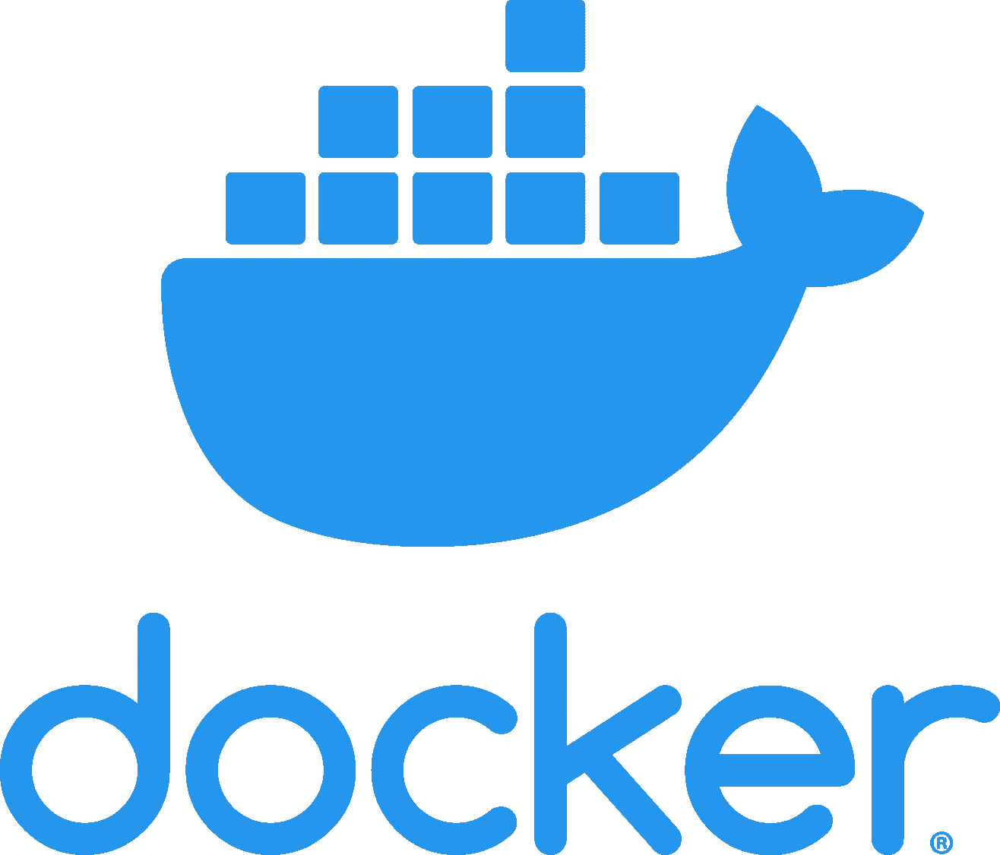
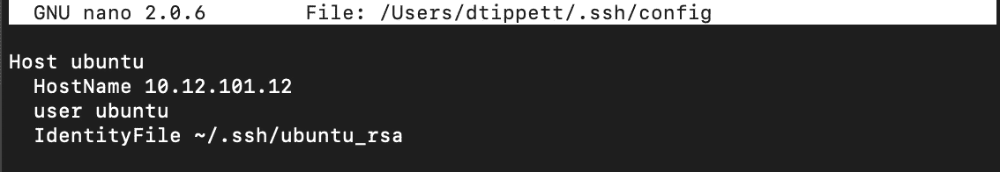
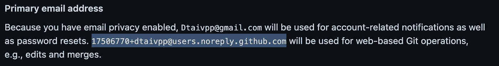
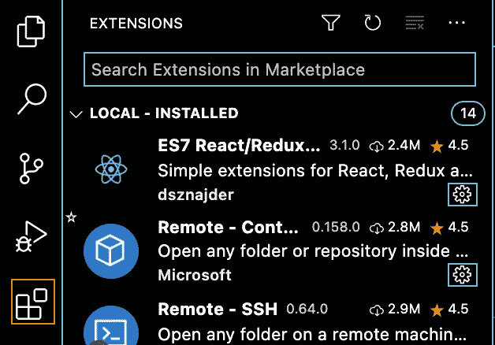
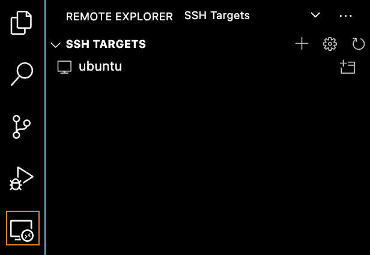
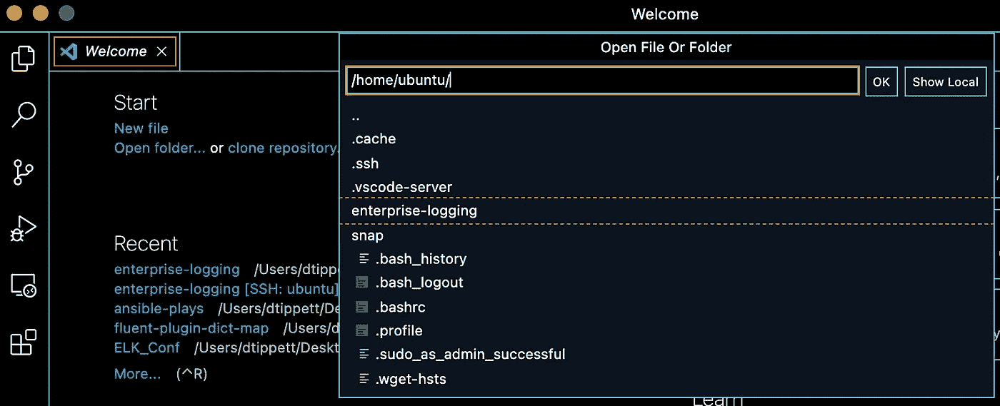
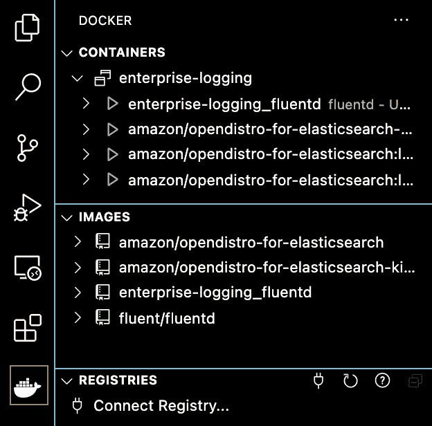

# 像专业人士一样从 Mac 远程开发 Docker

> 原文：<https://levelup.gitconnected.com/develop-docker-remotely-from-your-mac-like-a-pro-69dcf75219e>



来源:[初学者 Docker](https://thenucleargeeks.com/2020/06/02/docker-for-beginners-introduction-to-dockers/)

发展在继续前进，你如何发展也应该随之改变。通常我们正在开发的东西变得如此庞大和复杂，以至于从我们的本地机器上运行它们是不切实际的。不过不用担心，有了这个指南，你可以连接到一个远程服务器，使用 docker 容器进行开发。


获得 [u/GBKPres](https://www.reddit.com/r/homelab/comments/gtjpl0/homelab_meets_battlestation/) 的许可

在我的例子中，我的开发环境是一个旧的 dell R620，有 104 Gb 的内存和 16 个内核。我设计处理日志的系统，用于搜索和可视化。我不想让我的笔记本电脑 24/7 全天候消耗这些日志，这样能够在我的家庭实验室上远程开发可以节省我大量的时间和精力。

# 安装 Ubuntu 服务器

首先是从他们的网站[下载最新的 Ubuntu 服务器镜像](https://ubuntu.com/download/server)安装到我们的远程机器上。选择选项 2 进行手动安装，以下载映像。接下来，您需要按照他们的指南(链接如下)进行安装。我不会在这里讨论这个，因为他们有一个很好的指南。

[](https://ubuntu.com/tutorials/install-ubuntu-server#1-overview) [## 安装 Ubuntu 服务器

### Ubuntu Server 是你已经知道的标准 Ubuntu 的变体，为网络和服务量身定制。就像…

ubuntu.com](https://ubuntu.com/tutorials/install-ubuntu-server#1-overview) 

# 安装 Docker

要安装 docker，我建议使用 snap。在我看来这是最简单的方法。

```
sudo snap install docker
```

安装 docker snap 后，将您的用户添加到 docker 组中也很重要。这样，您就可以运行 docker 命令，而无需成为 sudo'er，并允许我们远程连接到 docker 守护进程。

```
sudo addgroup --system docker
sudo adduser $USER docker
newgrp docker
sudo snap disable docker
sudo snap enable docker
```

我建议编辑/etc/sysctl.conf 并在最后添加下面一行。不是所有的容器都需要这个集合，但是如果你确实需要它，找出它的缺失可能会很棘手。它设置允许容器请求多少虚拟内存。

```
sudo nano /etc/sysctl.conf# Add this line to the end
vm.max_map_count=262144
```

完成后，运行`sudo sysctl —-system`命令将使用我们所做的配置更改来重新加载您的 shell。

# 从您的 Mac 配置 SSH

设置 ssh 的第一步是生成一个 ssh 密钥。下面的命令将让您做到这一点。

```
ssh-keygen
```

将密钥保存到/Users/ <yourusername>/中。ssh/ubuntu_rsa</yourusername>

在所有提示中按 enter 键跳过添加密码(除非您觉得必须为此设置密码)。然后，您需要使用 ssh-copy-id 命令将该密钥复制到远程 ubuntu 服务器。

```
ssh-copy-id -i /Users/<YourUsername>/.ssh/ubuntu_rsa <ServerUsername>@<ServerIP>
```

编辑您的 ssh hosts 文件，并添加以下变量来代替它们的实际值。

```
sudo nano /Users/<YourUsername>/.ssh/configHost ubuntu
 HostName <ServerIP>
 user <ServerUsername>
 IdentityFile ~/.ssh/ubuntu_rsa
```

下面是从终端看到的条目。



这个文件看起来像什么

现在你可以 ssh 而不需要输入密码。试一试！

```
ssh ubuntu
```

# 远程 Git 设置

在您的服务器上设置 git 就像设置下面的全局配置选项一样简单。我建议你首先检查一下你是否在 GitHub 中设置了电子邮件隐私。要检查这一点，你可以从你的账户右上角进入你的账户->设置。然后导航至左侧栏中的电子邮件，并向下滚动至主要电子邮件地址。如果你在那里看见这个，复制它并且使用它作为你的电子邮件。



```
git config --global user.name "David Tippett"
git config --global user.email [17506770+dtaivpp@users.noreply.github.com](mailto:17506770+dtaivpp@users.noreply.github.com)
```

如果你觉得自己很勇敢，你可以用 SSH 或 GPG 键来设置它。我通常这样做，但是为了节省时间，这篇文章我不打算涵盖这一点。

# 安装 Visual Studio 代码

在本节中，我假设您已经安装了 VSCode。如果你安装完之后没有回到这里([从这里安装](https://code.visualstudio.com/))。

接下来安装一些扩展！从左下角的小方块开始，它有一个奇怪的浮动方块。我们将搜索并安装 Remote - SSH 和 Docker。



一旦你安装了这些，你应该会在左边的栏中看到它们。点击远程 ssh 扩展……你会看到吗！它已经知道你的服务器了！这是因为它读取了/Users/ <yourusername>/。ssh/config 文件来提取您设置的任何服务器连接。</yourusername>



远程 SSH 扩展

点击 Ubuntu 行右边的小窗口，打开一个新窗口，目标是远程服务器。这包括从终端到远程服务器上的文件系统的所有内容。

一旦你连接上了，点击 Ctrl + Shift + ~打开一个远程服务器的终端(或者如果你喜欢菜单，它是顶栏的终端和新终端)。现在，您可以将一个 repo 克隆到您的服务器上。

```
git clone [https://github.com/dtaivpp/enterprise-logging.git](https://github.com/dtaivpp/enterprise-logging.git)
```

现在从 VSCode 的左上角开始，你可以选择 open folder，它会显示远程服务器的选项。图为我的企业日志项目文件夹。选择您想要的，然后从右边选择确定。



有趣的事情来了。现在，您可以在远程服务器上构建和运行 docker 容器了。对于我的，我进入终端，输入`docker-compose up`来启动我的服务。现在，我可以进入 docker 扩展，查看正在运行的内容，连接到容器，查看网络等。



出于好奇，我使用的样本库是我编写本指南的原因之一。它创建了 4 个容器，执行以下操作:

Fluentd 容器接受 netflow 和 syslogs，并将它们索引到 [OpenDistro Elasticsearch](https://opendistro.github.io/for-elasticsearch/) 节点中。从这里可以看到基巴纳。将这些放在服务器上是很有用的，因为服务器上有真正的 netflows 和 syslogs 进入其中进行开发。这就是为什么在我的笔记本电脑上开发对我来说是不实际的。有了这个设置，我就可以部署到我的服务器上，然后用实验室环境中的真实数据进行测试。