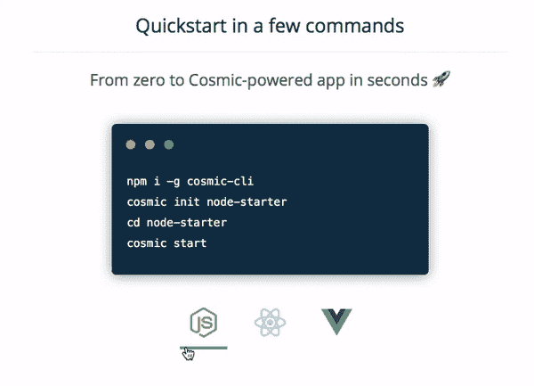

# 开发者聚焦:约翰·艾伦·霍珀

> 原文：<https://levelup.gitconnected.com/developer-spotlight-john-allen-hopper-3fce08187dd3>

在 Cosmic JS [开发者聚焦系列](https://cosmicjs.com/developers)的这一期中，我们采访了达拉斯的软件开发者[约翰·艾伦·霍珀](https://cosmicjs.com/johnallenhopper)。除了拥有北德克萨斯大学的人类学学位之外，John 还是[编码道场](https://www.codingdojo.com/)的毕业生，多年来一直在广告公司和自由职业者的工作中构建应用程序。在 [GitHub](https://github.com/jahopp23) 、 [LinkedIn](https://www.linkedin.com/in/john-allen-hopper-874424aa/) 和 [Twitter](https://twitter.com/jahwebulariam) 上关注约翰，享受问答。

**你开发软件有多久了？我在北德克萨斯大学获得人类学学士学位的同时，开始了网站建设和 C++编程。我的学位实际上鼓励我将软件开发作为职业，因为我明白编程和 web 应用程序是交流和文化转变的重要工具。总而言之，我做了 8 年的 HTML，CSS，JavaScript 代码。我在 2016 年参加 Coding Dojo 的时候开始“堆叠”程序，从那以后一直在构建新的应用。**

**您首选的开发堆栈是什么？我学习了 MEAN stack、Ruby on Rails 和 Python。我的偏好倾向于基于 Express 和 Node 构建的 JavaScript 框架。我开始更喜欢 React 这样的框架，因为它专注于构造 UI 组件。我一直在寻找新的库、框架和栈，还没有真正选定一个。对我来说，作为一名程序员的便利之处在于理解任何软件应用程序中的编码语言。如果我必须找出我最喜欢的三种工具，它们会是 1。)Ubuntu，2)。JavaScript/节点/NPM，以及 3)。带有引导 CSS 的 HTML5。**

过去有哪些项目是你最引以为豪的，为什么？为 Johnson & Sekin 开发[mexene.com](https://mexene.com/)是一次富有洞察力和挑战性的经历。这是我的第一个广告代理项目，没有一个资深开发人员在一起建设网站。作为一名初级前端开发人员，我感到责任重大。我仔细研究了原始设计中的细节，实现了用于创建动画的代码库，并遵循了战略方法论。我能够通过完美的像素表现来开发复杂的 UI/UX 组件。这个项目无疑教会了我设计和编码之间的融合关系。这两种艺术形式应该永远相互包容。

**多谈谈你构建应用的过程。他们是面向外部受众还是内部受众？我喜欢为教育和提高技术开发应用程序。为社区构建应用程序对我来说是一种全新的体验。出于任何目的的编码总是被证明是有益的，因为有重要的问题要解决，有美妙的体验要创造。我参与过面向外部受众的项目，比如我的开发人员网站和一个摄影师网站，以及依赖于 Laravel、AngularJS 和 MongoDB 等框架的专业角色内的项目。Cosmic JS 将生产力提高了十倍，因为它将现代代码库编译成了一个中心，人们可以在这里学习、构建和成长。现在，更多的时间可以花在设计、内容和进度上。**

**您对目前正在使用的哪些技术感到兴奋，或者想了解更多？Zeit Now/Next 带来了可靠的命令行部署。这项技术让我可以随时更新和部署项目。Bootstrap 在我心中永远有一个特殊的位置，因为它的美感。我预计我会用 React、Redux、Ionic、GraphQL、Apollo 等来研究和开发新的应用程序。这些框架采用了令人难以置信的响应能力、系统的代码结构和无缝的效率——允许程序员通过简单的 JS 逻辑自由地构建复杂的 web 应用程序。**

[使用 Cosmic 驱动的 React、Node.js 或 Vue 应用在几秒钟内开始使用](https://cosmicjs.com/getting-started)🔥

要了解如何向 [Cosmic JS 社区](https://cosmicjs.com/community)贡献应用、文章和扩展，请联系 jobs@cosmicjs.com[的我们](mailto:jobs@cosmicjs.com)。