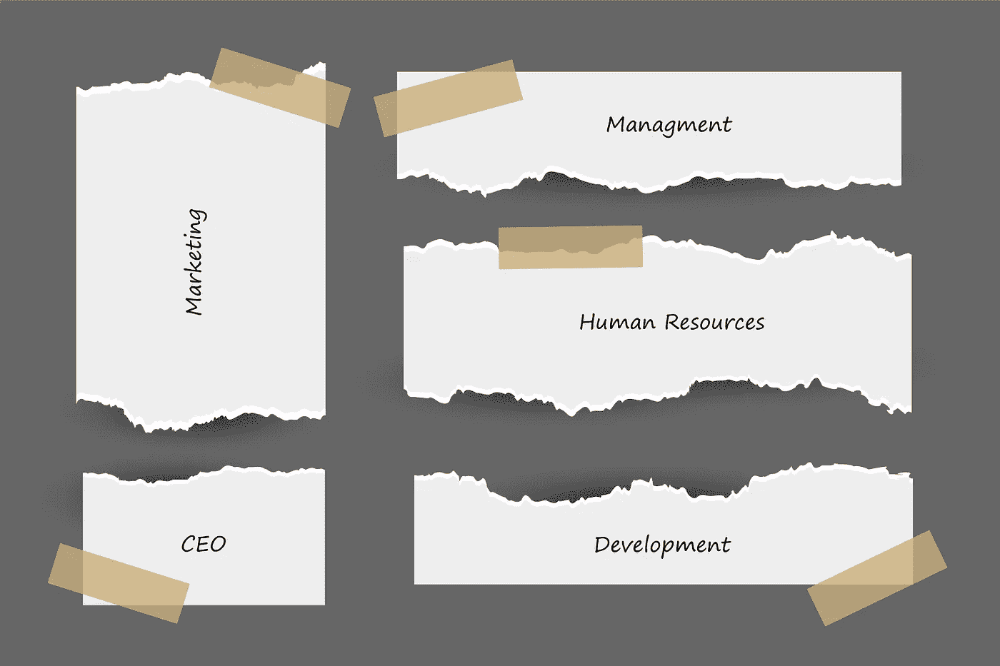
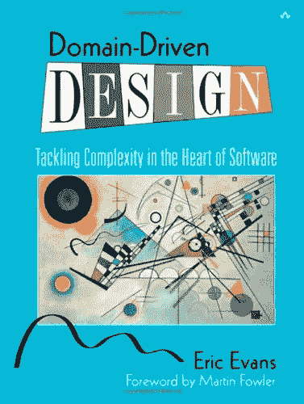

# 开发者都是内向的人。领域驱动的设计可以帮助改变它。

> 原文：<https://levelup.gitconnected.com/developers-are-introverts-domain-driven-design-can-help-669510b6930d>

## 作为开发人员，我们正在编写代码来构建软件，但不与客户交谈就无法做出好的软件。

## 开发人员并不健谈。

大多数时候，软件开发人员都在努力与客户以及外部世界沟通。我们中的许多人选择这个职业是为了避免与人接触，这就是为什么公司雇佣那些代替我们做事的经理。

如果你是这些内向的人之一，那么我有一个坏消息要告诉你。你可能会永远被错误的代码所困扰。

由 rawpixel.com 创造—[www.freepik.com](http://www.freepik.com)

如果你要为商业开发软件，你需要理解每一个细节，因为你要把业务流程翻译成代码。而且你也不想在翻译中丢失重要信息。

## 领域驱动的设计干预

领域驱动设计(DDD)的关键部分之一是鼓励开发人员与领域专家更好地互动。**领域专家**了解客户的业务需求和流程。

开发人员需要比他们的合作伙伴更了解他们的客户。如果你是一个男人，你可能比你的宝贝更能理解你的客户。

www.freepik.comT4【yanalya】的照片

你可能会说你已经和他们谈过了，但是可能是用不同的语言。也许你使用的术语就像数据库中的表格，而不是领域概念。

DDD 指导我们找到与领域专家的共同语言，并在更高的层次上相互理解。

## 普遍存在的语言

无处不在。可怕的词。如果你不知道如何发音，这可能有助于[yo͞oˈbikwətəs].]对我来说，没有。我不得不使用谷歌翻译来听发音。也无济于事。

无处不在的语言的简单定义是提出在讨论特定子域时常用的术语。什么是子域，将在下一段介绍。抓紧了。

最有可能出现的术语来自商业领域，而不是软件世界。但是这些条款必须得到领域专家和开发者双方的同意。确保团队各成员使用的术语不会造成混淆或误解。

记者拍摄的照片——www.freepik.co

## 域和子域

核心领域是一个研究领域，它为任何软件程序定义了一组通用的需求、术语和功能。DDD 教我们如何将核心域分成更小的子域。

想象一个公司。它可以被分成更小的部分，例如部门。对于子域，逻辑保持不变。它们充满了复杂性、术语、任务和挑战。

图片由 Starline 提供—[www.freepik.com](http://www.freepik.com)

许多应用程序只是试图同时做许多事情，引入新功能变得越来越困难。和 DDD 一起，你将**分而治之**。通过把软件撕成分离的子域，我们可以实现更容易解决的划分问题。

[关注点分离](https://en.wikipedia.org/wiki/Separation_of_concerns) (SoC)的原则不仅在识别子域中起着关键作用，而且在每个子域中，我们也使用它。

许多应用程序将领域逻辑分布在整个项目中。跨越持久层，跨越用户界面。这种分散使得保持所有业务逻辑的一致性更加困难。

DDD 应用 SoC 通过关注领域来帮助指导你。而不是像如何将数据持久化到数据库中或如何连接到外部 API 这样的细节。这些成为实现细节，您可以稍后再考虑。

## 利益

第一个主要好处是灵活性。因为 DDD 指导我们专注于我们领域中小的、独立的、近乎自治的部分，所以我们的过程和最终的软件更加灵活。我们可以很容易地移动或修改小零件，几乎没有副作用。该项目稳定而灵活。

图片出自 master 1305—[www.freepik.com](http://www.freepik.com)

另一个好处是代码与客户对问题的理解紧密相关。DDD 为你提供了一条清晰且易于处理的途径来解决一个非常复杂的问题。当您查看代码时，可以看到它通常组织得很好，业务逻辑都在一个地方。

DDD 并不是每个项目的必经之路，但是有许多原则和模式可以让你受益。它真正的好处是对于复杂的领域。当领域专家难以表达他们的需求时，你可以把领域描述为复杂的。你知道的。比如女人。

图片来自 Jcomp—[www.freepik.com](http://www.freepik.com)

DDD 提供了帮助我们解决困难的软件问题甚至商业问题的原则和模式。历史上，这些模式在解决非常复杂的问题时非常成功。

最终目的不是写代码，甚至不是构建软件，而是解决问题。没人想要你的软件；他们想要它能给他们的东西。

## 不足之处

你会花很多时间谈论领域和需要解决的问题。并且你将花费大量的时间来区分什么是真正的领域逻辑，什么只是基础设施。

DDD 并不总是适合你的申请。记住在某些情况下 DDD 是多余的是有帮助的。如果您有一个应用程序或子域，它只是一个数据驱动的应用程序，除了大量的 crud 逻辑之外没有什么别的功能，那么就没有必要使用 DDD。这将是浪费时间和精力。

技术复杂性并不意味着业务领域的复杂性。DDD 可能不仅仅是一条路径，因为你的项目在技术上具有挑战性。

## 这本书

2003 年，埃里克·埃文斯在一本名为《领域驱动设计》的书中介绍了 DDD。写这本书的一个主要原因是为了解决复杂的问题。这就是为什么埃文斯的书的一个副标题是“解决软件核心的复杂性”。

## 摘要

领域驱动设计帮助男人充分理解女人。不。我开玩笑的。一本书是不够的。

我要你带走的是这个。多和你的客户聊天，总是试着理解他们的需求。如果你不理解对方，定义你的无处不在的语言。

分而治之你的商业逻辑。关注点分离，松散耦合，子域。一个想法有这么多头衔。在每一层都把你的代码分成更小的部分。

 [## 丹尼尔·鲁斯诺克的时事通讯

### 每个月我都会给你发一封电子邮件，列出我的最新文章。这当然是友好的联系…

www.danielrusnok.com](https://www.danielrusnok.com/daniel-rusnoks-newsletter) 