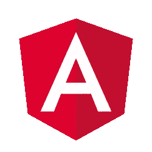

# 开发者的选择:2019 年最佳前端框架综述

> 原文：<https://levelup.gitconnected.com/developers-choice-an-overview-of-the-best-front-end-frameworks-in-2019-a26e616f8602>

JavaScript 框架的选择总是取决于特定项目的需求。

您应该考虑各个方面:它的足迹、性能、可重用性，以及社区支持。

知道总是跟上潮流有多难，我们决定根据个人经验和开发者社区的意见列出一个最佳前端框架的列表。

让我们来关注一下这五大框架和**库**:

# 反应

无论你是初学者还是有经验的前端开发人员，你肯定听说过 [React](https://reactjs.org/) 。

由脸书开发人员创建，最初的意图是使他们的代码更有效，目前 React 是领先的前端框架和发展最快的技术。这并不奇怪，因为它大大简化了为 web 应用程序构建丰富的交互式 ui 的过程。

JavaScript 2018 的[状态结果显示，在 2016–2018 年期间，React 的受欢迎程度保持逐渐增长:](https://2018.stateofjs.com/front-end-frameworks/react)

最棒的是，它得到了来自世界各地的大型开发人员社区的支持。

此外，该框架对新手来说是完全用户友好的——指南有助于应对学习过程中出现的任何困难。因此，您可以在几个小时内学习 React 的基础知识，并通过详细的文档进一步掌握它的高级方面。

与 React 一起，开发人员倾向于使用 ES6、Redux 状态管理库、Express、Jest 和 React Native 来实现无缝的移动体验。

**开发人员喜欢 React 的这些特性**:

*   基于组件的架构。
*   一种优雅的编程风格和声明性视图，有助于生成清晰和可维护的代码。
*   由于单向数据绑定使得虚拟 DOM 的操作速度更快，所以性能更快。
*   有效的事件处理。
*   JSX——一种保持编写组件简单的标记语法。
*   采用和推广功能性范例，简化开发并使应用程序状态的管理更加可预测。
*   搜索引擎友好。

除此之外，如果您必须在应用程序中处理实时数据，这是一个不错的选择。

我们挑选了一些文章，将帮助您开始使用 React，并从开发人员的角度**了解更多关于 React 的内容:**

*   [思考中做出反应](https://reactjs.org/docs/thinking-in-react.html)
*   [所有基本的 React.js 概念都集中在这篇文章中](https://medium.freecodecamp.org/all-the-fundamental-react-js-concepts-jammed-into-this-single-medium-article-c83f9b53eac2)
*   [React 慢，React 快:在实践中优化 React 应用](https://medium.com/dailyjs/react-is-slow-react-is-fast-optimizing-react-apps-in-practice-394176a11fba)

# 某视频剪辑软件

尽管是一个年轻的框架， [Vue](https://vuejs.org/) 每个月都继续得到开发者社区越来越多的关注。在最初推出几年后，它变得更加稳定，并成功地为许多初创公司和企业带来了价值。是的，React 和 Angular 仍然在总体受欢迎程度上赢了 Vue，并试图让后者相形见绌，但 Vue 逐渐被软件开发人员采用。根据 JS 2018 的[状态，大约 50%的受访者希望学习这个框架，并且不是没有原因的。](https://2018.stateofjs.com/front-end-frameworks/vuejs/)

Vue 主要因其*温和的学习曲线*和降低的复杂性而受到赞赏，由于这一点，构建简单的 web 应用程序几乎不需要时间。它使组件具有反应性，这意味着应用于状态对象的任何更改都可以在渲染的 HTML 中立即看到。

对于 React 和 Angular 开发人员来说，好消息是:切换到 Vue 很容易，因为它共享了两个框架的概念。

Vue 的其他**优势**是:

*   一个**面向组件的结构**封装了可重用的代码，提供了灵活性，并确保易于扩展。
*   有助于保持状态对象与视图和 DOM 完全同步的反应机制。
*   移动用户界面开发解决方案。
*   框架的微小尺寸。它的容量只有 18-21kb。
*   有助于保持项目的结构简单。
*   轻松集成到 JavaScript 应用程序中。

最后但并非最不重要的是全面的文档，它涵盖了 Vue 及其*生态系统*的几乎所有特性。一个*活跃的*和*不断增长的*社区为框架的发展做出了贡献，这是它不可否认的优势。

总而言之，如果你正在寻找一个轻量级的、渐进的、易于开始的框架，Vue 是一个很好的选择。

要深入了解 Vue 开发的各个方面，我们建议阅读以下文章:

*   [了解 Vue.js 生命周期挂钩](https://alligator.io/vuejs/component-lifecycle/)
*   [2019 年 Vue 发展:你需要知道的事情](https://medium.com/@anthonygore/vue-development-in-2019-what-you-need-to-know-2170942f0e54)
*   [VueJs:4 分钟基本动作](https://codeburst.io/vuejs-the-basics-in-4-mins-6208df76003d)

# 有角的

[Angular](https://angular.io/) 是一个用于构建用户界面的开源平台。它对于大型企业级项目至关重要，并且在前端框架中占据首要位置。

最初，它是由谷歌工程师在 2009 年开发的，被称为 AngularJS。

后来，在 2016 年，该框架被重写，并开始适应现代 web 开发的要求。开发团队一次又一次地发布新版本。目前的版本是 Angular 7.0。Angular 是 MEAN 栈的一部分，它涵盖了四个主要的软件开发支柱:MongoDB、Express、Angular 和 Node.js

但人们应该考虑到 Angular 更适合构建复杂的长期应用程序，而不是 spa，因为它需要陡峭的学习曲线。

Angular 的核心是 TypeScript——一种使代码更容易维护的语言，因为它提供了类型系统和可靠的类型检查。由于 TypeScript 的更新独立于浏览器，所以您不需要依赖浏览器，并且可以使用该语言的所有新功能。

除了框架本身，开发人员还使用 RxJS 等工具来处理异步数据，并使用 Angular CLI 来轻松创建项目、调试和部署。

**您会喜欢 Angular** 的功能有:

*   **基于组件的架构**使人想起 MVC，但使组件可重用，封装代码并使其更高效。
*   双向数据绑定，将模型与视图同步，无需编写过多的代码。
*   分层依赖注入使得组件可重用且易于维护。
*   采用移动优先的方法设计。
*   **快速性能**。然而，它高度依赖于代码的质量。
*   易于编写和阅读的模板语法。
*   确保简单单元测试的组件。
*   活跃的大型社区。
*   适合**迭代开发**。

总而言之，如果你正在构建复杂的系统，但是不方便创建快速变化的用户界面，Angular 对于你的项目来说是一个非常棒的前端技术。对于后一种情况，最好使用 React 和 Vue，它们更轻量级，学习曲线更容易。然而，Angular 陡峭的学习曲线被最终软件的可靠性所补偿。

为了更好地了解 Angular，我们建议阅读以下文章:

*   [清洁高效角度应用的最佳实践](https://medium.freecodecamp.org/best-practices-for-a-clean-and-performant-angular-application-288e7b39eb6f)
*   [棱角分明:概念概述](https://docs.angularjs.org/guide/concepts)

Google Trends 很好地展示了 Angular、React 和 Vue 的流行程度在过去五年中的变化:

为了帮助您在这三个框架之间做出选择，我们建议您阅读以下文章:

*   [Angular 和 React:哪个更适合 Web 开发？](https://codeburst.io/angular-vs-react-which-is-better-for-web-development-e0dd1fefab5b)
*   [角度对比反应对比 Vue:2017 年对比](https://medium.com/unicorn-supplies/angular-vs-react-vs-vue-a-2017-comparison-c5c52d620176)

# 毅力

[Backbone.js](https://backbonejs.org/) 是一个开源的 JavaScript 库，最初发布于 2010 年。它被认为是非常轻量级的，因为它只有 7.5KB，并且只依赖于另外两个 js 库——下划线. JS 和 jQuery。它得到了麻省理工学院的许可，每个人都可以为它的开发做出贡献。

虽然它在发布后非常流行，但随着 React、Vue.js 和 Angular 的发展，它的受欢迎程度开始下降。JS 状态调查[的结果显示，它不在最受欢迎的三个框架之列，但尽管如此，它还是受到了许多开发人员的赞赏，因为它为 web 应用程序提供了一个结构。Trello、Soundcloud、Airbnb 和许多其他公司选择使用 Backbone 作为前端技术。](https://2018.stateofjs.com/front-end-frameworks/other-libraries/)

**为什么使用主干网**

由于大量使用 JavaScript 会使代码难以组织和维护，Backbone 通过将业务逻辑与用户界面分开来帮助克服这个问题，并使应用程序结构良好。换句话说，它维护了应用程序的主干。

模型、视图、集合、事件、路由器和同步是框架的基本组件。它将 DOM 抽象成视图，将数据抽象成模型，并使用事件绑定它们。感谢通过事件进行通信，整个代码变得易于阅读和维护。

其他基本特征包括:

*   模型的键值绑定。
*   **模型-视图-展示者** (MVP)设计模式。
*   **与你的 app 后端实时同步**。
*   一个用于服务器-客户端通信的 RESTful JSON 接口。

另一个优点是，你可以使用你选择的带有主干网的模板引擎。

虽然 Backbone 目前没有如此积极地更新，但是 bug 已经修复，文档也在系统地更新。

总的来说，Backbone 是构建单页面应用程序(spa)和复杂客户端应用程序的绝佳选择。

想在**多了解一下骨干**？以下是值得您关注的文章列表:

*   【Backbone.js 入门
*   [Backbone.js:初学者详细指南](https://devrix.com/backbone-js-a-detailed-guide-for-beginners/)
*   【Backbone.js 开发人员最常犯的 8 大错误

# 余烬

听说过[余烬](https://emberjs.com/)吗？

你最喜欢的苹果音乐是用 Ember 构建的。网飞、LinkedIn、微软和许多其他热门网站都使用 Ember。

**Ember.js** 是 2011 年发布的免费 JavaScript 客户端框架。

它是为创建**可扩展的 spa**、**桌面**和**移动应用**而设计的，它与一组工具一起构成了一个完整的开发堆栈。有了 Ember 的约定和*开箱即用的*特性，开发者可以更专注于他们应用的功能，而不是整理如何配置它们。

以下是 Ember.js 的优势列表:

*   建立在 **MVVM 模式**之上。
*   兼容**Babel**——一个 JavaScript transpiler。
*   稳定而不停滞是 Ember 的核心原则之一。它向后兼容旧版本的框架。
*   漂亮的模板使你的应用程序的用户界面脱颖而出。它们是用手柄编写的——一种易于理解的模板语言。
*   声明式双向数据绑定。一旦基础模型的数据发生变化，模板就会立即更新。
*   Ember 的插件库中有超过 5000 个很棒的插件。你不需要从头开始构建一个附加组件——只需安装即可。其中最流行的是用于认证和授权管理的 [Ember-simple-auth](https://github.com/simplabs/ember-simple-auth) 。
*   Ember-CLI 是另一个提高生产力的工具。这是一个命令行工具，支持 CoffeeScript、LESS、Sass、Handlebars 等等。
*   *丰富的生态系统和充满活力的社区*。
*   [计算属性](https://guides.emberjs.com/v2.1.0/object-model/computed-properties/)允许将函数声明为属性。这是创造新价值的强有力的方法。
*   [对象系统](https://guides.emberjs.com/release/object-model/)简化了对继承和混合的理解。
*   将模板轻松重构为可重用的组件。

Ember 的构建考虑到了生产力，并被证明是当今最灵活的框架之一。试试 Ember，看看它是否适合你的应用。

了解更多关于 Ember 的信息:

*   【Ember 入门
*   [Ember JS——深度介绍](https://www.smashingmagazine.com/2013/11/an-in-depth-introduction-to-ember-js/)
*   [选择余烬的好处](https://medium.com/@alvincrespo/ember-your-best-bet-b5cd7275dc84)

## 比较受欢迎程度

很容易注意到，Ember 的受欢迎程度超过了 Backbone:

## 哪些框架最快？

如果您渴望知道哪些框架在速度和性能方面是最好的，我们建议您更深入地研究详细的[性能基准测试结果](https://jsreport.io/js-frameworks-fastest/)。

作为开发人员，我们知道选择 JS 框架的过程是多么的艰难和具有挑战性。

在比较多个框架时，您需要弄清楚学习曲线有多陡峭/平缓，其生态系统的核心是什么，它提供了什么样的性能，等等。

所有上面提到的框架和库拓宽了创建杰出的 UI 优先应用程序的机会。现在轮到你决定哪一个最适合你的项目了。

请在 [GitConnected](https://gitconnected.com/learn/) 上找到所有这些框架的更多教程和课程。

*原载于***。**