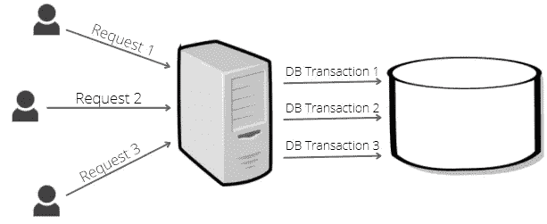
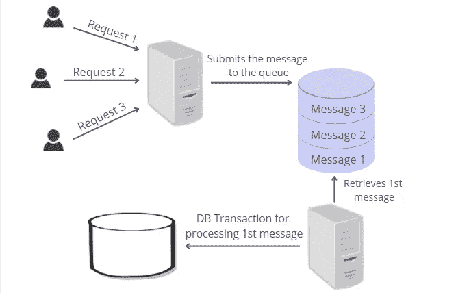

# 开发人员不应该害怕 SQL Server 中的死锁

> 原文：<https://levelup.gitconnected.com/developers-shouldnt-be-afraid-of-deadlocks-in-sql-server-8f8f4578675f>

## 后端开发人员处理死锁的策略。


在 [Unsplash](https://unsplash.com?utm_source=medium&utm_medium=referral) 上由 [Carlos Muza](https://unsplash.com/@kmuza?utm_source=medium&utm_medium=referral) 拍摄的照片

在项目中使用 MS SQL Server 时，软件开发人员可能会遇到以下错误信息:

***事务(进程 ID 69)与另一个进程在锁资源上死锁，并被选为死锁牺牲品。重新运行交易。***

虽然在某些情况下，死锁可以简单地通过一个更改来修复，但死锁通常可能是低效的数据库设计甚至是应用程序架构的结果，并且可能需要开发人员付出许多努力来最小化它们。

[什么是死锁？](#0564)
[受害者事务的重试逻辑](#07f1)
[如何最小化死锁？](#c4bd)
∘ [提高数据库性能](#e6f2)
∘ [降低事务隔离级别](#28f5)
∘ [按相同顺序访问对象](#ff22)
[限制并发事务数量](#34d4)
[汇总](#20b5)

# 什么是死锁？

当两个事务都在等待对方完成时，就会发生死锁，如果没有 MS SQL server 的干预，这种情况可能会无休止地继续下去。

让我们通过下面的示例来看看如何再现死锁:

*在这个例子中，死锁问题可以通过将事务降级到读提交隔离级别来解决。但是，会有更新丢失的问题。你可以在* [*我的另一篇文章*](/transaction-isolation-levels-in-ms-sql-guide-for-backend-developers-6a5998e34f6c#b494) *中阅读更多关于丢失的更新。*

如果您在一个会话中启动第一个事务，然后立即在另一个会话中启动第二个事务，您将看到死锁错误消息，因为:

*   第一个事务开始并获取该行的共享锁(第 9 行),并持有它直到事务结束(共享锁在可重复读取隔离级别的事务结束时被释放)。
*   第二个事务启动并获取第一个事务锁定的同一行的共享锁(第 18 行)。
*   第一个事务试图获取一个排他锁(第 11 行),但是**等待**,直到第二个事务从该行释放共享锁。
*   第二个事务试图获取一个排他锁(第 19 行)，但是**等待**直到第一个事务从该行释放共享锁。

两个事务都在等待对方从同一行释放共享锁，这是一个死锁问题。

与此同时，一个名为 **LOCK_MONITOR** 的独立 MS SQL server 线程在后台检查所有活动锁的周期。

一旦锁监视器检测到死锁(循环)，它将执行以下操作:

*   选择其中一个事务作为受害者。
*   终止受害者事务。
*   回滚受害者事务所做的所有更改。

默认情况下，牺牲事务是对数据库进行较少更改的事务，因此回滚会更便宜。但是，开发人员可以通过设置事务的死锁优先级来更改默认行为:

```
SET DEADLOCK_PRIORITY LOW;
```

可用选项有低、正常或高。此外，优先级可以设置在-10 到 10 之间。事务的默认优先级是正常的。

# 受害者事务的重试逻辑

当后端应用程序从数据库接收到死锁异常时，它可以向用户返回 500 错误。在这种情况下，用户将不得不手动重复他的动作一次或几次，直到它被服务器成功接受。

然而，用户体验是可以改进的，改进的提示在死锁错误消息中，即在第二句话中:

*事务(进程 ID 69)被另一个进程死锁在锁资源上，并被选为死锁牺牲品。* ***重新运行交易。***

MS SQL server 在检测到死锁后发出的错误消息提示我们重新运行受害者事务。重新执行的事务通常会成功，所以用户永远不会知道出错了。

项目的数据访问层应该能够使用线性或指数回退，在有限的尝试次数内重新运行受害者事务。

```
private int retryCount = 3;
private readonly TimeSpan delay = TimeSpan.FromSeconds(2);private const int DeadlockErrorCode = 1205;public async Task DatabaseCallWithRetryAsync()
{
    int currentRetry = 0; for (; ;)
    {
        try
        {
            await ExecuteDatabaseCallAsync();
            break;
        }
        catch (SqlException ex)
        {
            currentRetry++; if (currentRetry > retryCount ||
                   ex.ErrorCode == DeadlockErrorCode)
            {
                throw;
            }
        } await Task.Delay(delay);
    }
}
```

通过使用[重试模式](https://docs.microsoft.com/en-us/azure/architecture/patterns/retry)，您可以开发一个更加健壮和可用的应用程序。

# 如何最大限度地减少死锁？

重新运行受害者事务并不是开发人员在试图缓解死锁问题时应该做的唯一事情。尽量减少死锁的数量很重要，因为死锁会导致性能问题和应用程序延迟。

## 提高数据库性能

当事务由于长时间运行 SELECT、UPDATE 或其他语句而长时间运行时，死锁的可能性会增加。语句执行的时间越长，它对正在处理的资源的锁定时间就越长。

各种常见的数据库性能改进技术将降低死锁的可能性。这些技术包括:

*   使用聚集索引、非聚集索引和覆盖索引。
*   使用非规范化数据进行读取，使用规范化数据进行写入。
*   仅检索某些列并缩小查询谓词的范围。
*   对表列使用最小的数据类型。例如， **tinyint** 而不是 **int** 就足以存储一个人的年龄。
*   没有光标。

当然，这些和其他方法将改善数据库的整体健康状况、性能、内存消耗和更少的死锁将是一个不错的奖励。

## 降低事务隔离级别

降低隔离级别可以提高性能，但另一方面，也会增加并发问题的可能性。虽然在最高的可序列化级别不会出现任何并发问题，但最低的未提交读取级别会遇到所有这些问题，例如脏读取、不可重复读取、更新丢失和幻影读取。

降低事务的隔离级别应该根据具体情况仔细考虑。例如，如果您的事务读取大量静态数据，您可以设置 **read uncommitted** 隔离级别，而不用担心并发问题。只有当事务修改同时被另一个事务读取或修改的数据时，才可能出现并发问题，但静态数据永远不会改变。

您可以查看我的另一篇文章，以更好地理解事务隔离级别之间的差异:

[](/transaction-isolation-levels-in-ms-sql-guide-for-backend-developers-6a5998e34f6c) [## MS SQL 中的事务隔离级别:后端开发人员终极指南

### 选择正确的事务隔离级别是设计和开发过程中的一个重要部分

levelup.gitconnected.com](/transaction-isolation-levels-in-ms-sql-guide-for-backend-developers-6a5998e34f6c) 

## 以相同的顺序访问对象

当并发事务以相同的顺序访问对象时，死锁情况不太常见。

在上面的例子中，死锁的根本原因在于事务访问两个表的顺序。

*   第一个事务开始并获得用户行的一个独占锁(第 10 行)。独占锁将保持到事务结束。
*   第二个事务开始并获得 admin 行的独占锁(第 17 行)。独占锁将保持到事务结束。
*   第一个事务继续执行，并试图获取被第二个事务阻塞的管理行(第 12 行)的锁。
*   第二个事务继续执行，并试图获取被第一个事务**阻塞的用户行(第 18 行)的锁。**

与第一个事务相比，第二个事务以相反的顺序访问表，在第二个事务中简单地交换两个 update 语句(第 17 行和第 18 行)将消除死锁。

# 限制并发事务的数量

重试逻辑和应用技术来最小化死锁的数量可以在一定程度上帮助处理死锁问题。但是，在一些高负载的应用程序中，死锁仍然会导致性能问题，减少死锁的唯一方法是重新设计应用程序。

在具有大量长时间运行的并发事务的应用程序中，重试后的受害者事务可能会第二次陷入死锁，被选为受害者，以此类推。受害者事务可能会超过有限的重试次数，因此它不会将其更改应用到数据库。

如果后端接收到用户请求并立即启动数据库调用来处理这些请求，那么所描述的场景是可能的。

许多并发请求将导致相同数量的并发数据库事务，这将锁定共享资源并导致死锁。



这种架构无法扩展。可伸缩性差的一个标志是常规的数据库死锁。

在这种情况下，一个可能的解决方案是减少并发数据库事务的数量，这可以通过使用**队列**来实现。

整个流程将发生如下变化:

*   用户向后端应用程序提交请求。
*   后端服务向队列发布消息，队列可以是简单的内存队列，也可以是 RabbitMQ 这样的独立队列，并向用户返回响应。
*   单独的线程(在内存队列的情况下)或微服务(在独立队列的情况下)从队列中读取传入的消息，并启动数据库事务来处理该消息。
*   在处理完消息并完成事务后，服务可以开始处理队列中的下一条消息。



处理用户请求的基于队列的方法允许应用程序控制并发事务的数量，甚至将它们限制为一次一个事务(每个用户或其他类别)，因此死锁的可能性可以大大降低。

# 摘要

*   死锁是关系数据库中的自然现象，无法完全避免。
*   后端应用程序应该使用重试模式重新运行受害者事务。
*   提高数据库性能、降低事务隔离级别、以相同的顺序访问对象可以最大限度地减少死锁。
*   使用队列处理用户请求允许应用程序控制并发事务的数量，这提高了可伸缩性。

## 我的其他文章

[](/fast-database-fast-application-useful-db-performance-optimization-techniques-34b6926d1196) [## 快速数据库—快速应用程序(有用的数据库性能优化技术)

### 了解加速关系数据库的最佳实践。

levelup.gitconnected.com](/fast-database-fast-application-useful-db-performance-optimization-techniques-34b6926d1196) [](/50-software-engineering-best-practices-for-technical-leaders-and-seniors-cfcdf6a17e44) [## 面向技术领导者和资深人士的 50 个软件工程最佳实践

### 最佳工程师的最佳实践。

levelup.gitconnected.com](/50-software-engineering-best-practices-for-technical-leaders-and-seniors-cfcdf6a17e44) [](/5-ways-to-improve-the-performance-of-c-code-for-free-c89188eba5da) [## 5 种免费提高 C#代码性能的方法

### 慢速代码是可选的。

levelup.gitconnected.com](/5-ways-to-improve-the-performance-of-c-code-for-free-c89188eba5da)