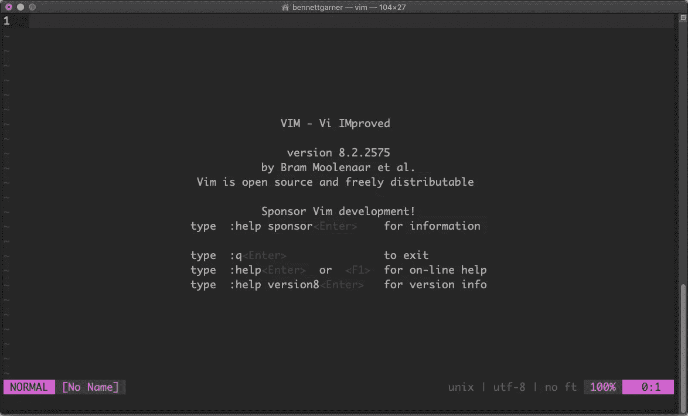
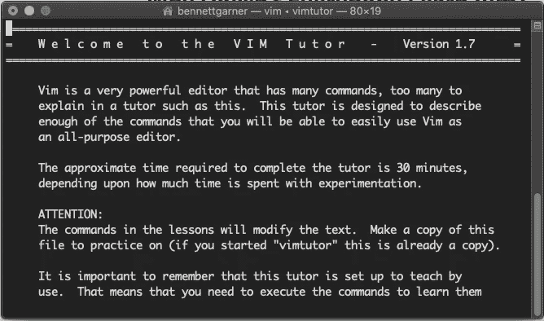
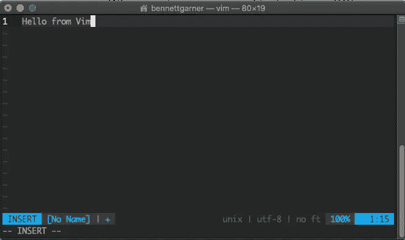
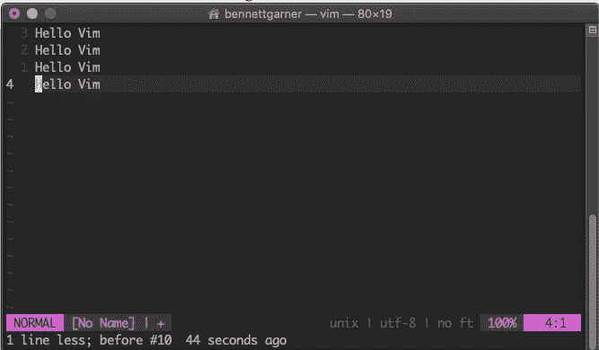
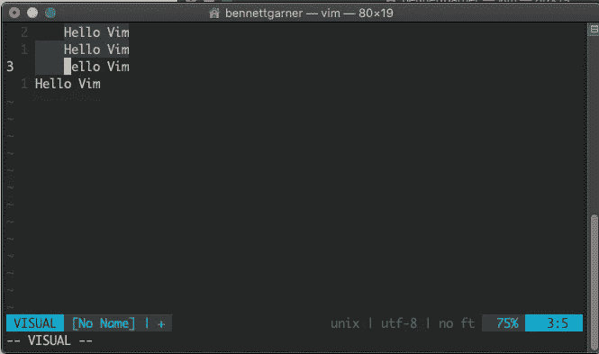

# 开发者:你应该学习 Vim

> 原文：<https://levelup.gitconnected.com/developers-you-should-learn-vim-9f05b2016307>

我所知道的最高效的开发人员都有一些共同点。他们知道如何使用 Vim。

欢迎来到 Vim

我并不是告诉你要一直使用 Vim(尽管你可以这样做)。但在这篇文章中，我将讨论为什么如果你想擅长软件开发，学习一个 30 岁的文本编辑器是重要的。

# Vim 的案例

Vim 是:

*   **使用起来非常快(一旦你学会)** — Vim 命令都来自键盘，它们允许你用单独的命令编辑整个单词、行或段落。一旦您理解了命令，批量编辑会使 Vim 的使用速度惊人地快。
*   **令人难以置信的高性能(不再需要等待文件打开)** —如果你曾经在试图编辑一个文件时等待 IDE 启动，你会明白我的意思。Vim 即时打开文件，编辑速度超快。不用等了。Vim 的轻量级内存是它预装在如此多的操作系统和服务器上的部分原因。
*   **随处可用(最重要的是:在你 SSH 到的机器上)** —这就是我所知道的最好的开发人员使用 Vim 的原因。他们通常更喜欢在本地 IDE 中编码，但是当他们在远程服务器上或者在不熟悉的机器上工作时，Vim 几乎总是预装的，以便快速编辑文本。

速度和可用性的结合使得 Vim 很难被击败。

# 为什么大家都不学 Vim？

简单地说:学习 Vim 很难。

不要让这吓到你。使用`$ vimtutor`或者像 [Open Vim](https://www.openvim.com/) 这样的在线教学工具，你可以在几分钟内学会 Vim 的基础知识。

但是你需要一段时间来消化 Vim 的命令和能力。在使用 Vim 的前几周，你会觉得自己走得更慢了！一开始很难记住所有的命令。

不过，在使用 Vim 键绑定大约一个月后，我保证您会比在旧编辑器中更有效率。

几个月后，你会想没有 Vim 你是怎么生活的。

# 喜欢你在这里读到的吗？

我免费与我的电子邮件列表分享我最好的内容。

加入我的电子邮件系列中的 500 名其他开发人员。棘手的部分:Vim 有模式

在普通文本编辑器或 IDE 中键入时，通过键入新字符或删除现有字符来操作光标旁边的字符。当您想在 IDE 中移动光标时，可以单击或使用箭头键。

维姆不是这样的。

Vim 是一个模态文本编辑器，这意味着它有多种不同的“模式”,您可以与页面上的文本进行交互。

*   在“插入”模式下，Vim 的操作很像标准的 IDE，添加和删除字符。

*   但是在“正常”模式下，你大部分时间都在这里，你可以使用键盘成组地移动、复制、操作和删除文本。

*   在“可视化”模式下，Vim 允许您突出显示和更新整个文本部分。

模式之间的切换以及使用键盘(不用鼠标)是 Vim 使用起来如此快速的原因。

# 分组编辑速度更快

在普通的 IDE 中，如果你想删除整个段落，你可以用鼠标高亮显示该段落，然后按下`delete`。

在 Vim 中，要删除相同的段落，只需在正常模式下键入`dap`。

虽然这种差别看起来微不足道，但能够键入所有命令意味着您可以更快地编辑。你不必在键盘和鼠标之间切换。没有更多的狩猎，点击和拖动。只需 3 次按键。

随着时间的推移，效率的提高会越来越多。使用 Vim，您可以非常快速地对文件进行大的修改。

例如，想要将一个函数复制到文件中的不同位置？

在 IDE 中:

1.  用鼠标突出显示该功能
2.  `cmd+x`(斩)
3.  单击到新位置
4.  `cmd+v`(粘贴)

在 Vim 中:

1.  `dap`(删除&复制段落)
2.  `3}`(移动到新位置—也可以是`7{`、`4j`、`12k`、`G` —在 Vim 中有很多方法可以移动文件)
3.  `p`(粘贴)

这似乎并不令人印象深刻。但是您甚至可以在完成 IDE 版本的步骤#1 之前输入`dap3}p`。

在 Vim 中编写高效的命令可以让您的生产率更上一层楼。

# 重复命令以提高效率

一旦你学会了如何重复命令，Vim 就会变得非常强大。

Vim 中的`.`键重复您的最后一个命令。学会有效地使用`.`是在 Vim 中变得又好又快的关键之一。

使用`.`，我可以对一段文本的多行或多个实例进行同样的修改。例如:

*   想在多行末尾加分号？

1.  `A;<esc>` —在该行末尾添加分号
2.  `j` —移动到下一行
3.  `.` —再次添加分号(重复#1)

*   想把“foo”的一些实例替换成“bar”？

1.  `/foo` —在文档中查找“foo”
2.  `cw` —更改单词
3.  `bar<esc>` —“条形”类型
4.  `n` —找到“foo”的下一个实例
5.  `.` —重复命令`cwbar<esc>`

这很酷，并且使重复的改变更快。

# 宏:Vim 是一个可编程编辑器

但是如果我的更改需要多个命令呢？`.`命令只支持重复上一个命令，有时我想重复一个需要多次编辑的更改。

输入宏。只需按下`qa`，我就可以开始记录我正在编写的命令。再次按下`q`停止录制，现在我可以使用`@a`在任何地方重复该宏。

宏在 Vim 会话中是持久的，所以它们是可重用的。在我上面的例子中，我选择了`a`来存储我的宏，但是你可以选择任何键。`qb`、`qc`、`qz`都是启动宏的有效方式。

一旦你到了在 Vim 中使用宏的程度，你就开始觉得自己拥有了超能力！您可以预测并重复修改复杂的文本。有了宏，在 Vim 中工作变得更加高效。

但是要小心！权力越大，责任越大，宏也不例外。就像编码一样，记录宏需要精确性，以确保它在所有情况下都能按预期工作。当你创建宏的时候要注意。如果创建得太松散，可能会适得其反。

# 插件:可扩展+快速

Vim 支持插件来添加更多功能。

我不可能列出所有你可能使用的 Vim 插件。但是不用说，插件可以极大地改善你的编辑体验，并给你通常在 IDE 中发现的洞察力。

一些最流行的插件包括:

*   [Vim sensible](https://github.com/tpope/vim-sensible) —基本自以为是的设置
*   [lightline](https://github.com/itchyny/lightline.vim) —一条更明显的状态线
*   [超级标签](https://github.com/ervandew/supertab) —更好的标签完成
*   [书呆子树](https://github.com/preservim/nerdtree) —文件系统资源管理器
*   [书呆子评论者](https://github.com/preservim/nerdcommenter) —支持各种语言的评论
*   [ctrl+p](https://github.com/kien/ctrlp.vim) —模糊文件搜索
*   [Vim gitgutter](https://github.com/airblade/vim-gitgutter) —在行号旁边显示 git diff

如果默认的 Vim 缺少一个你喜欢的特性，很可能有一个插件可以实现它！

# Vimrc:终极可定制性

除了插件之外，你还可以调整你能想到的任何东西，这样你的编辑器就可以根据你的喜好来定制。

想看看我的 vimrc 吗？

 [## Bennett 39/配置

### 创意存储、资源书签、论坛- bennett39/config

github.com](https://github.com/bennett39/config/blob/master/vim/vimrc) 

# 高效编辑很重要

那又怎样？

好吧，也许 Vim 是一个很棒的文本编辑器。它真的那么好，值得你花时间去学习吗？

最终，你必须自己回答这个问题。

*   如果您的工作涉及 SSH 到远程机器，那么学习 Vim 对于拥有一个可以在任何地方工作的编辑器几乎肯定是值得的
*   如果您主要在本地开发，但是不喜欢您的 IDE，您可能会喜欢“ [Unix as IDE](https://blog.sanctum.geek.nz/series/unix-as-ide/) ”这个概念
*   如果您真的喜欢您的 IDE，总有办法将 Vim 键绑定添加到您的 IDE 中，这将使您的效率更上一层楼

对我来说，作为一名后端开发人员，我花了相当多的时间登录远程机器。我也碰巧喜欢 Unix 作为 IDE 哲学，所以我喜欢 Vim。(明显吗？我为此写了一整篇文章。)

对于您来说，可以将 Vim 视为开发工具箱中的一个工具。对于开发人员来说，擅长编辑文本不是一件小事。在你的职业生涯中，你会输入成千上万行代码。

剪辑要快。思考代码和它是如何工作的应该是困难的部分。当需要更新屏幕上的代码时，你的手指应该能够以你所能想到的速度进行编辑。

最后，这就是我喜欢 Vim 的地方:以思考的速度编辑代码。

# 关于班尼特

我是一名用 Python 和 JavaScript 构建东西的 web 开发人员。

*想要我关于 web 开发和成为更好的程序员的最佳内容吗？*

我在邮件列表中分享我最喜欢的建议——没有垃圾邮件，没有推销内容，只有有用的内容。

[加入我的电子邮件系列中的 500 名其他开发人员。](https://sunny-architect-5371.ck.page/0a60026a5d)