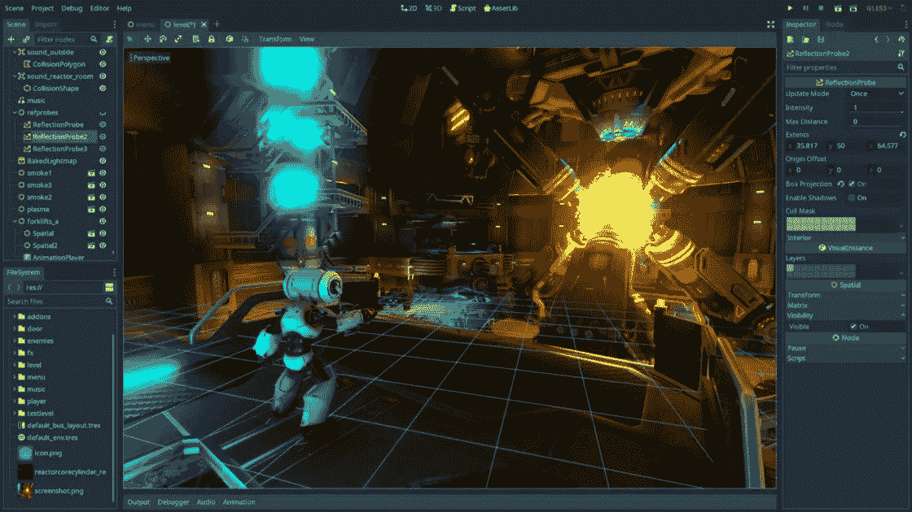
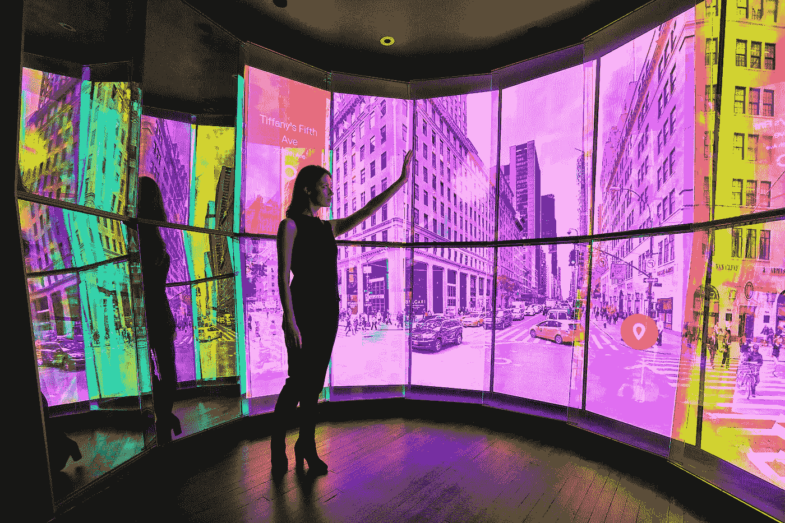

# 使用流行的 3D 引擎和框架

> 原文：<https://levelup.gitconnected.com/developing-3d-trying-popular-engines-and-libraries-f8476ed8abd7>

## 出于创作目的的流行 3D 框架之旅。

克里斯汀·麦克亚当斯在 [Unsplash](https://unsplash.com?utm_source=medium&utm_medium=referral) 上的照片

如果你像我一样，没有什么比编写或设计软件更能给你带来快乐了。我在编写代码时获得的巨大快乐让我开发了跨越许多软件领域的项目。

其中一个领域是为本地应用程序、桌面展示或 Web 创建 3D 图形。我从未创建过任何 3D 游戏，但有很多时候我需要创建一个 3D 物理模拟或呈现一个 3D 场景来响应作为输入接收的数据流。

在我决定开发 3D 软件之前，没有人警告过我，决定从什么开始将是一个挑战。从为创意场景设计的过多框架来看，在开始做任何工作之前，我必须做大量*工作*。

**免责声明**:这不是另一个“top X”帖子。我将谈到的一些技术可能肯定会受欢迎，但这不是重点。3D 图形场景是巨大的，这更像是我的一些解决方案的方法和经验的文档，而不是顶级框架的比较。

# 游戏引擎

啊，我遇到的大多数软件工程师的甜蜜圣杯。

我在生活中接触过的大多数开发者对创建一个游戏或者甚至使用它们都有一个非常模糊的概念。3D 图形是一种完整的哲学，它包含了许多软件工程师害怕的东西；数学。四元数，矩阵变换，如何应用于光线投射，照明如何工作(仅举几例)。

在理论部分之后，接下来是实践部分:文件格式(PNG，GLTF，importers)，网格，图形规范(OpenGL，WebGL，Vulkan，Metal)。然后你有物理引擎，声音引擎，游戏引擎，人工智能引擎。

幸运的是，我们有游戏引擎来帮助我们从所有这些烦人的事情中抽象出来，减轻开发者的负担，让我们专注于重要的事情:我们的游戏。但是如果我们不想做一个游戏呢？如果我们希望运行 3D 模拟，可视化一些数据，查看一些模型，或者在简单的 AR 应用程序中工作，该怎么办？

# AAA 游戏引擎

在游戏开发场景中，你有那些大型的游戏引擎，它们能够让一切开箱即用，比如[虚幻引擎](https://www.unrealengine.com/)、[统一](https://unity.com/)、 [CryEngine](https://www.cryengine.com/) 。这些引擎绝对无所不能。它们最初的设计是为了构建游戏——这一点也很明显。一些最好的 AAA 级游戏就是用这些来制作的。还有 [Godot](https://godotengine.org/) 发动机。

不久前，我用我的 Mac 开始了我的游戏引擎之旅。我知道在 Mac 上玩游戏多年来一直是一种事后想法(无论是创作还是游戏)，但由于各种原因，不在 Mac 上开发和玩游戏是一个交易破坏者。首先说明了一个游戏/游戏引擎是多么的有思想。其次，我的主要开发机器是 Mac，我不打算很快放弃它。最后，AR 在 iOS 上大放异彩，通过 Metal，macOS 已经变成了一只处理野兽。无论如何，把我在这里的经历看作是使用 Mac 获得的(尽管事件的性质对读者来说应该没有什么不同)。

AAA 引擎是有成本的，要么是版税，要么是月租费。然而，提到的那些提供了一些非常宽松的免费计划，允许在生产中进行实验和使用。

根据我对 Unity 和 Unreal 的有限经验，我会说 Unreal 在“最好看的游戏引擎”类别中获胜，同时仍然能够在 Mac 上开发(CryEngine 目前无法做到这一点)。然而，Unity 肯定会在“最佳生态系统”方法中胜出。对于我的简单 3D 游戏来说，通过执行简单的谷歌搜索就可以相对容易地找到我需要的任何东西。我相信 Unity 的编程模式与此有关。你看，在虚幻中，你要么用[蓝图](https://docs.unrealengine.com/en-US/ProgrammingAndScripting/Blueprints/index.html)(虚幻的可视化脚本系统)要么用 C++。Unity 还提供了可视化脚本系统(我不相信它有虚幻的那么全功能)和 C#。C#是一种比 C++更容易学习和使用的语言，这使得开发对缺乏经验的程序员来说更有吸引力。

难怪大部分游戏开发的工作申请都会提到 Unity 作为先决条件。

**对于发烧友:Godot**
然而，最近又有一个游戏开发引擎引起了我的注意，它的名字叫 [Godot](https://godotengine.org/) 。Godot 将自己标榜为“我们一直在等待的游戏引擎”，并介绍了一种“制作游戏的不同方式”。

我很感兴趣，我决定试一试，我被深深打动了。

Godot 在我的 Mac 上占用了大约 75mb，包括整个应用程序和游戏引擎。它是完全免费和开源的。没有版税，没有付款，甚至没有一个简单的注册。

Godot 的开发模型围绕着将行为和外观放入动画和脚本等对象中，并在您喜欢的任何地方重用它们。这对我来说是相当新的——它只是“点击”到我的脑海里。这是我想发展我的场景的方式。更不用说让你想使用引擎的好看的用户界面了。Godot 的脚本语言主要是 GDScript，这是一种完全有能力的类似 python 的语言，对 C++(通过绑定)和 C#(在以后的版本中添加)的支持也是存在的，并且是完全支持的。

传闻戈多擅长 2D 游戏开发，但不擅长 3D 游戏。对于我创建的场景和引擎中包含的演示，Godot 已经足够了，尽管它不能在复杂的 3D 场景和 AAA 引擎中执行。也就是说，Godot 渲染引擎正在被重写以使用 Vulkan(在 OS X 上，它将使用 MoltenVK 作为从 Vulkan 到 Metal 的转换层)，因此 Godot 4.0 将在性能和质量上缩短与 AAA 引擎的距离。

总而言之，Godot 是我在开发爱好项目时最喜欢的游戏引擎。GDScript 非常适合游戏开发。Godot 对开发者非常友好，甚至有人只用引擎本身就在 Godot 中创建了一个精灵编辑器。

总的来说，如果我要在游戏开发上投入时间被大公司录用，我会选择 Unity，并且仍然学习 Godot。对于我目前的项目来说，无非是简单的概念证明或者简单的模拟，Godot 绰绰有余，会变得更好。

荣誉奖:有点跑题，但是如果你在寻找一个优秀的 2D 游戏引擎，可以看看 [Cocos](https://www.cocos.com/) 。

# 图形框架/中间件

对于任何涉及 3D 图形的项目来说，拥有诸如 Unreal、Unity 或 Godot 这样的游戏引擎似乎已经足够了。

这不是真的。虽然这些引擎能够产生我感兴趣的那种图形保真度，但我决定不在需要 3D 图形的项目中使用它们。对于许多用例来说，使用一个全功能的游戏引擎似乎有些过头了。

我带着以下心态接近这些引擎:

*   我是一名业余 3D 开发者(注意，我是**而不是**游戏*开发者)*
*   我想创作 3D 图形，并将它们与声音很好地结合起来，使它们具有互动性。
*   我希望能够使用默认的物理引擎进行简单的模拟。
*   我希望将我构建的任何东西整合到一个本地应用程序中，无论是在 Windows、iOS、Android 还是桌面上。

当谈到研究创造性编码的解决方案时，我需要做的第一个选择是，我是为浏览器(我可以把它嵌入任何地方)还是为桌面开发一些东西。我研究了做我需要的事情的两种方法。

**Web 3D 的优点:**

*   更容易设置
*   它不需要你搞乱原生编译——这是一个痛苦，因为操作系统及其驱动程序和 OpenGL 实现之间的差异。
*   你不用担心 OpenGL 被弃用(尤其是如果你想解决 macOS 用户)。
*   开发人员友好的框架比原生的要多得多
*   Javascript 比 C++(大多数原生 3D 库和框架选择的语言)更容易接近。
*   本质上是跨平台的。它还可以毫不费力地嵌入任何 web 应用程序。

**原生 3D 的优点:**

*   极致性能。你能做的没有限制。如果 OpenGL 不够，你还有 Vulkan 或 Metal。
*   您可以更好地访问计算机的外围设备。这对于从事外部输入的创造性编码人员来说很重要。
*   它有多线程。Javascript 不支持这种情况。
*   您有更多的选择(尽管这些选择中的大多数要求您比开发浏览器时更深入)
*   C++很好用。不，真的。就像当你想要一个[表达 API 来执行数学计算](https://github.com/g-truc/glm)时。运算符重载在 C++和 GLM 中大放异彩。
*   我知道我们在谈论 3D——但如果你想把你的视觉和声音联系起来，本地库和网络库之间根本没有可比性，所以根据你需要的声音处理量，你必须使用本地库。

最终，我的项目需求决定了我应该走的路。所有这些的要点是，Web 有它自己的一套限制，通过提供开发的方便性和简单性来弥补这些限制。我会说，如果你想利用外围设备、声音/视频处理等，先从 Web 方法开始，然后深入到 Native。

# 原生创造性编码框架

## [开放框架](https://openframeworks.cc/)

OpenFrameworks 对于有创造力的程序员来说是一个完美的解决方案。这是一个基于 C++的开源项目，它的文档非常优秀。与其他创造性的编码框架相比，OpenFrameworks 存在的时间最长，因此它的社区要大得多。OpenFrameworks 的许多出色功能可以归功于它所拥有的巨大的附加生态系统。有些比其他的维护得更好，但它确实表明 OpenFrameworks 是一个为您的解决方案构建基础的良好支持的框架。当涉及到支持 Kinect 这样的外设时，很有可能有人已经为它发布了一个库。

考虑 OpenFrameworks，如果:

*   你想要一个使用 C++的高性能创造性编码框架
*   你需要利用这个巨大的社区，需要这个社区提供的任何强大的扩展。

## [煤渣](https://libcinder.org/)

Cinder 是 OpenFrameworks 的替代方案。它的用户群要小得多，但是它的目标用户是那些想要健壮的面向对象方法的开发人员。OpenFrameworks 有一种用 C++语言包装 C 风格代码和库的方法。另一方面，Cinder 是围绕与 C++一起使用的概念构建的。

这使得 Cinder 成为一个非常成熟的框架，具有很好的编程范式，旨在被经验丰富的开发人员所利用。它有非常好的文档，并且内置了对音频、视频和图像处理的支持。它还提供了丰富的数学和实用程序库作为其核心的一部分。

使用煤渣时，我非常喜欢的一点是，从头开始创建某个东西是多么容易，同时还可以用它来接近金属。Cinder 不会对你想做什么做太多假设。

如果你想了解更多关于 T4 由 Cinder T5 开发的一些项目，这里有一个展示页面。

谁应该使用煤渣？

*   寻找 OpenFrameworks 替代品的有创造力的程序员
*   寻找更以 C++为中心的创造性编码方法的开发人员。
*   那些不害怕尝试新事物的人，他们生活在一个小社区的框架中

一些由 Cinder 创建的项目甚至已经出现在大公司的装置中，比如谷歌深城项目。

## 优秀奖 1: [万能引擎](https://magnum.graphics/)

Magnum Engine 是一个框架，作为跨平台数据可视化的底层选择之一引起了我的注意。

我最终没有使用它，因为我的项目总是需要更高层次的东西。我不禁对为图形提供平台所做的工作印象深刻，而不仅仅是现成的库。

Magnum 是一个可以用来开发自己的解决方案或库的框架。支持 OpenGL，目前正在添加 Vulkan。如果你喜欢花时间在低级图形机制上，这是适合你的框架。

## 荣誉奖 2: [bgfx](https://github.com/bkaradzic/bgfx)

[bgfx](https://bkaradzic.github.io/bgfx/overview.html) 是一个跨平台的渲染库。它是低级的，面向 C++的。bgfx 支持各种各样的渲染后端和平台:Direct3D、Metal、OpenGL、Vulkan——所有这些都适用于 iOS、Android、Linux、Windows 等。

完成的工作是惊人的，它是一个非常久经考验的低级图形库。很多游戏都用这个作为他们的渲染后端(像 ioquake3，mame)，它的能力是无限的。有趣的事实:它也被巴比伦当地人使用(阅读下文)

bgfx 是非常低级的，它在渲染框架和平台之上提供了一个很好的抽象层，这样你就不必考虑支持不同的供应商和代码库。

因此，它不太适合创造性编码，但这并不意味着你不应该使用它。您应该意识到，如果您打算使用它，您将希望比您通常使用 OpenFrameworks 之类的解决方案做得更深入。

# 网络创意编码框架

**如果你正在寻找一种在网络上制作 3D 的方式**，那里的事情会更简单。我只用过网络上两个可用的引擎，但是有了这些引擎，我真的不需要比它们提供的更多的东西。

## 三个 j

ThreeJS 是网络上最流行的 3D 图形框架。它有一个充满 3D 例子的网站。它的社区很大，也有基于它的游戏引擎。这是因为 ThreeJS 本身并不是一个游戏引擎。事实上，它只不过是渲染图形。

然而，它做得远远不够。多年来，人们一直用它建造美丽的东西。我在简单的项目中使用过它，在那里我试图为一个特定的用例制作简单的 GLTF 查看器。我发现我可以很容易地创建 3D 场景，放一些东西进去，放一些灯光和一个相机。图像质量也很出色。

ThreeJS 自带编辑器，可以构建基本场景或者测试现有场景；有许多导出选项。你可以创建一个场景并导出到三个 JS 原生格式，COLLADA，GLTF，波前 obj 等等。总的来说，和它一起工作感觉很棒，直到我需要更多东西的时候。

## [Babylon.js](https://www.babylonjs.com/)

我必须承认，我不确定 Babylon.js 是否应该归入这一类，因为它既可以用作游戏引擎，也可以用作创造性的编码框架。

Babylon.js 于 2013 年发布，由两名微软员工开发，目前仍由微软提供支持。巴比伦是一个成熟的游戏引擎，它不仅仅是一个创造性的编码框架或渲染引擎。它还被[扩展到覆盖本地平台](https://github.com/BabylonJS/BabylonNative)——尽管现在说结果如何还为时过早。Babylon Native 使用 [bgfx](https://github.com/bkaradzic/bgfx) 作为其渲染后端。

Babylon.js 附带了一个很棒的游乐场工具，允许一些实时编码和场景构建。它还包括一个精灵编辑器，一个材质编辑器，等等。还有一个[优秀编辑器](http://editor.babylonjs.com/)，由社区维护，开源。它支持拖放材料和对象，设置具有高级灯光效果的场景，放置声音效果，构建游戏逻辑，等等。

根据我的经验，Babylon 已经使用更多的自然光照渲染了我放进去的场景，并且它还能够处理具有成千上万个对象的更大的场景，而不会有太大的压力。

虽然您可以使用编辑器创建巴比伦场景，但是您也可以使用普通的 javascript 库来手工创建。这非常重要，因为我想动态加载一些 GLTF 模型，并根据导入的模型添加一些灯光和效果。我不能用预建的模型来做这件事。设置摄像头也非常简单。

ThreeJS 中让我更喜欢 Babylon 的是易用性，它拥有的具体 API，一流的类型脚本支持，以及优秀的工具链。

# 结论

我想通过这篇文章记录我多年来使用一些 3D 引擎/框架的经历。无论您的体验如何，创建 3D 图形都充满乐趣和挑战。这对我来说也是最有回报的，尽管我目前没有一份支持这类项目的工作。

总的来说，3D 图形软件领域似乎充满了解决方案，没有一个放之四海而皆准的方法。最有帮助的是理解 3D 图形的基础理论和技术，然后每次都以解决明确定义的问题的心态来处理每个框架/引擎。因此，你应该做大量的工作来确定每个场合的 3D 软件工具。

## 有趣的链接:

*   [Awsome 创意编码](https://github.com/terkelg/awesome-creative-coding)库和框架集合
*   比较好的(有点过时)更多的图形框架。[https://dev . to/funatsufumiya/comparison-of-c-low-level-graphics-cross-platform-frameworks-and-libraries-58e 5](https://dev.to/funatsufumiya/comparison-of-c-low-level-graphics-cross-platform-frameworks-and-libraries-58e5)
*   [Ogre3D](https://www.ogre3d.org/) —开源 3D 图形引擎
*   [勤奋引擎](http://diligentgraphics.com/)——另一个有趣的 3D 引擎