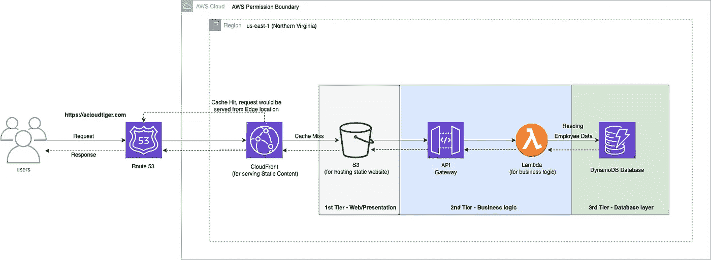
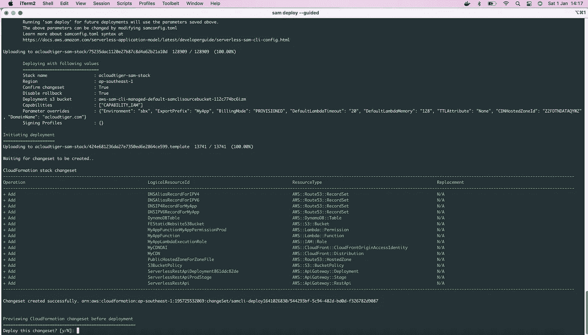

# 使用 AWS 无服务器应用程序模型(SAM)框架开发三层无服务器 web 应用程序

> 原文：<https://levelup.gitconnected.com/developing-a-3-tier-serverless-web-application-using-aws-serverless-application-model-sam-1c8b03dfef8e>

W 借助 **AWS SAM(无服务器应用程序模型)**，我们可以在 AWS 上创建无服务器资源来构建&开发无服务器应用程序，例如无服务器资源，如 **AWS Lambda、AWS API Gateway、**等。不仅如此，在 Lambda 被推送到 AWS Cloud 之前，我们可以使用 SAM 在本地开发、构建和测试 Lambda，而不是直接在 AWS 控制台上编写 Lambda，这节省了在本地系统本身调试 Lambda 的大量时间，并确保了生产率。


AWS 无服务器应用程序模型

在本文中，我们将了解如何使用 AWS SAM 构建一个简单的 3 层无服务器 web 应用程序，并借助一些 **CLI(命令行界面)**命令，我们如何从本地系统将它部署到 AWS Cloud，然后在这个域[https://acloudtiger.com](https://acloudtiger.com)访问它。

(*请注意，我将在本博客上线时停用资源，因此我们的无服务器应用程序将无法在该给定域访问*)

# 使用 AWS 的优势 SAM:-

1.  自动气象站云系的扩展
2.  本地开发、构建、调试和测试
3.  支持集成 CI/CD 服务器，如 Jenkins、Atlassian Bamboo 等，作为单个部署配置 YAML 文件
4.  对其他 AWS 工具/资源的本机支持，如 AWS Cloud9 IDE、代码构建、代码部署和代码管道

# 我们的三层无服务器 Web 应用程序架构:-



**AWS 3 层典型无服务器 Web 架构**

## 步骤 1:确保安装并配置了 AWS CLI 和 SAM CLI

在此访问 AWS 文档[https://docs . AWS . Amazon . com/server less-application-model/latest/developer guide/server less-Sam-CLI-install . html](https://docs.aws.amazon.com/serverless-application-model/latest/developerguide/serverless-sam-cli-install.html)并根据您的操作系统在您的本地系统中安装二进制文件。您还需要确保在 AWS CLI 中为 IAM 用户配置了访问密钥和秘密访问密钥。

(要使用您的 CLI 配置 IAM 用户的访问/秘密访问密钥，您可以参考[https://docs . AWS . Amazon . com/CLI/latest/User guide/CLI-configure-quick start . html](https://docs.aws.amazon.com/cli/latest/userguide/cli-configure-quickstart.html)

## **步骤 2:初始化 SAM 应用程序**

使用以下命令初始化 SAM 应用程序:-

```
sam init --runtime nodejs14.x --name <application name>
```

在这里，我选择了 NodeJS 作为运行时，但是您可以自由选择任何其他运行时，如 Python 等。您还需要在名为 name 的标志中给出一个应用程序名称。

一旦执行，它将在终端上为您提供一些选项，作为一个基本的启动项目。你可以选择基本的 hello world 作为例子。

一旦完成，它就用一个**模板在本地生成一个框架项目结构。YAML** 文件。

## 步骤 3:使用 SAM 模板创建 AWS 资源。YAML 文件

要使用模板创建 Lambda 函数，请在 Resources 标记中添加以下配置，如下所示

```
# -------------------------------------------------------------- #
#                                  Resources                                   #
# -------------------------------------------------------------- #

Resources:
MyAppFunction:
    Type: AWS::Serverless::Function # More info about Function Resource: https://github.com/awslabs/serverless-application-model/blob/master/versions/2016-10-31.md#awsserverlessfunction
    Properties:
      CodeUri: my-app/
      Handler: app.lambdaHandler
      Runtime: nodejs14.x
      MemorySize: !Ref DefaultLambdaMemory
      Timeout: !Ref DefaultLambdaTimeout
      Role: !GetAtt MyAppLambdaExecutionRole.Arn
      Environment:
        Variables:
          RUNTIME_DDB_TABLE_NAME: !Ref DynamoDBTable
      Architectures:
        - x86_64
      Events:
        MyApp:
          Type: Api # More info about API Event Source: https://github.com/awslabs/serverless-application-model/blob/master/versions/2016-10-31.md#api
          Properties:
            Path: /hello
            Method: get
```

*注，****myapp function****是给 Lambda 的逻辑名。*您可以给它起任何名字，并且可以通过使用 ARN (Amazon Resource Name)将这些资源引用到任何其他 AWS 资源，例如**！GetAtt MyAppFunction。Arn**

my Lambda 的文件名是 ***app.js*** 在名为 **my-app** 的文件夹内(参考上面 template.yaml 定义中的 **CodeUri: my-app/** )。您可以在 Lambda 函数中编写自己逻辑。**出于演示的目的，我在下面列出了每当这个 Lambda 第一次被调用时向 DynamoDB 表写入一个项目的逻辑，如下所示** :-

```
const AWS = require("aws-sdk");

//All Cold Start Code of Lambda goes here
const dynamodb = new AWS.DynamoDB.DocumentClient();
const ddbTable = process.env.RUNTIME_DDB_TABLE_NAME;

//All Warm Start Code of Lambda goes withing LambdaHandler
exports.lambdaHandler = async (event, context) => {
    let body;
    let statusCode = 200;
    const headers = {
      'Content-Type': 'application/json',     
      'Access-Control-Allow-Headers': 'Content-Type',
      'Access-Control-Allow-Origin': '*',
      'Access-Control-Allow-Methods': 'GET'
    };

    try {
        // Adding random data to DynamoDB table - Adding static data just for this Sample App otherwise data will be populated based on parsing the Request
        await dynamodb
          .put({
            TableName: ddbTable,
            Item: {
              'id': 'E1001',             
              'name': 'Vinod Kumar',
              'company': 'My Company',
              'email': 'vinod827@yahoo.com'
            }
          })
          .promise();

        // Retrieving data from DynamoDB table - Just from demo purpose only otherwise data will be fetched based on given employee id sent dynamically through headers
        body = await dynamodb.get({ TableName: ddbTable, Key: { id: 'E1001' }}).promise(); // To retrive 1 item

    } catch (err) {
        console.log(err);
        statusCode = 400;
        body = err.message;
        return err;

    } finally {
        body = JSON.stringify(body);

    }

    //return response
    return {
        statusCode,
        body,
        headers
    };

};
```

类似地，要添加另一个无服务器资源，如 DynamoDB 表，请在同一个模板中添加以下内容

```
# ------------------------------------------------------------ #
#                        DynamoDB Table                              #
# ------------------------------------------------------------ #
  DynamoDBTable:
      Type: AWS::DynamoDB::Table
      Properties: 
        AttributeDefinitions: 
          - AttributeName: id
            AttributeType: S
        KeySchema: 
          - AttributeName: id
            KeyType: HASH
        ProvisionedThroughput: 
          ReadCapacityUnits: 5
          WriteCapacityUnits: 5
        Tags: # Optional
          - Key: Namespace
            Value: '@MyApp'
          - Key: Name
            Value: !Sub
            - '${ExportPrefix_}DynamoDBTable'
            - ExportPrefix_: !If
              - HasExportPrefix
              - !Join ['-', [!Ref ExportPrefix, !Ref Environment, '']]
              - !Join ['-', [!Select [0, !Split ["-", !Ref "AWS::StackName"]], !Ref Environment, '']]
          - Key: Environment
            Value: !FindInMap [Environment, FullForm, !Ref Environment]
        TimeToLiveSpecification: !If
          - HasTTLAttribute
          - AttributeName: !Ref TTLAttribute
            Enabled: true
          - !Ref 'AWS::NoValue'
```

为了完成我们的 3 层无服务器 web 应用架构，下面是模板的完整版本。YAML 文件，它将创建 AWS 资源，如 Lambda、DynamoDB、API 网关、CloudFront 分发、Route 53 公共托管区域等。您可以简单地将下面的内容复制并粘贴到您自己的模板中。YAML 档案。

```
AWSTemplateFormatVersion: '2010-09-09'
Transform: AWS::Serverless-2016-10-31
Description: >
  AWS Serverless Application Model app
  Sample application

Globals:
  Function:
    Timeout: !Ref DefaultLambdaTimeout # Limit 900 seconds (15 minutes)
    MemorySize: !Ref DefaultLambdaMemory # Limit 128 MB to 3,008 MB, in 64 MB increments

  Api:
    Cors:
      AllowMethods: "'DELETE,GET,HEAD,OPTIONS,PATCH,POST,PUT'"
      AllowHeaders: "'Content-Type,X-Amz-Date,X-Amz-Security-Token,Authorization,X-Api-Key,X-Requested-With,Accept,Access-Control-Allow-Methods,Access-Control-Allow-Origin,Access-Control-Allow-Headers'"
      AllowOrigin: "'*'"    

Parameters:
  Environment:
    Type: String
    Default: dev
    Description: Deployment Environment
    AllowedValues:
      - sbx
      - dev
      - qa
      - stage
      - prod
  ExportPrefix:
    Type: String
    Default: 'myapp'
    Description: >-
      Prefix for the managed resources and cloudformation exports.
      Provide it in `namespace-environment` format,
      where namespace can be product UPI or leave blank for defaults.
    AllowedPattern: ^[a-zA-Z]+(-?[a-zA-Z0-9]+)*$
    ConstraintDescription: >-
      Only hyphen (-) separated alphanumeric string is allowed. Should start with a letter.
    MinLength: 3
    MaxLength: 30
  BillingMode:
    AllowedValues:
    - PAY_PER_REQUEST
    - PROVISIONED
    Default: 'PROVISIONED'
    Description: >-
      Specify how you are charged for read and write throughput and how you manage capacity.
      Set to PROVISIONED for predictable workloads and PAY_PER_REQUEST for unpredictable workloads.
      PAY_PER_REQUEST sets the billing mode to On-Demand Mode
    Type: String
  DefaultLambdaTimeout:
    Default: 3
    MinValue: 3
    MaxValue: 900
    Description: >-
      The amount of time that Lambda allows a function to run before stopping it.
      The default is 3 seconds.
      The maximum allowed value is 900 seconds.
    Type: Number
  DefaultLambdaMemory:
    Default: 128
    MinValue: 128
    MaxValue: 3008
    Description: >-
      The amount of memory that your function has access to.
      Increasing the function's memory also increases its CPU allocation.
      The default value is 128 MB. The value must be a multiple of 64 MB.
    Type: Number
  TTLAttribute:
    Default: None
    Description: >-
      Attribute name for time to live. Provide None or leave blank for if not required.
    Type: String
  CDNHostedZoneId:
    Default: 'Z2FDTNDATAQYW2'
    Description: >-
      CloudFront hosted zone id. 
      Always Static Value. 
      Refer AWS Documentation here
      https://docs.aws.amazon.com/AWSCloudFormation/latest/UserGuide/aws-properties-route53-aliastarget.html#cfn-route53-aliastarget-hostedzoneid
    Type: String
  DomainName:
    Default: 'acloudtiger.com'
    Description: >-
      Registered domain name with Top Level Domain as .com
    Type: String

# --------------------------------------------------------------- #
#                                   Mappings                                   #
# --------------------------------------------------------------- #

Mappings:
  Environment:
    FullForm:
      sbx: sandbox
      dev: development
      stage: staging
      qa: qa
      prod: production

# ------------------------------------------------------------ #
#                                  Conditions                                  #
# ------------------------------------------------------------ #

Conditions:
  HasExportPrefix: !Not [!Equals [!Ref ExportPrefix, '']]
  HasNoTTLAttribute: !Or [!Equals [!Ref TTLAttribute, ''], !Equals [!Ref TTLAttribute, 'None']]
  HasTTLAttribute: !Not [!Condition HasNoTTLAttribute]

# -------------------------------------------------------------- #
#                                  Resources                                   #
# -------------------------------------------------------------- #

Resources:
# ---------------------------------------------------------------- #
#  MyApp Lambda Execution Role for reading writing to DynamoDB, CloudWatch, etc #
# ---------------------------------------------------------------- #
  MyAppLambdaExecutionRole:
    Type: AWS::IAM::Role
    Properties:
      AssumeRolePolicyDocument:
        Statement:
          - Action:
              - "sts:AssumeRole"
            Effect: Allow
            Principal:
              Service:
                - lambda.amazonaws.com
        Version: 2012-10-17
      Path: /
      ManagedPolicyArns:
        - arn:aws:iam::aws:policy/service-role/AWSLambdaBasicExecutionRole
        - arn:aws:iam::aws:policy/AWSXrayWriteOnlyAccess
        - arn:aws:iam::aws:policy/service-role/AWSLambdaVPCAccessExecutionRole
      Policies:
        - PolicyName: !Sub
          - "${ExportPrefix_}MyAppGetLambdaPolicy"
          - ExportPrefix_: !If
            - HasExportPrefix
            - !Join ['-', [!Ref ExportPrefix, !Ref Environment, '']]
            - !Join ['-', [!Select [0, !Split ["-", !Ref "AWS::StackName"]], !Ref Environment, '']]
          PolicyDocument:
            Version: 2012-10-17
            Statement:
              - Sid: MyAppLambdaExecutionAndXRayTracing
                Effect: Allow
                Action:
                  - cloudwatch:PutMetricData
                  - dynamodb:UpdateItem
                  - dynamodb:ConditionCheckItem
                  - dynamodb:Scan
                  - dynamodb:BatchWriteItem
                  - dynamodb:PutItem
                  - dynamodb:GetItem
                  - dynamodb:DescribeTable
                  - dynamodb:Query
                  - dynamodb:BatchGetItem
                  - dynamodb:DeleteItem
                  - s3:*
                  - lambda:*
                Resource: "*"

# -------------------------------------------------------------- #
#                          MyApp Lambda Function                                #
# -------------------------------------------------------------- #
  MyAppFunction:
    Type: AWS::Serverless::Function # More info about Function Resource: https://github.com/awslabs/serverless-application-model/blob/master/versions/2016-10-31.md#awsserverlessfunction
    Properties:
      CodeUri: my-app/
      Handler: app.lambdaHandler
      Runtime: nodejs14.x
      MemorySize: !Ref DefaultLambdaMemory
      Timeout: !Ref DefaultLambdaTimeout
      Role: !GetAtt MyAppLambdaExecutionRole.Arn
      Environment:
        Variables:
          RUNTIME_DDB_TABLE_NAME: !Ref DynamoDBTable
      Architectures:
        - x86_64
      Events:
        MyApp:
          Type: Api # More info about API Event Source: https://github.com/awslabs/serverless-application-model/blob/master/versions/2016-10-31.md#api
          Properties:
            Path: /hello
            Method: get           

# ------------------------------------------------------------ #
#                        DynamoDB Table                              #
# ------------------------------------------------------------ #
  DynamoDBTable:
      Type: AWS::DynamoDB::Table
      Properties: 
        AttributeDefinitions: 
          - AttributeName: id
            AttributeType: S
        KeySchema: 
          - AttributeName: id
            KeyType: HASH
        ProvisionedThroughput: 
          ReadCapacityUnits: 5
          WriteCapacityUnits: 5
        Tags: # Optional
          - Key: Namespace
            Value: '@MyApp'
          - Key: Name
            Value: !Sub
            - '${ExportPrefix_}DynamoDBTable'
            - ExportPrefix_: !If
              - HasExportPrefix
              - !Join ['-', [!Ref ExportPrefix, !Ref Environment, '']]
              - !Join ['-', [!Select [0, !Split ["-", !Ref "AWS::StackName"]], !Ref Environment, '']]
          - Key: Environment
            Value: !FindInMap [Environment, FullForm, !Ref Environment]
        TimeToLiveSpecification: !If
          - HasTTLAttribute
          - AttributeName: !Ref TTLAttribute
            Enabled: true
          - !Ref 'AWS::NoValue'

# --------------------------------------------------------------- #
#             S3 bucket for static website hosting                             #
# ---------------------------- ---------------------------------- #
  FEStaticWebsiteS3Bucket:
    Type: AWS::S3::Bucket
    Properties:
      BucketName: acloudtiger.com
      Tags: # Optional
          - Key: Namespace
            Value: '@MyApp'
          - Key: Name
            Value: !Sub
            - '${ExportPrefix_}FEStaticWebsiteS3Bucket'
            - ExportPrefix_: !If
              - HasExportPrefix
              - !Join ['-', [!Ref ExportPrefix, !Ref Environment, '']]
              - !Join ['-', [!Select [0, !Split ["-", !Ref "AWS::StackName"]], !Ref Environment, '']]
          - Key: Environment
            Value: !FindInMap [Environment, FullForm, !Ref Environment]

  S3BucketPolicy:
    Type: AWS::S3::BucketPolicy
    Properties:
      Bucket: !Ref FEStaticWebsiteS3Bucket
      PolicyDocument:
        Statement:
          - Effect: Allow
            Action: 's3:GetObject'
            Resource:
              - !Sub "arn:aws:s3:::${FEStaticWebsiteS3Bucket}/*"
            Principal:              
              AWS: !Sub "arn:aws:iam::cloudfront:user/CloudFront Origin Access Identity ${MyCDNOAI}"

# ------------------------------------------------------------- #
#                       CDN and its distribution                    #
# ------------------------------------------------------------- #
  MyCDNOAI:
    Type: 'AWS::CloudFront::CloudFrontOriginAccessIdentity'
    Properties:
      CloudFrontOriginAccessIdentityConfig:
        Comment: 'Serverless website OA'

  MyCDN:
    Type: 'AWS::CloudFront::Distribution'
    Properties:
      Tags: # Optional
          - Key: Namespace
            Value: '@MyApp'
          - Key: Name
            Value: !Sub
            - '${ExportPrefix_}MyCDN'
            - ExportPrefix_: !If
              - HasExportPrefix
              - !Join ['-', [!Ref ExportPrefix, !Ref Environment, '']]
              - !Join ['-', [!Select [0, !Split ["-", !Ref "AWS::StackName"]], !Ref Environment, '']]
          - Key: Environment
            Value: !FindInMap [Environment, FullForm, !Ref Environment]
      DistributionConfig:
        Comment: "CDN configuration for s3 static website"
        ViewerCertificate:
          AcmCertificateArn: arn:aws:acm:us-east-1:195725532069:certificate/742155d5-0040-4a85-a24d-ac248d93324e #Cert for my personal domain acloudtiger.com
          MinimumProtocolVersion: TLSv1.1_2016
          SslSupportMethod: sni-only
        DefaultRootObject: 'index.html'
        Aliases:
          - !Ref DomainName
          #- !Sub '*.${DomainName}'
          - !Sub 'www.${DomainName}'
        Enabled: true
        HttpVersion: http2
        IPV6Enabled: true
        Origins:
          - Id: my-s3-static-website
            DomainName: !GetAtt FEStaticWebsiteS3Bucket.DomainName
            S3OriginConfig:
              OriginAccessIdentity: 
                Fn::Sub: 'origin-access-identity/cloudfront/${MyCDNOAI}'
        DefaultCacheBehavior:
          Compress: 'true'
          AllowedMethods: 
            - DELETE
            - GET
            - HEAD
            - OPTIONS
            - PATCH
            - POST
            - PUT
          CachedMethods: 
            - GET
            - HEAD
            - OPTIONS
          ForwardedValues:
            QueryString: false
          TargetOriginId: my-s3-static-website
          ViewerProtocolPolicy : redirect-to-https

# ---------------------------------------------------#
#  Zone file for TLD - Public Hosted Zone            #
# ---------------------------------------------------#

  # PublicHostedZoneForZoneFile:
  #   Type: AWS::Route53::HostedZone
  #   Properties: 
  #     HostedZoneConfig: 
  #       Comment: Hosted zone acloudtiger.com
  #     Name: !Ref DomainName

# -------------------------------------------------------------#
#                Record sets for Public Hosted Zone            #
# -------------------------------------------------------------#
  # DNSAliasRecordForIPV4:
  #   Type: AWS::Route53::RecordSet
  #   DependsOn: MyCDN
  #   Properties:
  #     HostedZoneId: !Ref PublicHostedZoneForZoneFile
  #     Name: !Ref DomainName
  #     Type: A
  #     AliasTarget:
  #       DNSName: !GetAtt MyCDN.DomainName
  #       HostedZoneId: !Ref CDNHostedZoneId

  # DNSAliasRecordForIPV6:
  #   Type: AWS::Route53::RecordSet
  #   DependsOn: MyCDN
  #   Properties:
  #     HostedZoneId: !Ref PublicHostedZoneForZoneFile
  #     Name: !Ref DomainName
  #     Type: AAAA
  #     AliasTarget:
  #       DNSName: !GetAtt MyCDN.DomainName
  #       HostedZoneId: !Ref CDNHostedZoneId

  # DNSIP4RecordForMyApp:
  #   Type: AWS::Route53::RecordSet
  #   DependsOn: MyCDN
  #   Properties:
  #     HostedZoneId: !Ref PublicHostedZoneForZoneFile
  #     Name: www.acloudtiger.com
  #     Type: A
  #     AliasTarget:
  #       DNSName: !GetAtt MyCDN.DomainName
  #       HostedZoneId: !Ref CDNHostedZoneId

  # DNSIPV6RecordForMyApp:
  #   Type: AWS::Route53::RecordSet
  #   DependsOn: MyCDN
  #   Properties:
  #     HostedZoneId: !Ref PublicHostedZoneForZoneFile
  #     Name: www.acloudtiger.com
  #     Type: AAAA
  #     AliasTarget:
  #       DNSName: !GetAtt MyCDN.DomainName
  #       HostedZoneId: !Ref CDNHostedZoneId  

# ------------------------------------------------------------#
#                          Outputs                                             #
# ----------------------------------------------------------- #
Outputs:
  MyAppApi:
    Description: "API Gateway endpoint URL for Prod stage for this function"
    Value: !Sub "https://${ServerlessRestApi}.execute-api.${AWS::Region}.amazonaws.com/Prod/hello/"

  MyAppFunction:
    Description: "Lambda Function ARN"
    Value: !GetAtt MyAppFunction.Arn

  # MyAppFunctionIamRole:
  #   Description: "Implicit IAM Role created for function"
  #   Value: !GetAtt MyAppFunctionRole.Arn

  DynamoDBTable:
    Description: Dynamodb table
    Export:
      Name: !Sub
        - ${ExportPrefix_}:${AWS::Region}:myapp:DynamoDBTable
        - ExportPrefix_: !If
          - HasExportPrefix
          - !Join ['-', [!Ref ExportPrefix, !Ref Environment]]
          - !Join ['-', [!Select [0, !Split ["-", !Ref "AWS::StackName"]], !Ref Environment]]
    Value: !Ref DynamoDBTable

  DynamoDBTableArn:
    Description: Dynamodb table Arn
    Export:
      Name: !Sub
        - ${ExportPrefix_}:${AWS::Region}:myapp:DynamoDBTable:Arn
        - ExportPrefix_: !If
          - HasExportPrefix
          - !Join ['-', [!Ref ExportPrefix, !Ref Environment]]
          - !Join ['-', [!Select [0, !Split ["-", !Ref "AWS::StackName"]], !Ref Environment]]
    Value: !GetAtt DynamoDBTable.Arn
```

**现在开始部署吧:)**

部署您的资源有两种方式，**交互模式**(如果您是新手，建议使用)或**非交互模式**(如果您是专业人员或希望像 Jenkins 一样与您的 CI/CD 服务器集成)。

运行以下命令并按照所有提示**执行基于交互模式的部署** :-

```
sam buildsam deploy --guided
```

或者，对于**非交互模式**，在您的终端中执行以下命令:-

```
sam buildsam package --template-file template.yaml --output-template-file deploy.yaml --s3-bucket acloudtiger-sam-template-cli

sam deploy --template-file deploy.yaml --stack-name acloudtiger-sam-stack
```

*请注意，有了上面的步骤，你需要确保 S3 桶(在我的例子中是****acloudttiger-Sam-template-CLI****)存在。*

## 输出:



AWS SAM CLI —输出

您将看到资源在您的终端上创建，一旦完成，您将有一个应用程序准备好在您在 template.YAML 中提到的公共托管区域域中访问。在我的情况下，它在 https://acloudtiger.com 的

除了上述步骤，如果您想在将 Lambda 函数部署到 AWS Cloud 之前在本地测试或调试它们，您可以执行以下命令并随时使用它们。

如果你想用一个预先配置的事件来执行你的 Lambda 函数

```
sam local invoke <Lambda function name> --event <event.json>
```

如果您不想将任何事件传递给 Lambda 函数:-

```
sam local invoke <Lambda function name> --no-event
```

如果在您的 IDE 中配置了一个调试器(比如， **VS 代码**)并监听特定的端口(在我的例子中是 1391)，那么执行下面的命令:-

```
sam local invoke <Lambda function name> -d 1391 --event ./events/event_sqs.json
```

希望你喜欢这篇文章:)

# 总结:

在这篇博客中，我们看到了如何使用 AWS SAM 来构建和创建无服务器资源，如 AWS Lambda、AWS API Gateway 和 AWS DynamoDB 表，以及其他 AWS 全球服务，如 Route 53 public hosted zone 及其记录集和 CloudFront 分发。

此外，我们可以将此 SAM 模板(无服务器 YAML 文件)与 CI/CD 服务器(如 Atlassian Bamboo 或 Jenkins)配合使用，构建一个端到端的集成管道，以自动完成临时设置无服务器应用程序的整个过程。

像往常一样，您可以在 GitHub 存储库中找到代码:

【https://github.com/vinod827/k8s-nest/tree/main/iac/aws/sa】T2 米