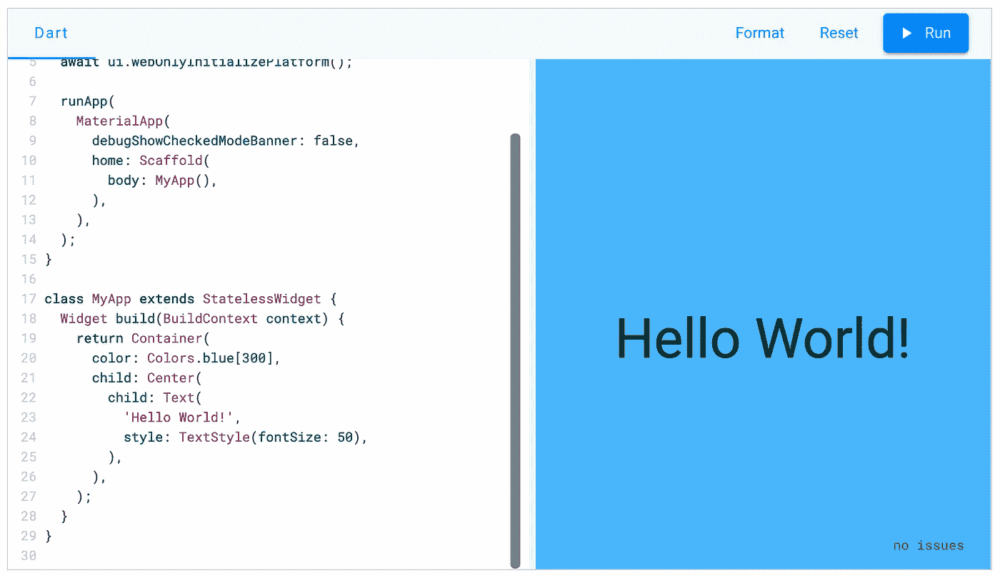
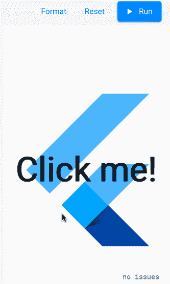
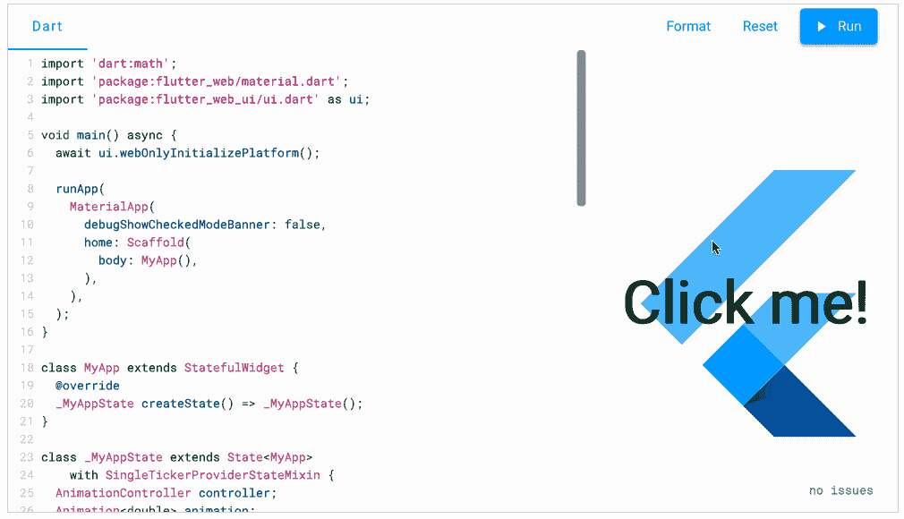

# 在你的浏览器中开发一个 Flutter 应用程序

> 原文：<https://levelup.gitconnected.com/developing-a-flutter-app-in-your-browser-28beea5180e1>



[flutter.dev](https://flutter.dev/)

***更新*** *:在你的浏览器中检查开发一个应用的更好的方法是使用*[*DartPad*](https://dartpad.dartlang.org/)*，它现在支持 Flutter。从菜单中选择一个颤动样本开始。*

我不知道你最近是否访问过 Flutter.dev 的主页，但是当我几周前准备一个演讲时，我发现了一个新的内容。向下滚动屏幕到显示“在你的浏览器中尝试抖动”的地方你可以在浏览器中运行 Flutter Web 应用程序！

默认应用程序是一个旋转的标志:



你也可以选择一些其他的例子。

你不仅可以运行给定的例子，还可以编辑和运行你自己的代码。我用自己的无状态小部件替换了旋转徽标演示中的`MyApp`小部件，并在浏览器中编写代码。

```
import 'package:flutter_web/material.dart';
import 'package:flutter_web_ui/ui.dart' as ui;void main() async {
  await ui.webOnlyInitializePlatform();runApp(
    MaterialApp(
      debugShowCheckedModeBanner: false,
      home: Scaffold(
        body: MyApp(),
      ),
    ),
  );
}// I wrote my own simple layout right 
// in the browser.
class MyApp extends StatelessWidget {
  Widget build(BuildContext context) {
    return Container(
      color: Colors.blue[300],
      child: Center(
        child: Text(
          'Hello World!',
          style: TextStyle(fontSize: 50),
        ),
      ),
    );
  }
}
```

运行会产生以下结果:



这不完全是热重装快，但也不错。甚至有一些最小的错误检查和自动完成。

我不会很快放弃 Android Studio 或 VS 代码，但能够在浏览器中进行开发是非常令人惊讶的！我可以很容易地想象一个成熟的 IDE 在网页上运行。

这里有一个有趣的想法。现在你甚至可以在手机上创建移动应用程序。在手机上进入 [Flutter.dev](https://flutter.dev/) 。在 Chrome 浏览器菜单中，你可以选择“桌面网站”。我能够像在笔记本电脑上一样编辑和运行代码。

我等不及要看接下来会发生什么了！