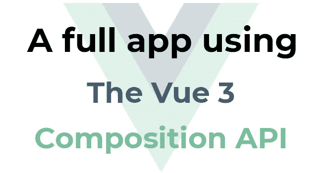
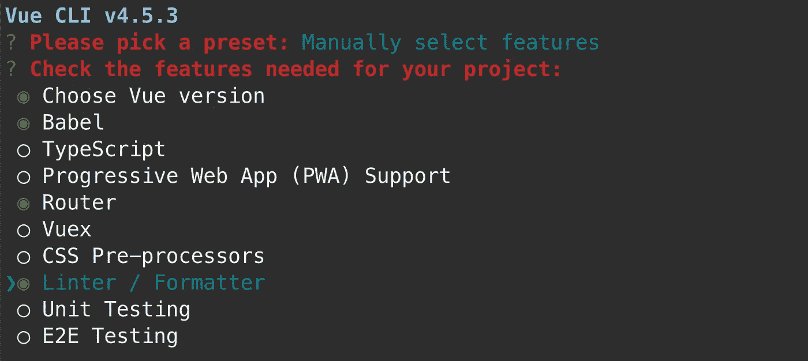
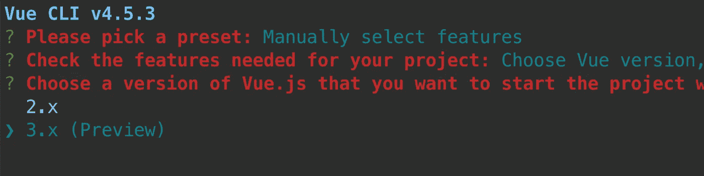
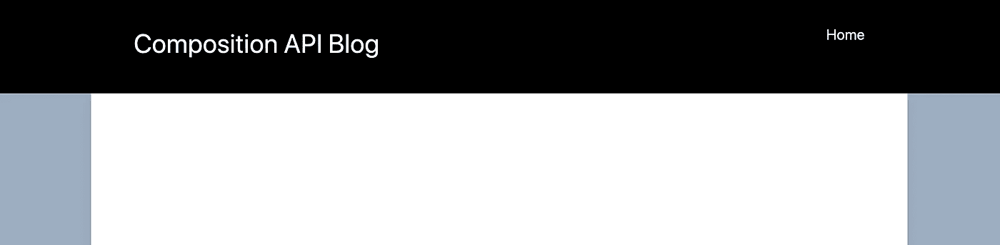
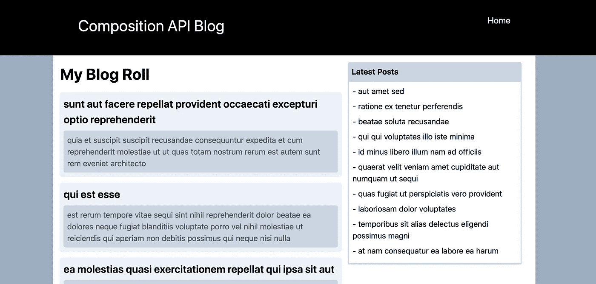

# 使用 Vue 3 组合 API 开发完整的应用程序

> 原文：<https://levelup.gitconnected.com/developing-a-full-app-using-the-vue-3-composition-api-4fd9431f2136>



虽然我很喜欢 Vue.js 2，但是在组件的可重用性和代码的布局方面还是有一些限制。这既是福也是祸。一方面，对于简单的组件，它让学习 Vue 变得超级容易，入门门槛低。另一方面，随着组件变得越来越复杂，您会发现同一组件中不同特性的代码被混淆了(那是一个单词吗？).

Vuejs 3 通过`composition API`克服了这个限制。在本文中，我将演示 Vuejs 2 中的这些限制，并向您展示使用组合 API 的可选新方法。

正如上面所暗示的，你不必被迫使用组合 API，它是可选的。对于更小的组件，只需保持您一贯的做法。随着组件变得越来越复杂，可能有不止一个特性，组合 API 真的很有用。

# GitHub 上的所有代码

我开发了一个简单的博客应用程序，有两个分支。一个分支使用 Vue 2 选项 API，另一个分支使用 Vue 3 组合 API

[https://github.com/simonjcarr/vue3_composition_api](https://github.com/simonjcarr/vue3_composition_api)

# 学习曲线

组合 API 有一个学习曲线，但这是值得的。为了让您了解它为什么如此有用，我将向您展示一下我们将在本文中创建的内容。我希望你会看到，为了它带来的好处，坚持下去是值得的。

这里有两段代码，都来自同一个组件。第一个使用您熟悉的 Vue 2 Options API，第二个使用新的 Composition API

**无组合 API**

**与组合 API** 相同的组件

组合 API 不仅使代码更加简单，而且正如您将在本文中看到的，从`@/composables/blog/posts`导入的代码可在其他组件中重用。

# 更新 Vue CLI

在我们创建新应用程序之前，请确保您拥有最新的 Vue CLI

```
npm install -g @vue/cli
```

# 创建新应用程序

```
vue create vue3_composition_api
```

当出现提示时，选择`Manually select features`，然后使用空格键切换功能的开和关，直到你有和我下面做的一样的选择。



完成后，按回车键

确保选择 Vue 版本`3.x (Preview)`并按下回车键



其他设置应该如下

*   对路由器使用历史模式？`Yes`
*   选择你喜欢的林挺版本，我用`ESLint + Prettier`
*   保存时 Lint
*   在专用配置文件中
*   将此存储为未来项目的预置？`No`

安装完成后，移动到应用程序文件夹

```
cd vue3_composition_api
```

# 添加顺风 CSS

在我的代码中，我使用了 tailwind CSS。用 Vue 安装超级简单。

```
vue add tailwind
```

出现提示时，选择`minimal`

# 启动应用程序

在应用程序根目录下的终端中

```
npm run serve
```

Vue 会启动并告诉你你的应用运行在哪个端口，对我来说是`8080`

打开浏览器并导航至`[http://localhost:8080](http://localhost:8080)`

你可能会注意到一些格式问题，这不是一个问题，因为顺风与基本 Vue 应用程序生成的一些样板 CSS 冲突。

# 删除样板代码

我们将从删除一些样板文件和 Vue 生成的代码开始。

从`/src/components/HelloWorld.vue`中删除`HelloWorld.vue`从`/src/views/About.vue`中删除`About.vue`

编辑`/src/App.vue`，使其包含以下代码。

编辑`/src/views/Home.vue`，使其包含下面的代码。

编辑`/src/router/index.js`以包含以下代码

按照这些编辑，你的应用程序应该没有错误，但你的浏览器应该是一个空白的，白色的画布。

# 添加标题

在`/src/components/site/header/Header.vue`中创建一个新文件(您必须创建文件夹`site/header`)

在`Header.vue`中添加以下代码。

现在让我们告诉 Vue 使用 Header 组件并显示它。

编辑`/src/App.vue`，使文件包含以下代码。

在上面的代码中，我已经导入了组件`Header.vue`并将其添加到组件选项中。

我在模板中添加了一些 HTML 结构和一些 tailwind CSS 类，当然，还添加了`<Header />`组件。

另外，请注意，我在`<router-view>`元素中添加了`:key="$route.fullPath"`，这修复了一些反应性问题，如果 URL 中唯一需要更改的是一个参数，Vue 将不会知道路由已经更改。我们将使用 URL 参数来查看个人博客文章。

如果您检查您的浏览器，您现在应该有一个标题和一个主要网站内容的中心部分。



# 博客文章组件

我将创建的最后 3 个组件如下所示。一旦我们创建了所有的文件，应用程序可以使用，我会检查内容。

```
/src/components/blog/BlogRoll.vue
/src/components/blog/LatestPosts.vue
/src/components/blog/Post.vue
```

下面是它们各自的代码。同样，这些只是基于选项 API 的普通 Vue 组件。

***/src/components/blog/blogroll . vue***

***/src/components/blog/latest posts . vue***

***/src/components/blog/post . vue***

# 让一切正常运转

现在让我们将这些组件连接到应用程序中

用下面的代码编辑文件`/src/views/Home.vue`。

在上面的文件中，我已经导入了 BlogRoll 组件，并在模板中呈现了它

编辑`/src/App.vue`,使其包含以下代码。

最后，我将添加一个新的路由，允许个人博客帖子被查看。编辑`/src/router/index.js`,并更新它以包含如下所示的代码。

如果你现在检查你的浏览器，一切都应该正常。



我们在页面的主要内容中有一个博客滚动，如果你点击一个帖子的标题，它会带你到那个帖子。

LatestPosts 组件呈现在页面的右侧，只显示最后 10 篇文章。再次点击其中一项，您可以查看完整的帖子。

# 到目前为止的总结

应用程序正在运行。很简单，你不能创建新的帖子，相反，所有的帖子都是从[https://jsonplaceholder.typicode.com/](https://jsonplaceholder.typicode.com/)中拉出来的

需要注意的关键点是，3 个博客组件中的每一个都从 jsonplaceholder 中提取内容。在 BlogRoll 和 LatestPosts 的例子中，它们都提取相同的内容。最好从一个地方开始。

我知道这是一个人为的例子，对于这个特定的应用程序，您可能会更好地使用 Vuex，但它可以演示原理，同时仍然相对简单，以便您可以理解这个概念。

# 更新应用程序以使用合成 API

在高层次上，使用组合 API 的过程如下

*   创建一个 javascript 文件，称为可组合文件，它导出您希望组件能够访问的数据和方法。
*   将可组合组件导入到一个组件中，并添加一个 setup()方法，在该方法中可以导入可组合组件导出的数据和方法。

让我们首先转换一个组件来使用组合 API，然后讨论我们已经做了什么。

# 创建可组合文件。

创建一个新文件`/src/composables/blog/posts.js`并添加如下所示的代码。

让我们花点时间来谈谈一些要点。

# 裁判员

ref 用于使组合 API 中的变量具有反应性。从 Vue 导入`ref`后，你会看到我用`ref()`声明了 3 个变量

```
let post = ref({});
let posts = ref([]);
let user = ref({});
```

通过使变量具有反应性，ref 将其转换为对象。你不再直接访问它的值，取而代之的是使用`.value`，例如`posts array`可以通过`posts.value[0]`访问，或者你可以用`posts.value.push({title: 'Hello World'})`将一个元素推入它的数组

在 Vue 组合 API 中还有其他一些利用反应性的方法，你可以在这里阅读[https://v3 . Vue js . org/guide/composition-API-introduction . html # standalone-computed-properties](https://v3.vuejs.org/guide/composition-api-introduction.html#standalone-computed-properties)

# 所有东西都在一个地方

关键的一点是，我们所有三个组件所需的一切现在都在这个文件中。我们可以根据需要在这里放置尽可能多的逻辑，但是我们只公开组件需要的内容。这将使我们未来的代码维护更加容易。

接下来，我们将看到如何通过重构 BlogRoll 组件来使用这个可组合文件。

# 重构 BlogRoll.vue

编辑`/src/components/blog/BlogRoll.vue`并更新它，如下面的代码所示。

模板部分没有改变。

增加了一个新的`setup()`选项，删除了之前的`data,` `methods`和`mounted`选项。

关于`setup()`选项需要注意的一个核心概念是不能在其中使用`this`关键字，因为 setup()是在组件的其余部分可用之前运行的。但是，您可以使用`this`从组件的任何其他选项中引用设置中的变量，即从`methods`或`mounted`中。

你会看到我正在安装程序中运行`onMounted`，当你使用组合 API 时，它已经取代了`mounted`选项。你可以看到它也需要被导入`import { onMounted } from "vue";`

`setup()`选项中的第一行代码从可组合组件中导入该组件所需的数据和方法。

```
const { posts, fetchPosts } = usePosts();
```

`fetchPosts`仅用于组件安装时的设置功能。

最后，`template`所需的唯一对象可用于最后一行的组件

```
return { posts }
```

**重要提示:**当引用从 composable 导出的变量时，通过`.value`访问它们的值。您不必在模板内的字符串插值中这样做，Vue 会为您做这些。例如，要在 setup()选项中使用`posts`的值，您必须使用`posts.value`，但是在模板中，您可以简单地引用`'posts'`

# 重构剩余的两个组件

编辑`/src/components/blog/LatestPosts.vue`,并添加以下代码

最后，编辑`/src/components/blog/Post.vue`，添加以下代码。

重构了最后两个组件后，应用程序应该还能工作。

我们的组件现在更简单了，所有与博客帖子相关的逻辑和异步调用都包含在一个文件中。如果我们需要将一些与博客文章没有直接关系的其他功能合并到这些组件中，我们可以用完全相同的方式创建另一个可组合组件，并保持其逻辑独立，而不是将其混合到同一个组件中。

# 摘要

我已经解释了新的组合 API 的一些好处，但是你可以在 Vue 3[https://v3.vuejs.org/guide/introduction.html](https://v3.vuejs.org/guide/introduction.html)的官方 Vue 文档页面上阅读更多信息并保持更新

我们已经使用 Vue 2 options API 构建了一个完整的应用程序，并将其转换为使用 Vue 3 composition API。

记住这个应用的所有代码都可以在 GitHub 上找到。回购包含两个分支，一个是使用`Options API`开发的 app，另一个分支是使用`Composition API` [https://github.com/simonjcarr/vue3_composition_api](https://github.com/simonjcarr/vue3_composition_api)

我希望这篇文章对你有所帮助。如果你喜欢，请在下面的评论中告诉我。