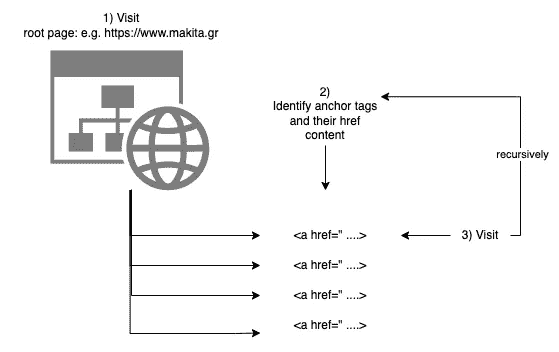
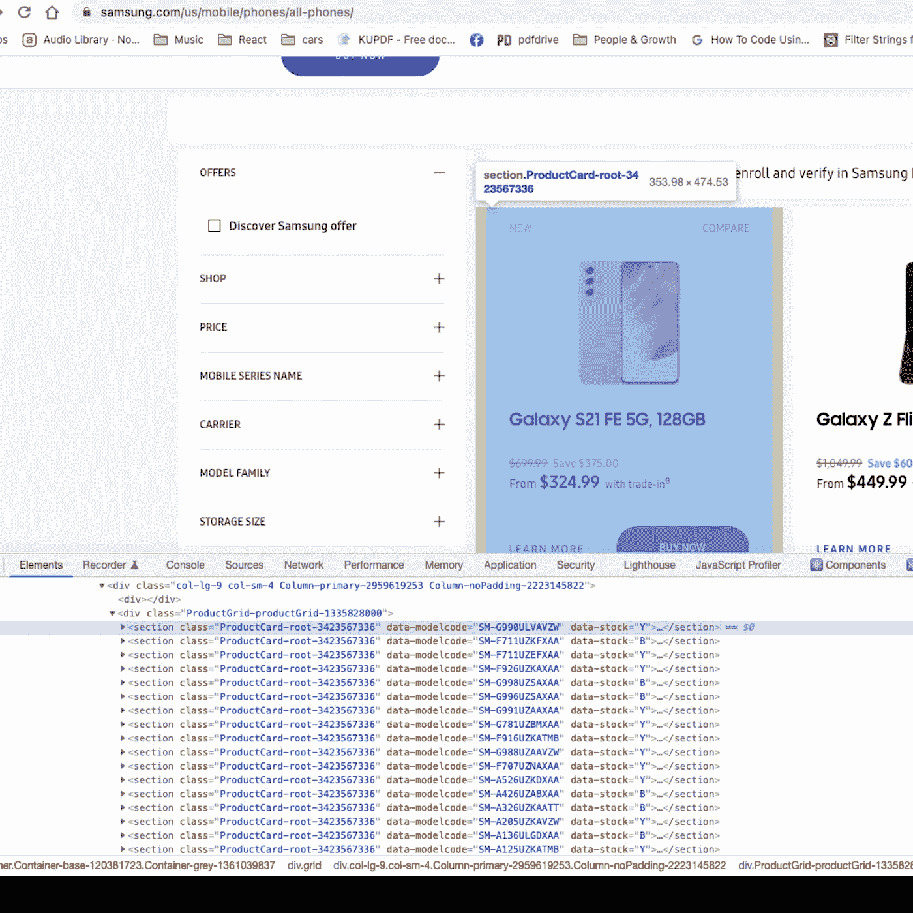
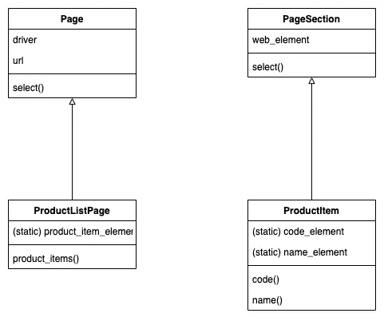

# 开发一个网站刮刀

> 原文：<https://levelup.gitconnected.com/developing-a-website-scraper-b7a78bb5544a>

我学到的东西，用 Python 写的


图片来自 [Pixabay](https://pixabay.com/?utm_source=link-attribution&amp;utm_medium=referral&amp;utm_campaign=image&amp;utm_content=4963715)

从网站检索信息是分析数据的企业的常见需求。因此，他们可能会要求你开发一个网站抓取器来自动化这个过程。网站抓取器是一种获取网站页面并试图识别对商业有用的信息的程序。

让我们来看看我们的武器库中有哪些工具可以开发这样的刮刀。本文主要关注 Python 工具，但它同样适用于其他流行的编程语言。

# 网站地图

为了从网站中挖掘信息，你需要得到它的页面列表。站点地图是一个非常有效的工具，可以抓取一个网站所有页面的 URL。网站地图以名称`sitemap.xml`存储在网站的根路径中，它们包含这里指定的格式[的信息](https://www.sitemaps.org/protocol.html)。

例如，看看 https://www.playstation.com/网站的地图文件。这是得到它的链接:[https://www.playstation.com/sitemap.xml](https://www.playstation.com/sitemap.xml)。

以下是它的摘录:

每个`loc`标签都有文本，它是网站上一个页面的 URL。

## 获取远程内容

但是我们如何获取网站地图呢？我们如何在本地获取`sitemap.xml`页面的内容？

`**requests**` **库**

在[请求 Python 库](https://docs.python-requests.org/en/latest/)的帮助下，获取网站地图的 XML 源很容易。

`requests`图书馆有一个非常丰富的界面。使用这个库获取站点地图的 XML 内容的一个简单方法是:

以上将获取 Playstation 网站 sitemap 的 XML 源。

`page.text`将以 Python 的形式返回 XML 源代码`str`。

我们使用`requests.get()`方法从网站获取站点地图文件和实际页面。但是，对于实际的页面，我们将在稍后讨论。现在，我还想提一下，当我使用`requests.get()`方法时，我还会注意以下技术细节:

**用户代理**

通过简单地给出您想要获得源代码的页面的 URL 来使用`requests.get()`，并不总是足够的。我建议你也把`User-Agent`标题发送过来。`User-Agent`应该设置为一个字符串，向对方暗示你的脚本是一个浏览器。这里有一个例子:

您可能还想将`User-Agent`设置为一个值，以表明您的脚本是一个移动设备浏览器。当您希望看到站点为移动设备用户返回的内容时，这可能会很有用。一些网站根据客户端设备类型返回不同的内容[，尽管这可能不是一个好主意](https://developer.mozilla.org/en-US/docs/Web/HTTP/Browser_detection_using_the_user_agent)。

为了便于参考，[本页](https://developer.mozilla.org/en-US/docs/Web/HTTP/Headers/User-Agent)列出了最常见的用户代理字符串。

**超时**

当使用`requests`库获取网站页面的源代码时，你应该考虑的另一个非常重要的因素是超时。你不会想让你的电话在一个没有响应或返回页面非常慢的网站上永远等待。

为了防止您的`requests.get()`调用在特定页面上永远等待，您可以如下设置`timeout`参数:

在上面的例子中，我们设置了 2 个超时值，其中`REQUEST_CONNECT`设置为 5 秒，而`REQUEST_READ`设置为 10 秒。您可以尝试不同的值，并根据自己的喜好调整请求超时。

**处理错误**

连接到页面以检索其内容的尝试可能会因为各种原因而失败。因此，我建议您将您的`requests.get()`调用包装在一个`try..except`块中，如下所示:

看上面的第 10 行。如果响应状态代码大于或等于`400`，则`response.raise_for_status()`将引发`requests.exceptions.HttpError`异常。因此，该行是可选的。您可能不希望使用异常对这些情况进行分支。

在任何情况下，`requests.exceptions.RequestException`都是`requests.get()`可能引发的所有异常的父类。捕捉它并相应地分支您的代码是一个很好的实践。

## 解析 Sitemap.xml

因此，使用`requests.get(..../sitemap.xml)`我们可以获得远程网站的站点地图文件。

找到所有`loc`标签并获取其内容的最简单方法是什么？人们肯定可以使用一些字符串匹配和正则表达式工具来解析`sitemap.xml`内容的整个字符串。但是，我们将使用 [BeautifulSoup](https://www.crummy.com/software/BeautifulSoup/bs4/doc/) 来代替。

这是一个非常棒的 Python 库，除了其他功能之外，它还允许浏览 HTML 或 XML 文档的 DOM 树。因此，获取所有的`loc`标签并迭代它们的内容以获取指向的页面就像下面这段代码一样简单:

注意:为了能够使用 BeautifulSoup 作为 XML 解析器，您可能还需要安装`[lxml](https://pypi.org/project/lxml/)` [python 库](https://pypi.org/project/lxml/)。

*   第 2 行:它获取 XML 文档中所有的`urlset`标签。注意，一个适当构造的`sitemap.xml`只有 1 个`urlset`。但是，上面的代码足够通用，可以与许多代码一起工作。
*   第 4 行:它获取所有的`loc`标签。
*   第 5–6 行:对于每个`loc`，它将其内容`loc.text`发送给一个解析特定网站的函数。`parse_website_page()`函数是解析网站页面的自定义函数。

## 指向其他站点地图的站点地图

但是网站地图内容可能不是网站页面的 URL。一个`sitemap.xml`文件可能不包含带有`url > loc`标签的`urlset`。它可能包含带有`sitemap > loc`标签的`sitemapindex`。这些类型的`sitemap.xml`文件指向其他站点地图文件。这是网站声明大量页面的一种方式。注意一个`sitemap.xml`文件不能包含超过 50K 的 URL。因此，较长的 URL 列表需要分成多个站点地图，而站点地图索引是将它们组合在一起的一种方式。

以[https://www.samsung.com/](https://www.samsung.com/)站点的`sitemap.xml`文件为例。这个`sitemap.xml`就是这个[https://www.samsung.com/sitemap.xml](https://www.samsung.com/sitemap.xml)。如果您查看它的内容，您会看到类似这样的内容:

如您所见，`loc`条目是其他的`sitemap.xml`文件。

因此，您需要确保您也可以解析这种类型的`sitemap.xml`文件，它们包含指向其他`sitemap.xml`文件的指针/loc。

下面是 Python 中的一段伪代码，可以启发你实现这样的逻辑:

在第 10 行，我们调用`process_sitemapindex()`来处理一个站点地图索引。第 17 行的这个函数递归地回调站点地图索引中的每一个`loc`条目。在某种程度上，递归将会停止，因为将会下载一个带有 urlset 的站点地图(而不是一个站点地图索引)。

## 压缩网站地图

到目前为止，网站地图还不错。但这并没有结束。网站地图可以被压缩。

请看这里的文件:[https://www.huaweistore.gr/sitemap.xml](https://www.huaweistore.gr/sitemap.xml)

这个`sitemap.xml`文件的内容很小，里面只有一个条目。这是一个指向单个站点地图文件的`sitemapindex`。这个:

```
https://www.huaweistore.gr/Uploads/xmlFiles/huaweigr-staginglh-com_GoogleSitemap_el_00001.xml.gz
```

注意这里指向的文件的文件扩展名。不是`.xml`。正是`.xml.gz`。这意味着，如果您尝试使用`requests.get()`方法获取该文件，您将得到一个二进制的压缩数据流。

因此，您不能只是开始解析响应`content`。您必须在本地下载二进制内容并创建一个文件，然后解压缩它，然后将其解析为一个普通的`sitemap.xml`文件。

**本地下载文件**

为了将请求响应的内容下载到本地文件中，您可以使用如下代码:

运行时参数`stream`被设置为`True`(第 9 行)。这允许你使用`response.iter_content()`来下载大文件。每个块的大小设置为 128 字节，但这可以根据您自己的喜好进行调整。每次下载一个块，我们保存到本地文件(第 15 行)。

**解压本地文件**

接下来，您必须解压缩本地文件。下面的函数演示了解决这个问题的一种方法:

它使用 Python 标准库`gzip`来解压缩文件(第 9 行)并将其保存到本地的另一个文件中。然后删除原始文件(第 12 行)。

现在有了实际的`sitemap.xml`内容，您可以将它发送给进行站点地图解析的函数，就好像您从远程 URL 获取了这个文件一样。

# Robots.txt

在这篇博文继续详细介绍如何解析网站页面内容之前，我想提一下文件`robots.txt`，它通常可以在网站的根路径中找到。

看这里的文件:[https://www.huaweistore.gr/robots.txt](https://www.huaweistore.gr/robots.txt):

一个抓取网站的程序绝对应该尊重`robots.txt`文件的内容。该文件包含诸如哪个是站点地图文件(这样您就不必猜测)之类的信息，而且非常重要的是，它告诉您的脚本网站的哪些路径不应该被访问/解析/抓取。

# 在没有网站地图的情况下查找网站页面

但是，如果您无法访问一个`sitemap.xml`文件来获得一个网站的页面列表呢？

不幸的是，在这种情况下，您必须获得站点的主页，即通过访问根路径返回的主页，然后识别所有锚点并递归地访问它们。



当您实现这个递归过程时，您必须注意以下几点:

*   跟踪访问过的页面，这样你就不会再次访问它们。如果你不保持跟踪，你将会一次又一次地访问同一个页面，这将导致一个无限循环。
*   注意锚 href 链接，它会把你带离你想要解析的网站。例如，如果您使用站点`[https://www.makita.gr](https://www.makita.gr)`，并且在它的任何页面上有一个锚链接，其值为`[https://www.foo.gr](https://www.foo.gr,)` [，](https://www.foo.gr,)这个锚应该被忽略。
*   规范化非绝对路径。例如，如果一个 anchor href 值是`/products/xyz.html`，首先使它成为`[https://www.makita.gr/products/xyz.html](https://www.makita.gr/products/xyz.html)`，然后开始使用它。换句话说，对于非绝对路径，您最好将站点的根 URL 放在前面。但是，这又有点复杂。如果非绝对路径不是从`/`开始的，那么，为了规范化它，你必须在你找到锚点的当前页面前面加上完整的路径。例如，如果您正在页面`[https://www.makita.gr/products](https://www.makita.gr/products/)`中寻找锚 href，并且您找到了一个具有 href `XYZ.html`的锚，那么规范化的值应该是`[https://www.makita.gr/products/XYZ.html](https://www.makita.gr/products/XYZ.html)`而不是`https://www.makita.gr/XYZ.html`。
*   你需要确保你不会去找媒体文件。锚点 href 可能是一个到图像、视频或 PDF 文档的链接。您需要通过查看 href 指向的资源的文件扩展名来判断 href 值。例如，应该忽略 href 值等于`[https://www.makita.gr/logo.png](https://www.makita.gr/logo.png,)`的锚点。
*   注意`nofollow`超链接。一个`nofollow`锚标签有一个值为`"nofollow"`的`rel` HTML 属性。例如:`<a href="/data" rel="nofollow">Data dir</a>`。特定网页的设计者不希望机器人跟随这个链接，这是他们表达意图的一种方式。请注意，一个页面可能在页面的头部有一个 robots meta 标记，它将该页面的所有锚点声明为`nofollow`。你可能也要考虑到这一点。顺便说一句，`"nofollow"`超链接的发明有一个非常特殊的原因。你可以在这篇非常好的文章中了解更多信息[。](https://ahrefs.com/blog/nofollow-links/)
*   识别超链接并访问它可能会返回一个错误，如当链接*断开*时，即不对应于现有页面时，返回 404。确保你也忽略了这个链接。

# 检查站 1

我们已经解释了如何获取网站页面列表:

*   使用`sitemap.xml`文件和/或
*   从主/根页面开始爬行每个页面并遍历所有超链接。

现在，给定一个页面 URL，我们如何有效地获取它并解析它以识别我们感兴趣的数据？

接下来让我们看看。

# 获取和解析网站页面

基本上，有两种方法可以获取和解析网站页面的内容。

1.  静态地
2.  动态地

## 静态获取网站页面

使用这种技术，您得到的只是页面的 HTML 源代码。这不一定是坏事。如果 HTML 源代码包含了你需要的所有信息，那么它就能为你的目标服务。

在[的 HTML 源代码上寻找例子，这个页面在这里](https://www.makita.gr/products/%CE%BA%CE%B7%CF%80%CE%BF%CF%85.html)。它包含了足够的信息让你建立一个产品的清单。

## `requests`再图书馆

您可以再次使用`requests.get()`方法，就像当您想要获取网站的`sitemap.xml`文件时一样。

`requests.get()`可用于获取网站页面的内容。

示例:

```
response = requests.get('https://www.makita.gr')
response.content
```

但是，当然，我们建议您使用相同的增强版本，包括用户代理头、超时和异常处理。

## 又是美丽的声音

一旦您有了页面的 HTML 内容(`response.content`)，您就可以依靠 [BeautifulSoup](https://www.crummy.com/software/BeautifulSoup/bs4/doc/) 来解析它，并在它的 HTML 标签和属性中识别感兴趣的信息。

例如，以下标识了页面[https://www.makita.gr/products/πνευματικά-πιστολέτα-για-sds-plus.html](https://www.makita.gr/products/%CF%80%CE%BD%CE%B5%CF%85%CE%BC%CE%B1%CF%84%CE%B9%CE%BA%CE%AC-%CF%80%CE%B9%CF%83%CF%84%CE%BF%CE%BB%CE%AD%CF%84%CE%B1-%CE%B3%CE%B9%CE%B1-sds-plus.html)中的所有产品代码

*   第 5 行:我们用页面内容和`'html.parser'`参数初始化`BeautifulSoup()`。
*   第 6 行:我们使用 CSS 选择器来选择我们感兴趣的标签。
*   第 7 行:`anchor.text`返回`<a>`锚的文本内容，在这个特定的例子中，包含产品代码。

就是这样！现在让我们来看另一种获取和解析网页内容的技术。

## 动态获取网站页面

如果网页使用 JavaScript 在浏览器上动态构建内容，用`requests.get()`获取网页内容是不够的。

[这是一个动态构建内容的网站页面](https://www.samsung.com/us/mobile/phones/all-phones/)的例子。如果您使用您的浏览器或使用`requests.get()`检查页面的 HTML 源代码，您将不会找到当您使用浏览器打开此页面时可以直观看到的产品。这个页面使用 JavaScript 在浏览器端构建 DOM。它不是在服务器端构建的。

**硒**

为了获取一个网站页面并执行它包含的 JavaScript 代码，以便您可以拥有所有动态构建的内容，您需要使用一个类似于 [Selenium](https://www.selenium.dev/) 的工具。Selenium 的工作原理类似于浏览器。它获取一个网站页面并加载它，就像它是一个浏览器。然后它给你一个 API 来访问动态构建的页面的 DOM。该 API 与`BeautifulSoup()` API 有相似之处，但它也有更多的功能，允许您在 JavaScript 级别工作。

事实上，Selenium 需要在您的系统中安装一个浏览器来执行它的工作。

我使用`chromedriver`二进制文件([从这里下载](https://chromedriver.chromium.org/downloads))并让 Selenium 调用这个二进制文件来获取页面和模拟 web 浏览器。

因此，给定一个 web 页面 URL，我使用 Selenium 获取并解析它:

以上适用于页面[https://www.samsung.com/us/mobile/phones/all-phones/](https://www.samsung.com/us/mobile/phones/all-phones/)。

如果您在加载后检查该页面的元素(您可以使用 Chrome 开发人员工具来完成)，您会看到它将其产品包装到如下部分:



您可以将模型代码视为属性`data-modelcode`的值的 HTML 属性。

因此，上面的 Python 代码示例使用选择器`'section[data-modelcode]'`来选择所有的部分。然后对于每个选中的部分，它调用`.get_attribute('data-modelcode')`来获取相应 HTML 属性的值。

请同时注意以下几点:

*   第 14–21 行:这是我用来在加载了 Selenium 的页面上查找元素的函数。寻找元素的方法是`#find_elements()`，这里记录了[。重点是我将它包装成一个`try...except`块，并请求`WebDriverWait().until()`方法的帮助。这个方法允许我定义一个超时来等待一个元素出现在页面上。这对于 JavaScript 加载的内容非常重要。因为当我们调用`#find_elements()`的时候，我们正在寻找的东西可能还没有被加载。](https://selenium-python.readthedocs.io/api.html)
*   第 24–28 行:看我如何初始化驱动程序来使用 Chrome 的一个无头版本。注意，我已经下载了`chromedriver`二进制文件，在初始化 webdriver 时，我在第 28 行给出了它的位置/路径。

**点击用户界面元素**

因为我在这里谈论的是动态构建的页面，所以我想特别提到这样一个事实:有时候，用`driver.get()`加载页面可能是不够的。由于用户与页面上的元素交互，有些页面会加载更多的内容。例如，他们可能在用户点击标签页标题时就加载标签页的内容。

另一个可能令人困惑的相关问题如下。内容可能被加载，但是`find_elements()`可能不会返回它。这是一个你可能会挠头想知道为什么的时刻。答案可能是您必须使用包含不可见内容的 CSS 选择器，例如，选项卡后面的内容，或者您可能需要单击某个元素以使内容可见。

如果您想成为 Selenium 方面的专家，您需要大量使用它并研究它的文档。它非常富有和强大。你甚至可以让它执行 JavaScript 代码，响应浏览器提示等等

**硒 IDE**

在我结束这篇文章关于 Selenium 的部分之前，我想提一下，当你在寻找写你的抓取，或者自动化测试，脚本的方法时，一个非常有用的工具正在等着你。它叫做[硒 IDE](https://www.selenium.dev/selenium-ide/) 。你可以抓取一个网站页面，快速抓取正确的 CSS 选择器。此外，您可以与页面进行交互，IDE 可以生成一个 Python 脚本，您可以在以后进一步调整该脚本并将其与您的项目集成。

# 不明显但非常有用的信息

我们已经看到了一些可以用来获取和解析网站页面的基本工具。到目前为止，我们已经讨论了如何从网站页面的元素中获取内容。通常人们停留在真实用户访问网站页面时可以看到的视觉元素上。但是，网站页面不仅仅是用户可以看到的。

## 打开图形标签

页面可能有一些遵循[开放图协议](https://ogp.me/)的特殊标签，它们被称为开放图标签或 OG 标签。

发明这些是为了支持向社交媒体共享网站页面 URL。它们被社交媒体平台解析并显示给用户。

例如，如果你在这个页面上[https://www.samsung.com/us/smartphones/galaxy-z-fold3-5g/](https://www.samsung.com/us/smartphones/galaxy-z-fold3-5g/)，你会看到它有以下 og 标签:

您仍然可以使用 BeautifulSoup API 或 Selenium API 来获取`content`属性的值。例如，上面的`og:title`给出了该页面所针对的产品的名称。

还要注意，这些标签静态地出现在页面上。这意味着您不需要使用 Selenium 的重载过程，但是一个简单的`requests.get()`后跟`BeautifulSoup(page.content, 'html.parser')`就可以完成这项工作。

## 结构数据

如今，人们可以在许多网站上找到的另一个有用信息块是包含[结构化数据](https://developers.google.com/search/docs/advanced/structured-data/intro-structured-data)的块。

结构化数据是一种标准化格式，用于提供有关页面的信息并对页面内容进行分类。

例如，继续访问页面[https://www.playstation.com/el-gr/ps4/ps4-games/](https://www.playstation.com/el-gr/ps4/ps4-games/)。然后打开这个页面的源代码，寻找`application/ld+json`。这将带你到这个网页的源代码块:

结构化数据被定义在一个`<script>`中，其中`type`的值为`application/ld+json`。这个标签的内容是一个 JSON 对象，符合`[https://schema.org](https://schema.org.)` [定义的结构。](https://schema.org.)

从上面的例子中可以看出，对于出现在特定页面上的不同对象，您可以获得非常有用的信息。在这里你可以看到这个页面是关于不同 PlayStation 游戏的一系列视频。

同样，您可以访问结构数据，而不需要使用 Selenium，就像打开图形数据一样。

# 检查站 2

我们已经看到了一些分析网站页面数据的技术:

*   使用 BeautifulSoup 静态遍历页面 HTML 文档的 DOM 树。
*   在无头浏览器(Selenium)加载页面时动态地遍历页面元素。
*   静态分析开放图形数据。
*   静态分析结构化数据。

# 页面对象模式

在我结束这篇长文之前，我想提到一个叫做页面对象模式的模式。

当您编写解析网站页面内容的脚本时，您需要引用页面的元素，并使用驱动程序 API 与它们进行交互。如果您使用如下命令传播解析代码:

```
username = driver.find_elements(by=By.CSS_SELECTOR, value='#username')[0]
username.fill('foo-bar')
```

那么你的脚本将变得脆弱，难以维护和扩展。

这里的建议是，为您想要解析的页面开发一个对象模型，然后开始使用对象模型 API 而不是驱动程序 API。

模式是这样的:



*   有一个超类`Page`，它保存对`driver`的引用，并有一个选择元素的方法。
*   有一个超类`PageSection`对页面的一部分建模，称为 sections。这使用一个已经选择的元素(`web_element`)来选择另一个。
*   您访问的特定页面使用`Page`类的子类建模，这些页面的特定部分使用`PageSection`类的子类建模。

让我们看一个 Python 代码的例子:

## 页面类

*   初始化器使用`driver`来加载页面。
*   `select()`方法使用`driver`来查找元素。

## PageSection 类

*   初始化器保存对已经选择的部分的引用。
*   `select()`方法使用 web 元素引用来查找元素。

## 特定的页面模型

这个特定的类，是`Page`的子类，模拟了一个产品列表页面，其中显示了产品的数组/列表。它还有一个方法(`product_items`)来获取对应于页面上每个产品的 web 元素列表。它使用来自`Page`类的`self.select()`并传递静态定义的选择器`ProductListPage.product_item_element`。

注意`product_items()`方法如何返回类型为`ProductItem()`的对象，这些对象是页面部分。参见下一条:

## 特定的 PageSection 模型

*   我们定义如何选择该部分的不同部分。例如，应使用`'.code'`选择器选择产品的代码。
*   然后我们定义返回相应 web 元素的方法。`code()`使用`code_element`选择器返回 web 元素。
*   然后我们定义返回实际值的方法，这些值是对我们的数据分析工作有用的内容。例如，`code_value()`返回实际的产品代码。

## 这些类的使用

我们已经定义了我们的页面和页面部分模型。让我们现在使用它:

看看我们如何使用我们建立的页面对象模型。它在第 14 行和第 18 行之间演示。它是一个面向对象的 API，不透露我们使用 Selenium driver API 的实现细节。

这更容易维护和扩展。你甚至可以切换驱动程序并使用不同的 API，这比你将驱动程序特定的 API 调用分散在你的代码库中要容易得多。

## 页面对象模式的参考

如果您想阅读/了解更多信息，请尝试以下两个参考资料:

*   [页面对象—马丁·福勒](https://martinfowler.com/bliki/PageObject.html)
*   [Webdriver 页面对象](https://webdriver.io/docs/pageobjects/)
*   [硒页对象](https://www.selenium.dev/documentation/test_practices/encouraged/page_object_models/)

# 结束语

我试图为那些有兴趣建立一个网站刮刀的人建立一个实用的提示列表。

一如既往，我从你那里学到的比你从我这里学到的更多，我很乐意听听你的评论和反馈。先谢谢你了。