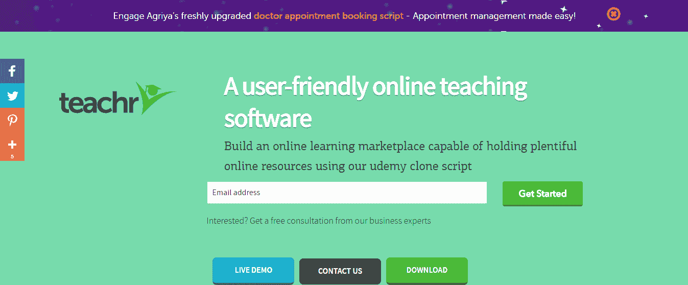
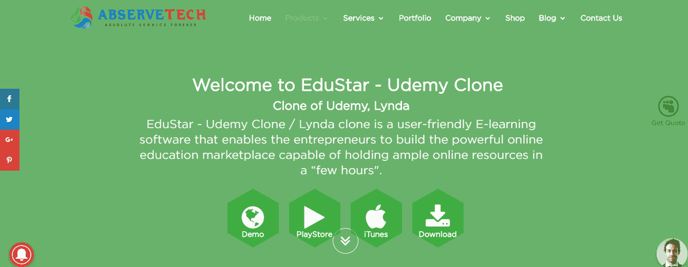

# 利用这些现成的克隆脚本，开发一个电子学习平台很容易

> 原文：<https://levelup.gitconnected.com/developing-an-e-learning-platform-is-easy-with-these-ready-made-clone-scripts-ec662f85f74>

我们学习的方式在不断发展，我们消费教育资源的媒介也随着技术的发展而迅速改变。电子学习在学习者、培训者和企业中越来越受欢迎。在线学习和教学模式为所有这三类人提供了机会，对每个人都有重要意义。

*   学习者可以通过互联网学习东西。不需要物理位置。
*   培训师可以利用数字媒体更全面地解释概念，也可以通过在互联网上销售课程来学习。
*   商业抱负，通过电子学习市场业务，赚取佣金和巨额利润。

查看这些统计数据，了解数字化学习行业有多大:

*   到 2025 年，全球数字化学习市场将超过 3250 亿美元，而 2015 年仅为 1070 亿美元。
*   仅通过销售在线课程，企业在 2017 年就赚了超过 460 亿美元。
*   自 2000 年以来，电子学习作为一个行业的增长已经出现了 900%的巨大飞跃。
*   通过实施在线学习平台，公司已经将其员工生产率提高了 26%。
*   IBM 通过为企业培训实施电子学习方法节省了 2 亿多美元。

底线是，互联网已经消费了我们，电子学习是它最好的产品之一。本文将带您踏上把电子学习作为一项业务的旅程，以及如何像 Udemy 一样开发自己的电子学习业务。

## 关于 Udemy 的一些事情

*   Udemy 是销售在线课程的最受欢迎的电子学习平台之一。
*   它于 2010 年推出。
*   超过 2400 万学生依靠 Udemy 浏览在线课程。
*   迄今为止，它有超过 80，000 门在线课程，有 35，000 名教师。
*   这家电子教学巨头出售 50 多种语言的在线课程。

# 什么是 Udemy 克隆？

一个 Udemy 克隆脚本可以被看作是一个网站建设者，用来建立一个像 Udemy 一样的在线学习平台。像所有其他在线市场一样，Udemy 脚本将在搜索者和解决方案/产品销售者之间提供一个连接媒介。具体来说，对于电子学习市场，我们可以将这三个目标视为平台用户的首要目标

1.  学习者想要购买在线课程
2.  学科专家希望通过销售在线课程来赚钱
3.  市场所有者从主题专家的销售佣金中获利。

在这里，我们将列出市场上的四个 Udemy 克隆脚本，它们将展示最佳功能，帮助您启动像 Udemy 这样的电子学习市场，并从电子学习市场行业的大饼中获得您的份额。

# **阿利亚**

来自阿格利亚的克隆剧本被称为“教师”。这是一个现成的解决方案，为有志于发展和推出一个高效的电子商务与电子学习网站销售在线课程。该脚本提供了所有必要的功能和赚钱方法，人们需要像 Udemy 一样赚钱。它充分利用最新技术提供交互式课程设计和课程销售体验。

通过为学生、教师和市场管理员提供单独的界面，该脚本完全加载了每个用户高效执行其任务所需的特定功能。

## 教师脚本的亮点

*   可下载的课程
*   折扣管理功能
*   课程分析
*   销售分析
*   集成支付网关
*   评级和审查系统
*   意愿列表管理

## 使用的技术

*   角度 JS
*   核心 PHP
*   引导程序
*   Postgre SQL

## 价格:1499 美元

# **PinLearn**

PinLearn 将其 Udemy 克隆产品称为“智能学校”。这个特殊的脚本不仅能够模仿 Udemy 的功能，还能够模仿其他流行的电子学习平台的功能，如 Coursera 和 Khan Academy。它是一个贴有白色标签的电子学习市场构建器，具有集成的功能，可以在同一个平台上容纳学习者、教师和市场管理员。

该平台还为所有三种类型的用户提供专用仪表板，让他们有效地管理他们的课程和交易。这是最有效的脚本之一，可以在相对更短的时间内建立一个像 Udemy 这样的网站。

## 智能学校脚本的亮点

*   iOS 和 Android 的移动应用
*   集成支付网关
*   开源代码，可以自托管
*   课程管理:创建、编辑和共享课程
*   审查管理
*   折扣管理
*   佣金管理
*   Facebook Messenger 集成版
*   一次性购买成本-无需重复支付

## 使用的技术:

*   Laravel 5.3 (PHP)
*   Angular JS 1
*   关系型数据库
*   Redis 缓存
*   NGINX web 服务器。
*   加密套接字协议层
*   jQuery
*   引导程序

## 价格:699-1499 美元(一次性付款)

# **Abservetech**

abservetech 的 Udemy 克隆脚本“EduStar”是功能强大的用户友好型电子学习软件的完美范例。这个现成的脚本可以用来在几个小时内创建一个电子学习市场网站。借助集成的证书管理系统，您还可以根据学员的课程完成情况对其进行认证。

该脚本为所有级别的用户提供了一个极其简单的界面。事实上，只要在图形用户界面上点击几下，即使是非技术人员也可以在没有任何帮助的情况下创建 marketplace 网站。它拥有所有种类的特性和功能，让所有三种类型的用户都能胜任他们的任务。

## EduStar 脚本亮点

*   Android 和 iOS 的移动应用
*   课程管理控制
*   课程货币化控制
*   数字证书管理
*   测验管理
*   集成博客管理
*   电子邮件管理
*   可下载的讲座
*   反馈管理
*   推广横幅视频-课程概述
*   开源代码

## 使用的技术:

*   Laravel 5.1 (PHP)
*   PHP 5
*   角度 JS
*   埃阿斯
*   关系型数据库
*   JQuery
*   引导程序

## 定价:联系方式

# **mintm**

MintTM Udemy 脚本能够在更短的时间内提供从头开始设计的体验。协助您完成从设计到部署的部分。这个脚本非常适合创建在线课程存储库和发行版的货币化。它配备了健壮的代码，可以根据客户需求进行高度定制。

## MintTM 脚本的亮点

*   集成社交登录
*   带视频的课程预览管理
*   列表的自定义课程类别管理
*   用于源索引的高级搜索引擎
*   专用管理面板
*   专用教练面板
*   支持多种格式的文件导出
*   响应迅速的用户界面，提供丰富的移动体验
*   最小网站设计

## 使用的技术:

*   拉勒韦尔
*   PHP 5.5
*   角度 JS
*   关系型数据库
*   JQuery
*   引导程序

## 定价:一次性付款的定制定价

# 轮到你了

希望这篇文章能够向您介绍实现启动 Udemy 式业务目标的解决方案。这些列出的大多数解决方案都是高度可定制的，可以进行调整，以提供其他流行平台的特性和功能，如 Coursera、Khan Academy 和 Lynda。通过一些研究来决定哪种商业模式最适合你，你可以要求这些开发者根据你的需求来调整解决方案。克隆脚本通常易于使用，并且可以定制以适应任何业务模型。你只要问问开发商就知道了。