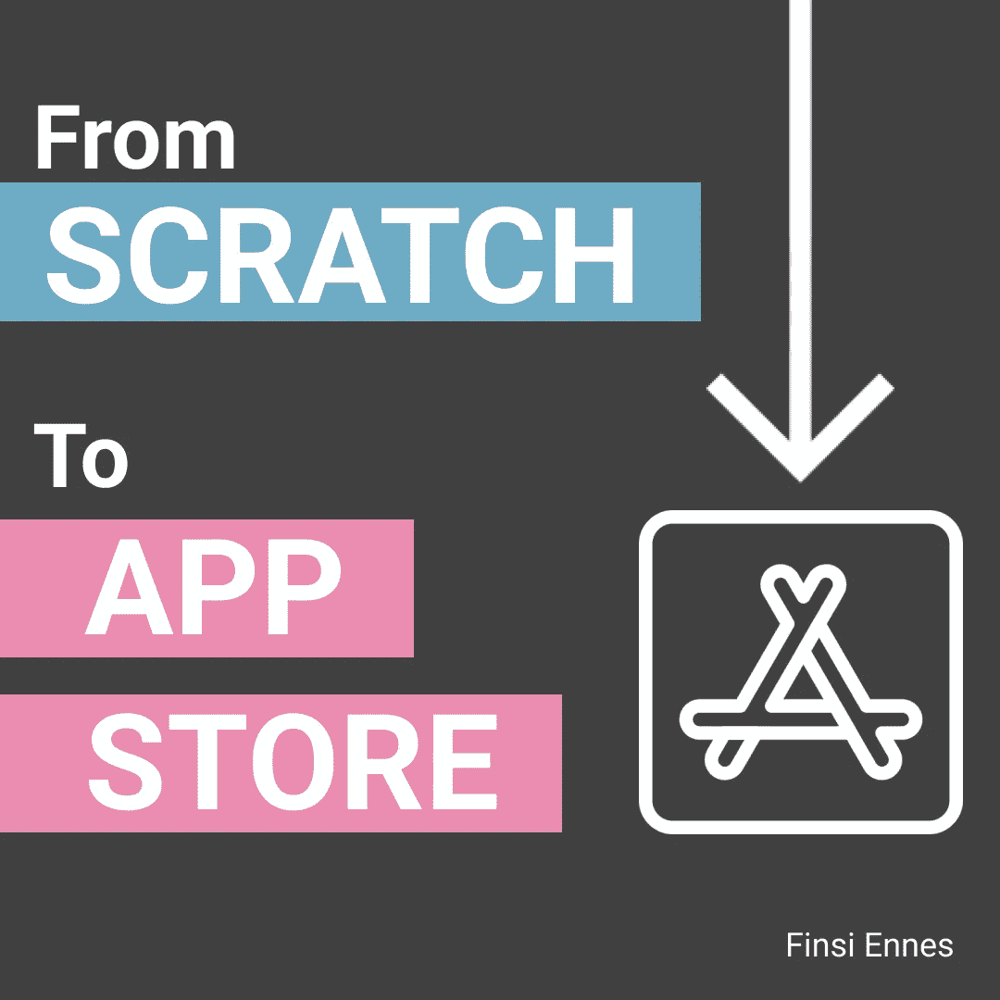
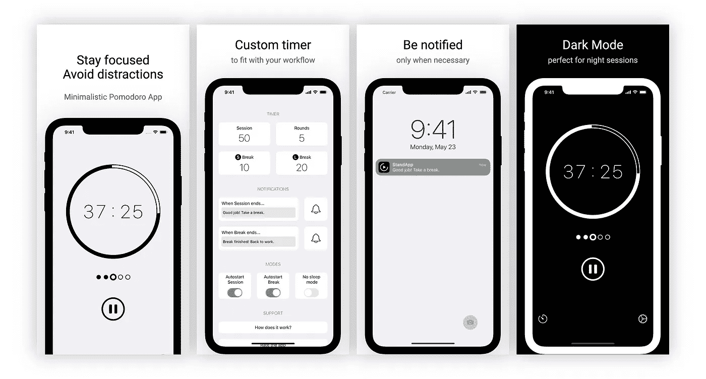
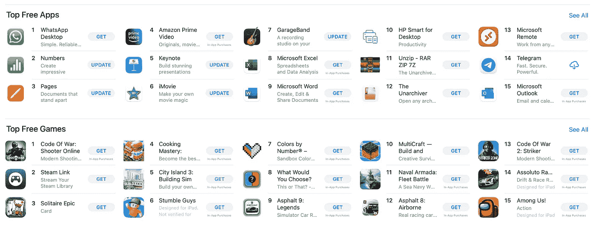
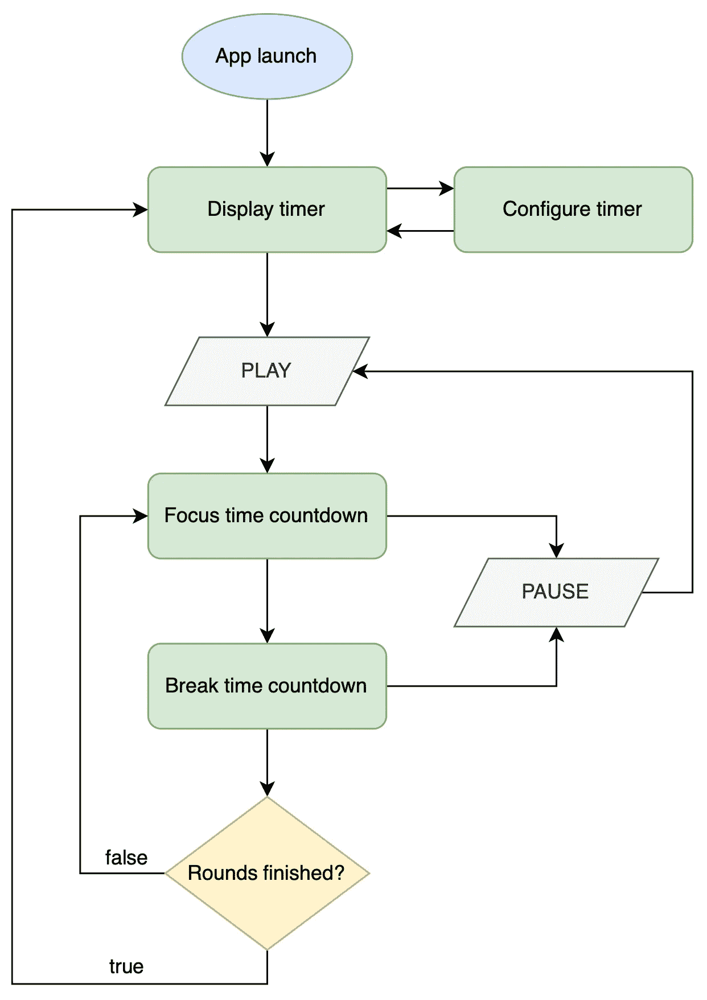

# 开发 iOS 应用程序

> 原文：<https://levelup.gitconnected.com/developing-an-ios-app-part-1-80d813bf19>

## 从零开始到应用商店

如果你想成为移动开发者，从头创建一个应用是你能做的最完整和最有益的练习之一。

就我而言，我开发了*聚焦。*一款完全在 SwiftUI 中实现的应用程序，并且已经可用:

*   [下载集中。在 App Store 上](https://apps.apple.com/us/app/focused/id1626040405)

在创建过程中，我学到了很多东西，不仅是 SwiftUI，还有分析、设计甚至营销。我也犯过错误，这是学习过程中很重要的一部分。因此，我决定在一系列文章中记录所有这些，以帮助您开发您的第一个应用程序。

# 应用程序演示

在开始记录开发过程之前，您应该了解本文中所涉及的应用程序的用途和工作方式。

于是*专注了。*基本上是一个**番茄定时器**，帮助你提高注意力，避免分心。番茄工作法是一种简单而有效的组织工作的方法，它将你的时间分成几个部分。就这样*集中了。*为您提供完全定制的定时器，以适应您的工作流程。

App 确实很简单。你可以在 App Store 个人资料中找到关于使用和功能的更多细节，但没有什么比使用它更好的了。所以我鼓励你下载并测试它。

了解了这些，就开始吧！

# 步骤概述

开发一个应用程序就像完成一个项目，它由几个不同类型的任务组成，并不是所有的事情都是编码。因此，一开始你可能会感到有点失落。

虽然当你开始开发应用程序时，没有一个明确的和精确的路径可循，但是项目之间确实存在一些共同点:

1.  市场调查
2.  确定基本特征(MVP)
3.  App 流量
4.  设计
5.  应用架构
6.  数据建模
7.  测试和编码
8.  App Store 提交

请注意，这些是我在我的案例中遵循的步骤，但它们可能会在每个项目的功能中发生变化。就当是给你的一个建议吧。

此外，在这篇文章中，我将涵盖与确定**你想做什么**和**如何做**相关的前三点。

## 市场调查

在做任何事情之前，你首先应该问自己两个简单的问题:

*   我想解决什么问题？
*   这个问题有什么解决方案吗？

第一个引用**主应用目的**。这一开始可能很难定义，但是回答这个问题会给你一个起点。一旦你清楚了这一点，就去寻找这个问题的可能**解决方案**，这样就没有必要多此一举了。

应用商店里的一堆应用

找到市场的**缺口。因此您可以提供一个解决方案来满足一个未覆盖的需求。这不仅困难，而且非常重要，因为你的应用程序的成功将取决于此。**

在我的情况下，创建这个应用程序的主要目标是学习 SwiftUI 和相关的开发过程。换句话说，市场调查与我无关。

## 识别基本特征

一旦我知道我想开发什么样的应用程序，下一步就是**确定**所有那些**要求**我的应用程序应该产生第一个版本。这是一个*最小可行产品*或 *MVP* 。

所以我写下了几点。只是来场头脑风暴。在收集了许多不同的想法后，我总结出了下面的功能列表。

应用程序应…

*   尽可能简单，界面简洁明了。
*   允许用户指定工作和休息时间。
*   询问用户想要多少工作和休息时间。
*   保存所有这些用户首选项。
*   通知当前工作流状态。
*   由用户自动或手动启动工作/休息倒计时
*   显示剩余时间。
*   如果需要，允许用户停止倒计时。
*   时间结束时通知用户。
*   在首次发布中解释番茄工作法是如何工作的。
*   使用分钟格式处理所有与时间相关的数据

在最初步骤中做的笔记

尽可能花时间来定义这个列表。你必须确定你要开发的应用程序的主要功能。注意，整个应用程序创建过程将基于您在此处指定的内容，所以不要着急。

此外，避免偏离主题。也就是说**关注**主应用功能**和**，这正是一个应用能够正常工作所需要的功能。

我知道你很兴奋开始开发你的第一个应用程序，你已经为它想了很多很酷的功能。然而，试着详细说明所有对你不利的事情。功能越多，获得 MVP 的时间就越长。

## App 流量

下一点我建议你画一个流程图。这是一张代表所需功能的**应用程序工作流程**的图表。事实上，有了之前的需求列表，确定应用程序流程将会非常简单。

这样，我为我的应用程序定义了以下流程:

应用程序工作流程

除了易于阐述之外，流程图还为我们提供了流程中的几个优势:

*   它有助于我们确定所提出的主要特征是否正确。
*   想象正在发生的事情，从而帮助理解这个过程。除了发现过程中不太明显的特征。
*   此外，它还是下一步设计的良好资源。

# **下一步是什么**

此时，我们已经有足够的信息来开始开发我们的 iOS 应用程序。因此，接下来的步骤将包括设计和创建符合我们之前定义的要求的应用程序架构。

这些要点将在下一部分介绍！同时，请在下面留下您的问题或建议。感谢阅读😁

# 分级编码

感谢您成为我们社区的一员！在你离开之前:

*   👏为故事鼓掌，跟着作者走👉
*   📰查看[级编码出版物](https://levelup.gitconnected.com/?utm_source=pub&utm_medium=post)中的更多内容
*   🔔关注我们:[推特](https://twitter.com/gitconnected) | [LinkedIn](https://www.linkedin.com/company/gitconnected) | [时事通讯](https://newsletter.levelup.dev)

🚀👉 [**软件工程师的顶级工作**](https://jobs.levelup.dev/jobs?utm_source=pub&utm_medium=post)