# 用 Kotlin 开发 Android 应用程序:超越基础

> 原文：<https://levelup.gitconnected.com/developing-android-app-with-kotlin-go-beyond-the-basics-4b388a16bf8c>

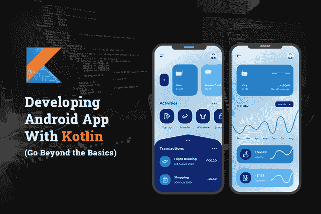

凭借 2020 年 84.8%的移动应用市场份额，Android 应用正在大胆接管 iOS 应用市场，并预计在未来仍将占据主导地位。Android 应用程序用户比例的迅速增长，促使企业家利用 Android 应用程序开发解决方案创建他们的第一个数字形象。

无论您是决定从头开发一款 Android 应用程序，还是想将现有的应用程序迁移到 Android 平台，您首先需要寻找的是该应用程序清晰、简单且健壮的架构基础。

随着谷歌在 2017 年宣布支持 Kotlin 编程语言，谷歌再次乘势而上，为 Android 开发提供了传统 Java 的完美替代语言。

尽管是 Android 应用程序开发的新领导者，Kotlin 已经成为最受欢迎、更整洁、更干净的 Java 版本。还有，得到谷歌的支持，毫无疑问，科特林未来会留在这里。

因此，在您开始学习使用业内公认的工具和库用 Kotlin 编程语言开发 Android 应用程序的架构之前，有必要了解一下 Kotlin 到底是什么…

## **先睹为快，开始使用 Kotlin Over Java 进行 Android 应用程序开发**

Kotlin 自 2011 年以来一直存在，于 2016 年作为开源编程语言正式推出，使您能够以更快的速度编写更好的 Android 应用程序。它是一种现代的统计类型编程语言，被超过 60%的专业 Android 开发人员使用，因为它有助于提高生产率，提高满意度并确保代码安全。

> **除此之外，这就是 Kotlin 接管 Java 用于 Android 应用开发的原因:**

*   **富有表现力和简洁的编程语言:**随着 Kotlin 中现代功能的集成，应用程序开发公司通过编写可重用的代码来表达想法变得更加容易。
*   **更安全的编码:**由于 Kotlin 在其类型系统中包含了@Nullable 和@NonNull，这有助于避免 NullPointerExpectations。使用 Kotlin 的 Android 应用程序崩溃的可能性要低 20%，因为它有更安全的代码。
*   **互操作性:**Kotlin 100%兼容其他编程语言，因此您可以在应用程序开发项目中使用或多或少的 kot Lin。因此，如果您想在 Kotlin 中使用现有的 Java 栈，这种语言将允许您轻松地做到这一点。

***除此之外，Kotlin 还解决了几个与 Java 相关的问题，如下所述:***

*   主要构造函数的可用性
*   多种类型的属性
*   字符串模板的可用性
*   提供不同类型数据类的可访问性
*   编写更少的代码并感到快乐
*   强大的 IDE 和工具支持
*   Kotlin 是一种企业应用程序开发语言

有了所有这些功能和谷歌的声明，毫无疑问，Android 开发将成为 Kotlin 优先。自谷歌宣布以来，Kotlin 的受欢迎程度比 beanstalks 增长得快得多，目前在 Google Play 商店推出的超过 50%的 Android 应用程序都在使用 kot Lin。因此，为 Kotlin Android 应用程序寻找 [**移动应用程序开发公司**](https://www.xicom.biz/services/mobile-app-development/) 对企业来说不再是一项遥不可及的任务。

如果你已经准备好开始你的新项目，你应该知道如何用 Kotlin 编写你的 Android 应用程序。让我们深入挖掘开发过程，了解 Kotlin 的关键特性如何帮助您简洁快速地编写 Android 应用程序。

# ***在 Kotlin 中构建你的第一个 Android 应用:应用开发过程概述***

*   **入门:**要入门 Kotlin 的 Android 应用开发，先了解这种年轻编程语言的基线。
*   **设置 Android Studio:** 从您的项目开始，您需要安装并下载 Android Studio。
*   **创建您的第一个项目:**安装 Android Studio 后，您需要注册为 Android 开发人员，并开始创建您的第一个项目。
*   **定义项目的布局:**定义片段的用户界面。
*   **设置虚拟设备:**创建用于测试的仿真器。
*   **运行你的 App:** 测试用 Kotlin 制作的 App。
*   **探索布局编辑器:**更改属性值并更新 UI。
*   **发布您的应用:**按照指南将您的应用发布到 Google Play 商店。

> 让我们深入挖掘每一步，超越基础:

## **第一步:入门**

Kotlin 是一种静态类型的编程语言，运行在 JVM 上，与 Java 编程语言完全兼容。但最重要的是，Kotlin 已经正式支持与 Java 一起开发 Android 应用程序的语言。开始使用这种编程语言只需要具备基本的阅读代码知识。

> 通过本教程，你将学习如何用 Kotlin 编程语言构建和运行你的第一个 Android 应用程序。分开，

*   如何使用 Android Studio 构建你的 app？
*   如何在设备上或使用模拟器运行应用程序？
*   如何使其具有互动性？
*   按钮按下后如何显示第二屏的内容？

## **第二步:设置 Android Studio 和 Kotlin**

要编写您的 Android 应用程序，请确保您安装了 Android Studio。你可以[点击这里](https://developer.android.com/studio/)，下载它并设置[安装环境](https://developer.android.com/studio/install.html)，如果你还没有这样做的话。否则，如果您是开发环境的新手，那么值得寻找一家在 Kotlin 中开发 Android 应用程序方面经验丰富的软件开发公司。

***Android Studio 适用于运行 Windows 或 Linux 的系统，也适用于运行 macOS 的 MAC。***

> ***简短说明:Android Studio 要求至少 3.6 或更高版本才能运行或管理这些类型的编码。***

## **步骤 3:创建新项目**

当你打开 Android studio 时，你会发现几个选项。点击创建一个新项目，然后你会被要求选择项目的类型来开发。

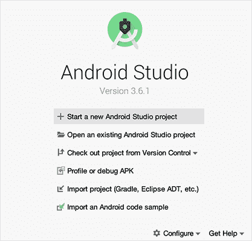

[图像来源](https://developer.android.com/codelabs/build-your-first-android-app-kotlin#8)

正如您在下面的屏幕模板中看到的，您需要在 ***【手机和平板】*** 部分下选择 ***【基本活动】*** 。

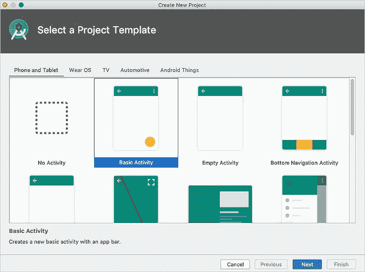

[图像来源](https://developer.android.com/codelabs/build-your-first-android-app-kotlin#8)

> **选择该选项后，您将被引导至添加应用程序名称并保存应用程序的屏幕。现在进一步按照这些步骤进行:**

1.  确保您选择了编程语言 Kotlin，保留其他字段的默认值，然后单击 finish。
2.  为您的 Android Studio 项目创建一个文件夹，通常位于您的主目录下名为 AndroidStudioProjects 的文件夹中。
3.  接下来，使用 Grade 构建您的项目，并在 Android Studio Windows 底部跟踪构建进度。打开显示您的项目的代码编辑器。

## **第四步:定义项目的布局**

一旦你建立了项目，从 Android Studio 窗口的左上方探索项目的结构和布局，如下图所示。

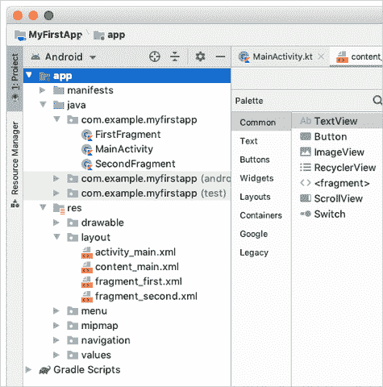

如上图所示，您需要展开 manifest 文件夹来添加 Android 应用程序的组件，并在执行应用程序时让 Android 运行时系统读取这些组件。

接下来，展开 Java 文件夹来组织所有的 Kotlin 文件，并将 Kotlin 项目文件与任何 Java 源代码一起保存在该文件夹中。在这里你也可以和 [**安卓应用开发公司**](https://www.xicom.biz/services/android-app-development/) 合作，更好的了解流程，协助你下一步的工作。

> **所以当你浏览 Java 文件夹时，你会发现三个子文件夹，包括:**

*   com。example.myfirstapp(或者您为项目指定的特定名称):该文件夹包含您的应用程序的 Kotlin 源代码文件。
*   com . example . myfirstapp(Android test):这是您将应用程序放入设备进行测试的地方。
*   com.example.myfirstapp (test):展开 ***res*** 。包含应用程序所有资源的文件夹，包括图像、布局文件、字符串、图标和样式。

**此外，为了构建应用程序，您需要浏览的子文件夹有:**

*   **Drawable:** 你所有 app 的图片都存放在这个文件夹里。
*   **布局:**该文件夹将帮助您定义 UI 布局，因为它包含 content_main.xml、fragment_first.xml 和 fragment_second.xml，使您能够自定义 UI。
*   **菜单:**该文件夹包含描述应用程序菜单的 XML 文件。
*   **Mipmap:** 此文件夹包含应用程序的启动器图标。
*   导航:这个文件夹包含导航图，它告诉 Android Studio 如何在你的应用程序的不同部分之间导航。
*   **值:**包含应用程序中使用的资源，如字符串和颜色。

此时单击“完成”。创建一个项目需要一段时间，然后进一步创建一个 Android 虚拟设备(AVD ),这样你就可以在 Android 模拟器中轻松预览你的应用了。

## **第五步:定义项目布局**

Android 虚拟设备(AVD)是一组特征，使您能够创建模拟特定类型 Android 设备配置的虚拟设备。但是 Android Studio 有一个 AVD 管理器，可以帮助我们开发和管理您的虚拟设备。

最终，这意味着 Android studio 提供了一个可以创建虚拟仿真器设备的地方，可以帮助您在其上测试您的应用程序。万一你发现它很复杂，那么雇佣软件开发人员来完成这项任务是值得的。

## 下面是安装它的步骤:

*   在 Android Studio 中，选择工具> AVD 管理器，或者单击工具栏中的 AVD 管理器图标。
*   单击“+创建虚拟设备..”。
*   选择您想要测试的硬件，因为有电话、平板电脑、电视和穿戴操作系统选项等选项。选择首选选项，然后单击下一步。
*   选择您的系统映像。因为你正在用 Kotlin 开发一个 Android 应用程序，所以，你需要在这里使用 Android 版本。
*   此外，如果 Android Studio 要求您下载系统映像，请按照说明进行操作。
*   单击下一个对话框，接受默认值，然后单击完成。

> ***现在你已经准备好在 Android 模拟器中模拟一个 Android 设备了！***

## **第六步:运行你的应用**

要在 Android Studio 中运行您的应用程序，请选择运行>运行“应用程序”，或单击工具栏中的运行图标。一旦你的应用程序运行，图标会自动改变。

一旦你的应用成功构建，模拟器准备就绪，Android Studio 将应用上传到模拟器并运行。在处理过程中，您的应用程序将类似于下面的屏幕截图。

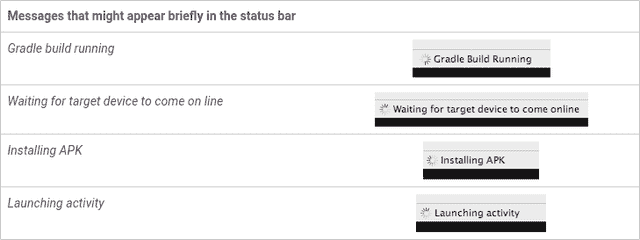

[图像来源](https://developer.android.com/codelabs/build-your-first-android-app-kotlin#8)

***要在设备中运行您的应用程序，您需要遵循以下步骤:***

*   以任何安卓设备为例，无论是手机还是平板电脑。
*   获取一根数据线，通过 USB 端口将 Android 设备连接到计算机。
*   如果您使用的是 Linux 或 Windows 操作系统，您可能需要练习额外的步骤来在硬件设备上运行您的应用程序。[点击此处](https://developer.android.com/studio/run/device)查看说明。

> **在设备上运行您的应用**

若要允许 Android Studio 与您的设备通信，您必须在 Android 设备上打开 USB 调试。

在 Android 3.6 或更高版本上，“开发者选项”屏幕默认是隐藏的，所以在开始在设备上运行应用程序之前，请确保启用 USB 调试选项。

## **步骤 7:浏览布局编辑器设置用户界面**

你需要打开布局编辑器，双击*“fragment _ first . XML”。*如果您没有看到文件“fragment_first.xml ”,那么建议您雇佣能够运行 Android Studio 3.6 或更高版本的移动应用程序开发人员。在布局编辑器中，你可以添加调色板，组件树，设计到你的应用程序，甚至可以通过选择纵向或横向来编辑应用程序的布局。

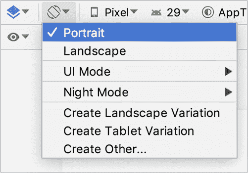

[图片来源](https://developer.android.com/codelabs/build-your-first-android-app-kotlin#8)

**1。组件树**

一旦选择了布局的方向，就需要查看组件树。

在组件树中，需要使用***constraint layout***视图。代码如下所述。

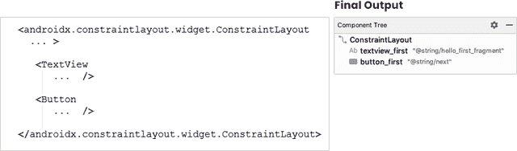

**2。更改属性值**

在代码编辑器中，只需访问 TextView 元素，就可以轻松地更改属性值。

> 示例代码如下:

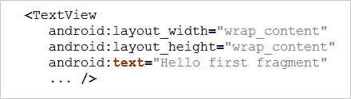

*要更改属性值，点击文本属性。(Android:text = " Hello first fragment ")在这些“hello_first_fragment”中，有一个字符串资源被使用过。右击属性，点击转到>声明或用法。更改 string 属性的值并切换回 fragment_first.xml.*

**3。改变文本显示属性**

在布局编辑器中，公共属性下有一个属性列表。展开文本外观字段以更改文本外观属性。从更改大小或文本选择粗体样式，您可以对您的文本进行任何更改。

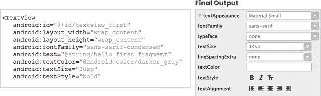

**4。改变布局的背景颜色**

给你的应用程序屏幕一个不同于第一个活动屏幕的背景颜色。

*1。在 colors.xml 中，使用这个示例代码****"<color name = " screen background 2 "># 26 c6da</color>"****添加一个新的颜色资源。*

*2。在第二个活动 fragment_second.xml 的布局中，将 ConstraintLayout 的背景设置为新颜色。*

你的应用程序现在已经完成了第二个片段的布局，代码为***"<color name = " screen background 2 "># 26C6DA</color>"***。然而，如果你运行你的应用程序并按下屏幕上的随机按钮，那么就有可能崩溃。您需要在 Android Studio 中单击处理程序来设置按钮中的更改。

**第八步:检查导航图**

最初，您选择基本活动作为新项目的模板。因此，当 Android Studio 为一个新项目使用基本活动模板时，它会设置两个片段和一个导航图，帮助您从一个屏幕连接到另一个屏幕。此外，它还设置了一个按钮，使您能够从第一个活动片段转到第二个活动片段。这是您更改为随机按钮的按钮。所以你需要在按钮被按下时发送一个数字。为此，您可以遵循以下步骤:

*打开“****nav _ graph . XML(app>RES>navigation>nav _ graph . XML)****”在设计视图中打开一个类似布局编辑器的屏幕。*

为了进一步将计数发送到第二个片段屏幕，您需要遵循代码来完成操作。

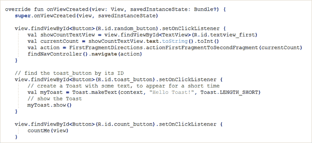

更新 SecondFragment 以计算并在屏幕上显示一个随机数。下一步是遵循下面提到的代码。

*下面是整个方法。*

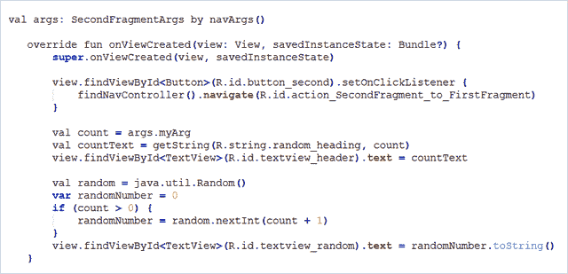

恭喜你，你已经在 Kotlin 成功开发了你的第一个 Android 应用。

*你的 app 最终结果是:*

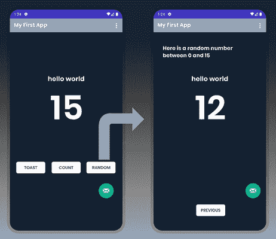

**第九步:发布你的应用**

完成构建后，现在是时候将您的应用程序发布到谷歌 Play 商店了。在准备你的应用程序发布时，确保雇佣熟悉所有发布指南的 Android 应用程序开发者，没有任何瑕疵。如果你是自己做的，那就花点时间阅读将应用发布到应用商店的指南，以免被拒绝。

要发布你的应用，你需要支付大约 100 到 150 美元的应用商店许可费，并且要一次性支付。

# **外卖**

随着“hello world”运行屏幕的设置完成，你已经接受了 Kotlin 的培训，可以开发下一个应用程序或在这个基本应用程序中添加组件列表。*虽然有了这个教程，我们还是努力帮助你学习下面这些东西:*

*   如何设置登录屏幕
*   构建用户界面
*   探索布局编辑器
*   发布应用程序

然而，应用程序开发过程并没有就此结束。要为竞争激烈的市场开发任何成熟的应用程序，你需要寻找久负盛名的 [**移动应用程序开发公司**](https://www.xicom.biz/services/mobile-app-development/) ，它可以帮助你在 Kotlin 开发 Android 应用程序。

由于外包软件开发公司由技术高超、经验丰富的工程师支持，因此，他们可以更好地帮助您将应用程序开发想法转化为完美的解决方案，同时牢记您的预算和时间限制。