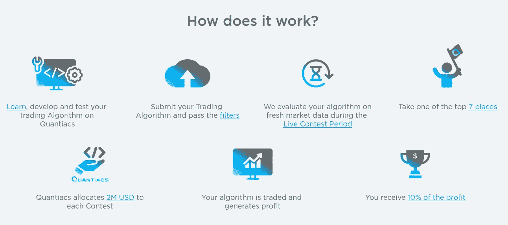
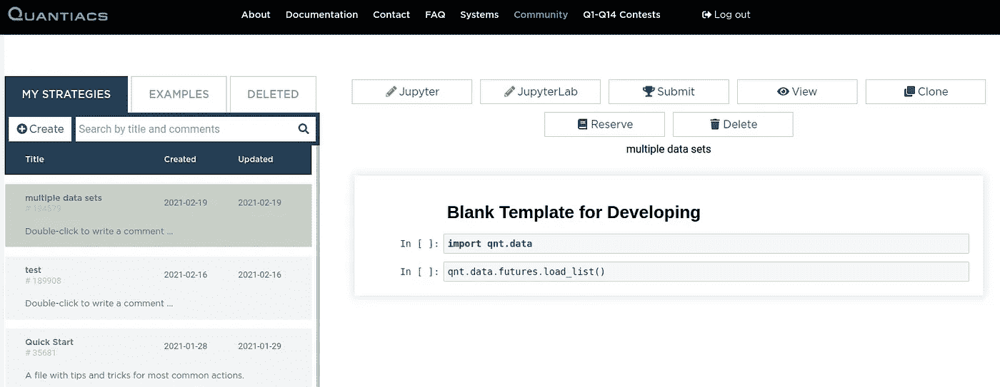
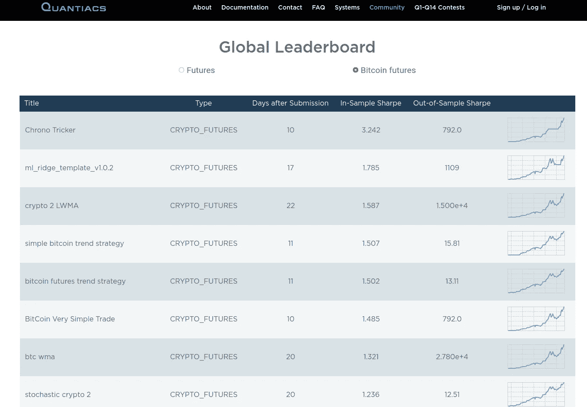

# 用 Quantiacs 开发比特币交易算法

> 原文：<https://levelup.gitconnected.com/developing-bitcoin-trading-algorithms-with-quantiacs-7bac5f063155>

*在本文中，我们描述了使用 Quantiacs 对比特币期货合约实施简单的量化策略。*

本月，我们发布了 Quantiacs 平台的新版本，有几项重大改进。除了提供新的开源回溯测试工具和免费下载金融数据的可能性，我们还为 quants 创建了一个云环境。在这里，可以使用 Jupyter Notebook 或 JupyterLab 用 Python 编写交易算法，并使用我们的免费资源直接在线运行它们。


比赛模式也发生了变化:基于 75 份流动性期货合约(包括股指、债券、外汇和大宗商品)的第 15 届期货大赛与第 1 届比特币期货大赛同时进行。

我们将为最好的系统拨款 400 万美元。7 名量子分析师将获得其期货系统的分配，7 名量子分析师将获得其比特币期货系统的分配，前提是他们在 2021 年 5 月 31 日之前提交，并且他们的样本内[夏普比率](https://en.wikipedia.org/wiki/Sharpe_ratio)大于 1。



在本文中，我们描述了一个简单的比特币期货合约交易算法的实现。

在[向 Quantiacs 注册](https://quantiacs.com/personalpage/registration)后，你可以打开你的[个人发展区，](https://quantiacs.com/personalpage/strategies)克隆一个例子，用 Jupyter 笔记本或 JupyterLab 编辑它。



打开笔记本后，我们导入所需的库:

```
import xarray as xrimport qnt.backtester as qnbt
import qnt.data as qndata
import qnt.ta as qnta
```

我们基于 xarray 的 Quantiacs，因为它使得处理多维数组非常有效。我们的 qnt 库可以在我们的 [github 库](https://github.com/Quantiacs)访问，文档可以在我们的[页面](https://quantiacs.com/documentation/en/)访问。

接下来，我们定义两个函数:一个用于加载比特币期货数据，另一个用于定义基于两个简单移动平均线交叉的基本趋势跟踪策略:

```
def load_data(period):
    crypto= qndata.cryptofutures.load_data(tail=period)
    return cryptodef strategy(data):
    close_crypto= data.sel(field=”close”)
    sma100= qnta.sma(close_crypto, 100).isel(time=-1)
    sma20 = qnta.sma(close_crypto, 20).isel(time=-1)
    return xr.where(sma100 < sma20, 1, 0)
```

策略是当 20 天移动平均线大于 100 天移动平均线时投资比特币期货，否则就不配置任何东西。

最后，我们调用 Quantiacs 回溯测试函数:

```
qnbt.backtest(
    competition_type= “cryptofutures”,
    load_data= load_data,
    lookback_period= 365,
    start_date= “2013-06-01”,
    strategy= strategy
)
```

运行笔记本。在输出消息中，您将看到与竞争相关的样本内时段的夏普比率大于 1:

```
Check the sharpe ratio...
Period: 2014-01-01 - 2021-02-17
Sharpe Ratio = 1.4853014048450253
Ok.
```

这意味着该系统可以提交，并将有资格参加竞赛。当然，这个想法只是一个起点，所以你应该改进它。

完成调查后，您可以从您的发展领域选择该策略，然后单击提交按钮。该战略将每天在我们的服务器上处理新的市场数据，您将能够监控您个人竞争领域的进展。

第一批提交的内容已经到达，可以在[排行榜页面](https://quantiacs.com/leaderboard)查看:



**全攻略**

```
import xarray as xrimport qnt.backtester as qnbt
import qnt.data as qndata
import qnt.ta as qntadef load_data(period):
    crypto= qndata.cryptofutures.load_data(tail=period)
    return cryptodef strategy(data):
    close_crypto= data.sel(field=”close”)
    sma100= qnta.sma(close_crypto, 100).isel(time=-1)
    sma20 = qnta.sma(close_crypto, 20).isel(time=-1)
    return xr.where(sma100 < sma20, 1, 0)qnbt.backtest(
    competition_type= “cryptofutures”,
    load_data= load_data,
    lookback_period= 365,
    start_date= “2013-06-01”,
    strategy= strategy
)
```