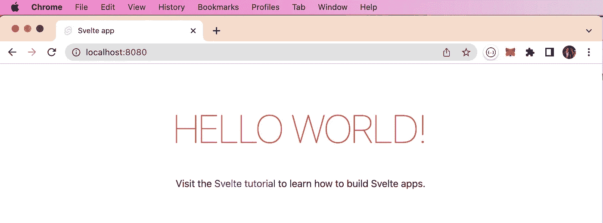
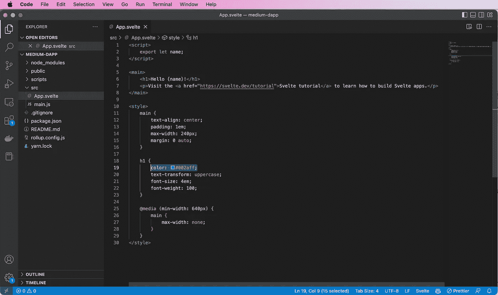
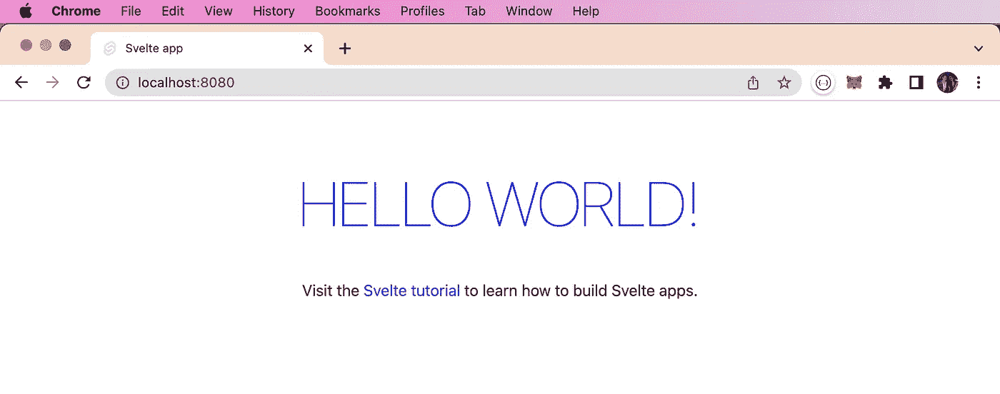
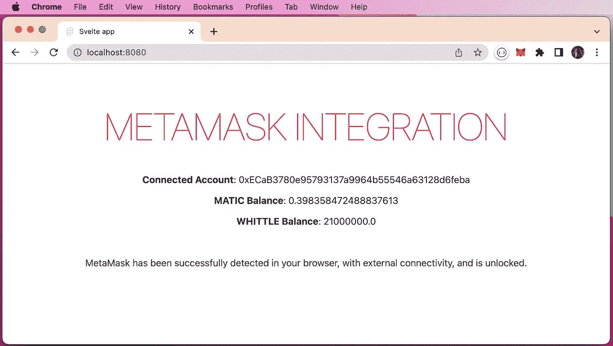

# 使用 Polygon MATIC 开发具有 Svelte 和 Web3/Ethers 的 DAPPs 第 2 部分

> 原文：<https://levelup.gitconnected.com/developing-dapps-with-svelte-and-web3-ethers-using-polygon-matic-part-2-7a17af83ee6d>

## 如何开始使用 Polygon 的孟买测试网


来自 Adobe Stock 的许可图像

在上一篇文章中，我向您展示了如何在浏览器中设置 MetaMask，在 Polygon Mumbai Testnet 上创建一个帐户，用 MATIC 为该帐户提供资金，甚至创建自己的 ERC-20 令牌(加密货币)。

[](https://medium.com/coinmonks/developing-dapps-with-svelte-and-web3-using-polygon-matic-part-1-c3cc13adc4e4) [## 使用 Polygon MATIC 用 Svelte 和 Web3 开发 DAPPs 第 1 部分

### 如何开始使用 Polygon 的孟买测试网

medium.com](https://medium.com/coinmonks/developing-dapps-with-svelte-and-web3-using-polygon-matic-part-1-c3cc13adc4e4) 

在这篇文章中，我将介绍如何用 Svelte(react . js、Angular、Vue 等的替代品)创建一个简单的 web 应用程序。)，使用 Ethers.js 将其与 MetaMask 集成，并与 Polygon Mumbai Testnet 区块链进行通信。

如果对第三篇文章感兴趣，我将演示如何将智能契约部署到 Polygon Mumbai Testnet 中，并使用我们的 web 应用程序与之交互。如果这是你想看到的，请考虑为这两篇文章鼓掌。

## 先决条件

为了创建我们苗条的 web 应用程序，我们将需要使用[节点包管理器](https://www.npmjs.com/) ( [NPM](https://www.npmjs.com/) )。这总是教程中棘手的部分，因为读者可能使用微软、OSX 或 Linux 系统。根据您的平台，安装会有所不同。我用的是苹果电脑，所以我只是用[自制软件](https://brew.sh/)来安装我的。例如“ **brew 更新**”，然后“ **brew 安装节点**”。如果一切按计划进行，它应该是这样的(版本可能会有所不同)。

```
% **npm --version**
8.3.1

% **node --version**
v17.4.0

% **npx --version**
8.3.1
```

## 苗条入门应用

为了开始使用 Svelte，我建议使用模板创建您的初始项目。我将把我的命名为“**中型 dapp** ”。

```
% **npx degit sveltejs/template medium-dapp**
Need to install the following packages:
  degit
Ok to proceed? (y) y
> cloned sveltejs/template#HEAD to medium-dapp
```

完成后，将创建一个名为“ **medium-dapp** 的新目录，其文件结构如下所示。

```
% cd medium-dapp
medium-dapp % tree .

.
|____README.md
|____rollup.config.js
|____public
| |____index.html
| |____global.css
| |____favicon.png
|____.gitignore
|____package.json
|____scripts
| |____setupTypeScript.js
|____src
| |____App.svelte
| |____main.js
```

在一个完全不相关的问题上——“**tree**”在 Linux 上是一个非常有用的命令，但是它不包含在 OSX 上。作为一种方便的解决方法，您可以创建一个别名，如下所示(产生上面的输出)。

```
alias tree="find . -print | sed -e 's;[^/]*/;|____;g;s;____|; |;g'"
```

Svelte 的库需求将包含在 **package.json** 文件中。

```
{
  "name": "svelte-app",
  "version": "1.0.0",
  "private": true,
  "scripts": {
    "build": "rollup -c",
    "dev": "rollup -c -w",
    "start": "sirv public --no-clear"
  },
  "devDependencies": {
    "@rollup/plugin-commonjs": "^17.0.0",
    "@rollup/plugin-node-resolve": "^11.0.0",
    "rollup": "^2.3.4",
    "rollup-plugin-css-only": "^3.1.0",
    "rollup-plugin-livereload": "^2.0.0",
    "rollup-plugin-svelte": "^7.0.0",
    "rollup-plugin-terser": "^7.0.0",
    "svelte": "^3.0.0"
  },
  "dependencies": {
    "sirv-cli": "^2.0.0"
  }
}
```

在“ **medium-dapp** ”目录下，您可以运行“ **yarn** ”或“ **npm** ”来安装依赖项。我更喜欢用“**纱**”但这取决于你。

```
medium-dapp % **yarn** 
yarn install v1.22.17
info No lockfile found.
[1/4] 🔍  Resolving packages...
[2/4] 🚚  Fetching packages...
[3/4] 🔗  Linking dependencies...
[4/4] 🔨  Building fresh packages...
success Saved lockfile.
warning Your current version of Yarn is out of date. The latest version is "1.22.19", while you're on "1.22.17".
info To upgrade, run the following command:
$ brew upgrade yarn
✨  Done in 13.14s.
```

如果一切都按计划进行，您应该能够启动“ **hello world** ”网站，如下所示。

```
medium-dapp % **npm run dev**

> svelte-app@1.0.0 dev
> rollup -c -w

rollup v2.79.1
bundles src/main.js → public/build/bundle.js...
LiveReload enabled
created public/build/bundle.js in 202ms

[2022-11-12 09:48:50] waiting for changes...

> svelte-app@1.0.0 start
> sirv public --no-clear "--dev"

  Your application is ready~! 🚀

  - Local:      http://localhost:8080
  - Network:    Add `--host` to expose

────────────────── LOGS ──────────────────
```



作者截图

在开发者模式下运行它的好处是，任何代码更新都将自动在浏览器中重新加载，而无需重启站点。

例如，我让现有的“ **npm run dev** ”终端运行。我打开一个新的终端，并在我的 IDE 中打开目录，这是 [Visual Studio 代码](https://code.visualstudio.com/)。

```
medium-dapp % code .
medium-dapp % 
```

我将“ **HELLO WORLD** ”的颜色从红色改为蓝色，并保存了文件。



作者截图

这些变化马上就反映出来了。

```
bundles src/main.js → public/build/bundle.js...
created public/build/bundle.js in 99ms

[2022-11-12 09:54:16] waiting for changes...
  [09:54:57] 200 ─ 4.54ms ─ /
  [09:54:57] 200 ─ 3.66ms ─ /global.css
  [09:54:57] 200 ─ 4.48ms ─ /build/bundle.css
  [09:54:57] 200 ─ 0.97ms ─ /build/bundle.js
  [09:54:57] 200 ─ 0.96ms ─ /favicon.png
  [09:55:27] 200 ─ 0.58ms ─ /
  [09:55:27] 200 ─ 5.08ms ─ /global.css
  [09:55:27] 200 ─ 5.96ms ─ /build/bundle.css
  [09:55:27] 200 ─ 2.19ms ─ /build/bundle.js
  [09:55:27] 200 ─ 0.80ms ─ /favicon.png
```



作者截图

我们现在有一个基本的苗条的应用程序启动和运行。下一步将开始将它与元掩码集成。

## Web3 与以太网

这两个 Javascript 库的语法略有不同，但它们本质上做的是相同的事情。它们都是"**同样受欢迎的**"，但是就我所见"**醚类**"似乎是现在大多数开发人员的首选(至少在我从事的项目中)。Web3 似乎是"**营销名称**"你听到的很多可能更多的是指它执行的功能，而不是它实际上是什么。归根结底，选择权在你。它们各有利弊，但大多是装饰性的。这篇文章不打算权衡利弊，但我仍然想提供更多的信息。我发现了这个 YouTube 视频，这个人解释得很好，所以我不打算重新发明轮子。我比其他人更喜欢这个解释的原因是，他在他的 Github repo 中也提供了类似的例子，所以你可以进行比较。

## 使用醚与超薄超屏蔽通信

是的，“**醚类**”…我喜欢“**醚类**”，我在 Svelte 中做的整合将使用这个库。如果你对使用“ **web3** ”有强烈的感觉，相反它非常相似，所以转换应该很容易。

你需要在你的项目中安装 **ethers** 。如果网站还在运行，停止网站，运行“**纱线添加醚**”或“ **npm 安装醚**”，随你喜欢。

```
medium-dapp % **yarn add ethers**
yarn add v1.22.17
[1/4] 🔍  Resolving packages...
[2/4] 🚚  Fetching packages...
[3/4] 🔗  Linking dependencies...
[4/4] 🔨  Building fresh packages...

success Saved lockfile.
success Saved 18 new dependencies.
info Direct dependencies
└─ ethers@5.7.2
info All dependencies
├─ @ethersproject/abi@5.7.0
├─ @ethersproject/contracts@5.7.0
├─ @ethersproject/json-wallets@5.7.0
├─ @ethersproject/providers@5.7.2
├─ @ethersproject/solidity@5.7.0
├─ @ethersproject/units@5.7.0
├─ @ethersproject/wallet@5.7.0
├─ aes-js@3.0.0
├─ bech32@1.1.4
├─ brorand@1.1.0
├─ elliptic@6.5.4
├─ ethers@5.7.2
├─ hash.js@1.1.7
├─ hmac-drbg@1.0.1
├─ js-sha3@0.8.0
├─ minimalistic-assert@1.0.1
├─ scrypt-js@3.0.1
└─ ws@7.4.6
✨  Done in 8.30s.
```

再次启动您的 web 服务器，“npm run dev ”，并打开一个单独的窗口来编辑代码。

为了节省时间，我将重复使用上面提到的启动代码。我将只在 src/App.svelte 文件中工作。

我们的最终结果将是这样的…



作者截图

*   加载页面时，元掩码将自动连接
*   如果元掩码已安装、解锁并连接，它将返回(每 3 秒检查一次)
*   如果元掩码中的账户发生变化，则“**关联账户**将立即更新
*   将显示当前 MetaMask 钱包中的“**自动余额**”(每 3 秒检查一次)
*   将对照我们在上一篇文章中创建的 ERC-20 令牌契约来检查“**惠特尔余额**”(每 3 秒检查一次)

我故意试着不要让它变得太复杂，所以它很容易理解。你可以做很多事情来改善这一点，比如使用苗条商店。它有点像 React.js 的翻版，但是更加简单明了。它基本上是应用程序变量的中央存储。

**让我们深入研究代码……**

首先，我们将从 **<脚本>…</脚本>** 标签内的代码开始。这是您的 Javascript 将要去的地方。

将 Ethers.js 导入到您的项目中，我们之前已经安装了它。

```
import { ethers } from "ethers";
```

配置您的常数。我使用了 ERC 20 令牌 ABI 的一个子集。通常您会从 separe ERC20.json 文件导入整个 ABI。出于本文的目的，我只是添加了我们现在需要的内容。我还包含了“ **tokenAddress** ”，这是我的 WHITTLE 令牌部署在区块链上的合同地址。[更多信息请参考上一篇文章](https://medium.com/coinmonks/developing-dapps-with-svelte-and-web3-using-polygon-matic-part-1-c3cc13adc4e4)。

```
const ERC20_ABI = [
  {
    constant: true,
    inputs: [
      {
        name: "_owner",
        type: "address",
      },
    ],
    name: "balanceOf",
    outputs: [
      {
        name: "balance",
        type: "uint256",
      },
    ],
    payable: false,
    type: "function",
  },
];

const tokenAddress = "0x348B9EaA3350EC3EfDB731FAc13EA1De234d2DE6";
```

然后我们定义全局变量。希望它们是不言自明的，不需要解释。

```
let provider;
let signer;
let signerAddress;
let tokenContract;
let tokenBalance = 0;
let accountBalance = 0;
let isConnected = false;
let isUnlocked = false;
let initialized = false;
let isPermanentlyDisconnected = false;
let metamaskStatus = "...";
```

然后我创建了一个名为“ **connectWallet** ”的异步函数。我在页面加载时自动运行这个，但是你可以很容易地将它附加到一个按钮上。这个函数有一些基本的元掩码错误处理来检测状态。我见过太多这方面做得不好的地方。元掩码可以安装或不存在、锁定或解锁、连接或不连接等。也有可能在调用" **connectWallet** "之后这种情况会发生变化，所以只检查一次是不够的。在这个函数中，我检索重要的信息，比如元掩码中活动帐户的地址、元掩码中的帐户余额以及元掩码中活动帐户的令牌余额。

```
async function connectWallet() {
  const { ethereum } = window;

  if (typeof window.ethereum !== "undefined") {
    // connect
    await ethereum.request({ method: "eth_requestAccounts" }).catch((err) => {
      if (err.code === 4001) {
        // EIP-1193 userRejectedRequest
        alert("You need to install MetaMask");
      } else {
        console.error(err);
      }
    });

    // get provider
    provider = new ethers.providers.Web3Provider(ethereum);

    // get signer
    signer = provider.getSigner();

    // get connected wallet address
    signerAddress = await signer.getAddress();

    // get account balance
    accountBalance = await provider.getBalance(signerAddress);

    // erc-20 token
    tokenContract = new ethers.Contract(tokenAddress, ERC20_ABI, provider);
    tokenBalance = await tokenContract.balanceOf(signerAddress);

    // update on account change
    ethereum.on("accountsChanged", function (accounts) {
      signerAddress = accounts[0];
    });
  } else {
    alert("MetaMask has not been detected in your browser!");
    console.err("MetaMask has not been detected in your browser!");
  }
}
```

正如我上面提到的，在最初的连接之后，很多事情都会改变。不仅是连接状态，还有帐户余额。例如，如果在 MetaMask 的账户中进行了转账，但 web 应用程序没有更新显示的余额，这就不好了。该预定功能每 3 秒运行一次。它确保余额得到更新，并显示正确的状态。

```
var accountInterval = setInterval(function () {
  if (provider) {
    ({ isConnected, isUnlocked, initialized, isPermanentlyDisconnected } =
      window.ethereum._state);

    if (isConnected && !isPermanentlyDisconnected && initialized) {
      if (isUnlocked) {
        metamaskStatus = `<span style="color: green;">MetaMask has been successfully detected in your browser, with external connectivity, and is unlocked.</span>`;

        // get account balance
        provider.getBalance(signerAddress).then((_accountBalance) => {
          accountBalance = _accountBalance;
        });

        // erc-20 token balance
        tokenContract.balanceOf(signerAddress).then((_tokenBalance) => {
          tokenBalance = _tokenBalance;
        });
      } else {
        metamaskStatus = `<span style="color: red;">Please unlock your MetaMask and reload.</span>`;
      }
    } else {
      if (isUnlocked) {
        metamaskStatus = `<span style="color: red;">MetaMask has been successfully detected in your browser, but without external connectivity.</span>`;
      } else {
        metamaskStatus = `<span style="color: red;">Please unlock your MetaMask and reload.</span>`;
      }
    }
  }
}, 3000);
```

您会注意到，我对变量“ **metamaskStatus** ”使用了反斜杠。我想包括 HTML，这将根据状态类型切换颜色。

最后一行只是运行，“ **connectWallet** ”。正如我上面提到的，当页面加载时我会自动运行它，但是你也可以很容易地将它绑定到一个按钮上。

```
connectWallet();
```

接下来的部分是 **<主>…</主>** 标签。我用这个替换了初始模板中的内容。

```
<main>
  <h1>MetaMask Integration</h1>
  <p><b>Connected Account</b>: {signerAddress}</p>
  <p><b>MATIC Balance</b>: {ethers.utils.formatEther(accountBalance)}</p>
  <p><b>WHITTLE Balance</b>: {ethers.utils.formatEther(tokenBalance)}</p>

  <br />
  <p>{@html metamaskStatus}</p>
</main>
```

这里要注意的要点是，我将余额从一个“**大数字**”格式化成可读的东西。您还会注意到，我对变量“ **metamaskStatus** ”的显示做了一些特殊的处理。如果之前没有包含 html 标签，那么“ **metamaskStatus** ”的内容将被准确返回。我们实际上希望解释变量字符串中的 HTML。

我没有从模板中修改 **<样式>…</样式>** 标签。

完整的代码如下所示…

```
<script>
  import { ethers } from "ethers";

  const ERC20_ABI = [
    {
      constant: true,
      inputs: [
        {
          name: "_owner",
          type: "address",
        },
      ],
      name: "balanceOf",
      outputs: [
        {
          name: "balance",
          type: "uint256",
        },
      ],
      payable: false,
      type: "function",
    },
  ];

  const tokenAddress = "0x348B9EaA3350EC3EfDB731FAc13EA1De234d2DE6";

  let provider;
  let signer;
  let signerAddress;
  let tokenContract;
  let tokenBalance = 0;
  let accountBalance = 0;
  let isConnected = false;
  let isUnlocked = false;
  let initialized = false;
  let isPermanentlyDisconnected = false;
  let metamaskStatus = "...";

  async function connectWallet() {
    const { ethereum } = window;

    if (typeof window.ethereum !== "undefined") {
      // connect
      await ethereum.request({ method: "eth_requestAccounts" }).catch((err) => {
        if (err.code === 4001) {
          // EIP-1193 userRejectedRequest
          alert("You need to install MetaMask");
        } else {
          console.error(err);
        }
      });

      // get provider
      provider = new ethers.providers.Web3Provider(ethereum);

      // get signer
      signer = provider.getSigner();

      // get connected wallet address
      signerAddress = await signer.getAddress();

      // get account balance
      accountBalance = await provider.getBalance(signerAddress);

      // erc-20 token
      tokenContract = new ethers.Contract(tokenAddress, ERC20_ABI, provider);
      tokenBalance = await tokenContract.balanceOf(signerAddress);

      // update on account change
      ethereum.on("accountsChanged", function (accounts) {
        signerAddress = accounts[0];
      });
    } else {
      alert("MetaMask has not been detected in your browser!");
      console.err("MetaMask has not been detected in your browser!");
    }
  }

  var accountInterval = setInterval(function () {
    if (provider) {
      ({ isConnected, isUnlocked, initialized, isPermanentlyDisconnected } =
        window.ethereum._state);

      if (isConnected && !isPermanentlyDisconnected && initialized) {
        if (isUnlocked) {
          metamaskStatus = `<span style="color: green;">MetaMask has been successfully detected in your browser, with external connectivity, and is unlocked.</span>`;

          // get account balance
          provider.getBalance(signerAddress).then((_accountBalance) => {
            accountBalance = _accountBalance;
          });

          // erc-20 token balance
          tokenContract.balanceOf(signerAddress).then((_tokenBalance) => {
            tokenBalance = _tokenBalance;
          });
        } else {
          metamaskStatus = `<span style="color: red;">Please unlock your MetaMask and reload.</span>`;
        }
      } else {
        if (isUnlocked) {
          metamaskStatus = `<span style="color: red;">MetaMask has been successfully detected in your browser, but without external connectivity.</span>`;
        } else {
          metamaskStatus = `<span style="color: red;">Please unlock your MetaMask and reload.</span>`;
        }
      }
    }
  }, 3000);

  connectWallet();
</script>

<main>
  <h1>MetaMask Integration</h1>
  <p><b>Connected Account</b>: {signerAddress}</p>
  <p><b>MATIC Balance</b>: {ethers.utils.formatEther(accountBalance)}</p>
  <p><b>WHITTLE Balance</b>: {ethers.utils.formatEther(tokenBalance)}</p>

  <br />
  <p>{@html metamaskStatus}</p>
</main>

<style>
  main {
    text-align: center;
    padding: 1em;
    max-width: 240px;
    margin: 0 auto;
  }

  h1 {
    color: red;
    text-transform: uppercase;
    font-size: 4em;
    font-weight: 100;
  }

  @media (min-width: 640px) {
    main {
      max-width: none;
    }
  }
</style>
```

如果你想让我继续学习这篇教程，请不要忘记为文章鼓掌。如果你想让我向你展示如何部署一个智能联系人并与之互动，或者告诉我苗条商店是如何工作的，请在评论中告诉我。如果你还有什么想看的或者已经解释过的，请告诉我。

我希望你觉得这篇文章有趣并且有用。如果您想随时了解情况，请不要忘记关注我，注册我的[电子邮件通知](https://whittle.medium.com/subscribe)。

# 迈克尔·惠特尔

*   ***如果你喜欢这个，请*** [***跟我上媒***](https://whittle.medium.com/)
*   ***更多有趣的文章，请*** [***关注我的刊物***](https://medium.com/trading-data-analysis)
*   ***有兴趣合作吗？*** [***我们上领英***](https://www.linkedin.com/in/miwhittle/) 连线一下
*   ***支持我和其他媒体作者*** [***在此报名***](https://whittle.medium.com/membership)
*   ***请别忘了为文章鼓掌:)←谢谢！***