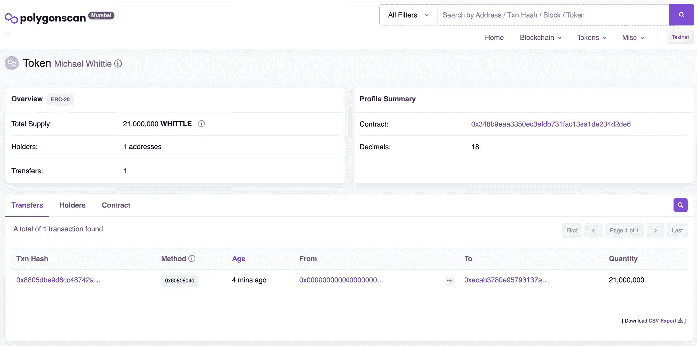

# 使用 Polygon MATIC 开发具有 Svelte 和 Web3/Ethers 的 DAPPs 第 1 部分

> 原文：<https://levelup.gitconnected.com/developing-dapps-with-svelte-and-web3-using-polygon-matic-part-1-c3cc13adc4e4>

## 如何开始使用 Polygon 的孟买测试网

来自 Adobe Stock 的许可图像

几个月前，我为 Polygon 的区块链开发 DAPPs 的三个项目提供咨询。我是[认证以太坊开发者](https://certificates.b9lab.com/certificate.html?uuid=5eb41a5e-780a-45bd-8c89-4329d015fdd9)，[认证以太坊 QA 工程师](https://certificates.b9lab.com/certificate.html?uuid=d719bfd8-0b69-4984-ab6c-06843b1c31d2)，做过[定额专精](https://certificates.b9lab.com/certificate.html?uuid=97587880-86e3-4eac-baca-dbfc6f6ea276)。起初，我有点担心，因为我以前从未使用过 [Polygon](https://polygon.technology/) 或 MATIC。我有在 [Solidity](https://docs.soliditylang.org/) 中使用 [Remix](https://remix.ethereum.org/) 、 [Tuffle Suite](https://trufflesuite.com/) 和 [Hardhat](https://hardhat.org/) 开发智能合约的知识和经验，但是会一样吗？为了增加另一个层次的复杂性，我有使用 [React.js](https://reactjs.org/) 的知识和经验，但要求是使用 [Svelte](https://svelte.dev/) 开发前端。我从未听说过苗条的 T21，但有人告诉我这很容易上手(事实也的确如此)。

我想我会通过几篇文章与你分享我的经验。对于那些想用 Polygon MATIC 开发 DAPPs 的人来说，这将有助于加速你的学习。Polygon 和 Svelte 给我留下了深刻的印象，我现在可能更喜欢它而不是以太坊和 React.js。多边形真的很好用。交易速度更快，成本更低。Svelte 的开发速度比 React.js 快太多了，性能也是如此。

## 让我们开始吧…

如果你打算开发 DAPPs，你将从使用 [Polygon 的 Mumbai Testnet](https://mumbai.polygonscan.com/) 开始。如果你熟悉以太坊的话，这个堪比罗普斯滕，科万，林克比，格力。在以太网上，你用来支付交易的货币是以太网。在多边形网络上，货币是 MATIC，您将使用它来支付交易。

**步骤 1:将元掩码安装到您的浏览器中**

[MetaMask](https://metamask.io/) 是一个非常流行的客户端(浏览器插件),用于与区块链进行交互。还有其他选择，如 [WalletConnect](https://walletconnect.com/) ，但我个人更喜欢 MetaMask。安装过程真的很简单，只需按照安装过程中的指示。

**步骤 2:将多边形测试网作为网络选项添加到元掩码中**

MetaMask 包括许多预配置的网络，但你可以添加任何你想要的区块链。我会假设你没有，需要添加它。

作者截图

您将需要点击“**显示/隐藏测试网络**”，并确保“**显示测试网络**”被切换到开。完成此操作后，您可能会看到也可能看不到多边形孟买测试网络。

作者截图

我没有看到它，所以需要添加它。点击**添加网络**。

作者截图

那里还是看不出来，我就“**手动添加一个网络**”。

**网络名称:**孟买测试网

**新 RPC 网址:**[https://rpc-mumbai.maticvigil.com/](https://rpc-mumbai.maticvigil.com/)

> 这里有一个题外话…上面的 RPC URL 不是孟买测试网络的唯一 RPC URL。RPC URLs 偶尔会遇到问题。如果由于某种原因，您的元掩码停止连接到网络或非常慢，您可以尝试其他 URL。

**连锁 ID:** 80001

**货币符号:** MATIC

**屏蔽浏览器网址:**[https://polygonscan.com/](https://polygonscan.com/)

作者截图

然后点击**保存**，应该是这样的。

作者截图

我们现在连接到 Polygon Testnet，我创建了一个帐户("**0x ecab 3780 e 95793137 a 9964 b 55546 a 63128 D6 feba**")，帐户余额为零 MATIC。

**第三步:资助我们的多边形测试网账户**

为了在区块链上做任何事情，我们需要使用名为 MATIC 的令牌进行支付。由于这是一个测试网络，您不能像在主网络中那样“购买”MATIC。

在区块链世界中，有一种叫做水龙头的重要服务。你可以申请测试基金。网上有很多，但是很难找到一个能用的；)

刚刚在谷歌搜索“polygon mumbai 水龙头”发现了这个:[https://水龙头. polygon.technology](https://faucet.polygon.technology/)

作者截图

我在“**钱包地址**中粘贴了我的地址，点击“**提交**，然后“**确认**”。

几分钟后，我的账户被存入了 0.2 MATIC。

作者截图

请注意，水龙头不是无限的资源。在这种情况下，水龙头有 MATIC 发送，但很可能水龙头可能没有足够的 MATIC。如果发生这种情况，只要继续在网上搜索，为自己找到一个工作。

**步骤 4:创建一个 ERC-20 令牌(例如加密货币)** *(可选)*

根据你想在 DAPP 中做什么，你可能想使用 ERC-20 代币。有一个非常简单的方法来创建你自己的 ERC 20 代币(或加密货币)。

我建议你创建一个，因为它很有趣，但我也会在后续文章中介绍如何使用 Svelte 和 Web3/Ethers 与它交互。

转到这个地址:
[https://www . smart contracts . tools/token-generator/create/polygon/？tokenType=SimpleERC20](https://www.smartcontracts.tools/token-generator/create/polygon/?tokenType=SimpleERC20)

作者截图

我像这样创建了我的 SimpleERC20 令牌:

*   代称:迈克尔·惠特尔
*   象征符号:惠特尔
*   初始供应量:21000000
*   网络:孟买测试网
*   检查一下你是否已经阅读了条款和细则
*   点击**下一步**

这将打开您的 MetaMask 客户端(应该连接到 Polygon Mumbai)并执行事务。

它会询问您有关“**计费信息**”的信息。因为我们在测试网上，你可以点击**跳过**。

作者截图

点击**创建令牌**。

这将再次打开您的元掩码，以提交事务来部署它。

作者截图

我喜欢的是，你可以通过上面的链接将你的 ERC-20 令牌直接添加到元掩码中。

作者截图

我的元蒙版现在是这样的。

我有 0.3984 MATIC，这是 0.4 MATIC 减去交易费。我现在也有 21000000 惠特尔代币。

您可以在[多边形扫描仪](https://mumbai.polygonscan.com/tx/0x8805dbe9d6cc48742aa18fab0b20246d84d72d176110ceda8cb294a5993d2dd4)上查看交易。

 [## 多边形事务哈希(Txhash)详细信息|多边形扫描

### 这只是一个多边形 PoS Testnet 交易]0x 8805 DBE 9 D6 cc 48742 aa 18 fab 0 b 20246d 84d 72d 176110 ceda 8 CB 294 a 5993 D2 DD 4 5…

mumbai.polygonscan.com](https://mumbai.polygonscan.com/tx/0x8805dbe9d6cc48742aa18fab0b20246d84d72d176110ceda8cb294a5993d2dd4) 

作者截图

我点击了“**代币转账**”行末尾我的 ERC-20 代币的链接。

 [## 迈克尔·惠特尔(惠特尔)令牌跟踪器|多边形扫描

### PolygonScan 上的 Michael Whittle (WHITTLE)代币追踪器显示代币的价格为 0.00 美元，总供应量为 21，000，000…

mumbai.polygonscan.com](https://mumbai.polygonscan.com/token/0x348b9eaa3350ec3efdb731fac13ea1de234d2de6) 

作者截图

这篇文章介绍了使用 Svelte 和 Web3/Ethers 创建和使用 DAPP 的准备工作。完成初始设置后，下一篇文章将关注 Svelte 和 Web3/Ethers，以及如何通过 DAPP 驱动 MetaMask。

我希望你觉得这篇文章有趣并且有用。如果您想随时了解情况，请不要忘记关注我，注册我的[电子邮件通知](https://whittle.medium.com/subscribe)。

本文的第 2 部分已经准备好了…

 [## 使用 Polygon MATIC 开发具有 Svelte 和 Web3/Ethers 的 DAPPs 第 2 部分

### 如何开始使用 Polygon 的孟买测试网

medium.com](https://medium.com/coinmonks/developing-dapps-with-svelte-and-web3-ethers-using-polygon-matic-part-2-7a17af83ee6d) 

# 迈克尔·惠特尔

*   ***如果你喜欢这个，请*** [***跟我上媒***](https://whittle.medium.com/)
*   ***更多有趣的文章，请*** [***关注我的刊物***](https://medium.com/trading-data-analysis)
*   ***有兴趣合作吗？*** [***我们上领英***](https://www.linkedin.com/in/miwhittle/) 连线吧
*   ***支持我和其他媒体作者*** [***在此报名***](https://whittle.medium.com/membership)
*   ***请别忘了为文章鼓掌:)←谢谢！***