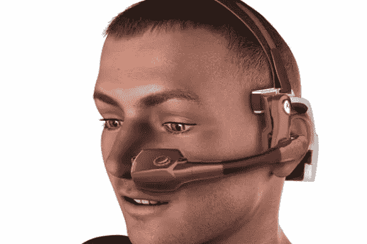
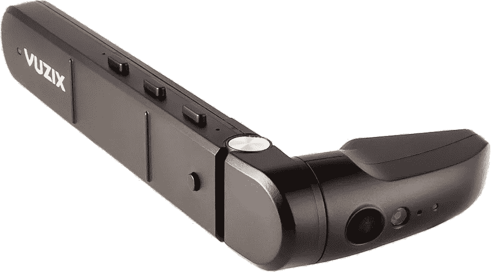
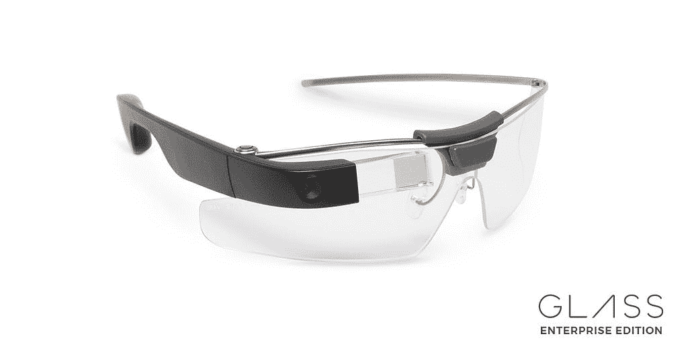
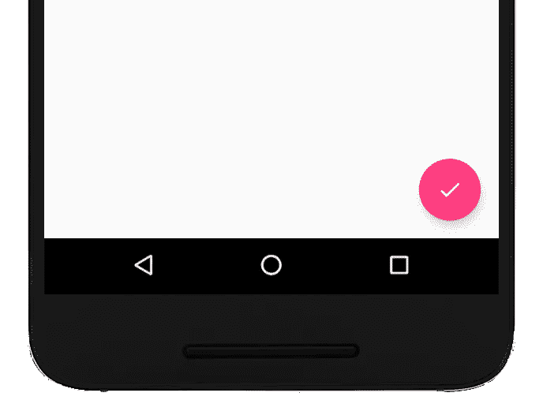
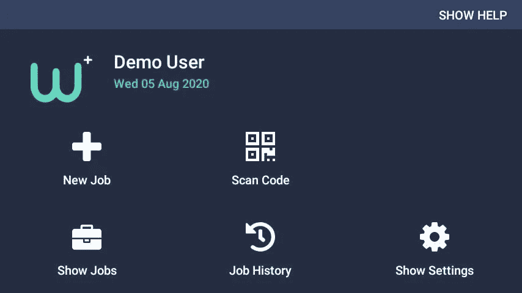
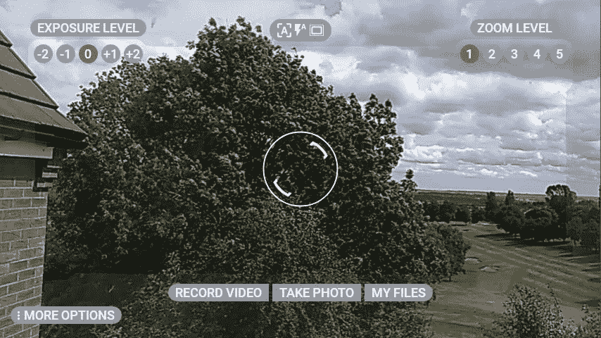

# 开发伟大的免提应用程序—第 1 部分

> 原文：<https://levelup.gitconnected.com/developing-great-hands-free-applications-part-1-58844395b048>

一些环境不适合智能手机和平板电脑——由 [Unsplash](https://unsplash.com?utm_source=medium&utm_medium=referral) 上的 [chandler denise](https://unsplash.com/@chandlerdenise?utm_source=medium&utm_medium=referral) 拍摄

*这篇文章开始变得有点长，所以我把它分开了。参见* [***第二部分***](/developing-great-hands-free-applications-part-2-1a923e1acbf) *。*

早在 2008 年，我就开始使用免提可穿戴技术。我的小型软件咨询公司是通过我们在 Windows SideShow 上做的一些工作联系上的。要求是:

> 如何使用免提设备控制 Microsoft PowerPoint 演示文稿？

我们决定接受挑战，并开始与微软和 Kopin Golden-i 3.5 合作(侧栏，我的公司后来被 Kopin 收购，我们继续与他们合作开发伟大的技术)。

Golden-i 设备完全免提，语音操作，早在 2008 年就运行微软 Windows CE 5。

kopin Golden-I 3.5-大约。2010

10 多年后，平台可能已经改变，但规则没有变。我发现为这些设备创建应用程序与为触摸设备开发完全不同，以下是我学到的东西。

# 1.仅限演讲

这是一个大问题，所以让我们先把它解决掉。没有触摸屏。这可能是显而易见的，但值得记住并记下来。没有触摸屏，你的用户界面可能没有意义。

> 无论你在哪里有一个按钮，这必须转化为语音命令。

幸运的是，在 RealWear HMT-1 上，这是相当直接的。作为 Android 设备，您现有的应用程序可以很好地编译和运行(除了一些例外，见下文)。任何带有文本标签的按钮都将被语音识别器拾取并转换成命令。

当用户说出命令时，按钮将被“点击”,因此您的事件处理程序可以按预期工作。

忘记你的视差滚动效果，缩放和橡皮筋效果。抱歉，这里不欢迎他们。

## 物理按钮

稍微回溯一下，纯语音在技术上是不正确的，因为许多设备也支持*偶然的*物理按钮。但是，不要依赖这些。RealWear HMT-1 只提供“主页”和“电源”按钮。然而，在“主页”的情况下，该功能通过“导航主页”命令可用。

乍一看，您可能会觉得这是限制性的，但是不要担心。语音识别引擎非常出色，你会忘记那些硬件按键。

## 触摸板

一些设备(谷歌眼镜和 Vuzix M400)支持位于设备侧面的触摸板。这些都是不错的选择，但是不要假设你的用户会乐意使用它们。

归根结底，这些设备是“可穿戴的免提计算机”，所以请确保您的 UI 主要可以通过语音导航，并使用触摸板作为备份。

**如果用户不得不脱下手套使用你的应用程序，他们是不会感谢你的。**

Vuzix 和谷歌设备，侧面有触摸板

# 2.仔细构思你的语音命令

仅仅因为你在屏幕上有一个语音命令并不意味着它是一个好的语音命令。如果您的用户不能很容易地说出这个短语，或者，如果语音识别器很容易将其误认为另一个命令，那么您需要重新考虑您的命令。

在内部，语音识别器加载了用户界面需要的短语。这被称为“语法”和**，如果你不告诉设备你的语法，它不知道要听它**。当识别器检测到一些具有给定阈值(即 60%置信度)的语法时，它将向用户界面代码发送一条消息。

> 您的目标是以最低的误报率获得最高的识别置信度

对于应用程序中的每个布局，写下所有可用的语音命令。这将帮助你理解你要求你的用户做什么。为了帮助您轻松识别好的语音命令和坏的语音命令，这里有一些简单的提示:

*   每个命令都应该与其他命令保持“距离”
*   简短的命令效果很好
*   但是，千万不要(！)使用单音节命令

## 远离你的命令

假设您有一个显示文档页面的应用程序。如果用户希望向前导航，那么可用的命令是“下一页”,向后导航的命令是“上一页”。

理论上，这看起来不错。然而，有一个微妙的问题。语音识别器按时间片监听。一次将有 100-200 毫秒的音频传输到语音识别器，这意味着有时单词的开头可能会被截断。

在上面的场景中，如果您砍掉这两个命令的开头，您可能会得到“ **xt Page** 和“ **ous Page** ”。

在这种情况下，语音识别器必须有一定的信心来确定；发出命令了吗？哪个命令发出了？

如果你把你的命令稍微改成“Page Right”和“Page Left ”,这个问题是完全可以避免的。这些命令的含义保持不变(“Page Right”和“Next Page”是等价的)，但是就语音识别器而言，命令之间的距离增加了。

HMT 一号上 WorkfloPlus 中的远距离语音命令

## 简短的命令(类似于)

如果你的触摸式用户界面包含一个按钮，上面写着:“*是的，我接受并理解条款和条件*”，那么没有人会有问题。然而，在基于语音的用户界面中，这是一个烦恼。

这个短语可以被翻译成“*接受条款*，或者也许仅仅是“*接受*”。好多了。

再举个例子。在我的媒体编辑器上，我有一个按钮用于“*提示和键盘快捷键*”。同样，这在基于触摸的用户界面上没有错，但是，我确信“*显示提示*”会更容易说。

## **切勿使用单音节命令**

是的，使用短命令，但不要太短。如果你有一个“是”、“否”、“向上”、“向下”的命令，那么设备就有可能听不到你的声音。

记住设备**一直在听你说什么**。它被设计用来丢弃你和别人的对话，但是，当你发出一个命令时，它就会开始行动。

一个非常短的命令可能会被解释为背景噪音而被忽略。你的用户会感到沮丧，不明白为什么他们的命令不被接受。

更糟糕的是，单音节命令也可能被误报。这意味着，即使你什么也不说，它们也可能触发，或者，错误的命令可能被拾取。如果这个动作是破坏性的，那么对用户来说这可能是灾难性的，所以尽你所能避免这些。

如果你被卡住了，这里有一个方便的参考指南:

*   **是** =确认/肯定/接受
*   **否** =取消/驳回/否定
*   向上导航
*   向下 =向下导航/向下
*   后退=返回/向后导航
*   向左 =向左翻页/向左走
*   向右 =向右翻页/向右走

> 对“向后导航”的一个警告。HMT-1 将覆盖这个命令，并将其解释为 Android 的“后退”按钮。和基于触摸的 Android 一样，你可以在你的活动中覆盖后退按钮功能，但是，要确保用户理解正在发生的事情。

# 3.移除按钮图标

关于语音命令的最后一个提示，避免使用图标。一般放在你 UI 里的装饰图标是可以的，但是按钮图标没有任何意义。

在下面一个 Android 智能手机应用程序的截图中，按钮是做什么的？

未知按钮

*   如果这是一个电子邮件撰写屏幕，它可能意味着“发送”。
*   或者，对于收件箱，它可能意味着“撰写”或“新建”
*   对于“现场服务”工具，它可能意味着“完成”或“结束”
*   对于媒体，它可能意味着“发布”，或“保存到草稿”

你明白了。在基于触摸的设备中，用户只需点击按钮，但如果没有语音命令提示，用户会感到困惑。

> 带有图标的按钮对于移动按钮体验来说很棒，但是对于免提可穿戴设备来说，它们是不可能的。

将所有图标按钮转换成清晰易读的语音命令。是的，这意味着重构你的用户界面，但是，如果你想让你的用户明白他们应该做什么，这是你最起码应该做的。

以 WorkfloPlus 仪表板为例。用户在屏幕中间清楚地看到 5 个主要命令。

HMT 一号上的 WorkfloPlus 仪表板

这些命令都有很好的标签，距离和简短。

图标提示用户需要做什么，但是语音命令解释他们如何与应用程序交互。

如果没有图标，一些命令可能没有意义(如果 QR 码符号丢失,“扫描码”是什么意思？).通过将文本和图标结合起来，我们可以让用户清楚地了解整个过程的每一步。

# 4.声频反馈

与语音识别相反的是文本到语音。当你在基于触摸的应用程序中按下一个按钮时，你会得到一个很好的视觉提示，比如按钮上的悬停状态。

一些设备(如 HMT-1)允许你将显示器吊杆移开。在这种情况下，用户完全通过语音导航应用程序，因此，如果没有音频反馈，他们将如何知道他们在做什么。

WorkfloPlus 是一个循序渐进的指导平台。该解决方案的目标是指导用户完成一系列任务，并记录过程中的输出(例如:修理发动机、检查泵)。在 WorkfloPlus 中，我们**实现了一种模式，在这种模式下，设备会告诉用户他们当前所处步骤的标题和描述**。从这里开始，通常的语音命令可用于执行工作指令，但重要的是，用户不需要看着屏幕就可以使用软件。

显然，这并不适用于所有的应用程序，但是，如果你的应用程序可以通过语音来描述，那么用户可以在日常工作中自由使用(或不使用)物理显示器。

# 5.避开边缘

这似乎是一个奇怪的建议，但是，**避免你的用户界面的边缘。一些用户起初会发现很难适应这些免提可穿戴设备。此外，根据显示器的放置方式，可能不是所有用户都能看到全屏。**

> 如果你有任何语音命令、暗示或指示，试着稍微向内移动它们。如果你把它放在最前面和中心，你的用户就不太可能错过重要的信息，所以使用边缘作为次要的 UI 元素。

这与经常使用侧边栏的移动应用形成了鲜明对比。一个好的建议是将次要信息移到它自己的屏幕上。也许可以为额外的信息创建一个“Show Info”用户界面，让你的用户清楚在哪里可以找到这些其他的项目。

请注意在下面的截图中，所有的选项都被设置在稍微远离屏幕边缘的地方，如果用户需要的话，还会有“更多的选项”可用。

HMT-1“我的相机”用户界面

# 后续步骤

在下一篇文章中，我将介绍:

*   本土化
*   用户界面缩放和对比度
*   “不要依赖游戏商店”
*   运动跟踪
*   表演

 [## 开发伟大的免提应用程序—第 2 部分

### 为免提开发不同于触摸。上接第 1 部分，遵循这个方便的指南，您的用户将…

levelup.gitconnected.com](/developing-great-hands-free-applications-part-2-1a923e1acbf)