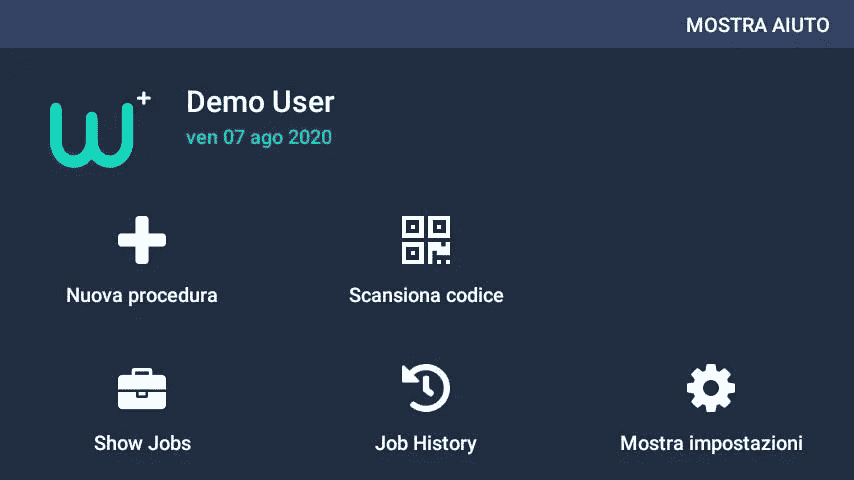

# 开发伟大的免提应用程序—第 2 部分

> 原文：<https://levelup.gitconnected.com/developing-great-hands-free-applications-part-2-1a923e1acbf>

在 [Unsplash](https://unsplash.com?utm_source=medium&utm_medium=referral) 上[科学高清](https://unsplash.com/@scienceinhd?utm_source=medium&utm_medium=referral)摄影——手套和移动设备不能混在一起。

*本文上接* [*第 1 部分*](/developing-great-hands-free-applications-part-1-58844395b048) *。*

如前所述，免提应用程序的开发不同于手机应用程序。第 1 部分的大部分内容集中在语音以及如何针对这种新的输入方式优化您的应用程序。在这一部分，我将讨论运动跟踪，定位和其他一些事情。

# 6.本土化

我们都知道应用程序应该是本地化的。这不仅适用于免提应用，也适用于移动应用。毕竟世界上只有 20%的人口会说英语，那么如何迎合另外 80%的人呢？

但不止于此，对于 20%说英语的人来说，还有一个挑战:

> 有多少人英语说得好到计算机能听懂？

仅仅因为你的海外客户对英语有一个完美的书面掌握，如果他们的口音与设备期望的太不一样，它可能很难理解正在说的话。

这就导致了本地化(*我是英国人，我们并不真正喜欢我们的 Z*)。对于免提可穿戴设备，这意味着:

*   语音命令
*   屏幕上的说明和内容
*   文本到语音

如果你的移动应用程序使用图标按钮，那么你很可能只需要简单地翻译内容就可以了。毕竟，播放/暂停按钮在所有文化中都有相同的含义。但是，有了免提，你将需要做更多的事情。

## 语音命令

翻译你的语音命令意味着人们实际上可以在应用程序中导航。原生 RealWear HMT-1 语音识别器提供多种语言，因此命令指令(导航回来，导航回家)已经翻译。

此外，如果你使用一些标准的 Android 单词，如`android.R.string.cancel`或`android.R.string.ok`，那么多亏了谷歌，这些单词也会被翻译出来。

然而，如果你把你定制的英语短语放进意大利语语音识别器，它就不会工作。

下面的例子展示了 HMT 一号的主页。键盘命令(我的程序、我的相机和我的文件)都很容易使用，并且是说话者的母语。

HMT 1 上的相同用户界面有英语、西班牙语和印度尼西亚语

请记住，这不仅仅是翻译单词那么简单，还需要说出来。

从第 1 部分开始，我们讨论了确保命令至少有两个音节(但不要太多)在创建一个伟大的免提用户体验时是多么重要。**仅仅因为一个命令在英语中是两个音节，并不意味着在另一种语言中也是如此。**作为您的本地化专家，复述他们正在翻译的短语，以确保命令不会太长或太短。

我的建议是，在设计本地化时，与以英语为母语的人合作。机器翻译对于初稿来说是很好的，但是他们可能会误解上下文的要求。

然后，一旦你收集了最初的译文，就和你的客户谈谈。在与意大利拜耳医药公司合作时，我们定期向他们发送我们翻译的 WorkfloPlus 软件的早期版本。有几次，我们发现翻译的选择的命令不适合在现实生活中使用，他们建议更好的命令。在很多情况下，他们甚至建议我们不知道的更短的命令。

> T4:和你的顾客一起工作，毕竟，他们会使用你的产品。

## **屏幕指示和内容**

显然你的内容需要翻译，这是不言而喻的。然而，要记住一个额外的小细节，**你新翻译的内容可能放不进页面**。我这么说是什么意思？

> 平均来说，英语单词有 8 个字符长，而德语单词有 12 个字符长

 [## 各种语言中单词长度的分布

### 我想知道各种语言中的单词有多长。我有一种直觉，比如说，德国人会有一种…

www.ravi.io](http://www.ravi.io/language-word-lengths) 

这对可穿戴技术的不利之处在于，你可能无法将所有东西都显示在屏幕上。考虑到所有命令都应该与其他命令隔开一定距离(参见第 1 部分)以增加可读性，您可能需要为某些语言留出空间。

我建议从一开始就设计一个良好的用户体验。然后，如果你需要为某些语言多添加几个字母，你就不需要把你的设计带回绘图板了。

以下面的例子为例。在 WorkfloPlus 主屏幕上，我们将所有 5 个命令隔开。当翻译成意大利语时，这允许所有命令填满屏幕空间，确保它们适合屏幕，不管短语有多长。

英语和意大利语的 WorkfloPlus 仪表板(Alpha 版本)

## 文本到语音(TTS)

如前所述，我建议您在应用程序中添加对此的支持。让你的用户“大声朗读”这个应用程序是非常有益的，特别是如果他们想在执行复杂任务时将吊杆移开。

因此，确保任何翻译的内容也包括 TTS。如果您不这样做，那么这些单词将以目标语言显示在屏幕上，但它们可能会以您的默认语言显示。毫无疑问，这对你的用户来说会是一个令人困惑的体验。

正如上一篇文章中提到的，在 WorkfloPlus 中，我们将向用户说出每个步骤的标题和描述。由于流程步骤是用户定义的(我们的客户导入他们自己的流程指令)，我们实际上不需要翻译它们，因为假设用户自己已经为我们完成了这项工作。

# 7.用户界面缩放和对比度

我在部署免提解决方案时注意到的一件事是人们改变屏幕和字体缩放的频率。这在移动设备上并不常见，但是在我的体验中，大多数用户会立即将文本尺寸放大到最大。

通常，这种情况发生在用户第一次接触这些新设备时，因为他们还不习惯屏幕和外形。

幸运的是，在为 Android 设备开发时，由于相对于绝对布局的相对布局，这是一个容易解决的问题。

这两者之间的差异可以归结为:

*   绝对布局手动指定 UI 元素的像素位置
*   相对布局通过定义元素的边距和填充来指定元素之间的关系

当开发单个设备时，很容易退回到绝对布局，但是请避免这样做。

然后，如果用户决定缩放他们的设备，那么你的 UI 元素将会显示并且不会重叠。

# 8.运动跟踪

这不仅仅是语音命令，一些设备也支持头部跟踪。这对于使用头部的自然运动来浏览列表非常有用，并且完全避免了使用语音命令来翻页的需要。

然而，要注意的是，**从左向右滚动比从上向下**要自然得多。

如果你需要一个大的垂直列表，你最好实现一些分页命令(Page Up，Page Down)。

通过 HMT-1“我的控制”应用程序进行头部跟踪导航

当语音命令和头部跟踪器结合在一起时，可以开发出引人注目的自然用户体验。和上面的例子一样，如果我需要看到列表右边的内容，我只需要把头移向右边。而且，所有的语音命令都可以在整个屏幕上使用，所以如果我已经知道“手电筒”命令，那么它不需要在焦点上才能工作。

## 时间旅行侧边栏

*早在 2013 年，我就是一项专利的发明者，该专利的核心是将这两种技术结合起来。我们称之为“生活板”。我们设想了一个场景，用户会把它当作自己的个人主页，包含新闻、文件、通知和日历约会。*

我们在 2013 年国际消费电子展上展示了这些演示，它们确实令人兴奋。谁知道呢，我们可能很快就会看到这样的东西。当前一代的设备通常用于单一任务(即维护、检查)，但是，当这些设备开始成为日常工作生活的主流时，我们可能会看到“生活板”式的方法。

生活的概念板，一个免提主页

 [## wo 2014107410 A8-life board-头戴式显示器(hmd)主页系列，响应…

### 为了协助免提计算，头戴式显示器或头戴式计算机利用一系列用户…

patents.google.com](https://patents.google.com/patent/WO2014107410A8/en) 

# 9.“不要依赖游戏商店”

作为一名 Android 开发人员，您可能熟悉 Android SDK 类库以及它带来的所有好处。与 Android SDK 并行的是谷歌移动服务(GMS)。大多数开发人员会在头脑中将它们联系起来，但是，实际上，它们是完全独立的实体。

GMS 让您可以访问:

*   谷歌地图
*   推送通知
*   游戏商店
*   谷歌演员表
*   …还有更多

好吧，就此打住，**谷歌移动服务在免提世界中不可用。**

Google Play 服务提供的一些 SDK—【https://developers.google.com/android/reference/packages 

之所以会这样，源于 Android 作为操作系统的独特性。实际上，Android 有两种风格:

*   AOSP——Android 开源平台
*   AOSP + GMS — [谷歌移动服务](https://www.android.com/intl/en_uk/gms/)

GMS 框架是一系列插件，Google 可以安装这些插件来添加 Play Store、Gmail 和许多其他服务。此外，GMS 仅适用于“认证”设备。

> 在撰写本文时，没有触摸屏的设备无法通过 GMS 认证。

谷歌甚至没有为谷歌眼镜破例，因此即使是它也无法从任何 GMS 服务中受益。

这对开发人员来说意味着你需要**重新开发应用程序中使用这些服务的任何部分**。

例如，如果你依赖谷歌地图软件开发套件，或许可以试试必应地图软件开发套件？或者，也许您可以托管一个 WebView 并使用 Google Maps Javascript SDK，但这可能是一个非常糟糕的解决方法。

我看到许多开发人员经常遇到的另一个挑战是缺乏推送通知。**没有 GMS，您将无法使用您通常习惯的推送通知服务**。不用担心，使用像微软 SignalR 这样的技术，并在后台运行 Android 服务，可以开发出一种令人信服的解决方案。

只要创造性地思考。如果你已经做到这一步，那么你将很容易绕过 GMS 的缺失。

如果你或你的开发团队在这些方面遇到了困难，请随时联系我，我会看看我能做些什么。

# 10.表演

这最后一点有点模糊，但确实很重要。确保您的应用程序运行良好，并且不会耗尽电池。

这个建议对于移动应用程序来说没什么不同，但我认为对于免提设备来说更重要。

在 2020 年撰写本文时，大多数可穿戴设备都在企业和工业用例中使用。使用这些设备的工人在恶劣、危险的环境中工作。任何重大的绩效问题都可能影响他们完成工作的能力，造成一些相当严重的问题。

在 Android 中，开发人员很容易耗尽电池寿命，操作系统也不一定能拯救你。这与 iOS 形成对比，如果你行为不端，苹果会很乐意终止你的应用。

## 工程进度

一个简单的技巧是利用 JobScheduler 机制。如果您有任何上传任务(或长时间运行的后台任务)，请让设备为您安排这些任务。启动一个传统的 Android 服务来为你工作可能很有诱惑力，但是如果你还没有走上这条路，那就研究一下 [JobScheduler](https://developer.android.com/reference/android/app/job/JobScheduler) 吧。

这里的明显优势是，当设备准备好时，你可以要求它开始一项工作。您可以指定某些网络特征以及充电状态(等等)，然后，**如果设备感觉它没有达到所需的状态，那么它要么会在它不运行时延迟您的工作，要么会暂时停止它**。

当你被停止时，你可以告诉设备你还没有完全完成，它会在适当的时候重新开始工作。

您自己的用例将决定需要什么类型的后台处理，但是，请仔细考虑。如果你的任务可以稍微推迟，那就推迟。现在上传和 30 分钟后上传之间的现实对底层用户来说不会有什么影响。

# 包扎

所以，我们有了 10 个制作伟大的免提可穿戴应用的技巧。正如你所看到的，在为移动设备和可穿戴设备写作之间有很多不同，但是，如果你遵循这些建议，你将会得到一个真正伟大的应用。

简单地使用现有的智能手机/平板电脑应用程序并“添加一些语音命令”可能很有诱惑力，但我真的要提醒你不要这么做。最好的申请是“一等公民”。

当然，你可以用平板电脑的一个端口勉强度日，但是，如果你的服务不好用，你的用户会愿意用吗？