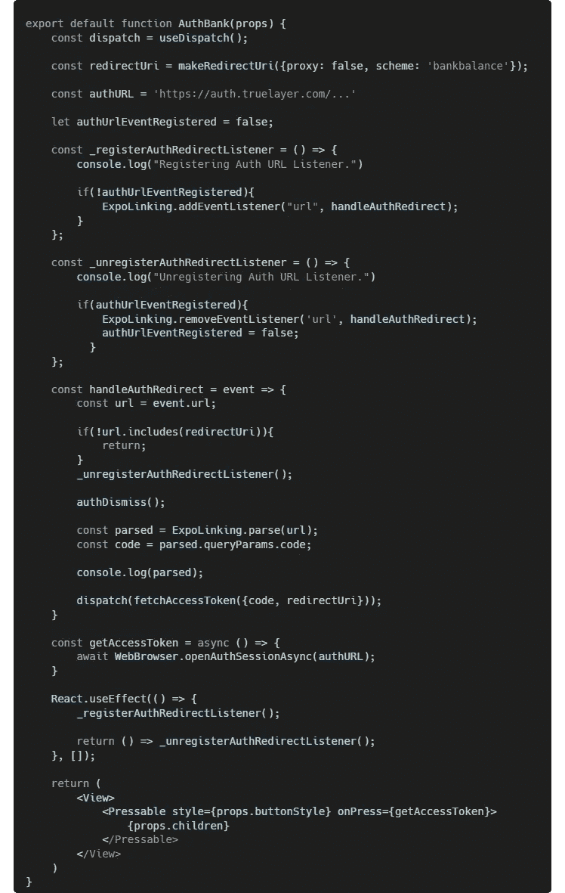

# 使用 React Native、Redux、Figma 和 FastAPI 开发我的第一个金融应用程序

> 原文：<https://levelup.gitconnected.com/developing-my-first-financial-app-using-react-native-redux-figma-and-fastapi-4a6b911845d0>

如今，拥有多个银行账户很正常，尤其是像 Revolut 这样的应用程序在爱尔兰取得了巨大成功。我和我的朋友发现拥有多个银行账户的问题是，很难轻松管理我们的财务。我决定通过设计和开发我的第一个名为“银行余额”的应用程序来解决这个问题，它将立即告诉我在多家银行的余额，包括我的存款。

我决定使用的技术栈是 Expo React-Native 的跨平台功能，Redux 用于状态管理，FastAPI 用于编排层。Figma 用于 UI/UX 原型开发。除了 FastAPI 之外，我以前没有使用这些技术的经验，但是我总是准备迎接挑战。

银行余额的初始 Figma 原型

最初的原型是使用 Figma 设计的，有两个屏幕。登录屏幕有一个启动授权过程的按钮，授权成功后，主屏幕将显示用户的银行账户及其相应的余额。

在我开始应用程序开发之前，我需要使用 FastAPI(一个现代的、快速的、使用 Python 构建 API 的 web 框架)创建一个编排层，以保护我的由 TrueLayer 提供的密钥，因为应用程序可以被逆向工程。银行平衡使用 TrueLayer 安全地访问用户的财务数据，因为 TrueLayer 遵守所有开放的银行法规。认证后提供的访问令牌通过 iOS 上的 Keychain 和 Android 上的 Keystore 安全存储。

Python 编排层

编排层有两个端点，`/exchange`和`/refresh`。交换端点向所请求的银行账户返回访问令牌，并且一旦访问令牌过期，刷新就更新访问令牌。每个银行对于它们的访问令牌的有效时间有不同的阈值。

默认情况下，iPhone 将阻止任何不使用 SSL 的请求([https://developer.apple.com/forums/thread/3544](https://developer.apple.com/forums/thread/3544))，这意味着应用程序被阻止向编排层发出请求。因此，我使用 [mkcert](https://github.com/FiloSottile/mkcert) 生成了一个 SSL 证书来提供这个层，mkcert 是一个制作本地可信开发证书的简单工具。

为您的 IPv4 地址检索和创建 SSL 证书非常重要，因为这是应用程序将用来访问编排层的 IP 地址。此外，需要安装 mkcert 根证书并信任它。运行`mkcert -CAROOT`可以找到证书。

带有 SSL 的 FastApi 的业务流程部署命令。

在编排层部署之后，我实现了与真正的层 API 和编排层通信的逻辑。使用`@reduxjs/toolkit`库提供的函数`createSlice`，我创建了两个 reducers，`token`和`account`。`createSlice`隐藏了 Redux 的一些复杂性，删除了样板代码。`token` reducer 负责处理编排层提供的令牌,`account`负责处理银行余额等账户信息。

令牌缩减器代码片段

`fetchAccessToken`函数使用`createAsyncThunk`返回一个 [thunk action creator](https://redux.js.org/usage/writing-logic-thunks) ,意思是“一段做一些延迟工作的代码”,包装在一个承诺中，通过使用`.then()`实现链接。`token`缩减器使用`expo-secure-store`库安全地存储令牌信息，而`account`缩减器使用`@react-native-async-storage/async-storage`库存储帐户信息。

实现逻辑屏幕相当困难，因为 Expo 的认证库`expo-auth-session`在被测试 TrueLayer 环境重定向后不会触发其链接回调(它会在沙盒 TrueLayer 环境中触发，因为该应用程序从未打开另一个应用程序，即 Revolut)。因此，我创建了一个具有回调链接功能的可定制授权组件。

可定制的银行授权组件代码

CSS 样式通过属性`buttonStyle`传递给授权组件，并且它的子组件也被呈现。例如，登录屏幕使用授权组件，如下所示:

登录屏幕授权配置代码片段

最终 Figma 原型

主屏幕是最后实现的。我决定对最初的原型稍加修改，使其看起来更像一张资产负债表。显示相关帐户需要 API 请求的链接和转换。API 链接工作如下，对于每个访问令牌(银行帐户)，检索允许的帐户，并且对于每个允许的帐户，检索其银行余额。然后，将每个银行账户与其相关银行余额合并，并转换所需信息，即将余额转换为当地货币。

链接 API 请求和转换的代码片段。

到目前为止，用户只能选择通过登录屏幕链接一个银行账户。我在右上角添加了一个加号按钮，实现了以前用于登录屏幕的授权，重用了功能，坚持了 DRY ( *不要重复自己*)软件开发原则，节省了开发时间，但稍微增加了复杂性。

总之，这个项目很有趣，但我决定不部署它，因为涉及到成本(苹果开发者项目费和编排层 API 费)。我对下一次迭代有更多的想法/特性:

*   删除链接的银行帐户。
*   洞察，如跨账户的日常支出、预测支出等。
*   用户配置文件。
*   首次登录时链接多个银行账户。

使用所有这些新技术非常有趣，但我会在未来的应用程序中使用 Typescript，因为随着代码库的增长，代码的可读性和可维护性是一个问题。Redux 的旧代码示例有很多重复的代码，但是`@reduxjs/toolkit`库删除了大量重复的代码。我发现 Redux 对于这个应用程序来说是多余的，而且不必要的复杂，但是如果我继续开发，它会变得非常有益，因为给孩子传递道具将成为维护的噩梦。最后，我发现 Expo 是在 IOS/Android 两个移动平台上快速开发的一个很好的解决方案。

感谢您的阅读，如果您想与我联系，您可以在 [Linkedin](https://www.linkedin.com/in/shanenullain/) 或 [Github](https://github.com/ShaneNolan) 上找到我。