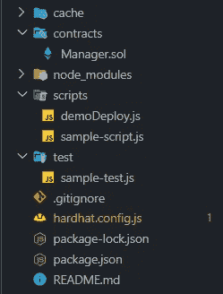

# 使用 Hardhat 和 Ethers.js 开发智能合约(第 2 部分)

> 原文：<https://levelup.gitconnected.com/developing-smart-contracts-using-hardhat-and-ethers-js-part-1-7db0ac89c18e>

在上一篇[文章](https://medium.com/@kumancev1/developing-smart-contracts-using-hardhat-and-ethers-part-1-4a393261d4df)中，我们设置了开发环境并运行了 *demoDeploy.js* 脚本来测试 **hardhat** 和 **ethers.js** 的基本功能。
今天我们来写一份智能合约，用**柴**来测试一下。


# 创建和部署新的智能合同

首先，转到项目目录中的 contracts 文件夹。删除 *Greeter.sol* 并创建一个新文件 *Manager.sol* 。

*Manager.sol* 中的代码如下。

您的项目应该具有以下结构



让我们清除 */scripts* 文件夹。并创建一个新文件 *deploy.js*

我们现在可以执行我们的合同了。打开**控制台**并键入命令

```
npx hardhat node
```

—这将启动本地区块链。然后打开另一个终端窗口，输入以下命令

```
npx hardhat run .\scripts\deploy.js — network localhost
```

您应该会收到一条成功消息

```
Compiled 1 solidity file successfully
Manager deployed to: 0x5FbDB2315678afecb367f032d93F642f64180aa3
```

# 测试合同

干得好！你做到了。现在让我们为我们的智能契约编写测试，并检查它是否有错误。

转到*/测试*文件夹。让我们**删除**文件
*sample-test.js* 并**创建一个新的 *manager-test.js***

在 *before()* 中，我们放置了我们的契约部署代码，这样我们就不必每次都在 *it()* 检查中编写它。

```
before(async function () {
    Manager = await ethers.getContractFactory("Manager");
    manager = await Manager.deploy();
    await manager.deployed();  
});
```

*注意，代码与我们在 deploy.js* 中编写的代码相同

然后我们只做检查。我们创建一个新的票证，并检查它是否符合我们的期望，等等。
是时候进行测试了，看看我们的合同是否有效。

在控制台中，编写以下命令。*(安全帽区块链运行时请勿触摸控制台)*

```
npx hardhat test
```

你应该看看这个

```
Manager
    ✔️ Should create a new ticket (106ms)
    ✔️ Should update the ticket name (85ms)
    ✔️ Should update a ticket status (58ms)
    ✔️ Should return a list tickets (149ms)4 passing (2s)
```

这意味着我们的测试是成功的，合同的运作完全符合我们的预期。

说到这里，我们将结束第二部分。在下一部分中，我们将配置 hardhat 如何与 metamask 一起工作，还将前端连接到我们的智能契约。

祝你好运，再见！