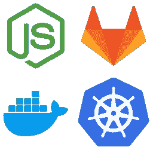
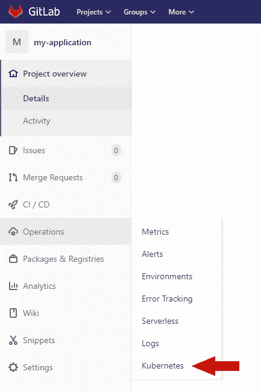
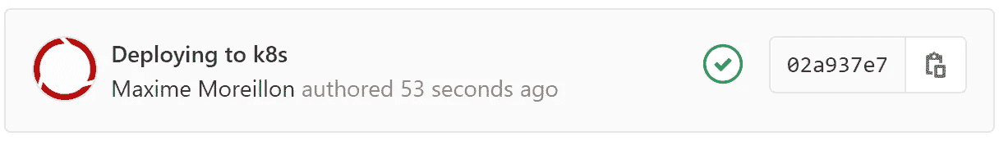

# 使用 GitLab-CI 将 Node.js 应用程序停靠和部署到 Kubernetes

> 原文：<https://levelup.gitconnected.com/development-containerization-and-deployment-of-a-node-js-application-to-kubernetes-using-gitlab-ci-e78a3eb38c26>

在本文中，我们将构建一个简单的 Node.js 应用程序，它使用 Express 来响应 HTTP 请求。为了将这个应用程序部署到生产环境中，我们还将配置一个 GitLab CI/CD 管道，以便对其进行 dockerize，并将其容器部署到 Kubernetes 集群中。



# 先决条件

本文假设读者可以使用以下环境:

*   安装了 [Node.js](https://nodejs.org/en/) 的开发环境。
*   一个 [GitLab](https://about.gitlab.com/install/) 实例，一个可用的 [runner](https://docs.gitlab.com/runner/install/) 能够运行 *docker* 和 *kubectl* 命令。
*   从 GitLab 实例可以访问带有 Kubernetes 集群的生产环境。为此， [Microk8s](https://microk8s.io/) 很容易上手
*   一个[码头登记系统](https://docs.docker.com/registry/deploying/),用于推进和拉出集装箱。请注意，运行您自己的注册表可能需要 [Docker](https://docs.docker.com/registry/insecure/) 和 Kubernetes 配置(此处提供 MicroK8s 指南)

# Node.js 应用程序


本指南中部署的应用程序是使用 [Node.js 构建的。](https://nodejs.org/en/)它由一个使用 [Express](https://expressjs.com/) 包构建的简单 web 服务器组成，该服务器简单地响应 *Hello World！*对 HTTP 的请求。

## 项目创建

为了创建我们的应用程序，我们将首先创建一个新目录，其中包含一个名为 *main.js* 的空 javascript 文件。

```
mkdir my_application
cd my_application
touch main.js
```

接下来，我们需要安装 Express，这可以使用节点包管理器或 NPM 来完成。这需要用 NPM 初始化项目，可以使用 *init* 命令来完成:

```
npm init -y
```

完成后，使用以下命令安装 Express:

```
npm install --save express
```

此时，名为 *node_modules* 的新文件夹以及名为 *package.json* 和 *package-lock.json* 的文件应该已经出现在项目的目录中。这些是用于依赖性管理的。 *node_modules* 是包本地存储的有效位置*。*

完成这些之后，项目就可以进行实际的开发了。

## Node.js 应用程序开发

作为一个示例应用程序，我们将使用 Express 文档中的 [hello world 示例](https://expressjs.com/en/starter/hello-world.html)

使用文本编辑器，打开应用程序目录中的空文件 main.js，输入以下内容:

```
// Import the express package
const express = require('express')// Instanciate an express app
const app = express()// Specify port on which the application will listen
const port = 3000// Define a route
app.get('/', (req, res) => res.send('Hello World!'))// Start listening on the defined port
app.listen(port, () => console.log(`Example app listening on port ${port}`))
```

该应用程序可通过以下方式执行:

```
node main.js
```

现在，用户可以将浏览器指向服务器的 IP 地址并指定端口 3000，以查看应用程序用`Hello World!`做出的响应。要退出应用程序，请按下 *Ctrl+C* 。


人们可能会争论这种应用的有用性。然而，对读者来说，显而易见的是，可以将业务逻辑添加到代码中以扩展其功能。

# 码头化配置


既然应用程序已经在开发环境中运行了，那么是时候对它进行容器化了，这样它就可以被发布到生产环境中了。

使用 [Docker](https://www.docker.com/) 将应用程序容器化，只需要一个配置文件(称为 Dockerfile)来指定容器化参数。本节遵循 [NodeJS 应用程序归档指南](https://nodejs.org/fr/docs/guides/nodejs-docker-webapp/)

Dockerfile 用于创建一个容器映像，作为容器的模板。例如，官方 Python docker 映像可用于部署预装 Python 的容器。

因此，为了创建我们的应用程序的图像，在项目的根目录下创建一个名为 *Dockerfile* 的文件，其内容如下:

```
# The image is built on top of one that has node preinstalled
FROM node:12# Create app directory
WORKDIR /usr/src/app# Copy all files into the container
COPY . .# Install dependencies
RUN npm install# Open appropriate port 
EXPOSE 3000# Start the application
CMD [ "node", "main.js" ]
```

为了防止容器太重，里面不需要 *node_modules* 目录。相反，当执行 *npm 安装*时，将自动重新创建 *node_modules* 。为了防止目录被复制，创建一个名为*的文件。应用程序目录中的 dockerignore* ，内容如下:

```
node_modules
```

# 部署到 Kubernetes 的配置


使用前一节中创建的 Dockerfile，可以创建应用程序的容器映像，并将其推送到容器注册中心。这使得应用程序可以部署在 Kubernetes 集群中。

在 Kubernetes 中部署这个应用程序包括在集群中创建两个资源:一个[部署](https://kubernetes.io/docs/concepts/workloads/controllers/deployment/)和一个[服务](https://kubernetes.io/docs/concepts/services-networking/service/)。部署基本上是应用程序本身，而服务是用于将应用程序连接到其用户的资源，通过为部署提供它可以与外部通信的端口来有效地进行连接。这里，我们将使用端口 31234 进行服务。

我们的应用程序的部署和服务的创建是通过在一个清单文件中描述它们并让 Kubernetes 读取该文件的内容来完成的。因此，在项目的根目录下创建一个名为 kubernetes_manifest.yml 的文件，其内容如下:

```
# This section will create a deployment in the Kubernetes cluster
apiVersion: apps/v1
kind: Deployment
metadata:
  name: my-application
spec:
  replicas: 1
  selector:
    matchLabels:
      app: my-application
  template:
    metadata:
      labels:
        app: my-application
    spec:
      containers:
      - name: my-application
        image: my-registry/my-application:latest
        imagePullPolicy: Always
        ports:
        - containerPort: 3000
---
# This section will create a service in the Kubernetes cluster
# so that the deployment can be accessed from the outside
apiVersion: v1
kind: Service
metadata:
  name: my-application
spec:
  ports:
  - port: 3000
    nodePort: 31234
  selector:
    app: my-application
  type: NodePort
```

# GitLab CI 配置


该项目现在已经有了一个工作源代码，以及需要打包并部署到 Kubernetes 集群的配置。虽然容器化和部署可以手动完成，但是让 GitLab 自动执行这些步骤会更方便。如果执行这些步骤所需的工具没有安装在开发环境中，情况尤其如此。

要让 GitLab 负责容器化和部署，只需创建一个名为*的文件。gitlab-ci.yml* 以 yaml 数组的形式包含了每一步所必需的命令:

```
stages:
  - containerization
  - deploycontainerization:
  stage: containerization # must match the stage name declared above
  script:
    # Build the container image
    - docker build -t my-registry/my-application .
    # Push the container image to the registry
    - docker push my-registry/my-application
    # Cleanup by removing the local image
    - docker image rm my-registry/my-applicationdeployment:
  stage: deploy # must match the stage name declared above
  script:
    # create/update the kubernetes resources
    - kubectl apply -f kubernetes_manifest.yml
    # Restart the deployment so as to pull the latest version of the container image
    - kubectl rollout restart deployment/my-application
  environment:
    name: production
```

需要注意的重要一点是缺乏自动化测试。这样做是为了保持文章的简洁，但是对于比这个例子更复杂的应用程序来说，快速实现严格的测试是必要的。

# GitLab 项目

## 项目创建

项目的本地内容已经为应用程序的部署做好准备。现在，需要在 GitLab 中为项目创建一个远程存储库。

只需点击*新建项目*按钮，然后给项目命名即可。

创建之后，GitLab 提供了一个 URL，可以用来将代码推送到存储库。

## Kubernetes 集群集成

既然已经在 GitLab 中创建了项目，那么必须对其进行配置，以便集成所需的 Kubernetes 集群。

为此，请转到 GitLab 中项目的 Operations 菜单，然后单击 Kubernetes。



这将导致一个页面，允许用户配置 Kubernetes 集群集成的详细信息。Gitlab 文档提供了完整的指南。

## 使用 Git 将项目推送到 GitLab

创建远程存储库后，可以使用 [Git](https://git-scm.com/) 推送本地内容。为此，必须初始化项目目录，以便与 git 一起使用，可以这样做

```
git init
```

然后可以使用`git remote add`命令注册远程存储库:

```
git remote add gitlab http://<gitlab url>/<username>/my-application
```

无论如何,`node_modules` 目录可能会很大，并且是在使用 npm install 时自动生成的，因此不需要将其推送到远程存储库。为了防止它被上传，文件命名为*。gitignore* 在项目的根目录下，有如下内容:

```
node_modules
```

一切就绪后，代码就可以准备、提交和推送了

```
git add .
git commit -m "Deploying to k8s"
git push gitlab master
```

现在代码已经被推送到 GitLab，CI 管道负责应用程序的容器化和部署。如果一切顺利，项目页面应该会在提交号旁边显示一个绿色的复选标记来欢迎用户。



如果一切顺利，那么可以在生产环境的端口 31234 上访问应用程序。

有了这样的管道，Kubernetes 中运行的应用程序将在每次开发人员在项目的主分支上推送代码时自动更新。因此，开发人员现在可以专注于应用程序本身的开发，而不必担心部署细节。