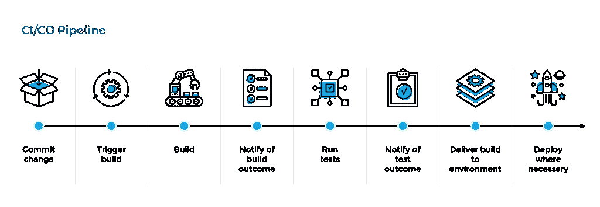
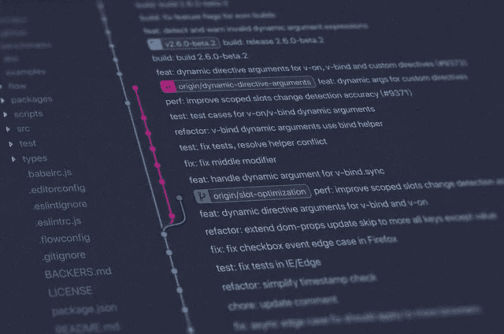

# DevOps:前 15 大平台的 CI/CD 贸易研究

> 原文：<https://levelup.gitconnected.com/devops-ci-cd-trade-study-for-the-top-15-platforms-2a4840fdf30>

制造者在 [Unsplash](https://unsplash.com/s/photos/software-development?utm_source=unsplash&utm_medium=referral&utm_content=creditCopyText) 上 [NESA 的照片](https://unsplash.com/@nesabymakers?utm_source=unsplash&utm_medium=referral&utm_content=creditCopyText)

*为了利用软件开发生命周期(SDLC)的全部潜力，在您的工作流程中实现一个健壮的 CI/CD 管道是非常必要的。随着* [*技术继续加速发展*](https://medium.com/@kirimaandrew/how-the-acceleration-of-technology-will-impact-the-business-world-976b72122921) *安装一个可以自动完成琐碎任务的管道，让自己熟悉最佳实践，以便更快地装运产品，这一点很重要。记住，*

> [不要重新创建轮子，只需自动化它](https://medium.com/@kirimaandrew/dont-reinvent-the-wheel-just-automate-it-85a2074ab628)

## CI/CD 简介

持续集成(CI)和持续交付(CD) (CI/CD)是软件开发和 DevOps 测试不可或缺的一部分。它为开发人员提供了必要的功能，以便他们可以持续地部署代码。通过使用集成到您的工作流中的健壮的 CI/CD 管道，您可以减少单调调试的数量。您的管道将有助于在早期阶段检测 bug，并避免由于频繁提交源代码而导致的集成问题。

有这么多适合预算和项目需求的 CI/CD 工具，很难选择正确的。下面是对最常用的 CI/CD 工具的比较研究，以帮助区分哪种工具最适合您使用。

## **实施 CI/CD 渠道的优势**

*   轻松更新您的产品。
*   开发者效率更高。
*   提高了代码质量。
*   更快上市。
*   增强了构建的性能速度，因此您可以更快地推出产品的新更新。
*   可以自动化繁琐的任务，尤其是在测试方面。
*   通过访问系统的所有版本，减少了质量保证的回归测试。
*   测试日志的可读性增加并存档。
*   建立有效的反馈循环，帮助实现客户的成功目标。

## **贸易研究目标**

我的目标，代表我在 [Sencha Credit](https://senchacredit.com/) 的产品主管的工作，是实现一个到我们 DevOps 工具堆栈的自动化 CI/CD 管道，以便我们可以在可能的最佳时间内执行产品部署。作为一家初创公司，我们正在寻找免费或廉价的移动应用程序开发解决方案。正在开发的应用程序是为 fintech 开发的，用 React-Native 构建。此外，选择的管道需要同时兼容 iOS 和 Android 部署。

## **贸易因素**

1.  **定价:**什么是成本模型？根据你要做的构建的数量，某些工具会向你收取不同的费用。在较大的项目中，您可能会在一天中运行很多次构建，这一点在您选择 CI/CD 工具时非常重要，因为一些供应商将基于此收费。你需要兼做建筑吗？如果您在开发中有不止一个团队，那么他们可能都想同时访问构建工具链。这意味着您可能需要从 SaaS 供应商那里获得更多的基础设施或资源。需要多少用户？你拥有的用户越多，许多供应商收取的费用就越高。如果您没有预算，是否有免费层？
2.  可靠性:你的工具是开源的还是私有的？开源软件可以免费使用，但是如果它不流行，那么它可能会失去支持。然而，一个专有工具有持续的支持，但通常它会花费更多。效果如何？其他人对此有什么看法？
3.  **可用性&学习曲线:**使用起来有多简单，如果您有问题，是否有足够大的社区让您可以获得支持？它们有多大帮助？
4.  **灵活性:**它能与我们现有的设置很好地集成吗？整合起来有多容易？它还提供了哪些功能？它可以部署到什么地方？云、内部部署还是 Saas？
5.  **安全性:**安全性如何？它的安全性多久失效一次？如果您使用在虚拟基础设施上运行的工具，那么您需要考虑数据和访问键。它可能需要访问编码库中的 SSH 密钥和来自 Github repo 的凭证。

照片由[扬西·敏](https://unsplash.com/@yancymin?utm_source=unsplash&utm_medium=referral&utm_content=creditCopyText)在 [Unsplash](https://unsplash.com/s/photos/development?utm_source=unsplash&utm_medium=referral&utm_content=creditCopyText) 拍摄

## **CI/CD 平台**

下面是我从对每个 CI/CD 平台的研究中获得的关键信息的快速总结。

[**詹金斯**](https://www.jenkins.io/)

*   **定价:**免费既然是开源。
*   **可靠性:**领先的基于 java 的跨平台开源 CI/CD 工具。更适合初创公司和大型组织。适用于 Windows、Linux 和 macOS 平台。
*   **可用性&学习曲线:**易于安装和升级。简单的用户界面。你需要一个服务器来托管它。维护和更新是你的责任。它有一个很好的生态系统(1500+插件)和一个围绕它的很好的社区。
*   **灵活性:**与 AWS、Google Cloud、Azure、Digital Ocean 等整合良好。可用于并行执行工作和实现复杂的 CD 要求。
*   **安全性:**即使您在私有网络上运行 Jenkins，并且信任团队中的每个人，Jenkins 中的安全问题仍然会影响您。您必须手动管理安全性，所以记住您将在哪里托管代码库是很重要的。

[**IBM 城市代码**](https://www.ibm.com/cloud/urbancode)

*   **定价:**必须联系定价。
*   **可靠性:**最适合大型企业复杂构建的工具之一。
*   **可用性&学习曲线:**提供项目模板，使管理不同的配置变得容易。此外，来自大型企业社区的支持。
*   灵活性:整合应该不会太难。有了拖拽自动化。可以通过自动化、可重复的部署过程提高软件交付的频率。
*   **安全性:**企业级的安全性和可扩展性。

[**AWS CodeBuild**](https://aws.amazon.com/codebuild/)

*   **定价:**基于每分钟的构建有各种各样的价格，每月 100 分钟的构建分钟免费。AWS 免费等级条款提供的 1 年免费服务。
*   **可靠性:**支持 Java、Python、Node.js、Ruby、Go、Android 等。
*   **可用性&学习曲线:**由大型企业支持，因此您可以访问几乎无限的文档并帮助回答问题。
*   **灵活性:**内置于 AWS 项目中。可以预先配置和定制。
*   **安全性:**通过与 AWS 密钥管理服务的集成实现了工件加密。内置于前三大云提供商的生态系统中。

[**蔚蓝 DevOps**](https://azure.microsoft.com/en-us/services/devops/)

*   **定价:**对开源和小型项目(最多五个用户)免费。对于较大的团队，成本从每月 30 美元(10 个用户)到每月 6，150 美元(1，000 个用户)不等。
*   **可靠性:**支持多种版本控制系统、编程语言和部署目标。
*   **可用性&学习曲线:**适合与 Visual Studio 一起使用。易于使用，具有广泛的企业支持和几乎无限的文档。
*   **灵活性:**可以使用 Docker 托管构建代理。非常灵活。能够使用微软技术之外的任何开发堆栈。
*   **安全性:**拥有云空间的大型企业，众所周知是最安全的之一。由于其平台安全性，被 Smithfield 和 Merrill Corporation 选中。

[**团队合作**](https://www.jetbrains.com/teamcity/)

*   **定价:**免费为小团队和开源项目设置。100 个免费构建。建筑代理许可证 299 美元。
*   **可靠性:**基于服务器的 Java 管道工具，由 JetBrains 开发，JetBrains 是开发 ide 最成功的公司之一，因此它有一个可靠的网络和接口。
*   **可用性&学习曲线:**设置起来很简单。与吉拉软件云和 Azure DevOps 很好地集成。拥有一个庞大的支持社区，并为您可能遇到的任何问题提供了良好的文档。
*   **灵活性:**可以和 GitHub、GitHub Enterprise、BitBucket 很好的集成。可以托管在云上。并行自动化的快速测试，可定制。
*   安全:可以在私有基础设施防火墙上运行。

[**圆形**](https://circleci.com/)

*   **定价:**为 Linux 和 Windows 提供免费增值模式，你可以一次免费运行一个作业。开源项目的容器数量有限。2500 免费学分/周。每月 30 美元，大型组织可以选择。
*   **可靠性:**开源和大型项目的最佳工具之一。它支持可以在 Windows、Linux 和 macOS 平台上构建的语言。被 Forrester Wave 誉为云原生持续集成(CI)领域的领导者。
*   **可用性&学习曲线:**易于使用其专有的 YAML 管道语法进行设置。有一大群人支持。
*   **灵活性:**提供现代软件开发架构，让团队加速他们的开发操作。适合缩放。提供基于云的本地解决方案。
*   **安全性:**所有数据都用 TLS 和 SSH 加密，比如密钥、令牌和其他凭证等环境变量。

[特拉维斯 CI](https://www.google.com/search?q=travis+cl&oq=travis+cl+&aqs=chrome..69i57j0i13i457j0i13l6.2471j0j4&sourceid=chrome&ie=UTF-8)

*   **定价:**对于开源项目是免费的，如果你有一个 CircleCI 云帐户，每月最多 1000 分钟的构建时间，1 个容器和 1 个并发作业。
*   **可靠性:**用 Ruby 编程语言编写，被认为是开源项目&企业级项目的最佳之一。可以在他们的云变体上托管开源项目和小团队规模的企业。
*   **可用性&学习曲线:**资源丰富的大型社区。以易用著称。
*   **灵活性:**支持一整套编程语言。可以与 Lambda Test 集成，在浏览器、平台和设备(模拟器)上执行测试。整合了无缝使用的构建矩阵。
*   **安全性:**要获得更多安全性，您可以选择他们的企业套装。

[**GoCD**](https://www.gocd.org/)

*   **定价:**免费，因为它是开源的。
*   **可靠性:**最好的 CI/CD 工具之一，可以与 Windows、macOS、Docker 等配合使用。
*   **可用性&学习曲线:**在他们的谷歌团队中有一个活跃的社区，有足够的文档。
*   **灵活性:** GoCD 简化了您在 Kubernetes、Docker、AWS 等流行云环境中的 CD 工作流程。它有一个虚拟流图(VSM ),以图形方式查看管道。
*   **安全性:**内置了两种身份验证方法，以降低安全风险。

[**代号**](https://codeship.com/)

*   **定价:**免费增值定价模式，每月 100 次构建对无限项目是免费的。每月 49 美元的无限构建。
*   **可靠性:**专注于速度、可靠性和简单性的托管连续交付服务 **y.** 您可以建立团队，并将团队权限分配给特定成员。
*   **可用性&学习曲线:**已知超级好用。它将在几分钟内推出构建&部署。
*   **灵活性:**与 GitHub 版本控制系统配合良好。它可以直接从 GitHub 项目中测试、构建和部署。有很多功能，尤其是多阶段构建。此外，将有助于减少 Docker 图像的图像大小。
*   **安全性:**它没有安装在你的 VPC 上，而是运行在他们的安全构建机器上。

[**GitLab CI**](https://docs.gitlab.com/ee/ci/)

*   **定价:**可免费无限量私人&公共回购。提供免费的分层包，包括 DevOps 生命周期的所有阶段和 400 CI/CD 分钟。然后剩下的套餐从 4 美元到 99 美元不等。
*   **可靠性:**被广泛认为是最好的 CI/CD 工具之一。适用于 Windows、Linux 和 macOS。
*   **可用性&学习曲线:**易于使用。要使用它，您需要在 Git repo 中托管代码库，并指定要构建、测试和部署的脚本。
*   **灵活性:**您可以轻松地从 Jenkins 和/或 CircleCI 等工具迁移到 Gitlab。也可以与詹金斯 CI 集成。具有各种特性，如代码审查、部署、开发人员 API 等。它有完整的包装和一些。
*   **安全性:**已知安全可靠，但必须升级到黄金套装才能获得高级应用程序安全性。

[**Appcircle**](https://appcircle.io/)

*   **定价:**入门包是免费的，包含 1 个并发构建、每个构建最长 25 分钟的构建时间、每月 5 分钟的设备预览等。供个人使用。需要升级到专业版套餐，每月 59 美元，确保适合团队使用。
*   **可靠性:**已知是手机 app 开发的最佳工具之一。
*   **可用性&学习曲线:**可以从大型社区获得帮助的文档。简单易用的构建配置界面。用 react-native 构建。有一个 iOS 和 Android 浏览器模拟器/仿真器。
*   **灵活性:**有非常大的灵活性，比 App Center 更大。
*   **安全性:**包括私有云和内部云支持。可靠的安全认证。

[**浪子**](https://fastlane.tools/)

*   **定价:**MIT 许可下的免费开源。
*   **可靠性:**众所周知是向应用商店发布更新的最佳产品之一。与另一个管道协同工作效果最佳。
*   **可用性&学习曲线:**与 Bitrise、CircleCI、Jenkins 和 Travis CI 等主流 CI 平台整合良好。这个社区不够大，所以可能很难学习，但是提供了文档。
*   **灵活性:**可以为 iOS 和 Android 自动构建和发布应用。
*   **安全性:**需要配置另一条管道来保证安全性。

[**never code**](https://nevercode.io/)**(从 2021 年 1 月开始过渡到 CodeMagic)**

*   ****定价:**定价结束于 CodeMagic。如果你没有太多的构建，这是非常便宜的。**
*   ****可靠性:**app 开发者最好的工具之一。UI 测试是在模拟器、设备模拟器或实际设备上执行的，不需要任何人工干预。**
*   ****可用性&学习曲线:**已知拥有出色的支持和文档。**
*   **灵活性:无需维护本地基础设施，因为它只在云上运行。可定制，并可通过其更智能的构建逻辑加速构建过程。**
*   **安全:众所周知非常安全。**

****

*   ****定价:必须与他们联系，制定计划。****
*   ******可靠性**:泰勒为 salesforce 平台打造了最快的 CI/CD 解决方案。从分支获取更改以及合并/提交更改可能需要一些时间。****
*   ******可用性&学习曲线:**不像其他选项那样容易使用，但确实有支持团队和文档。****
*   ******灵活性:**支持 120 多种元数据类型。非常适合与 salesforce 配对。****
*   ******安全:**一负就是安全。鉴于这种交易的速度，我担心安全漏洞。****

****[**位上升**](https://www.bitrise.io/?gclid=Cj0KCQiAhs79BRD0ARIsAC6XpaUJArmnREyxxitkIbCxdiLvZ-XYJxBaox0hL1RMfAQwvFGGNBgb_gAaAtPmEALw_wcB)****

*   ******定价:**无自由层。有一个面向个人开发者、组织标准和组织精英的计划，价格从 36 美元到 270 美元不等。****
*   ******可靠性:**覆盖大多数编程语言，非常适合移动应用程序开发。****
*   ******可用性&学习曲线:**提供了一个广泛的社区来回答问题。易于使用和实施。****
*   ******灵活性:**包括全面的移动堆栈覆盖。您可以为测试人员组添加电子邮件。可以在同一个版本中部署多个应用。****
*   ******安全性:**内置安全且可扩展的公共云实例。****

## ******结论******

****DevOps 工具没有一刀切的做法，因此您可能需要选择多种 CI/CD 工具来满足各种需求，而不是单一的解决方案。如果你是个人开发者或小企业，你应该考虑提供免费或低价套餐的选择，要节俭。此外，强烈建议将安全性集成到您的 DevOps 模型中，如果您选择的工具还不具备安全性，则使用像 [Threat Stack 的云安全平台](https://www.threatstack.com/resources/attack-simulation-docker-application?utm_campaign=792295152&utm_source=google&utm_medium=cpc&utm_term=threat%20stack&_bt=471067892396&_bm=p&_bn=g&gclid=Cj0KCQiAqdP9BRDVARIsAGSZ8Al_yXMdTYEnmINBf56C26Fz5Msh1uuNjDn1FeyZCqSlqMdVlAdYPPsaAhfIEALw_wcB)这样的全面安全解决方案。****

****根据我的研究结果，我能够决定一些最适合我的团队和我们当前设置的首选，我们是 Jenkins、CodeShip、GitLab 和 CircleCI。我选择的任何一个都将被添加到 FastLane 中，作为 iOS 和 Android 的自动构建过程的附加功能。****

****对于在进行这项研究之前对 CI/CD 管道知之甚少的人来说，我现在可以说，当涉及到我的 DevOps 工具堆栈时，我可以放心地继续做出我应该做出的决定。这项研究有效地帮助我做出了正确的决定，同时增加了我对 DevOps 的了解，所以我希望它也能为你做同样的事情，祝你好运！****

******资源:******

*   ****[https://dzone . com/articles/10-选择 ci 平台时要考虑的事项](https://dzone.com/articles/10-things-to-consider-while-choosing-a-ci-platform)****
*   ****[https://www . functionize . com/blog/choosing-the-right-ci-CD-tool/](https://www.functionize.com/blog/choosing-the-right-ci-cd-tool/)****
*   ****[https://www . katalon . com/resources-center/blog/ci-CD-pipeline/](https://www.katalon.com/resources-center/blog/ci-cd-pipeline/)****
*   ****[https://securityboulevard . com/2019/05/20-best-continuous-integration-tools-a-guide-to-optimizing-your-ci-CD-processes/](https://securityboulevard.com/2019/05/20-best-continuous-integration-tools-a-guide-to-optimizing-your-ci-cd-processes/)****
*   ****[https://www . guru 99 . com/top-20-continuous-integration-tools . html](https://www.guru99.com/top-20-continuous-integration-tools.html)****
*   ****https://www.lambdatest.com/blog/27-best-ci-cd-tools/****
*   ****[https://www . katalon . com/resources-center/blog/ci-CD-pipeline/](https://www.katalon.com/resources-center/blog/ci-cd-pipeline/)****